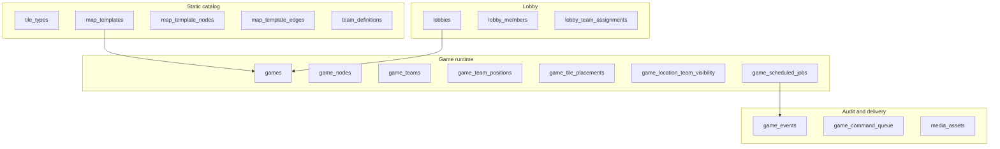
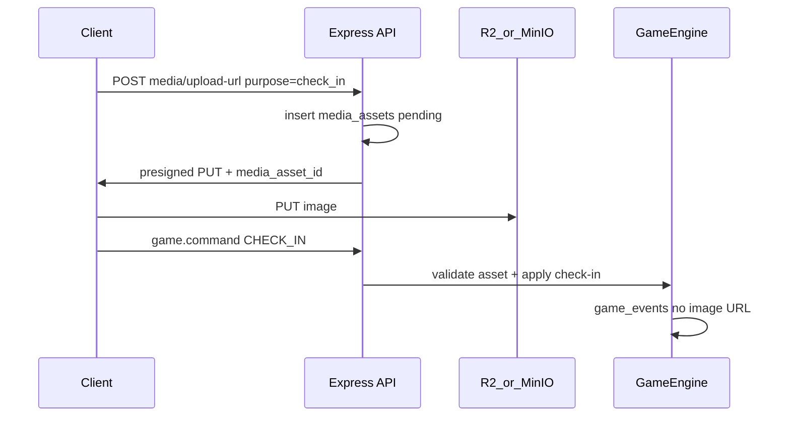
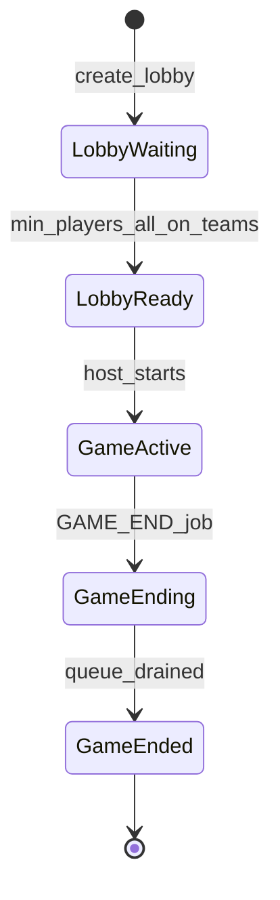
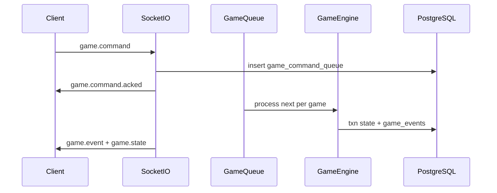

# Mahjong Jet Lag — Technical Design Document

**Status:** Living document (v1 infrastructure)  
**Last updated:** 2026-05-17

---

## 1. Purpose and scope

This document defines **infrastructure and architecture** for *mahjong-jet-lag* before deep game UX work. The backend is the **source of truth** for game state, ordering, and visibility; clients primarily render projections and send commands.

### In scope (v1 infra)

- Registered-user auth (JWT)
- Lobby → game lifecycle
- Normalized relational game state (minimal JSONB on state tables)
- Event log + per-game command queue
- Socket.IO realtime + team-scoped state projections
- Map template cloning (84 nodes per game)
- Station check-in with **required photo**, geolocation (warn + allow)
- **Cloudflare R2** media storage (MinIO locally)
- DB-backed scheduler (visibility phases, notifications, game end)
- Challenge system **schema + media plumbing** (resolver logic when product defines cards)
- **Riichi hand evaluation** module (stub → full scoring; see [§4.8](#48-mahjong-hand-evaluation-riichi))

### Out of scope (v1)

- Polished UI
- Exhaustive riichi edge-case coverage on day one (incremental implementation inside the scoring module)
- Anti-cheat beyond basic validation
- Multi-server Redis (design allows it later; ship single-node first)
- Mobile push (FCM/APNs) — Socket-only notifications for v1
- Specific challenge card rules until product defines decks
- Custom per-lobby notification copy
- User-initiated media deletion (GDPR) — post-v1

Hand **styling** is a client concern; hand **order** is always server-provided.

---

## 2. Current repository state

This TDD branch starts from the Express + Sequelize + PostgreSQL scaffold. **No gameplay migrations exist on this branch yet.**

### Migrations from sibling work (merge or re-apply)

| Migration | Table | Status | Notes |
|-----------|--------|--------|--------|
| `20260517155235-create-users.js` | `users` | **Done on other branch** | Bring onto this branch before auth work. See [§5.1](#51-identity-and-membership). |
| `20260517160720-create-teams.js` | *(stub)* | **Do not use as-is** | Was an empty stub. Replace with `team_definitions` per [§5.2](#52-teams-catalog-vs-runtime). |

All other tables in [§5](#5-data-model) are **not yet migrated** on this branch.

### Existing scaffold

- `server/src` — Express app, Sequelize config, empty `models/index.ts`
- `docker-compose.yml` — PostgreSQL 16
- `client/` — React + Vite (demo only)

### Sequelize CLI + ESM

`server/package.json` has `"type": "module"`. **Migrations and seeders must use the `.cjs` extension** (same as `config/config.cjs`) so `module.exports` / `require` work with sequelize-cli.

---

## 3. Confirmed design decisions

| Area | Decision |
|------|----------|
| Map | Static **templates** cloned into per-game rows at start |
| Auth | Registered users only (`users` + JWT) |
| Tile set | Standard **136** tiles/game: **84** on map + **13** × 4 team hands |
| Map size | Exactly **84** nodes (21 per visibility group) |
| Deal | **Fisher–Yates** shuffle; random always |
| Hand order | **Server-sorted** (`suit_sort_order` → `rank`); client renders as given |
| Tile visibility | Scheduled **quarter unlock** + **ephemeral** view while checked in at a station |
| Game config | **Lobby**, editable by **host only**; snapshotted to `games` at start |
| Lobby start | `min_players_to_start` (default **4**); every member assigned to a team |
| Travel | **Any station** on check-in (honor + geofence); skipping stations OK |
| Commands | `CHECK_IN`, `CHECK_OUT`, `SWAP_TILE`, `SWAP_LOCATION_TILES` (separate) |
| Team commands | **Any member** on that team (`game_participants`) |
| Team positions (UI) | **Not on map**; intel via **event log** only |
| Check-in photo | **Required**; stored in R2; **hidden during game**; **game summary** after end |
| Media retention | **365 days**, then delete (lifecycle rule + sweeper) |
| Object storage | **Cloudflare R2** (prod), **MinIO** (dev) |
| Geolocation | Browser API; **warn + allow**; log flags on events |
| Notifications | **Static server templates** over Socket (v1) |
| Game end | Drain **in-flight** command queue, then `ended` |
| Realtime | Commands → queue → engine → `game_events` → broadcast |
| State storage | Relational tables; JSONB only on events/commands/challenge params |
| Hand scoring | **Riichi** ruleset; `HandEvaluationService`; stub in infra phase, wired to **game summary** + **challenges** later |

---

## 4. Domain model



### 4.1 Core invariants

- **Closed tile set:** 136 `game_tiles` per game — 84 on map, 13 per hand × 4 teams. No mid-game create/destroy.
- **One tile per map node:** Each `game_node` has exactly one `game_tile_placements` row with `game_node_id` set (84 map placements total).
- **One placement per tile:** Each `game_tile` has exactly one `game_tile_placements` row — either on a node or in a team hand (XOR via DB check).
- **Fixed hand size:** 13 tiles per team hand (`games.hand_size = 13`).
- **Checked-in gate:** Station actions require `current_game_node_id` set.
- **Swap at station:** `SWAP_TILE` only at `current_game_node_id`; exchanges hand tile ↔ location tile; counts unchanged.
- **Visibility:** Clients never infer fog-of-war; server projection only.
- **No rival position on map:** Other teams’ locations are not in live projection; use `game_events`.

### 4.2 Progressive visibility (global game state)

**At game start:**

1. Random partition of 84 nodes into 4 groups of 21 (`game_node_visibility_groups`).
2. Random unique home group per team (`game_team_home_groups`).
3. `visibility_phase = 0` — each team sees face-up tiles only in home group on map.
4. Schedule `VISIBILITY_PHASE_ADVANCE` jobs at `started_at + interval × k` (k = 1,2,3) and `GAME_END` at `ends_at`.

**Unlock order per team:**

```text
visible_groups(team, phase) = first (phase + 1) entries of
  [home, (home+1)%4, (home+2)%4, (home+3)%4]
```

| Phase | Map visibility per team |
|-------|-------------------------|
| 0 | Home quarter only |
| 1 | 2 quarters |
| 2 | 3 quarters |
| 3 | Full map |

All teams advance phase on the **same schedule**; which quarters are visible differs by home group.

**On phase advance (scheduler):** bump phase, upsert `game_location_team_visibility` (`source = phase`), emit `VISIBILITY_PHASE_ADVANCED`, broadcast state.

### 4.3 Visit-based visibility (ephemeral)

While checked in at node `N`:

- `faceUpForTeam(team, N) = true` even if phase would hide `N`.
- `SWAP_TILE` and other station actions allowed.

After `CHECK_OUT` (or `CHECK_IN` elsewhere after implicit check-out):

- No persistent reveal in `game_location_team_visibility`.
- `faceUpOnMap` falls back to phase rules only.

```text
faceUpOnMap(team, node) =
  game_location_team_visibility[team, node].is_face_up

faceUpForTeam(team, node) =
  faceUpOnMap(team, node)
  OR game_team_positions[team].current_game_node_id == node

canSwap(team, node) =
  game_team_positions[team].current_game_node_id == node
```

**Projection rule:** The server computes `faceUpOnMap` / `faceUpForTeam` internally but **does not expose phase numbers or boolean flags to the client**. It emits **tile data only where that team may see it** (see [§7.3](#73-gamestate-projection-shape)).

### 4.4 Station commands and travel

| Command | Description |
|---------|-------------|
| `CHECK_IN` | Requires prior photo upload (`media_asset_id`). Sets `current_game_node_id` to any station. |
| `CHECK_OUT` | Clears `current_game_node_id`. |
| `SWAP_TILE` | Hand ↔ location at current station (swap two `game_tile_placements` targets). |
| `SWAP_LOCATION_TILES` | Swap tiles between two map nodes (challenges). Uses shared `TileSwapService`. |
| *(future)* | Additional station actions while checked in. |

**Travel:** No adjacency requirement. Geolocation optional on check-in/swap — allow always, warn if outside geofence or poor `accuracy_meters`.

**Check-in elsewhere:** Server runs check-out first, then check-in.

### 4.5 Check-in photo flow



- Live `game_events` / projections: `has_photo: true` only — **no URLs** during play.
- Uploader may show **local preview** only.
- After `status = ended`: `GET /api/games/:id/summary` returns presigned GET URLs for participants.

### 4.6 Hand sorting (server authority)

```text
sortKey(tile) = (tile_types.suit_sort_order, tile_types.rank, game_tiles.copy_index)
```

- Hand order is **not stored** in the DB. The engine/projection layer sorts by `sortKey` when building `handTiles[]`.
- Projections emit `handTiles[]` with `slotIndex` 0–12 assigned at read time; **client must not re-sort**.

### 4.7 Challenges (architecture; rules TBD)

Static catalog: `challenge_decks`, `challenge_types`, `challenges` (parameters JSONB OK).

Runtime: `game_challenge_instances`, `game_challenge_submissions`.

`ChallengeResolutionService` dispatches by `resolver_key`:

| Type | Examples (product) |
|------|-------------------|
| `travel` | “Travel 500m in direction of drawn wind” |
| `photo` | “Photo of 3 round objects”, “three same-colour foods” |
| `tile_swap` | Map tile exchanges via `TileSwapService` |

Photo challenges reuse media pipeline (`purpose = challenge_submission`). Implement resolvers when product defines decks (Phase H).

### 4.8 Mahjong hand evaluation (Riichi)

A dedicated **scoring module** (not part of the realtime command engine) evaluates a mahjong hand and returns structured scoring metadata. The client **never** computes score - only displays server results.

**Ruleset (v1 target):** [Riichi / modern Japanese](https://riichi.wiki/) (han–fu style scoring, yaku detection). Implementation is **code-first** in `server/src/scoring/`; optional static `yaku_definitions` table later if product wants data-driven yaku.

#### Responsibility boundary

| Module | Role |
|--------|------|
| `HandEvaluationService` | Pure function(s): tiles in → evaluation out |
| `GameSummaryService` | At game end, loads each team’s 13 `handTiles`, calls evaluator, attaches results to summary |
| `ChallengeResolutionService` | Invokes evaluator when a challenge requires proving a scoring hand |

No game state mutation from scoring alone unless a challenge resolver explicitly applies an effect after a successful evaluation.

#### Input / output (contract)

**Input** (`HandEvaluationInput`):

```ts
{
  tiles: Array<{
    suit: string;      // matches tile_types.suit
    rank: number;      // 1–9 for suits; honors use agreed rank mapping
    isRedFive?: boolean;
  }>;
  winningTile?: { suit, rank, isRedFive? };  // optional 14th tile if evaluating complete win
  context?: {
    seatWind?: "east" | "south" | "west" | "north";
    roundWind?: "east" | "south" | "west" | "north";
    riichi?: boolean;
    // extended riichi flags (ippatsu, haitei, etc.) as rules firm up
  };
}
```

For this game, the live hand is **13 tiles**; evaluation for “complete hand” may pass `winningTile` separately or as a 14th entry—pick one convention in implementation and keep consistent in API.

**Output** (`HandEvaluationResult`):

```ts
{
  isValidWinningHand: boolean;
  handRank?: string;           // e.g. "Full flush", "Riichi", "No yaku"
  yaku: Array<{ name: string; han: number }>;
  fu?: number;
  han?: number;
  points?: { total: number; dealer?: number; nonDealer?: number };
  errorCode?: string;          // e.g. "NOT_A_WINNING_HAND", "INVALID_TILE_COUNT"
  message?: string;            // human-readable for UI / summary
}
```

#### v1 sequencing

| Step | Deliverable |
|------|-------------|
| **I-a (early)** | Module skeleton + types; stub returns `isValidWinningHand: false`, `errorCode: "NOT_IMPLEMENTED"`; unit test harness with fixture hands |
| **I-b** | Winning-hand structure detection (standard form: 4 melds + pair) |
| **I-c** | Yaku + han–fu + point calculation (riichi baseline) |
| **I-d** | `GET /api/games/:id/summary` includes per-team `handEvaluation` |
| **I-e** | Challenge resolvers call same service when card requires it |

**HTTP (dev / optional v1):** `POST /api/scoring/evaluate-hand` — authenticated; body = `HandEvaluationInput`; for tooling and client-free tests. Not required for production gameplay if summary + challenges cover integration.

#### Open riichi details (defer to implementation)

- Red fives, dora/uradora indicators (likely **out of v1** unless product requires)
- Which yaku apply in this outdoor variant
- Whether evaluation uses **closed hand only** (13 tiles via `game_tile_placements` where `game_team_id` is set) or can include called tiles later

---

## 5. Data model

JSONB is avoided for authoritative **state**. Allowed on: `game_events.payload`, `game_command_queue.payload`, `challenges.parameters`, challenge submissions.

### 5.1 Identity and membership

#### `users` (migration on sibling branch — required here)

| Column | Type | Constraints |
|--------|------|-------------|
| `id` | UUID | PK, default UUIDv4 |
| `email` | STRING | NOT NULL, UNIQUE |
| `password_hash` | STRING | NOT NULL |
| `username` | STRING | NOT NULL, UNIQUE |
| `created_at` | DATE | NOT NULL |
| `updated_at` | DATE | NOT NULL |

Indexes: `email`, `username`.

Sequelize model: `User` extends `BaseModel` (`server/src/models/user.ts` on sibling branch).

#### `lobbies`

| Column | Notes |
|--------|--------|
| `id` | UUID PK |
| `host_user_id` | FK → `users` |
| `status` | `waiting` \| `starting` \| `closed` |
| `map_template_id` | FK |
| `game_duration_seconds` | |
| `visibility_phase_interval_seconds` | |
| `team_assignment_mode` | `pick` \| `random` \| `mixed` |
| `min_players_to_start` | default **4** |
| `config_updated_at` | |

**Config:** only `host_user_id` may `PATCH /api/lobbies/:id/config`.

**Start rule:** member count ≥ `min_players_to_start` and all members have `team_slot` 1–4 (none in random pool).

#### `lobby_members`

`lobby_id`, `user_id`, `joined_at` — unique `(lobby_id, user_id)`.

#### `lobby_team_assignments`

`lobby_id`, `user_id`, `team_slot` (1–4, nullable = random pool at start).

#### `games`

| Column | Notes |
|--------|--------|
| `status` | `active` \| `ending` \| `ended` |
| `hand_size` | always **13** |
| `visibility_phase` | 0–3 |
| `started_at`, `ends_at`, `duration_seconds` | |
| `visibility_phase_interval_seconds` | snapshot from lobby |
| `config_version` | |

#### `game_participants`

`game_id`, `user_id`, `game_team_id`.

### 5.2 Teams (catalog vs runtime)

#### `team_definitions` (static, 4 rows)

`id`, `code` (e.g. `red`), `display_name`, `sort_order`.

**Migration note:** Replaces empty `create-teams` stub. Seed four teams.

#### `game_teams`

`id`, `game_id`, `team_definition_id`, `display_name` (optional).

### 5.3 Map catalog and instances

#### `map_templates`

`node_count` must be **84**. Defaults for duration / hand size.

#### `map_template_nodes`

`code`, `name`, `lat`, `lng`, `geofence_radius_meters` (default ~75–150m if null).

#### `map_template_edges`

`from_node_id`, `to_node_id`, optional `weight` / `travel_seconds`.

#### `game_nodes` / `game_edges`

Cloned from template at game start.

### 5.4 Tiles

#### `tile_types`

34 types × 4 copies in seed = 136 logical types.  
`suit`, `rank`, `suit_sort_order`, `display_name`.

#### `game_tiles`

136 rows per game: `tile_type_id`, `copy_index` (0–3).

#### `game_tile_placements`

Where each `game_tile` lives — **exactly one** of:

| Column | Meaning |
|--------|---------|
| `game_node_id` | On the map at that station (84 rows at deal) |
| `game_team_id` | In that team’s hand (13 rows per team) |

`game_tile_id` is unique. `game_node_id` is unique when set (one tile per node). DB check: `(game_node_id IS NOT NULL) XOR (game_team_id IS NOT NULL)`.

**Deal:** Shuffle all 136 `game_tiles` → create 84 node placements → 13 team placements per team in fixed team order. Hand sort order is applied in the engine when projecting, not persisted.

### 5.5 Positions and visibility

#### `game_team_positions`

`current_game_node_id` (nullable), `checked_in_at`, `last_check_in_lat/lng`, `geofence_validated`, `geolocation_warning`.

#### `game_node_visibility_groups`

`game_node_id`, `group_index` (0–3).

#### `game_team_home_groups`

`game_team_id`, `group_index` (unique per game).

#### `game_location_team_visibility`

Phase unlocks only: `is_face_up`, `source` (`phase` \| `override`), `revealed_at`.

#### `game_rule_flags` (optional)

Extensible global rules beyond visibility.

### 5.6 Scheduled jobs

#### `game_scheduled_jobs`

| `job_type` | Effect |
|------------|--------|
| `VISIBILITY_PHASE_ADVANCE` | Phase++, recompute visibility, event + broadcast |
| `GAME_END` | `ending` → drain queue → `ended` |
| `NOTIFICATION` | Static template message via `game.notification` |

### 5.7 Media

#### `media_assets`

| Column | Notes |
|--------|--------|
| `game_id` | Owning game |
| `user_id` | Uploader |
| `purpose` | `check_in` \| `challenge_submission` \| `other` |
| `storage_key` | R2 object key (unique) |
| `status` | `pending` \| `ready` \| `failed` |
| `content_type` | Optional MIME for presign |
| `byte_size` | Optional uploaded size |
| `expires_at` | `created_at + 365 days` |
| `deleted_at` | set when purged |

**Stack:**

| Env | Storage |
|-----|---------|
| Production | Cloudflare R2 (S3 API) |
| Development | MinIO (Docker Compose) |

**Env vars:** `R2_ACCOUNT_ID`, `R2_ACCESS_KEY_ID`, `R2_SECRET_ACCESS_KEY`, `R2_BUCKET_NAME`, `R2_ENDPOINT`, `MEDIA_MAX_BYTES`, `MEDIA_RETENTION_DAYS` (365).

Use `@aws-sdk/client-s3` with custom endpoint + path-style for R2.

### 5.8 Challenges (schema; seeds later)

#### `challenge_types`

Global catalog: `code`, `name`, `resolver_key` (dispatches `ChallengeResolutionService`).

#### `challenge_decks`

`code`, `name`, `is_active`, `sort_order`.

#### `challenges`

`challenge_deck_id`, `challenge_type_id`, `code` (unique per deck), `title`, `parameters` (JSONB), `sort_order`, `is_active`.

#### `game_challenge_instances`

Runtime draw per team: `game_id`, `game_team_id`, `challenge_id`, `status` (`active` \| `submitted` \| `approved` \| `rejected` \| `cancelled`), `assigned_at`, `expires_at`, `resolved_at`, `resolution_payload` (JSONB).

#### `game_challenge_submissions`

`game_challenge_instance_id`, `submitted_by_user_id`, optional `media_asset_id`, `payload` (JSONB), `status` (`pending` \| `accepted` \| `rejected`), `submitted_at`, `reviewed_at`, `rejection_reason`.

Seeder: `challenge_types` only (`travel`, `photo`, `tile_swap`); decks/cards when product defines them.

### 5.9 Events and command queue

#### `game_events`

`sequence` (bigint, monotonic per game), `event_type`, `actor_user_id`, `actor_game_team_id`, `payload` (JSONB).

#### `game_command_queue`

`game_id`, `game_team_id`, `user_id`, `command_type`, `payload` (JSONB).  
`status`: `pending` \| `processing` \| `done` \| `failed`.  
`client_command_id` (UUID) — unique per `game_id` for idempotency.  
`processed_at`, `error_message` when terminal.

#### `game_scheduled_jobs`

`game_id`, `job_type` (`VISIBILITY_PHASE_ADVANCE` \| `GAME_END` \| `NOTIFICATION`), `run_at`, `status`, optional `payload` (JSONB), `completed_at`, `error_message`.

Optional (later): `game_event_media` (`event_id`, `media_asset_id`) for multiple attachments.

---

## 6. Lifecycle



1. Host creates lobby; members join and pick teams.
2. Host starts → validate 84 nodes → clone map → deal tiles → partition visibility → schedule jobs.
3. Active play via command queue + scheduler.
4. End → summary with photo URLs for participants.

---

## 7. Realtime architecture



### Socket rooms

- `lobby:{lobbyId}`
- `game:{gameId}`

Auth required; verify membership/participation.

### Command authorization

Issuer must be `game_participants` for the command’s `game_team_id`.

### Projections (`game.state`)

Delivered on join/reconnect and after every processed command (v1: **full snapshot** per team).

#### Design principles

1. **Do not send all location tiles.** Hidden tiles must be **absent** from the payload (not `tile: null` with a “secret” object the client could inspect). The server is the only authority on who sees what.
2. **Do not send `visibilityPhase`.** The client does not need the global phase index; fog-of-war is already applied in what tile data is included. Optional **`nextVisibilityChangeAt`** (ISO timestamp) is enough for a countdown banner.
3. **One realtime channel, not a separate “station” API for v1.** After `CHECK_IN`, the next `game.state` includes an **`atStation`** block with the tile. A second HTTP call would duplicate state and risk drift between Socket and REST.
4. **Split map view vs station view** in the JSON shape:
   - **`mapNodes`** — 84 entries; `tile` present only when **phase-visible on the map** (`faceUpOnMap`).
   - **`atStation`** — present when checked in; always includes the **current station tile** even if that node is fogged on the map.

The client renders the map from `mapNodes` and the station panel from `atStation` without re-deriving visibility rules.

#### Field summary

| Field | Scope |
|-------|--------|
| `gameId`, `status`, `endsAt` | Shared |
| `nextVisibilityChangeAt` | Optional; for UI timer only |
| `mapNodes[]` | `id`, `code`; `tile` only if phase-visible on map |
| `atStation` | When checked in: `nodeId`, `code`, `tile` (always) |
| `handTiles[]` | Own team, pre-sorted |
| `recentEvents[]` | Shared metadata (no photo URLs) |
| Other teams’ hands / map positions | Omitted |

### 7.3 `game.state` projection shape

**Tile object** (when included):

```json
{
  "instanceId": "uuid",
  "suit": "characters",
  "rank": 2,
  "displayName": "2 Character"
}
```

**`mapNodes[]`** — one per map node, fixed length 84:

```json
{ "id": "uuid", "code": "STN_01", "tile": { "...": "..." } }
{ "id": "uuid", "code": "STN_02" }
```

- Include **`tile`** only when `faceUpOnMap` is true for this team.
- Omit `tile` (or use `null` consistently—pick one in implementation; **never** send placeholder tile identity for hidden nodes).

**`atStation`** — `null` when checked out; otherwise:

```json
{
  "nodeId": "uuid",
  "code": "STN_01",
  "tile": { "instanceId": "...", "suit": "dots", "rank": 9, "displayName": "9 Dot" }
}
```

- Populated whenever `current_game_node_id` is set.
- Tile is **always** included here, even when the same node has no `tile` on the map (fogged quarter + checked in).

**Why not let the client render from full data?**  
Exposing every location’s tile in `game.state` would leak map state via devtools/network and breaks competitive play. Any “hidden” UI must be based on **missing data**, not client-side filtering.

**Post-game:** `GET /api/games/:id/summary` may include richer history; live `game.state` stays redacted as above.

### Scheduler

`SchedulerWorker` polls `game_scheduled_jobs` (`FOR UPDATE SKIP LOCKED`).  
v1: in-process on single node. System handlers update state → `game_events` → broadcast (may bypass player queue; document ordering if unified later).

---

## 8. API surface

### HTTP

| Area | Endpoints |
|------|-----------|
| Auth | `POST /api/auth/register`, `POST /api/auth/login`, `GET /api/auth/me` |
| Lobbies | `POST /api/lobbies`, `GET /api/lobbies/:id`, `PATCH /api/lobbies/:id/config` (host), `POST …/join`, `POST …/team`, `POST …/start` |
| Games | `GET /api/games/:id`, `GET /api/games/:id/summary` (ended only; includes `handEvaluation` per team when Phase I-d) |
| Media | `POST /api/games/:id/media/upload-url`, optional `POST …/media/:id/confirm` |
| Catalog | `GET /api/map-templates`, `GET /api/tile-types`, `GET /api/challenge-decks` |
| Scoring | `POST /api/scoring/evaluate-hand` (optional dev API; same contract as `HandEvaluationService`) |

### Socket

| Direction | Event |
|-----------|--------|
| C→S | `lobby.join`, `game.command` |
| S→C | `lobby.config`, `game.command.acked`, `game.command.rejected`, `game.event`, `game.state`, `game.notification` |

---

## 9. Server module layout

```text
server/src/
  auth/           JWT, bcrypt, middleware
  socket/         Socket.IO, rooms
  queue/          per-game processor
  engine/         handlers, TileSwapService, invariants
  projections/    GameStateProjection (hand sort via sortKey)
  scheduler/      game_scheduled_jobs worker
  media/          R2/MinIO presign, retention sweeper
  challenges/     ChallengeResolutionService (stubs → impl)
  scoring/        HandEvaluationService (Riichi: structure, yaku, han–fu, points)
  services/       LobbyService, GameStartService, GameSummaryService
  models/         Sequelize models
```

Entry: `http.createServer(app)` + Socket.IO; `import "dotenv/config"`.

---

## 10. Implementation phases

| Phase | Work |
|-------|------|
| **A** | This doc; migrations (incl. merge `users`, add `team_definitions` + all §5 tables); seeds |
| **B** | Auth + lobby (host config, start rules) |
| **C** | `GameStartService` (clone, deal, visibility partition, jobs) |
| **D** | Engine, queue, scheduler, event tests |
| **E** | Socket.IO, projections (sorted hands), reconnect |
| **F** | Geolocation warn/allow |
| **G** | R2/MinIO, check-in photo, game summary URLs, retention |
| **H** | Challenge catalog + resolvers (when product ready) |
| **I** | **Scoring:** `HandEvaluationService` stub → riichi implementation; summary + challenge integration |

---

## 11. Open items (non-blocking)

| Item | Status |
|------|--------|
| Deal algorithm | Resolved — Fisher–Yates |
| Notification copy | Resolved — static templates |
| Challenge definitions | Waiting on product |
| Custom lobby notifications | Deferred |
| GDPR media delete | Deferred |
| Challenge photo visibility during game | Likely same as check-in; confirm with product |
| Riichi: dora / red dora / full yaku list | Defer; confirm with product |
| 13 vs 14 tiles for evaluation API | Convention TBD when implementing Phase I-b |
| Scoring affects game winner | TBD — summary ranking only vs mechanical win condition |

---

## 12. Migration checklist (this branch)

- [x] Add user table
- [x] Add team definitions
- [x] Add lobby tables
- [x] Add game runtime tables
- [x] Add tile + map catalog tables
- [x] Add visibility + positions tables
- [x] Add `game_events`, `game_command_queue`, `game_scheduled_jobs`
- [x] Add `media_assets`
- [x] Add challenge tables (challenge_types seeder; decks/cards empty)
- [ ] Seeds: `team_definitions`, `tile_types` (136), sample `map_template` (84 nodes)

---

## Appendix: example `game.state` (team-scoped snapshot)

Team is checked in at `STN_42` (fogged on map). Home quarter nodes include `STN_01` with a visible tile.

```json
{
  "gameId": "a1b2c3d4-…",
  "status": "active",
  "endsAt": "2026-05-17T20:00:00.000Z",
  "nextVisibilityChangeAt": "2026-05-17T19:30:00.000Z",
  "handTiles": [
    {
      "slotIndex": 0,
      "instanceId": "…",
      "suit": "characters",
      "rank": 2,
      "displayName": "2 Character"
    }
  ],
  "atStation": {
    "nodeId": "node-42-…",
    "code": "STN_42",
    "tile": {
      "instanceId": "tile-…",
      "suit": "dots",
      "rank": 9,
      "displayName": "9 Dot"
    }
  },
  "mapNodes": [
    {
      "id": "node-01-…",
      "code": "STN_01",
      "tile": {
        "instanceId": "tile-…",
        "suit": "bamboos",
        "rank": 5,
        "displayName": "5 Bamboo"
      }
    },
    {
      "id": "node-02-…",
      "code": "STN_02"
    }
  ],
  "recentEvents": [
    {
      "sequence": 42,
      "type": "CHECK_IN",
      "teamCode": "red",
      "nodeCode": "STN_42",
      "hasPhoto": true,
      "at": "2026-05-17T18:12:00.000Z"
    }
  ]
}
```

Notes:

- `mapNodes` is abbreviated (84 items in production); `STN_02` has **no** `tile` key—client shows face-down on map.
- `STN_42` tile appears under **`atStation`**, not under `mapNodes` (still fogged on map).
- After `CHECK_OUT`, `atStation` becomes `null`; `STN_42` remains without `tile` in `mapNodes` until phase unlock.
- `edges` may be included once for static graph layout (no tile data on edges).
