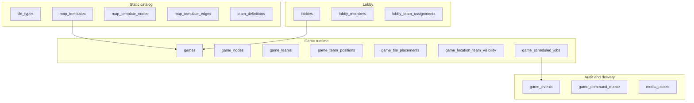
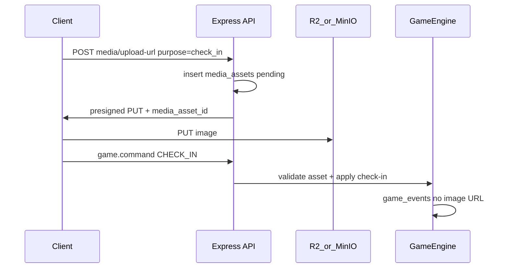
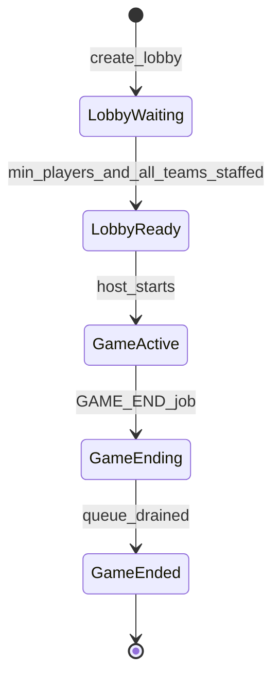
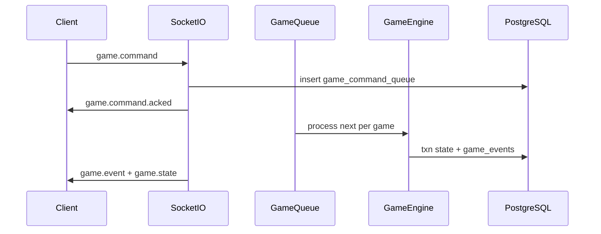

# Mahjong Jet Lag — Technical Design Document

**Status:** Living document (v1 infrastructure)  
**Last updated:** 2026-05-24

---

## 1. Purpose and scope

This document defines **infrastructure and architecture** for *mahjong-jet-lag* before deep game UX work. The backend is the **source of truth** for game state, ordering, and visibility; clients primarily render projections and send commands.

### In scope (v1 infra)

- Registered-user auth (JWT)
- Lobby → game lifecycle
- Normalized relational game state (minimal JSONB on state tables)
- Event log + per-game command queue
- Socket.IO realtime + team-scoped state projections
- Map template cloning (**configurable node count** per template)
- Station check-in with **required photo**, geolocation (warn + allow)
- **Cloudflare R2** media storage (MinIO locally)
- DB-backed scheduler (visibility phases, notifications, game end)
- **Per-lobby static notification schedule** (`lobby_notifications`)
- Challenge system **schema + media plumbing** (resolver logic when product defines cards)
- **Riichi hand evaluation** module (stub → full scoring; see [§3.9](#39-mahjong-hand-evaluation-riichi))

### Abstraction layer vs rule layer

The infrastructure below the dotted line is intentionally agnostic to the specific game rules product ends up shipping. The engine knows about:

- **N nodes** on a map (per map template)
- **M tiles** at each node (`tiles_per_node`, configurable per lobby)
- **K tiles** in each hand (`hand_size`, configurable per lobby)
- A primitive for **swapping placements** between any two locations (node ↔ node, hand ↔ node)
- An **append-only event log** that records every state-changing action
- A **scheduler** that can fire static notification templates at configurable game-relative times
- **Visibility groups + phases** as a configurable mechanic (N phases, N groups) layered on top of the placement model

Specific rules (the exact tile catalog, exact visibility schedule, exact challenge mechanics, exact scoring) live above this layer and can shift without schema migrations.

### Out of scope (v1)

- Polished UI
- Exhaustive riichi edge-case coverage on day one (incremental implementation inside the scoring module)
- Anti-cheat beyond basic validation
- Multi-server Redis (design allows it later; ship single-node first)
- Mobile push (FCM/APNs) — Socket-only notifications for v1
- Specific challenge card rules until product defines decks
- Catalog of notification templates (the lobby stores opaque template keys; the actual text lookup table is a rule-layer concern)
- User-initiated media deletion (GDPR) — post-v1

Hand **styling** is a client concern; hand **order** is always server-provided.

### Repository conventions

- **Stack:** Express + Sequelize + PostgreSQL (`docker-compose.yml`), React + Vite client (demo).
- **Migrations / seeders:** `server/migrations/*.cjs`, `server/seeders/*.cjs`. Use **`.cjs`** (not `.js`) because `server/package.json` has `"type": "module"` — same rule as `config/config.cjs`.
- **Models:** `server/src/models/`, registered in `server/src/config/database.ts`.
- **CLI:** From `server/`, `npm run db:migrate`, `npm run db:seed`, `npm run db:migrate:status`.

**Phase A (schema):** All tables in [§4](#4-data-model) are migrated. Catalog seeds: `team_definitions`, `tile_types` (136 for the standard riichi catalog, but the engine reads the count dynamically), `challenge_types`, `map_template` **TTC 2026** (84 stations; WGS84 `latitude`/`longitude` and schematic layout in `seeders/data/ttc2026-network.cjs`). The 84/136/13/4 combination is the **default configuration**, not a hard constraint.

---

## 2. Confirmed design decisions

| Area | Decision |
|------|----------|
| Map | Static **templates** cloned into per-game rows at start |
| Auth | Registered users only (`users` + JWT) |
| Tile catalog | Per-game tile set drawn from `tile_types` (standard riichi seed = 136 rows; engine reads count dynamically). Closed set per game: no mid-game create/destroy. |
| Map size | **Configurable per template** (`map_templates.node_count`); standard TTC 2026 = 84 |
| Tiles per node | **Configurable per lobby** (`tiles_per_node`, default 1); snapshotted onto `games.tiles_per_node` at start |
| Hand size | **Configurable per lobby** (`hand_size`, default 13); snapshotted onto `games.hand_size` at start |
| Tile count invariant | `tiles_per_node × node_count + hand_size × team_count` must equal the game's tile catalog size (Fisher–Yates draws the entire deck) |
| Deal | **Fisher–Yates** shuffle; random always |
| Hand order | **Server-sorted** (`suit_sort_order` → `rank`); client renders as given |
| Visibility phases | **Configurable count** `visibility_phase_count` (default 4); N phases ⇒ N visibility groups; phase 0 reveals home group, phase N-1 reveals all. Ephemeral view while checked in remains independent. |
| Game config | **Lobby**, editable by **host only**; snapshotted to `games` at start |
| Lobby start | `min_players_to_start` (default **4**); every member picks a team (1–4); **>= 1 player per team** before start; multiple players may share the same team |
| Travel | **Any station** on check-in (honor + geofence); skipping stations OK |
| Commands | `CHECK_IN`, `CHECK_OUT`, `SWAP_TILE`, `SWAP_LOCATION_TILES` (separate) |
| Team commands | **Any member** on that team (`game_participants`) |
| Team positions (UI) | **Not on map**; intel via **event log** only |
| Check-in photo | **Required**; stored in R2; **hidden during game**; **game summary** after end |
| Media retention | **365 days**, then delete (lifecycle rule + sweeper) |
| Object storage | **Cloudflare R2** (prod), **MinIO** (dev) |
| Geolocation | Browser API; **warn + allow**; log flags on events |
| Notifications | Per-lobby `lobby_notifications` rows (`at_seconds`, opaque `template` key, optional `data` JSONB); copied into `game_scheduled_jobs` as `NOTIFICATION` rows at game start; broadcast over Socket |
| Game end | Drain **in-flight** command queue, then `ended` |
| Realtime | Commands → queue → engine → `game_events` → broadcast |
| State storage | Relational tables; JSONB only on events/commands/challenge params/notification data |
| Hand scoring | **Riichi** ruleset; `HandEvaluationService`; stub in infra phase, wired to **game summary** + **challenges** later |

---

## 3. Domain model



### 3.1 Core invariants

- **Closed tile set:** the game's tile catalog (number of `tile_types` rows, e.g. 136 for the riichi seed) is partitioned across `game_tile_placements` at deal time. No mid-game create/destroy. `tiles_per_node × node_count + hand_size × team_count` must equal the catalog size.
- **`tiles_per_node` per map node:** Each `game_node` has exactly `games.tiles_per_node` `game_tile_placements` rows with `game_node_id` set (default 1; configurable per lobby).
- **One placement per tile:** Each `game_tile` has exactly one `game_tile_placements` row — either on a node or in a team hand (XOR via DB check).
- **Configurable hand size:** Each team hand has exactly `games.hand_size` tiles (default 13).
- **Checked-in gate:** Station actions require `current_game_node_id` set.
- **Swap at station:** `SWAP_TILE` only at `current_game_node_id`; exchanges a specific hand tile ↔ a specific station tile (caller chooses both); counts unchanged.
- **Visibility:** Clients never infer fog-of-war; server projection only.
- **No rival position on map:** Other teams’ locations are not in live projection; use `game_events`.

### 3.2 Progressive visibility (global game state)

Visibility is parameterized by `games.visibility_phase_count` (`N`, default 4). N phases ⇒ N visibility groups ⇒ (N-1) `VISIBILITY_PHASE_ADVANCE` jobs scheduled at `started_at + interval × k` for `k = 1 … N-1`.

**At game start:**

1. Random partition of all `game_nodes` into N groups (`game_node_visibility_groups`). Sizes differ by at most 1 when `node_count` doesn't divide evenly.
2. Random home group per team (`game_team_home_groups`). Group assignment is **independent of team count**: when `team_count <= N` each team can get a unique home; when `team_count > N` teams may share a home group; when `team_count < N` some groups have no home team.
3. `visibility_phase = 0` — each team sees face-up tiles only in its home group on map.
4. Schedule (N-1) `VISIBILITY_PHASE_ADVANCE` jobs plus `GAME_END` at `ends_at`. When `N = 1`, no advance jobs are scheduled and everything is visible from start.

**Unlock order per team:**

```text
visible_groups(team, phase) = first (phase + 1) entries of
  [home, (home+1) % N, (home+2) % N, …, (home+N-1) % N]
```

| Phase | Map visibility per team (for `N = 4`) |
|-------|---------------------------------------|
| 0 | Home group only |
| 1 | 2 groups |
| 2 | 3 groups |
| 3 | Full map |

All teams advance phase on the **same schedule**; which groups are visible differs by home group.

**On phase advance (scheduler):** bump phase, upsert `game_location_team_visibility` (`source = phase`), emit `VISIBILITY_PHASE_ADVANCED`, broadcast state.

### 3.3 Visit-based visibility (ephemeral)

While checked in at node `N`:

- `faceUpForTeam(team, N) = true` even if phase would hide `N`.
- `SWAP_TILE` and other station actions allowed.

After `CHECK_OUT` (or `CHECK_IN` elsewhere after implicit check-out):

- No persistent reveal in `game_location_team_visibility`.
- `faceUpOnMap` falls back to phase rules only.

```text
faceUpOnMap(team, node) =
  game_location_team_visibility[team, node].is_face_up

faceUpForTeam(team, node) =
  faceUpOnMap(team, node)
  OR game_team_positions[team].current_game_node_id == node

canSwap(team, node) =
  game_team_positions[team].current_game_node_id == node
```

**Projection rule:** The server computes `faceUpOnMap` / `faceUpForTeam` internally but **does not expose phase numbers or boolean flags to the client**. It emits **tile data only where that team may see it** (see [§6.3](#63-gamestate-projection-shape)).

### 3.4 Station commands and travel

| Command | Payload | Description |
|---------|---------|-------------|
| `CHECK_IN` | `{ nodeId }` | Requires prior photo upload (`media_asset_id`) (Phase G). Sets `current_game_node_id` to any station; implicit check-out first if already checked in elsewhere. |
| `CHECK_OUT` | `{}` | Clears `current_game_node_id`. |
| `SWAP_TILE` | `{ handTileId, stationTileId }` | Exchanges a specific hand tile with a specific tile at the team's current station. Both tile ids are caller-chosen since a station may hold N tiles (`games.tiles_per_node`). |
| `SWAP_LOCATION_TILES` | `{ tileAId, tileBId }` | Swap two tiles between map nodes (challenges). Uses shared `TileSwapService`. Implemented in Phase H. |
| *(future)* | | Additional station actions while checked in. |

**Travel:** No adjacency requirement. Geolocation optional on check-in/swap — allow always, warn if outside geofence or poor `accuracy_meters`.

**Check-in elsewhere:** Server runs check-out first, then check-in.

### 3.5 Check-in photo flow



- Live `game_events` / projections: `has_photo: true` only — **no URLs** during play.
- Uploader may show **local preview** only.
- After `status = ended`: `GET /api/games/:id/summary` returns presigned GET URLs for participants.

### 3.6 Tile identity and red fives

Each physical tile is one `tile_types` row: `(suit, rank, copy_index)` with `copy_index` 0–3. There is **no** `is_red_five` column.

**Red-five convention (catalog):** for `man`, `pin`, and `sou` at **rank 5**, **`copy_index === 0`** is the red five (three tiles in the 136 set). Other copies of the 5 are normal fives. Seeded `display_name` values are `Red 5 Man`, `Red 5 Pin`, `Red 5 Sou` for those rows.

**Game rule:** `game_rule_flags` with `rule_key = red_fives_enabled` (boolean `enabled`). When **off**, red-five tiles still exist and count as normal 5s for melds; when **on**, scoring/projections treat them as red fives. Default at game start: TBD with product (recommend **on** for riichi).

**Server helper:** `server/src/tiles/red-five.ts` — `isRedFiveTileIdentity(tile)`, `isRedFiveForGame(tile, redFivesEnabled)`. All engine, projection, and scoring code must use this; do not re-encode the convention ad hoc.

### 3.7 Hand sorting (server authority)

```text
sortKey(tile) = (tile_types.suit_sort_order, tile_types.rank, game_tiles.copy_index)
```

- Hand order is **not stored** in the DB. The engine/projection layer sorts by `sortKey` when building `handTiles[]`.
- Projections emit `handTiles[]` with `slotIndex` 0–12 assigned at read time; **client must not re-sort**.

### 3.8 Challenges (architecture; rules TBD)

Static catalog: `challenge_decks`, `challenge_types`, `challenges` (parameters JSONB OK).

Runtime: `game_challenge_instances`, `game_challenge_submissions`.

`ChallengeResolutionService` dispatches by `resolver_key`:

| Type | Examples (product) |
|------|-------------------|
| `travel` | “Travel 500m in direction of drawn wind” |
| `photo` | “Photo of 3 round objects”, “three same-colour foods” |
| `tile_swap` | Map tile exchanges via `TileSwapService` |

Photo challenges reuse media pipeline (`purpose = challenge_submission`). Implement resolvers when product defines decks (Phase H).

### 3.9 Mahjong hand evaluation (Riichi)

A dedicated **scoring module** (not part of the realtime command engine) evaluates a mahjong hand and returns structured scoring metadata. The client **never** computes score - only displays server results.

**Ruleset (v1 target):** [Riichi / modern Japanese](https://riichi.wiki/) (han–fu style scoring, yaku detection). Implementation is **code-first** in `server/src/scoring/`; optional static `yaku_definitions` table later if product wants data-driven yaku.

#### Responsibility boundary

| Module | Role |
|--------|------|
| `HandEvaluationService` | Pure function(s): tiles in → evaluation out |
| `GameSummaryService` | At game end, loads each team’s 13 `handTiles`, calls evaluator, attaches results to summary |
| `ChallengeResolutionService` | Invokes evaluator when a challenge requires proving a scoring hand |

No game state mutation from scoring alone unless a challenge resolver explicitly applies an effect after a successful evaluation.

#### Input / output (contract)

**Input** (`HandEvaluationInput`):

```ts
{
  tiles: Array<{
    suit: string;      // matches tile_types.suit
    rank: number;      // 1–9 for suits; honors use agreed rank mapping
    copyIndex: number; // 0–3; red five iff man|pin|sou, rank 5, copyIndex 0
  }>;
  winningTile?: { suit, rank, copyIndex };  // optional 14th tile if evaluating complete win
  rules: {
    redFivesEnabled: boolean;  // from game_rule_flags.red_fives_enabled
  };
  context?: {
    seatWind?: "east" | "south" | "west" | "north";
    roundWind?: "east" | "south" | "west" | "north";
    riichi?: boolean;
    // extended riichi flags (ippatsu, haitei, etc.) as rules firm up
  };
}
```

`HandEvaluationService` derives red-five treatment via `isRedFiveForGame(tile, rules.redFivesEnabled)` — **not** a persisted per-tile flag.

For this game, the live hand is **13 tiles**; evaluation for “complete hand” may pass `winningTile` separately or as a 14th entry—pick one convention in implementation and keep consistent in API.

**Output** (`HandEvaluationResult`):

```ts
{
  isValidWinningHand: boolean;
  handRank?: string;           // e.g. "Full flush", "Riichi", "No yaku"
  yaku: Array<{ name: string; han: number }>;
  fu?: number;
  han?: number;
  points?: { total: number; dealer?: number; nonDealer?: number };
  errorCode?: string;          // e.g. "NOT_A_WINNING_HAND", "INVALID_TILE_COUNT"
  message?: string;            // human-readable for UI / summary
}
```

#### v1 sequencing

| Step | Deliverable |
|------|-------------|
| **I-a (early)** | Module skeleton + types; stub returns `isValidWinningHand: false`, `errorCode: "NOT_IMPLEMENTED"`; unit test harness with fixture hands |
| **I-b** | Winning-hand structure detection (standard form: 4 melds + pair) |
| **I-c** | Yaku + han–fu + point calculation (riichi baseline) |
| **I-d** | `GET /api/games/:id/summary` includes per-team `handEvaluation` |
| **I-e** | Challenge resolvers call same service when card requires it |

**HTTP (dev / optional v1):** `POST /api/scoring/evaluate-hand` — authenticated; body = `HandEvaluationInput`; for tooling and client-free tests. Not required for production gameplay if summary + challenges cover integration.

#### Open riichi details (defer to implementation)

- Red fives: **identity resolved** (§3.6); han/fu for red fives in scoring may still be **out of v1**
- Dora/uradora indicators (likely **out of v1** unless product requires)
- Which yaku apply in this outdoor variant
- Whether evaluation uses **closed hand only** (13 tiles via `game_tile_placements` where `game_team_id` is set) or can include called tiles later

---

## 4. Data model

JSONB is avoided for authoritative **state**. Allowed on: `game_events.payload`, `game_command_queue.payload`, `challenges.parameters`, challenge submissions.

### 4.1 Identity and membership

#### `users`

| Column | Type | Constraints |
|--------|------|-------------|
| `id` | UUID | PK, default UUIDv4 |
| `email` | STRING | NOT NULL, UNIQUE |
| `password_hash` | STRING | NOT NULL |
| `username` | STRING | NOT NULL, UNIQUE |
| `created_at` | DATE | NOT NULL |
| `updated_at` | DATE | NOT NULL |

Indexes: `email`, `username`.

Sequelize model: `User` (`server/src/models/user.ts`).

#### `lobbies`

| Column | Notes |
|--------|--------|
| `id` | UUID PK |
| `host_user_id` | FK → `users` |
| `status` | `waiting` \| `starting` \| `closed` |
| `map_template_id` | FK |
| `game_duration_seconds` | |
| `visibility_phase_interval_seconds` | |
| `visibility_phase_count` | INT NOT NULL DEFAULT 4 (sourced from `map_template.default_visibility_phase_count`); snapshotted to `games.visibility_phase_count` at start. `>= 1`. |
| `tiles_per_node` | INT NOT NULL DEFAULT 1 (sourced from `map_template.default_tiles_per_node`); snapshotted to `games.tiles_per_node` at start. `>= 1`. |
| `team_assignment_mode` | `pick` \| `random` \| `mixed` |
| `min_players_to_start` | default **4** |
| `config_updated_at` | |

**Config:** only `host_user_id` may `PATCH /api/lobbies/:id/config`.

**Start rule:**

- Member count ≥ `min_players_to_start` (default **4**; must be ≥ 4 so all teams can be staffed).
- **Each team 1–4 has at least one member** after resolving assignments (many players may share the same team).
- Mode-specific rules below.

**`team_assignment_mode`:**

| Mode | Lobby behavior | At game start (`GameStartService`) |
|------|----------------|-------------------------------------|
| `pick` | Every member must choose `team_slot` 1–4 before start. | Use picks as-is. |
| `random` | Members may leave `team_slot` null until start. | Assign **all** members across teams 1–4 **as evenly as possible** (shuffle order, then repeatedly place each player on a currently smallest team; random tie-break). |
| `mixed` | Members may pick a team or stay in the random pool (`null`). | Keep picks; assign pool members on top of existing counts using the same **even distribution** algorithm. Readiness: enough pool players to fill any team with zero picks. |

Even distribution implementation: `server/src/services/even-team-assignment.ts` (`assignTeamsEvenly`, `resolveTeamsForGameStart`).

#### `lobby_members`

`lobby_id`, `user_id`, `joined_at` — unique `(lobby_id, user_id)`.

#### `lobby_team_assignments`

`lobby_id`, `user_id`, `team_slot` — which of the four game teams (1–4) the user chose. **Not unique per lobby:** many users may share the same `team_slot`. `null` = random pool (assigned evenly at start in `random` / `mixed` modes).

#### `lobby_notifications`

Per-lobby schedule of static notification templates that fire during the game. Host-managed via REST while the lobby is `waiting`. Copied into `game_scheduled_jobs` as `NOTIFICATION` rows at game start (`run_at = started_at + at_seconds × 1000`, `payload = { template, data }`).

| Column | Notes |
|--------|--------|
| `id` | UUID PK |
| `lobby_id` | FK → `lobbies` (ON DELETE CASCADE) |
| `at_seconds` | INT NOT NULL CHECK `>= 0`; offset in seconds from `games.started_at`. |
| `template` | VARCHAR(64) NOT NULL; opaque template key (no enum catalog in v1). |
| `data` | JSONB; optional template-specific payload (e.g. `{ minutesLeft: 10 }`). |
| `created_at`, `updated_at` | |

Index: `(lobby_id, at_seconds)`. Same `at_seconds` may repeat (two distinct templates may fire at the same time).

#### `games`

| Column | Notes |
|--------|--------|
| `status` | `active` \| `ending` \| `ended` |
| `hand_size` | snapshot from `map_template.default_hand_size` (default 13) |
| `tiles_per_node` | INT NOT NULL DEFAULT 1; snapshot from `lobby.tiles_per_node` at start |
| `visibility_phase` | 0 … `visibility_phase_count - 1` |
| `visibility_phase_count` | INT NOT NULL DEFAULT 4; snapshot from `lobby.visibility_phase_count` at start |
| `started_at`, `ends_at`, `duration_seconds` | |
| `visibility_phase_interval_seconds` | snapshot from lobby |
| `config_version` | |

#### `game_participants`

`game_id`, `user_id`, `game_team_id`. Many rows may reference the same `game_team_id` when several lobby members chose the same team. All participants on a team share that team’s hand and may issue commands for it.

### 4.2 Teams (catalog vs runtime)

#### `team_definitions` (static, 4 rows)

`id`, `code` (e.g. `red`), `display_name`, `sort_order`.

Seeded: `east`, `south`, `west`, `north` (`20260517180000-seed-team-definitions.cjs`).

#### `game_teams`

`id`, `game_id`, `team_definition_id`, `display_name` (optional).

### 4.3 Map catalog and instances

#### `map_templates`

| Column | Notes |
|--------|-------|
| `name`, `description` | |
| `node_count` | Number of stations on this template (TTC 2026 = 84). The cloner trusts the value; not constrained to 84. |
| `default_duration_seconds` | Default `games.duration_seconds` if not overridden on the lobby. |
| `default_hand_size` | Default `lobby.hand_size`. Standard riichi = 13. |
| `default_tiles_per_node` | Default `lobby.tiles_per_node`. Default 1. |
| `default_visibility_phase_count` | Default `lobby.visibility_phase_count`. Default 4. |
| `default_start_node_code` | Station code where teams spawn at game start (nullable; null = teams start unchecked). |

#### `map_template_nodes`

| Column | Notes |
|--------|--------|
| `code`, `name` | Station identifiers (unique `code` per template) |
| `latitude`, `longitude` | WGS84 entrance coords for geofence (authoritative values in `server/seeders/data/ttc2026-network.cjs`) |
| `geofence_radius_meters` | Optional; engine may default ~75–150m when null |
| `coordinate_x`, `coordinate_y` | Integer grid position for schematic map UI |
| `label_anchor` | Label placement hint (lowercase compass: `n`, `ne`, `sw`, `e`, …) — `STRING(16)`; stored as seeded, echoed in projections as `labelAnchor` |
| `label_rotate` | Optional label rotation in degrees (client transit-map style) |
| `is_interchange` | Interchange station styling |

#### `map_template_lines`

Lines for a template: `code` (`STRING`, unique per template), `name`, `short_name`, `color` (hex), `sort_order`, `render_metadata` (JSONB: `stationIds`, `bends` waypoints).

#### `map_template_node_lines`

Many-to-many: `map_template_node_id` ↔ `map_template_line_id` (a station can serve multiple lines).

#### `map_template_edges`

`from_node_id`, `to_node_id` (unique per template + pair). Graph for layout only — **no** `weight` / `travel_seconds` in v1 (travel is not edge-constrained).

#### `game_nodes` / `game_edges`

Cloned from template at game start (`GameStartService`):

- **`game_nodes`:** copy template node layout fields + `game_id`, `template_node_id` (FK, `RESTRICT` on delete).
- **`game_lines`:** clone `map_template_lines` per game (`code`, `name`, `short_name`, `color`, `render_metadata`, `sort_order`, `template_line_id`).
- **`game_nodes`:** also clone `label_rotate`.
- **`game_node_lines`:** clone `map_template_node_lines` using cloned line + node IDs.
- **`game_edges`:** `from_game_node_id`, `to_game_node_id` mapped from template edge endpoints.

Layout fields (including `lineIds[]` string codes) are **not secret** and are included in `game.state` `mapNodes[]`, `mapLines[]`, and `mapEdges[]`. Tile identity on nodes remains visibility-gated.

### 4.4 Tiles

#### `tile_types`

Tile catalog for the standard riichi seed: 34 types × 4 copies = 136 rows.  
`suit`, `rank`, `copy_index` (0–3), `suit_sort_order`, `display_name`.

The engine never hard-codes the count: `tile_types.count()` is the source of truth for the game's catalog size. Future map templates / game modes may seed alternate catalogs.

Red fives: `(man|pin|sou, rank 5, copy_index 0)` — see [§3.6](#36-tile-identity-and-red-fives). No boolean column.

#### `game_tiles`

One row per tile in the catalog (e.g. 136 for the riichi seed): `tile_type_id`, `copy_index` (must match the referenced `tile_types.copy_index`).

#### `game_tile_placements`

Where each `game_tile` lives — **exactly one** of:

| Column | Meaning |
|--------|---------|
| `game_node_id` | On the map at that station |
| `game_team_id` | In that team’s hand |

`game_tile_id` is unique. `game_node_id` is **not unique** (a node may hold up to `games.tiles_per_node` tiles); a non-unique index supports lookups by node. DB check: `(game_node_id IS NOT NULL) XOR (game_team_id IS NOT NULL)`.

**Deal:** Shuffle all catalog tiles → create `tiles_per_node` placements at each `game_node` → `hand_size` placements per team in fixed team order. Required invariant at deal time: `tiles_per_node × node_count + hand_size × team_count = catalog_size`. Hand sort order is applied in the engine when projecting, not persisted.

### 4.5 Positions and visibility

#### `game_team_positions`

`current_game_node_id` (nullable), `checked_in_at`, `last_check_in_latitude`, `last_check_in_longitude`, `geofence_validated`, `geolocation_warning`.

#### `game_node_visibility_groups`

`game_node_id`, `group_index` (0–3).

#### `game_team_home_groups`

`game_team_id`, `group_index` (unique per game).

#### `game_location_team_visibility`

Phase unlocks only: `is_face_up`, `source` (`phase` \| `override`), `revealed_at`.

#### `game_rule_flags` (optional)

Extensible per-game rules: `rule_key`, `enabled` (boolean).

| `rule_key` | Meaning |
|------------|---------|
| `red_fives_enabled` | When true, copy 0 of each suited 5 uses red-five scoring/UI (§3.6) |

Set at game start from lobby config (when product defines it). Other keys may be added later.

### 4.6 Scheduled jobs

#### `game_scheduled_jobs`

| `job_type` | Effect |
|------------|--------|
| `VISIBILITY_PHASE_ADVANCE` | Phase++, recompute visibility, event + broadcast. `(N - 1)` rows seeded at game start (`N = games.visibility_phase_count`). |
| `GAME_END` | `ending` → drain queue → `ended`. One row seeded at game start. |
| `NOTIFICATION` | Broadcasts a static notification via `broadcaster.emitNotification`. Rows are seeded at game start by copying every `lobby_notifications` row into `game_scheduled_jobs` (`run_at = started_at + at_seconds × 1000`, `payload = { template, data }`). |

### 4.7 Media

#### `media_assets`

| Column | Notes |
|--------|--------|
| `game_id` | Owning game |
| `user_id` | Uploader |
| `purpose` | `check_in` \| `challenge_submission` \| `other` |
| `storage_key` | R2 object key (unique) |
| `status` | `pending` \| `ready` \| `failed` |
| `content_type` | Optional MIME for presign |
| `byte_size` | Optional uploaded size |
| `expires_at` | `created_at + 365 days` |
| `deleted_at` | set when purged |

**Stack:**

| Env | Storage |
|-----|---------|
| Production | Cloudflare R2 (S3 API) |
| Development | MinIO (Docker Compose) |

**Env vars:** `R2_ACCOUNT_ID`, `R2_ACCESS_KEY_ID`, `R2_SECRET_ACCESS_KEY`, `R2_BUCKET_NAME`, `R2_ENDPOINT`, `MEDIA_MAX_BYTES`, `MEDIA_RETENTION_DAYS` (365).

Use `@aws-sdk/client-s3` with custom endpoint + path-style for R2.

### 4.8 Challenges (schema; seeds later)

#### `challenge_types`

Global catalog: `code`, `name`, `resolver_key` (dispatches `ChallengeResolutionService`).

#### `challenge_decks`

`code`, `name`, `is_active`, `sort_order`.

#### `challenges`

`challenge_deck_id`, `challenge_type_id`, `code` (unique per deck), `title`, `parameters` (JSONB), `sort_order`, `is_active`.

#### `game_challenge_instances`

Runtime draw per team: `game_id`, `game_team_id`, `challenge_id`, `status` (`active` \| `submitted` \| `approved` \| `rejected` \| `cancelled`), `assigned_at`, `expires_at`, `resolved_at`, `resolution_payload` (JSONB).

#### `game_challenge_submissions`

`game_challenge_instance_id`, `submitted_by_user_id`, optional `media_asset_id`, `payload` (JSONB), `status` (`pending` \| `accepted` \| `rejected`), `submitted_at`, `reviewed_at`, `rejection_reason`.

Seeder: `challenge_types` only (`travel`, `photo`, `tile_swap`); decks/cards when product defines them.

### 4.9 Events and command queue

#### `game_events`

`sequence` (bigint, monotonic per game), `event_type`, `actor_user_id`, `actor_game_team_id`, `payload` (JSONB).

#### `game_command_queue`

`game_id`, `game_team_id`, `user_id`, `command_type`, `payload` (JSONB).  
`status`: `pending` \| `processing` \| `done` \| `failed`.  
`client_command_id` (UUID) — unique per `game_id` for idempotency.  
`processed_at`, `error_message` when terminal.

#### `game_scheduled_jobs`

`game_id`, `job_type` (`VISIBILITY_PHASE_ADVANCE` \| `GAME_END` \| `NOTIFICATION`), `run_at`, `status`, optional `payload` (JSONB), `completed_at`, `error_message`.

Optional (later): `game_event_media` (`event_id`, `media_asset_id`) for multiple attachments.

---

## 5. Lifecycle



1. Host creates lobby; members join and pick teams.
2. Host starts → validate tile-count invariant (`tiles_per_node × node_count + hand_size × team_count == catalog_size`) → clone map → deal tiles → partition visibility into `visibility_phase_count` groups → schedule phase + notification jobs.
3. Active play via command queue + scheduler.
4. End → summary with photo URLs for participants.

---

## 6. Realtime architecture



### Socket rooms

- `lobby:{lobbyId}`
- `game:{gameId}`

Auth required; verify membership/participation.

### Command authorization

Issuer must be `game_participants` for the command’s `game_team_id`.

### Projections (`game.state`)

Delivered on join/reconnect and after every processed command (v1: **full snapshot** per team).

#### Design principles

1. **Do not send all location tiles.** Hidden tiles must be **absent** from the payload (not `tile: null` with a “secret” object the client could inspect). The server is the only authority on who sees what.
2. **Do not send `visibilityPhase`.** The client does not need the global phase index; fog-of-war is already applied in what tile data is included. Optional **`nextVisibilityChangeAt`** (ISO timestamp) is enough for a countdown banner.
3. **One realtime channel, not a separate “station” API for v1.** After `CHECK_IN`, the next `game.state` includes an **`atStation`** block with the tile(s). A second HTTP call would duplicate state and risk drift between Socket and REST.
4. **Split map view vs station view** in the JSON shape:
   - **`mapNodes`** — one entry per `game_node`; `tile`/`tiles` present only when **phase-visible on the map** (`faceUpOnMap`).
   - **`atStation`** — present when checked in; always includes the **current station tile(s)** even if that node is fogged on the map.

> When `games.tiles_per_node = 1` (the default), projections currently expose a singular `tile` field on `mapNodes[]` and `atStation`. When `tiles_per_node > 1`, the field becomes `tiles[]`; sites that issue `SWAP_TILE` must address a specific tile via `stationTileId`. The wire shape change is scoped to the projection phase (Phase G); the engine accepts the new payload from chunk 7 of the Phase D refactor onward.

The client renders the map from `mapNodes` and the station panel from `atStation` without re-deriving visibility rules.

#### Field summary

| Field | Scope |
|-------|--------|
| `gameId`, `status`, `endsAt` | Shared |
| `nextVisibilityChangeAt` | Optional; for UI timer only |
| `mapNodes[]` | Layout fields per `game_node`; `lineIds[]` (string codes); `tile` (default config) or `tiles[]` (when `tiles_per_node > 1`) only if phase-visible on map |
| `mapLines[]` | Line catalog (`code`, `name`, `shortName`, `color`, `renderMetadata`) — sent once / on reconnect |
| `mapEdges[]` | Static graph (`fromNodeId`, `toNodeId`) — sent once / on reconnect |
| `atStation` | When checked in: `nodeId`, `code`, `tile` (always) |
| `handTiles[]` | Own team, pre-sorted |
| `recentEvents[]` | Shared metadata (no photo URLs) |
| Other teams’ hands / map positions | Omitted |

### 6.3 `game.state` projection shape

**Tile object** (when included):

```json
{
  "instanceId": "uuid",
  "suit": "man",
  "rank": 2,
  "copyIndex": 1,
  "displayName": "2 Man",
  "isRedFive": false
}
```

`isRedFive` is **computed** when building the snapshot (`isRedFiveForGame` + `red_fives_enabled`). Include `copyIndex` so the client can reconcile with catalog conventions.

**`mapNodes[]`** — one entry per `game_node` (length = `games.node_count`). Layout fields are always present; **`tile`** is conditional:

```json
{
  "id": "uuid",
  "code": "STN_01",
  "name": "Union Station",
  "coordinateX": 12,
  "coordinateY": 4,
  "lineIds": ["red", "blue"],
  "labelAnchor": "ne",
  "labelRotate": null,
  "isInterchange": false,
  "latitude": 51.5074,
  "longitude": -0.1278,
  "tile": { "instanceId": "...", "suit": "sou", "rank": 5, "displayName": "5 Sou" }
}
{
  "id": "uuid",
  "code": "STN_02",
  "name": "North End",
  "coordinateX": 8,
  "coordinateY": 1,
  "lineIds": ["red"],
  "labelAnchor": "n",
  "isInterchange": false,
  "latitude": 51.52,
  "longitude": -0.13
}
```

- Include **`tile`** only when `faceUpOnMap` is true for this team.
- Omit `tile` (or use `null` consistently—pick one in implementation; **never** send placeholder tile identity for hidden nodes).

**`mapLines[]`** — line catalog for styling:

```json
{
  "code": "1",
  "name": "Line 1 Yonge-University",
  "shortName": "Line 1",
  "color": "#FFC72C",
  "sortOrder": 0,
  "renderMetadata": { "stationIds": ["finch-west", "..."], "bends": { "union": [{ "x": 575, "y": 680 }] } }
}
```

**`mapEdges[]`** — cloned graph edges (no tile data):

```json
{ "fromNodeId": "uuid", "toNodeId": "uuid" }
```

**`atStation`** — `null` when checked out; otherwise:

```json
{
  "nodeId": "uuid",
  "code": "STN_01",
  "tile": { "instanceId": "...", "suit": "dots", "rank": 9, "displayName": "9 Dot" }
}
```

- Populated whenever `current_game_node_id` is set.
- Tile is **always** included here, even when the same node has no `tile` on the map (fogged visibility group + checked in).

**Why not let the client render from full data?**  
Exposing every location’s tile in `game.state` would leak map state via devtools/network and breaks competitive play. Any “hidden” UI must be based on **missing data**, not client-side filtering.

**Post-game:** `GET /api/games/:id/summary` may include richer history; live `game.state` stays redacted as above.

### Scheduler

`SchedulerWorker` polls `game_scheduled_jobs` (`FOR UPDATE SKIP LOCKED`).  
v1: in-process on single node. System handlers update state → `game_events` → broadcast (may bypass player queue; document ordering if unified later).

---

## 7. API surface

### HTTP

| Area | Endpoints |
|------|-----------|
| Auth | `POST /api/auth/register`, `POST /api/auth/login`, `GET /api/auth/me` |
| Lobbies | `POST /api/lobbies`, `GET /api/lobbies/:id`, `PATCH /api/lobbies/:id/config` (host), `POST …/join`, `POST …/team`, `POST …/start` |
| Games | `GET /api/games/:id`, `GET /api/games/:id/summary` (ended only; includes `handEvaluation` per team when Phase I-d) |
| Media | `POST /api/games/:id/media/upload-url`, optional `POST …/media/:id/confirm` |
| Catalog | `GET /api/map-templates`, `GET /api/tile-types`, `GET /api/challenge-decks` |
| Scoring | `POST /api/scoring/evaluate-hand` (optional dev API; same contract as `HandEvaluationService`) |

### Socket

| Direction | Event |
|-----------|--------|
| C→S | `lobby.join`, `game.command` |
| S→C | `lobby.config`, `game.command.acked`, `game.command.rejected`, `game.event`, `game.state`, `game.notification` |

---

## 8. Server module layout

```text
server/src/
  auth/           JWT, bcrypt, middleware
  socket/         Socket.IO, rooms
  queue/          per-game processor
  engine/         handlers, TileSwapService, invariants
  projections/    GameStateProjection (hand sort via sortKey)
  scheduler/      game_scheduled_jobs worker
  media/          R2/MinIO presign, retention sweeper
  challenges/     ChallengeResolutionService (stubs → impl)
  scoring/        HandEvaluationService (Riichi: structure, yaku, han–fu, points)
  tiles/          red-five identity helpers (isRedFiveForGame)
  services/       LobbyService, GameStartService, GameSummaryService
  models/         Sequelize models
```

Entry: `http.createServer(app)` + Socket.IO; `import "dotenv/config"`.

---

## 9. Implementation phases

| Phase | Work |
|-------|------|
| **A** | This doc; all §4 migrations; catalog seeds (`team_definitions`, `tile_types`, `challenge_types`, `map_template` **TTC 2026** with full WGS84 coords in `seeders/data/ttc2026-network.cjs`) |
| **B** | Auth + lobby HTTP APIs; **host** `POST /api/lobbies/:id/start` validates readiness, resolves teams (`even-team-assignment.ts`), persists `team_slot`, creates `games` + four `game_teams` + `game_participants`, closes lobby |
| **C** | Extend **same** `GameStartService`: clone map (template `node_count`), create one `game_tile` per catalog entry + placements (`tiles_per_node` per node + `hand_size` per team), visibility groups, scheduled jobs |
| **D** | Engine, queue, scheduler, event tests |
| **E** | Socket.IO, projections (sorted hands), reconnect |
| **F** | Geolocation warn/allow |
| **G** | R2/MinIO, check-in photo, game summary URLs, retention |
| **H** | Challenge catalog + resolvers (when product ready) |
| **I** | **Scoring:** `HandEvaluationService` stub → riichi implementation; summary + challenge integration |

---

## 10. Open items (non-blocking)

The infra layer is intentionally rule-agnostic. Items marked **rule layer** describe questions that will be answered by whatever rule set product picks (riichi, TTC variant, etc.) and do **not** block the infra phases.

| Item | Status |
|------|--------|
| Deal algorithm | Resolved — Fisher–Yates |
| Notification copy | Resolved — opaque `template` key per `lobby_notifications` row; concrete text catalog is a rule-layer concern |
| Challenge definitions | Waiting on product (rule layer) |
| GDPR media delete | Deferred |
| Challenge photo visibility during game | Likely same as check-in; confirm with product (rule layer) |
| Riichi: dora / red dora / full yaku list | Rule layer — defer; confirm with product |
| 13 vs 14 tiles for evaluation API | Rule layer — convention TBD when implementing Phase I-b |
| Scoring affects game winner | Rule layer — summary ranking only vs mechanical win condition |
| Per-template notification defaults | Future — `map_templates` could seed a default notification set; not in v1 |

---

## 11. Migration checklist

- [x] Add user table
- [x] Add team definitions
- [x] Add lobby tables
- [x] Add game runtime tables
- [x] Add tile + map catalog tables
- [x] Add visibility + positions tables
- [x] Add `game_events`, `game_command_queue`, `game_scheduled_jobs`
- [x] Add `media_assets`
- [x] Add challenge tables (challenge_types seeder; decks/cards empty)
- [x] Seeds: `team_definitions`, `tile_types` (136 rows for the standard riichi catalog), `challenge_types`
- [x] Seed: `map_template` **TTC 2026** (`server/seeders/data/ttc2026-network.cjs` → `20260517202000-seed-map-template-ttc2026.cjs`). All 84 stations have entrance `latitude`/`longitude` plus schematic `x`/`y`/`labelAnchor` in the seed file, which is the canonical map source for the DB-backed client.
- [ ] Phase D abstraction-layer relaxation (`2026052*-relax-abstraction-layer.cjs`):
  - Drop unique index `game_tile_placements_game_node_id_unique`; add non-unique index on `game_node_id`.
  - `map_templates`: add `default_tiles_per_node INT NOT NULL DEFAULT 1`, `default_visibility_phase_count INT NOT NULL DEFAULT 4`.
  - `lobbies`: add `tiles_per_node INT NOT NULL DEFAULT 1`, `visibility_phase_count INT NOT NULL DEFAULT 4`.
  - `games`: add `tiles_per_node INT NOT NULL DEFAULT 1`, `visibility_phase_count INT NOT NULL DEFAULT 4`.
  - Create `lobby_notifications (id, lobby_id FK CASCADE, at_seconds, template, data JSONB, timestamps)` + index `(lobby_id, at_seconds)`.

---

## 12. Testing

**Stack:** Vitest + Supertest; Postgres **test database only** for any test that touches the DB.

| Layer | Location | Database |
|-------|----------|----------|
| Unit | `server/test/unit/**` | None |
| Integration | `server/test/integration/services/**` | `DATABASE_URL_TEST` only |
| API | `server/test/integration/api/**` | `DATABASE_URL_TEST` only |

**Commands** (from `server/`):

- `npm test` — all suites
- `npm run test:unit` — pure logic (no migrate/seed)
- `npm run test:integration` — service + HTTP tests against test DB

**Rules:**

- `DATABASE_URL_TEST` is required; harness sets `DATABASE_URL` from it before app/Sequelize load. Database name must contain `test`. Never run integration tests against dev data.
- Global setup migrates + seeds the **test** DB once per integration run; `beforeEach` truncates mutable tables, keeps catalog seeds.
- **Intentional coverage only** — test business rules and regressions, not framework boilerplate. Prefer one orchestration test over duplicate DB count assertions. API tests assert HTTP status + error `code`; deep invariants live in service integration tests.

Phase D+ adds engine/scheduler/socket suites under the same tree.

---

## Appendix: example `game.state` (team-scoped snapshot)

Team is checked in at `STN_42` (fogged on map). Home group nodes include `STN_01` with a visible tile. Example uses the default `tiles_per_node = 1` config.

```json
{
  "gameId": "a1b2c3d4-…",
  "status": "active",
  "endsAt": "2026-05-17T20:00:00.000Z",
  "nextVisibilityChangeAt": "2026-05-17T19:30:00.000Z",
  "handTiles": [
    {
      "slotIndex": 0,
      "instanceId": "…",
      "suit": "characters",
      "rank": 2,
      "displayName": "2 Character"
    }
  ],
  "atStation": {
    "nodeId": "node-42-…",
    "code": "STN_42",
    "tile": {
      "instanceId": "tile-…",
      "suit": "dots",
      "rank": 9,
      "displayName": "9 Dot"
    }
  },
  "mapNodes": [
    {
      "id": "node-01-…",
      "code": "STN_01",
      "name": "Example A",
      "coordinateX": 10,
      "coordinateY": 5,
      "lineIds": ["red"],
      "labelAnchor": "ne",
      "isInterchange": false,
      "latitude": 51.5,
      "longitude": -0.12,
      "tile": {
        "instanceId": "tile-…",
        "suit": "bamboos",
        "rank": 5,
        "displayName": "5 Bamboo"
      }
    },
    {
      "id": "node-02-…",
      "code": "STN_02",
      "name": "Example B",
      "coordinateX": 8,
      "coordinateY": 3,
      "lineIds": ["red", "blue"],
      "labelAnchor": "n",
      "isInterchange": false,
      "latitude": 51.51,
      "longitude": -0.11
    }
  ],
  "mapLines": [
    { "code": "1", "name": "Line 1 Yonge-University", "shortName": "Line 1", "color": "#FFC72C", "sortOrder": 0, "renderMetadata": { "stationIds": [], "bends": null } },
    { "code": "2", "name": "Line 2 Bloor-Danforth", "shortName": "Line 2", "color": "#00923F", "sortOrder": 1, "renderMetadata": { "stationIds": [], "bends": null } }
  ],
  "mapEdges": [
    { "fromNodeId": "node-01-…", "toNodeId": "node-02-…" }
  ],
  "recentEvents": [
    {
      "sequence": 42,
      "type": "CHECK_IN",
      "teamCode": "red",
      "nodeCode": "STN_42",
      "hasPhoto": true,
      "at": "2026-05-17T18:12:00.000Z"
    }
  ]
}
```

Notes:

- `mapNodes` is abbreviated (one entry per `game_node`; 84 items for the TTC 2026 template); `STN_02` has **no** `tile` key—client shows face-down on map.
- `STN_42` tile appears under **`atStation`**, not under `mapNodes` (still fogged on map).
- After `CHECK_OUT`, `atStation` becomes `null`; `STN_42` remains without `tile` in `mapNodes` until phase unlock.
- `mapEdges` carries the static graph; no tile data on edges.
