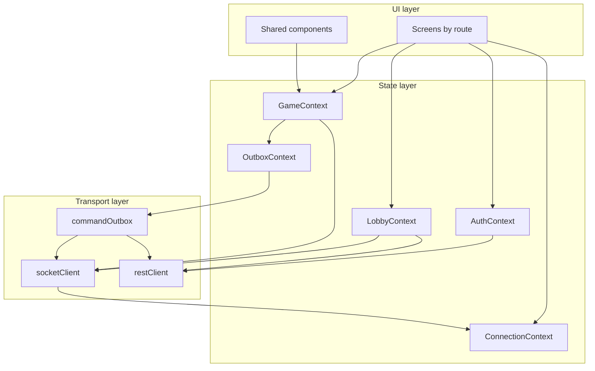
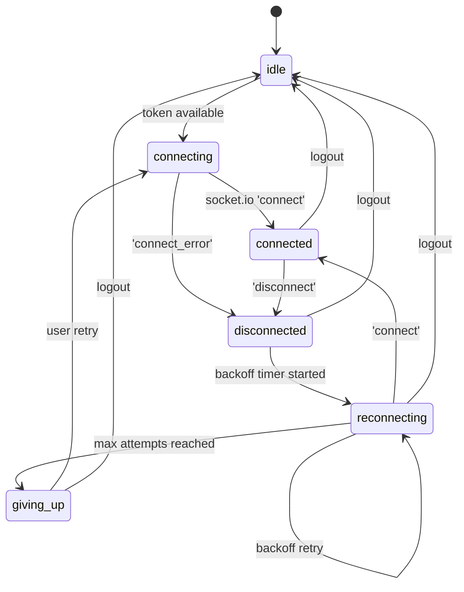
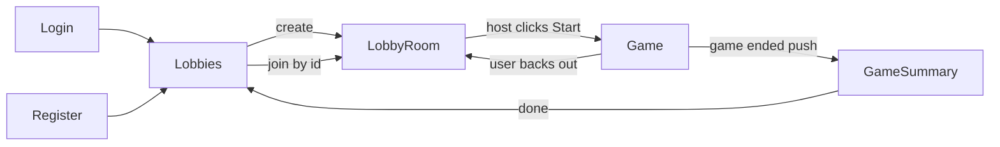

# Mingmei's Mahjong Mania — Client Technical Design Document

**Status:** Living document (v1 MVP)
**Last updated:** 2026-06-01
**Companion:** [docs/TDD_server.md](TDD_server.md) — the server is the source of truth for game state, ordering, and visibility; this doc covers the React client that renders projections and dispatches commands.

---

## 1. Purpose and scope

This document defines the **architecture and chunked implementation plan** for the v1 MVP client of *mingmei-mahjong-mania*. The deadline is approximately **2026-06-08** (one week from the decision date), so the scope is intentionally cut to "functional and reliable, not polished".

The server is feature-complete through Phase E (Socket.IO + projections + queue/scheduler workers) and Phase F (geolocation warn/allow on the engine side). The client today is a static map viewer plus a local tile shuffler — none of the realtime, auth, or game-state plumbing exists yet. This TDD describes how we build it.

### In scope (v1 MVP)

- **Auth** — registered-user login + registration; JWT in `localStorage`; route guards.
- **Lobby flow** — create lobby (host), join lobby (member), see members + readiness, pick team, host-only config editor, host-only start. Notifications CRUD is included since the lobby DTO carries them.
- **In-game** — map view (reuse existing `MapShell`), team hand panel, station panel (slot-aware), event log drawer, game timer, station check-in, station check-out, swap-tile / swap-location-tiles UX. All reads driven by the server's `game.state` projection.
- **Game summary screen** — final scores, full event log replay, post-game hand. (Score values come from Phase I when it lands; v1 shows what the server gives us, including stub values.)
- **Mobile-first responsive web** — the target device is a phone in a subway. Desktop works because it's the same DOM, but layout breakpoints prioritize portrait phone first.
- **Realtime + reliability** — `socket.io-client` for live updates; `react-router-dom` for navigation; reconnect-on-visibility-change; per-game IndexedDB command outbox; REST fallback (`POST /api/games/:id/commands`) when the socket is offline.

### Out of scope (v1)

- **Photo capture and upload (Phase G)** — deferred per [docs/TDD_server.md §1](TDD_server.md#1-purpose-and-scope). CHECK_IN is photo-less in MVP.
- **Polished design / brand identity** — visual design is intentionally rough. Spacing, typography, colors land as "consistent enough to use", not "pretty".
- **PWA service worker / offline app shell** — only a manifest + icon so users can add-to-home-screen.
- **Native wrappers (Capacitor, React Native)** — out of scope; browser-only.
- **Push notifications (FCM/APNs)** — out of scope; the only realtime channel is the open socket.
- **Offline-first caching of game state** — the IndexedDB outbox is the *only* offline persistence we add; everything else is in-memory and re-fetched on reconnect.
- **Dark mode** — light only in v1.
- **Accessibility audit** — basic keyboard navigation + sensible tab order; no ARIA audit / screen reader testing.
- **Internationalization** — English only.
- **Automated end-to-end tests** — manual smoke checklist per chunk; Playwright deferred.
- **Shared-types package (server↔client)** — wire types are duplicated client-side and kept in sync manually. Post-MVP cleanup.

### Repository conventions

- **Client stack:** React 18 + Vite + TypeScript (already in [client/package.json](../client/package.json)).
- **New deps to land:** `socket.io-client`, `react-router-dom`, `vitest`, `@testing-library/react`, `@testing-library/jest-dom`, `@testing-library/user-event`, `jsdom`, `idb` (small typed wrapper around IndexedDB). All other behavior is built on the React standard library.
- **Test runner:** Vitest with `jsdom`. One config file ([client/vitest.config.ts](../client/vitest.config.ts)) added in chunk 1.
- **Path conventions:** flat under [client/src/](../client/src). Source layout:
  - `client/src/transport/` — `restClient.ts`, `socketClient.ts`, `commandOutbox.ts`.
  - `client/src/state/` — one folder per context (`auth/`, `lobby/`, `game/`, `connection/`, `outbox/`), each with `Context.tsx`, `reducer.ts`, `types.ts`, `hooks.ts`.
  - `client/src/screens/` — one folder per route (`Login/`, `Register/`, `Lobby/`, `LobbyRoom/`, `Game/`, `GameSummary/`).
  - `client/src/components/` — existing map components stay here; new shared components join them.
  - `client/src/wire/` — duplicated server wire types (`projection.ts`, `lobby.ts`, `auth.ts`, `command.ts`).

---

## 2. Confirmed design decisions

| Area | Decision |
|------|----------|
| Framework | **React 18 + Vite + TypeScript** (existing) |
| State management | **React Context + useReducer + custom hooks** — no Zustand/Jotai/Redux. Each domain gets its own context to keep render scope tight. |
| Routing | **`react-router-dom` v6** — real URLs, browser back button, refresh-safe. |
| Styling | **Plain CSS files**, mobile-first responsive, design tokens as CSS custom properties on `:root`. No Tailwind, no CSS-in-JS. |
| Transport (realtime) | **`socket.io-client`** with default reconnection, tuned backoff, `auth.token` JWT in the handshake. |
| Transport (REST) | **Native `fetch`** wrapped in `restClient.ts`. JWT injection in a `Authorization: Bearer …` header. Centralised error → `HttpError`-shaped JSON parsing. |
| Auth storage | **JWT in `localStorage`** under key `mmm.auth.v1`. Documented XSS caveat — acceptable for MVP since the only injection vector is our own bundle. Migration to httpOnly cookies tracked as a post-MVP hardening item. |
| Outbox storage | **IndexedDB** via `idb`, one object store `commandOutbox` keyed by `clientCommandId`. Per-game scoping via an `idx_gameId` index. |
| Testing | **Vitest + React Testing Library** for transport/state/outbox; **light component tests** for screens; **manual smoke checklist** per chunk. No automated E2E in v1. |
| PWA | **Manifest + icon only.** No service worker. Users can add-to-home-screen for a more app-like launch experience. |
| Geolocation | **Warn-and-allow** on check-in. Request permission, log the result, proceed regardless. Coordinates passed as command payload `geo: { latitude, longitude, accuracy, capturedAt }` if available, omitted on deny / unavailable. Server's Phase F validation accepts both shapes. |
| Photo capture | **Deferred (Phase G).** No camera UX in v1. |
| Wire types | **Duplicated** under `client/src/wire/`. Manual sync from server when types change. Post-MVP: extract to shared workspace package. |
| Error surfacing | **Three classes:** toasts (transient — failed command, reconnect blip), banners (persistent state — disconnected, game ended), modals (blocking — auth required, fatal client error). |
| Browser target | **Modern evergreen mobile** — iOS Safari 16+, Chrome 110+. ES2022 baseline; Vite handles transpile for older if we ever need it. |

---

## 3. Architecture overview

The client splits into three layers:



### Layer responsibilities

**Transport layer** — owns the raw connections and durable storage. Stateless from the UI's perspective; exposes typed primitives:

- `restClient` — typed `fetch` wrapper. Handles JWT injection, JSON serialisation, error normalisation. Exports `get`, `post`, `patch`, `delete` with typed bodies and responses.
- `socketClient` — owns the single `Socket` instance. Manages connection lifecycle, exposes typed `emit` helpers and an event-bus subscription API. Forwards state changes (`connect`, `disconnect`, `reconnect_attempt`, etc.) to `ConnectionContext`.
- `commandOutbox` — IndexedDB-backed FIFO queue. Pure storage primitive; the drain loop lives in `OutboxContext`. Exports `enqueue`, `markInFlight`, `markAcked`, `markRejected`, `peekNext`, `listForGame`.

**State layer** — five contexts, each tightly scoped so a re-render in one doesn't cascade through the others. Every context owns:

- A typed `state` (reducer state).
- A typed `actions` union (reducer inputs).
- A `Provider` component that wires the reducer + side effects (subscriptions, persistence reads/writes).
- A set of custom hooks (`useAuth`, `useLobby`, `useGame`, `useConnection`, `useOutbox`) that read slices via `useContext` and dispatch actions. Selector hooks (`useGameTeamSlot`, `useIsHost`) wrap the broad hooks for components that only need narrow slices.

**UI layer** — pure rendering. Screens compose contexts; components compose props. No screen calls transport directly; everything goes through a context.

### Why five contexts instead of one global store

A single root store would re-render every component on every event tick. Splitting by concern keeps the blast radius small:

- `ConnectionContext` flips on every reconnect — we don't want the in-game hand panel to re-render when only the connection badge changed.
- `GameContext` updates on every `game.state` push (many per game) — the lobby screen shouldn't care.
- `OutboxContext` updates as commands drain — only the command-dispatch component and the connection badge care.
- `AuthContext` rarely changes — most of the tree only reads `user.id` and `token`.
- `LobbyContext` updates on every `lobby.config` push — only the lobby room screen subscribes.

The cost is some lifting of cross-context state (e.g., the outbox needs the auth token to make REST calls). We handle this with a small composition pattern: contexts higher in the tree expose their state to lower contexts via plain props on the Provider, not via reaching across.

### Provider composition

```
<AuthProvider>
  <ConnectionProvider token={authToken}>
    <OutboxProvider socket={socket} restClient={rest}>
      <LobbyProvider socket={socket} restClient={rest}>
        <GameProvider socket={socket} outbox={outbox}>
          <RouterProvider> ... </RouterProvider>
        </GameProvider>
      </LobbyProvider>
    </OutboxProvider>
  </ConnectionProvider>
</AuthProvider>
```

`AuthProvider` is outermost because every layer below needs the JWT. `ConnectionProvider` constructs the `Socket` once the auth token is known and tears it down on logout. The remaining providers are siblings in concept but nest for prop wiring; none of them subscribes to the others' context (no `useContext` calls between providers), so the nesting order below `ConnectionProvider` is mechanical.

---

## 4. Wire-shape consumption

The server is the source of truth for every type the client renders. This section enumerates **every server contract the client consumes**, points at the file that defines it, and notes how the client mirrors it.

### 4.1 Type duplication policy

For v1 we duplicate wire types under `client/src/wire/`. The mirrored files are:

- `client/src/wire/auth.ts` — `RegisterRequest` (Phase K: optional `discordUsername`), `LoginRequest`, `AuthResponse`, `User` (Phase K: gains `discordUsername`, `discordUserId`, `discordLinkStatus`).
- `client/src/wire/lobby.ts` — `LobbyDetailDto`, `LobbyConfigDto` (Phase K: gains `discordEnabled`), `LobbyMemberDto`, `LobbyReadinessDto`, `LobbyNotificationDto`, `LobbyConfigPatch`, `CreateLobbyInput`, `VisibilityMode` (`"none" | "phase" | "slot" | "both"`), `TeamAssignmentMode`.
- `client/src/wire/discord.ts` — **new in Phase K.** `DiscordLinkStatus` (`"unlinked" | "pending" | "linked" | "failed"`), `DiscordLinkRequest`, `DiscordLinkStatusResponse`. Consumed exclusively by `AuthContext` + Profile screen + Lobby room.
- `client/src/wire/projection.ts` — `GameStateProjection`, `TileDto`, `MapNodeTileDto`, `MapNodeDto`, `MapLineDto`, `MapEdgeDto`, `AtStationDto`, `HandTileDto`, `RecentEventDto`, plus the **Phase J** additions `HandCompletedDto` (the team-private snapshot, fields per server §6.3) and `TeamsCompletedEntryDto` (the public roster entry). **Phase L:** `MapNodeDto.tiles[]` flips from the conditional `{ slotIndex, tile }` shape to an exhaustive `{ slotIndex, tile: TileDto | null, visible: boolean, locked: boolean }` array — every slot the node has appears in ascending `slotIndex` order, `tile` is `null` whenever `!visible` or the slot is empty. The pre-Phase-L singular `tile` field on `MapNodeDto` is removed; a 1-slot game still emits a 1-entry array. **Phase L Chunk 4 B-2 + L4 follow-up:** `AtStationDto.tiles[]` adopts the same exhaustive `MapNodeTileDto[]` shape; the pre-L4 `SlotTileDto` type and the singular `AtStationDto.tile?` field are removed. The original "see every station tile regardless of any timer" privilege stays gone — a *claim-locked* slot is still rendered as `Unknown` at the station (Tier 3 before its claim window). A narrower **at-station privilege** is restored: claim-unlocked-but-map-fogged slots (Tier 2 in `[0, 3600)` for the canonical preset) have their `visible: true` + `tile: TileDto` populated at the team's own station even when the same slot on `mapNodes[teamNode].tiles[]` reads `visible: false, tile: null`. Server is the sole authority — the client should pass `viewingId === checkedInId ? atStation.tiles : viewingNode.tiles` into the station panel renderer and never re-derive the rule. `visibilityPhase`, `visibilityPhaseCount`, and `phaseDrivenSlotMap` survive on the projection but are flagged in JSDoc as "telemetry-only — do not use for rendering" (their only consumer becomes `<VisibilityCountdown />`).
- `client/src/wire/summary.ts` — **new in Phase J.** `GameSummaryDto`, `GameSummaryTeamDto`, `AnalyzedWaitDto` (mirrors `server/src/scoring/index.ts` shape); consumed exclusively by the post-game `SummaryScreen`.
- `client/src/wire/nodeView.ts` — **new in Phase L.** `NodeViewDto`, `NodeViewTileDto`, `AvailableActionDto`, `AvailableActionReason` (string literal union of the stable disable-reason codes from server [§3.14](TDD_server.md#314-node-view-endpoint)). Consumed by `useNodeView()` and the `StationPanel`. The `NodeViewTileDto` shape is **identical** to `MapNodeDto.tiles[]` post-Phase-L — the two are byte-equal for the same node + team + clock, by design.
- `client/src/wire/command.ts` — `GameCommandPayload`, `GameCommandAcked`, `GameCommandRejected`, `GameJoinPayload`, `GameJoinResponse`, `Ack<T>` envelope, `CommandType` literal union, per-command-type payload narrowings. **Phase L:** the shared `GeoPayload` type (`{ latitude, longitude, accuracy, capturedAt? }`) is lifted out of the CHECK_IN payload narrowing and added as an optional field on **every** command's payload (`CHECK_IN`, `CHECK_OUT`, `SWAP_TILE`, `SWAP_LOCATION_TILES`, `START_CHALLENGE`, `CHALLENGE_COMPLETED`, `CHALLENGE_FORFEITED`, `CLAIM_WIN`) — additive, never required.
- `client/src/wire/error.ts` — `HttpErrorBody` (`{ error: { code: string; message: string; details?: unknown } }`).

These files are *only* type declarations — no runtime code, no validation. Mismatch surfaces at compile time when the server changes and we manually re-sync. A `// SERVER SOURCE:` comment at the top of each file points at the server-side definition so the sync is auditable.

Post-MVP we extract this into a `packages/wire` workspace package consumed by both sides; that work is captured in [§9 Open items](#9-open-items).

### 4.2 REST surface (consumed)

All endpoints below already exist on the server; the client just needs to call them. Authentication is `Authorization: Bearer <jwt>` except where noted.

| Method + path | Body (request) | Response | Client caller | Source |
|---------------|----------------|----------|----------------|--------|
| `POST /api/auth/register` (public) | `{ email, username, password }` | `201 { user, token }` | `restClient.register()` | [server/src/routes/auth.ts](../server/src/routes/auth.ts) |
| `POST /api/auth/login` (public) | `{ email, password }` | `200 { user, token }` | `restClient.login()` | [server/src/routes/auth.ts](../server/src/routes/auth.ts) |
| `GET /api/auth/me` | — | `200 { user }` | `restClient.getMe()` (used to re-validate a stored token at boot) | [server/src/routes/auth.ts](../server/src/routes/auth.ts) |
| `GET /api/map-templates` | — | `200 { templates: MapTemplateSummary[] }` | `restClient.listMapTemplates()` (used by the host config form to populate the map dropdown) | [server/src/routes/map-templates.ts](../server/src/routes/map-templates.ts) |
| `POST /api/lobbies` | `{ mapTemplateId?, gameDurationSeconds?, ... }` | `201 { lobby: LobbyDetailDto }` | `restClient.createLobby()` | [server/src/routes/lobbies.ts](../server/src/routes/lobbies.ts) |
| `GET /api/lobbies/:id` | — | `200 { lobby: LobbyDetailDto }` | `restClient.getLobby()` (used on screen mount before the socket join lands; also the recovery path if `lobby.config` pushes are dropped) | [server/src/routes/lobbies.ts](../server/src/routes/lobbies.ts) |
| `PATCH /api/lobbies/:id/config` | `Partial<LobbyConfigDto>` | `200 { lobby }` | `restClient.updateLobbyConfig()` | [server/src/routes/lobbies.ts](../server/src/routes/lobbies.ts) |
| `POST /api/lobbies/:id/join` | — | `200 { lobby }` | `restClient.joinLobby()` | [server/src/routes/lobbies.ts](../server/src/routes/lobbies.ts) |
| `POST /api/lobbies/:id/team` | `{ teamSlot: 1\|2\|3\|4 }` | `200 { lobby }` | `restClient.pickTeam()` | [server/src/routes/lobbies.ts](../server/src/routes/lobbies.ts) |
| `POST /api/lobbies/:id/start` | — | `201 { gameId, lobby }` | `restClient.startLobby()` (host only) | [server/src/routes/lobbies.ts](../server/src/routes/lobbies.ts) |
| `GET /api/lobbies/:id/notifications` | — | `200 { notifications: LobbyNotificationDto[] }` | unused in v1 (notifications come embedded in `LobbyDetailDto`); kept for future debug surfaces. | [server/src/routes/lobbies.ts](../server/src/routes/lobbies.ts) |
| `POST /api/lobbies/:id/notifications` | `{ atSeconds, template, data? }` | `201 { notification }` | `restClient.addNotification()` (host only) | [server/src/routes/lobbies.ts](../server/src/routes/lobbies.ts) |
| `PATCH /api/lobbies/:id/notifications/:notifId` | partial of above | `200 { notification }` | `restClient.updateNotification()` (host only) | [server/src/routes/lobbies.ts](../server/src/routes/lobbies.ts) |
| `DELETE /api/lobbies/:id/notifications/:notifId` | — | `204` | `restClient.deleteNotification()` (host only) | [server/src/routes/lobbies.ts](../server/src/routes/lobbies.ts) |
| `POST /api/games/:id/commands` | `{ gameTeamId, commandType, payload?, clientCommandId }` | `202 { clientCommandId, queueItemId }` | `restClient.submitCommand()` — **HTTP fallback path** for the outbox when the socket is down. Same idempotency contract as `game.command`. | [server/src/routes/games.ts](../server/src/routes/games.ts) |
| `GET /api/games/:id/summary` | — | `200 { summary: GameSummaryDto }` or `409 game_not_ended` | `restClient.getGameSummary()` — **Phase J.** Called by `SummaryScreen` after `GAME_ENDED` is observed on `game.event`. Read-only; the response shape is `wire/summary.ts::GameSummaryDto`. | [server/src/routes/games.ts](../server/src/routes/games.ts) |
| `GET /api/games/:id/nodes/:nodeId/view` | — | `200 NodeViewDto`, `403 forbidden`, `404 game_not_found`, `404 node_not_found`, `409 game_not_started`, `409 game_ended` | `restClient.getNodeView(gameId, nodeId)` — **Phase L.** Called by `useNodeView(nodeId)` on mount + on every `game.event` for the game. Returns the per-team station view (tiles + currentChallenge + availableActions). Response shape is `wire/nodeView.ts::NodeViewDto`. | [server/src/routes/games.ts](../server/src/routes/games.ts) |
| `POST /api/users/me/discord-link` | `{ discordUsername: string }` | `200 { user: User }` or `409 discord_username_taken` | `restClient.linkDiscord()` — **Phase K.** Called from the Profile screen or Register form. Server flips `user.discordLinkStatus` to `"pending"` immediately; the bot resolves at the next lobby start. | [server/src/routes/users.ts](../server/src/routes/users.ts) |
| `DELETE /api/users/me/discord-link` | — | `204` | `restClient.unlinkDiscord()` — **Phase K.** Clears the username/snowflake and resets `discordLinkStatus = "unlinked"`. | [server/src/routes/users.ts](../server/src/routes/users.ts) |
| `GET /api/users/me/discord-status` | — | `200 { user: { discordUsername, discordUserId, discordLinkStatus, lastError } }` | `restClient.getDiscordStatus()` — **Phase K.** Polled by the Profile screen while status is `"pending"`. | [server/src/routes/users.ts](../server/src/routes/users.ts) |

### 4.3 Socket events

The client's `socketClient` is a single `Socket` instance authenticated at handshake time (`auth: { token }`). Every event has a typed wrapper.

**Client → Server (acked)**

| Event | Payload | Ack response | Notes |
|-------|---------|--------------|-------|
| `lobby.join` | `{ lobbyId: string }` | `{ ok: true, data: { lobby: LobbyDetailDto } }` or `{ ok: false, error: { code, message } }` | Re-emitted on every reconnect after the first (see [§6](#6-reliability-layer)). |
| `game.join` | `{ gameId: string }` | `{ ok: true, data: { state: GameStateProjection } }` or `{ ok: false, … }` | The initial state arrives in the ack, not as a separate `game.state` push. Sets `socket.data.gameTeamId` server-side so subsequent `game.command` events are authorised. |
| `game.command` | `GameCommandPayload` (`{ gameId, gameTeamId, commandType, payload?, clientCommandId }`) | `{ ok: true, data: GameCommandAcked }` or `{ ok: false, error: { code, message } }` | The ack means "enqueued"; the actual state mutation arrives later as `game.event` + `game.state`. |

**Server → Client (pushed, no ack)**

| Event | Payload | Room | Notes |
|-------|---------|------|-------|
| `lobby.config` | `{ lobby: LobbyDetailDto }` | `lobby:{id}` | Broadcast on every lobby mutation (config edit, join, team pick, notification CRUD). The client replaces its `LobbyContext.lobby` wholesale. |
| `game.state` | `{ state: GameStateProjection }` | `game:{id}` (team-scoped — server projects per team) | Pushed after every applied command, every scheduler tick that mutates state, and once on initial `game.join` ack. Drives the entire in-game render. |
| `game.event` | `RecentEventDto` | `game:{id}` (team-scoped) | One event per applied command / system action that's visible to the team. Appended to the rolling event log; `recentEvents` in the next `game.state` may overlap, so the client dedupes by `sequence`. |
| `game.notification` | `{ template: string; data: Record<string, unknown>; at: string }` | `game:{id}` | Server-side scheduled toast events. Surfaced as a transient banner / toast in the in-game UI. |
| `game.command.acked` | `GameCommandAcked` | direct to emitting socket | Not used in v1 — the `game.command` ack callback carries this. Listed for completeness; the broadcaster currently never targets it as a room emit, but if we ever add cross-tab fan-out it lives here. |
| `game.command.rejected` | `GameCommandRejected` | direct to emitting socket | Same as above; v1 reads rejections from the ack callback. |

### 4.4 Error envelope

REST and socket acks share an error envelope shape so the client has one error path:

```ts
// REST (HTTP non-2xx body):
{ error: { code: string; message: string; details?: unknown } }

// Socket ack:
{ ok: false, error: { code: string; message: string } }
```

The `restClient` parses non-2xx responses into a typed `HttpError(code, message, status, details?)`. The socket ack-aware helpers (`emitWithAck`) reject with the same `HttpError` shape on `ok: false`. Every context's reducer can therefore handle one error type regardless of transport.

**Known error codes the client must recognise:**

| `code` | Origin | Client behavior |
|--------|--------|-----------------|
| `unauthenticated` | auth middleware / socket handshake | Clear stored JWT, redirect to `/login`. |
| `forbidden` | command auth, lobby host checks | Toast "Not allowed"; refresh the relevant projection (state may have shifted). |
| `validation_error` | every router and command parser | Toast the `message` field; do not retry. |
| `not_found` | lobby/game lookups | Redirect to a "not found" placeholder route. |
| `client_command_id_conflict` | `enqueueCommand` idempotency | **Sticky banner**: indicates a client bug (different payload, same id). Outbox row is dropped; rest of queue continues. |
| `duplicate` | `enqueueCommand` (same id + same payload) | Treat as success — the outbox row transitions to `acked`. |
| `game_not_active` | command auth | Toast "Game already ended"; remove the outbox row; resync via `GET /api/games/:id` if we add it later, otherwise drop the row silently. |
| `slot_locked` | engine validation (swap pre-unlock) | Toast "Tile not yet available"; remove the outbox row. |
| `visibility_knob_locked` | lobby config validation (`PATCH /api/lobbies/:id/config`) when a caller tries to set a knob the chosen `visibilityMode` excludes (phase off → phase knobs; slot off → non-trivial slot arrays) | Surface the `message` via the existing inline form error. Do not retry. Rely on the next `lobby.config` push to re-sync the draft to the server's reset values. **Dormant in the current build:** the live `LobbyRoomScreen` ships member list + team picker + Start only — there is no host config form — so this code only fires for direct REST callers (CLI, future tooling) or a stale `useLobby().updateConfig` call from the dormant `ConfigForm`. The host-form UX described in §5.3 / §7.3 is preserved as a future re-introduction surface; see §5.3 for the dormancy callout. |
| `not_at_station` | engine validation (`CLAIM_WIN` when team isn't checked into the station that holds the tile) | Toast "Not at this station"; remove the outbox row. The station panel hides the Claim affordance whenever the team isn't at the right station, so this only fires on stale/forged commands. |
| `not_a_winning_tile` | engine validation (`CLAIM_WIN`) when `analyzeHand` over the candidate 14-tile hand returns `shanten !== -1`, or the station tile isn't in the current wait set | Toast "Not a winning tile"; remove the outbox row. The station panel only renders Claim on tiles in `handAnalysis.waits[]`, so this only fires when the wait set has shifted between render and submit (e.g. a swap landed first). |
| `hand_completed` | engine validation (any tile-modifying command from a team whose `game_teams.hand_completed_at IS NOT NULL`) | Toast "Hand already complete"; remove the outbox row. The Game / Station / Hand panels disable all action affordances when `state.handCompleted !== null`, so this only fires on stale clients. |
| `game_not_ended` | `GET /api/games/:id/summary` called before the engine has run `GAME_ENDED` | Stay on the in-game screen; SummaryScreen retries on the next `game.event` matching `GAME_ENDED`. Never toast — this is normal during the race window. |
| `discord_username_taken` | `POST /api/users/me/discord-link` when another user already claims the username (`users.discord_username` is UNIQUE) | Surface the message inline next to the Discord username input. Do not retry. |
| `discord_unavailable` | bot-side resolution failed (guild outage or transient Discord 5xx) — bubbled back via `GET /api/users/me/discord-status` `lastError` | Profile screen shows the `lastError` text under the username; offers a "Retry" button that POSTs the same username again to flip the status back to `pending`. |
| `command_queue_full` (future) | rate limit | Toast "Slow down"; retry with backoff. |

For any error code not in this list the client falls back to a generic toast carrying `message`, and the row is marked `rejected` in the outbox so it never retries.

---

## 5. State model

Five contexts, each with its own reducer, action union, and persistence story. Below, each subsection documents the shape, the actions, and the side-effects performed by the provider.

### 5.1 `AuthContext`

**Shape:**

```ts
type AuthState =
  | { status: "unknown" }
  | { status: "anonymous" }
  | { status: "authenticated"; user: User; token: string };
```

`status: "unknown"` is the boot state — we have a token in `localStorage` and need to validate it (`GET /me`) before deciding `authenticated` vs `anonymous`.

**Actions:**

- `auth/restore` `{ token: string }` — read from localStorage on mount, triggers a `GET /me`.
- `auth/login/success` `{ user, token }` — successful POST /login or POST /register.
- `auth/logout` — clears in-memory and localStorage.
- `auth/restore/failed` — token was rejected; transition to `anonymous` and clear storage.

**Persistence:** `localStorage["mmm.auth.v1"] = JSON.stringify({ token })`. We do **not** persist `user` — `GET /me` is the source of truth on every boot.

**Hooks:**

- `useAuth()` — returns the full state plus `login`, `register`, `logout`, **`linkDiscord(username)`**, **`unlinkDiscord()`**, **`refreshDiscordStatus()`** callbacks (Phase K).
- `useAuthToken()` — selector returning the token string or `null`; used by transport layer.
- `useRequireAuth()` — throws (caught by router guard) if `status !== "authenticated"`; used inside protected routes.
- `useDiscordStatus()` — **Phase K.** Selector returning `{ username, userId, status: DiscordLinkStatus, lastError }` derived from the authenticated user. Returns null when unauthenticated. Used by the Profile screen and the lobby room's Discord toggle to label its tooltip.

**Side effects in `AuthProvider`:**

1. On mount, read `localStorage["mmm.auth.v1"]`; if present, dispatch `auth/restore` and call `restClient.getMe()`.
2. On `auth/login/success`, write to localStorage.
3. On `auth/logout`, remove from localStorage and call `socketClient.disconnect()` (via injected callback) so we drop the underlying connection.
4. **Phase K.** `linkDiscord(username)` calls `POST /api/users/me/discord-link`, dispatches `auth/discord/pending` on success, and starts a polling effect that calls `GET /api/users/me/discord-status` every 5s until status leaves `"pending"`. The polling stops automatically on `unlinkDiscord()`, `logout`, or when status becomes `"linked"` / `"failed"`. `unlinkDiscord()` calls `DELETE /api/users/me/discord-link` and dispatches `auth/discord/unlinked`.

### 5.2 `ConnectionContext`

**Shape:**

```ts
type ConnectionState =
  | { status: "idle" }              // no token yet
  | { status: "connecting"; attempt: number }
  | { status: "connected"; since: number }
  | { status: "disconnected"; reason: string; attempt: number }
  | { status: "reconnecting"; attempt: number; nextAttemptAt: number }
  | { status: "giving_up"; reason: string };
```

`giving_up` is reached only after the configured max-retry threshold (default 30 attempts ≈ 5 minutes of exponential backoff capped at 10s). User action — pressing a "Retry" affordance — resets the state machine to `connecting`.



**Actions:**

- `conn/connect/started` `{ attempt }`
- `conn/connect/succeeded` `{ at }`
- `conn/disconnect` `{ reason, attempt }`
- `conn/reconnect/scheduled` `{ attempt, nextAttemptAt }`
- `conn/give-up` `{ reason }`
- `conn/retry-requested` — user-initiated retry from `giving_up`.
- `conn/reset` — on logout.

**Persistence:** none. Connection state is purely runtime.

**Hooks:**

- `useConnection()` — full state, plus a `retry()` callback.
- `useIsOnline()` — selector returning `state.status === "connected"`; used by `OutboxContext` to decide between socket and HTTP drain.

**Side effects in `ConnectionProvider`:** subscribes to `socketClient.on('connect' | 'disconnect' | 'reconnect_attempt' | 'reconnect_failed')`. Also subscribes to `document.visibilitychange` — see [§6](#6-reliability-layer).

### 5.3 `LobbyContext`

**Shape:**

```ts
type LobbyState =
  | { status: "absent" }
  | { status: "loading"; id: string }
  | { status: "ready"; id: string; lobby: LobbyDetailDto }
  | { status: "error"; id: string; error: HttpError };
```

The client tracks **at most one active lobby at a time**. Switching lobbies dispatches `lobby/leave` and then `lobby/load`. This keeps the listener bookkeeping straightforward.

**Actions:**

- `lobby/load` `{ id }` — set `loading`.
- `lobby/loaded` `{ id, lobby }` — set `ready`.
- `lobby/updated` `{ lobby }` — push from `lobby.config` socket event.
- `lobby/load/failed` `{ id, error }`.
- `lobby/leave` `{ id }`.
- `lobby/team/optimistic` `{ teamSlot }` — see below.
- `lobby/team/rolled-back` — REST call failed, restore prior teamSlot.

**Persistence:** none. Lobby state is fetched fresh on every screen mount.

**Optimistic updates:** the team picker is the only optimistic surface. Clicking a team slot dispatches `lobby/team/optimistic` immediately, then issues `POST /api/lobbies/:id/team`. On `200` the inbound `lobby.config` push reconciles; on failure we dispatch `lobby/team/rolled-back`. All other mutations (config edits, notifications) are awaited synchronously — they're rare and host-only, so a 200 ms spinner is fine.

**Hooks:**

- `useLobby()` — full state plus `loadLobby`, **`createLobby({ isTestGame })`** (admin-only; see §7.3 hub wireframe), `joinLobby`, `pickTeam`, `updateConfig` *(dormant — see callout below)*, `addNotification` *(dormant)*, `updateNotification` *(dormant)*, `removeNotification` *(dormant)*, `startLobby`, `leaveLobby`.
- `useIsHost()` — selector `state.lobby?.hostUserId === currentUserId`.
- `useLobbyMembers()` — selector returning sorted member list.
- `useLobbyNotifications()` — selector returning the notifications array (already sorted by the server). *Dormant — the live `LobbyRoomScreen` does not render the notifications list.*

**Side effects in `LobbyProvider`:** on entering `loading`, emit `lobby.join` (if socket connected) plus `GET /api/lobbies/:id` (always; gives us a fast path that doesn't depend on socket). On `lobby.config` push, dispatch `lobby/updated`.

**Lobby creation flow (live).** Lobby creation does not go through the host config form. The Lobbies hub (§7.3 `/lobbies`) exposes an admin-only "Test game" checkbox + "Create new lobby" button; the button navigates to `/lobbies/new` with `location.state = { testGame }`. `LobbyRoomScreen` detects the `new` id, calls `useLobby().createLobby({ isTestGame })`, and `replace`-navigates to the persisted id. The server's [`lobbyPresetForTestFlag`](TDD_server.md#315-lobby-creation-presets) decides every knob (game duration, phase count, slot offsets, notifications) from that single boolean — the client never picks them. After creation the lobby is read-only from the UI: the screen renders member list + team picker + Start (admin only). All host-tunable affordances described in §7.3 (config dropdowns, slot tier editor, notifications list) ship as dormant components.

**Dormant: host config + notifications surface.** `client/src/screens/LobbyRoom/ConfigForm.tsx`, `client/src/screens/LobbyRoom/NotificationsEditor.tsx`, `client/src/lib/lobbyConfig.ts`, and `client/src/lib/slotTier.ts` shipped under the visibility-mode + Phase L plan but are not mounted in the current build (no production code path renders `<ConfigForm />` or `<NotificationsEditor />`; `useLobby().updateConfig` / `addNotification` / `updateNotification` / `removeNotification` have no call sites outside their own tests). They're preserved as dormant code (and their tests stay in the CI matrix as a regression net) because the server-side lobby-config and notifications APIs are still live and a future "advanced lobby settings" feature can re-mount the components without a rewrite. The `visibility_knob_locked` error path (§4.4) covers that dormant surface plus direct REST callers; today it only fires for the latter. See §7.3 "Dormant: host config form" for the preserved wireframe.

**Phase L — auto-join effect.** Today (`LobbyRoomScreen` lines ~88-97) a `loadLobby` failure with `forbidden` / `not_a_member` lands the user in an error state with a manual "Try join" button. Phase L replaces that with an **auto-join** effect inside `LobbyProvider`: when `loadLobby(id)` rejects with one of those two codes **and** the user is authenticated, the provider transparently calls `joinLobby(id)` exactly once before transitioning to `error`. On success the provider re-runs `loadLobby(id)` and the screen renders without ever showing the error UI. The retry is one-shot (the `error` branch keeps its current shape — no Try join button) and is keyed on `(lobbyId, userId)` so revisiting the same lobby after logout/login retries again. Terminal errors that are **not** auto-recoverable — `lobby_full`, `lobby_closed`, `lobby_already_started`, `not_found`, `validation_error` — bypass the auto-join branch entirely and surface inline copy on the error screen ("This lobby is full" / "Host already started the game" / etc.) instead of the now-removed Try join affordance. The screen-level "Try again" button is replaced with a "Back to lobbies" link for these terminal cases.

### 5.4 `GameContext`

**Shape:**

```ts
type GameState =
  | { status: "absent" }
  | { status: "loading"; id: string }
  | { status: "active"; id: string; projection: GameStateProjection; eventLog: RecentEventDto[]; notifications: GameNotificationToast[] }
  | { status: "error"; id: string; error: HttpError };
```

`eventLog` is a separate buffer from `projection.recentEvents` because:

- `projection.recentEvents` is a *snapshot* (last N events) that the server includes for new joiners.
- `eventLog` is the full rolling log the user has seen this session, deduplicated by `sequence`. The UI's event drawer shows this.

On every `game.state` push we merge `state.recentEvents` into `eventLog` (skip duplicates), preserving sequence order. On `game.event` push we append directly.

**Actions:**

- `game/load` `{ id }`
- `game/loaded` `{ id, projection }` — from `game.join` ack.
- `game/state` `{ projection }` — from `game.state` push.
- `game/event` `{ event }` — from `game.event` push.
- `game/notification` `{ template, data, at }` — from `game.notification` push.
- `game/notification/dismiss` `{ id }` — UI dismissal.
- `game/load/failed` `{ id, error }`.
- `game/leave`.

**Persistence:** none. On reconnect the `game.join` ack re-supplies the full projection.

**Hooks:**

- `useGame()` — full state plus `joinGame`, `submitCommand`, `dismissNotification`, `leaveGame`, and convenience wrappers `checkIn(nodeId, geo?)`, `checkOut()`, `swapTile(handTileId, stationTileId)`, **`claimWin(stationTileId)`** (Phase J), `startChallenge()`, `completeChallenge(instanceId)`, `forfeitChallenge(instanceId)`. Each wrapper builds a `GameCommandPayload` and delegates to `submitCommand`.
- `useGameProjection()` — selector returning the projection or null. The map, hand panel, and station panel use this.
- `useGameTeamSlot()` — selector returning the user's `gameTeamId` (read from the projection / lobby state).
- `useEventLog()` — selector returning the deduped event log.
- `useAtStation()` — selector returning `projection.atStation` or null; drives the station panel.
- `useNextVisibilityChange()` — selector returning the visibility countdown target; drives the timer banner.
- `useHandCompleted()` — **Phase J.** Selector returning `projection.handCompleted` or null. Truthy means the team has claimed and the entire in-game action surface (`CHECK_IN`/`CHECK_OUT` exempted, see §3.10 server) is locked. The Game / Hand / Station panels read this to flip disabled / readonly / "you won!" modes.
- `useTeamsCompleted()` — **Phase J.** Selector returning `projection.teamsCompleted` (sorted by `completedAt`). Drives the "X / 4 teams finished" badge that the lobby timer banner gains in Phase J.
- `useNodeView(nodeId: string | null)` — **Phase L.** Returns `{ data: NodeViewDto | null; loading: boolean; error: HttpError | null; refresh: () => void }`. Fetches `GET /api/games/:id/nodes/:nodeId/view` on mount and whenever `nodeId` changes. Subscribes to `game.event` on the active game; any inbound event invalidates the cached view and triggers a background refresh (the previous result stays rendered until the new one lands — no flicker). Passing `null` short-circuits to `{ data: null, loading: false, error: null, refresh }` so callers don't need to gate the hook behind an early return. The hook owns no global cache — multiple mounts of the same `(gameId, nodeId)` pair issue independent fetches; the dedupe is a post-MVP concern. Used by `StationPanel` (always, for the team's `currentNodeId` plus any node the user has selected on the map) and by the future "node preview" overlay.
- `useCommandWithGeo(commandType: CommandType)` — **Phase L.** Wraps `useGame().submitCommand` with a fire-and-forget `navigator.geolocation.getCurrentPosition` call (5 s timeout — same budget as Phase F's CHECK_IN-only path). Returns `(payload: Omit<CommandPayloadFor<commandType>, "geo">) => Promise<string>` (the inner Promise resolves with the `clientCommandId`). If geo resolves inside the window, the `geo` field is added to the payload; if it denies / errors / times out, the command is submitted without `geo` and no toast fires — geo is **always advisory** on the client too. The hook is the only place in the client that calls `getCurrentPosition` after Phase L lands; the existing `useGeolocation` hook is reduced to a thin internal primitive consumed by `useCommandWithGeo`. Wraps **every** command site by default — the goal is full telemetry coverage, not selective opt-in.

**Side effects in `GameProvider`:** on `game/load`, emit `game.join` and await ack. Subscribes to `game.state`, `game.event`, `game.notification`. On reconnect (`useConnection().status === "connected"` after a prior `disconnected`), re-emit `game.join` to resync. Outbox interactions are delegated to `OutboxContext` — `submitCommand` calls `outbox.enqueue(...)`. **Phase J:** on the first inbound `game.event` whose `type === "GAME_ENDED"`, the provider navigates the user to `/games/:id/summary` (replace, not push, so the back button returns to the lobby list). SummaryScreen lazy-loads via `restClient.getGameSummary()`.

### 5.5 `OutboxContext`

**Shape:**

```ts
interface OutboxRow {
  clientCommandId: string;       // UUID v4 generated at submit time
  gameId: string;
  gameTeamId: string;
  commandType: string;
  payload: Record<string, unknown>;
  enqueuedAt: number;
  status: "pending" | "in_flight" | "acked" | "rejected" | "expired";
  attempts: number;
  lastError?: { code: string; message: string };
}

interface OutboxState {
  byGame: Record<string, OutboxRow[]>;   // sorted by enqueuedAt asc
  draining: boolean;
  conflictBanner: { gameId: string; clientCommandId: string } | null;
}
```

**Actions:**

- `outbox/hydrated` `{ rows }` — IndexedDB read on mount.
- `outbox/enqueued` `{ row }`.
- `outbox/in-flight` `{ clientCommandId }`.
- `outbox/acked` `{ clientCommandId }`.
- `outbox/rejected` `{ clientCommandId, error, terminal }` — `terminal: true` drops the row; `false` resets to `pending` for retry.
- `outbox/conflict` `{ gameId, clientCommandId }` — sets the sticky banner.
- `outbox/banner/dismissed`.
- `outbox/drain/started` / `outbox/drain/finished`.

**Persistence:** IndexedDB. Schema:

- DB name: `mmm.client.v1`.
- Object store: `commandOutbox`, key = `clientCommandId`.
- Index: `byGameAndEnqueuedAt` on `[gameId, enqueuedAt]`.
- Hydration runs once on `OutboxProvider` mount; the in-memory `byGame` map is the read-path source of truth thereafter, with every write also persisted async.

**Hooks:**

- `useOutbox()` — `enqueue(row)`, `peek(gameId)`, `getConflictBanner()`, `dismissBanner()`.
- `useOutboxStatus(clientCommandId)` — selector for a single row; used by the optimistic UI on the in-game screen.

**Side effects in `OutboxProvider`:** owns the drain loop (see [§6.3](#63-command-outbox)).

---

## 6. Reliability layer

This section is the meat of the "mobile sockets are flaky" answer. The goal is **best-effort never-lose-a-command** in the face of subway tunnels, cellular handoffs, tab backgrounding on iOS Safari, and the browser's tendency to quietly close idle WebSockets. Everything here is layered on top of the contexts described in [§5](#5-state-model).

### 6.1 Reconnection

We use `socket.io-client`'s built-in reconnection with tuned settings:

```ts
const socket = io(SERVER_URL, {
  auth: { token },
  transports: ["websocket", "polling"],
  reconnection: true,
  reconnectionAttempts: 30,
  reconnectionDelay: 500,
  reconnectionDelayMax: 10_000,
  randomizationFactor: 0.4,
  timeout: 10_000,
});
```

Notes:

- **`transports`** starts with WebSocket; falls back to long-polling automatically if the WebSocket handshake fails (some corporate Wi-Fi / proxies break WS but allow XHR).
- **30 attempts × 10 s cap ≈ 5 minutes** before we surface `giving_up`. Manual retry resets the counter.
- **`reconnectionDelay` 500 ms** is aggressive on purpose — most mobile drops resolve inside 2 seconds, so we want to be ready immediately. The exponential ramp keeps long outages from hammering the server.
- **`randomizationFactor`** jitters the backoff to spread retries when many clients reconnect simultaneously (e.g., after a server restart).

After **every** `connect` event *except the first*, the client must re-issue the room joins:

- If the user is on `/lobbies/:id`, re-emit `lobby.join`.
- If the user is on `/games/:id` or `/games/:id/summary`, re-emit `game.join`.

This is implemented as a `useEffect` in `LobbyProvider` / `GameProvider` that subscribes to `useConnection().status` and re-fires the join whenever the transition is `disconnected → connected` (or `reconnecting → connected`).

The very first `connect` is handled inline by the loader effect, not by the reconnect watcher, to avoid a double-join race on screen mount.

### 6.2 Page Visibility

iOS Safari and modern Chrome both aggressively suspend background tabs, often closing the WebSocket silently. The user comes back to a tab whose `socket.connected` says `true` but no events have arrived in 15 minutes.

`ConnectionProvider` subscribes to `document.addEventListener('visibilitychange')`. When the tab becomes visible:

1. If `socket.connected === false`, call `socket.connect()` and dispatch `conn/connect/started`.
2. If `socket.connected === true`, fire a lightweight liveness probe: `socket.timeout(2000).emit('ping', ack)`. If the ack doesn't come back in 2 s, force-disconnect (`socket.disconnect()` then `socket.connect()`).
3. After reconnect, the room-rejoin logic in [§6.1](#61-reconnection) runs.

We do **not** implement a custom heartbeat in the foreground — socket.io's own pingInterval handles it. The visibility hook is purely a "wake up and check" mechanism for the case where the OS suspended us.

### 6.3 Command outbox

The outbox is the linchpin of reliability. Every command goes through it, even when the socket is healthy. This guarantees:

- **Crash safety:** a refresh / tab close mid-command doesn't lose user intent.
- **Idempotent retries:** the server already keys commands on `clientCommandId`; we just need to keep the same id across retries.
- **Single drain path:** the UI submits to the outbox; the outbox decides socket vs HTTP. Nobody else calls `socket.emit('game.command')` or `restClient.submitCommand()` directly.

#### Lifecycle of a command

```
user click
   │
   ▼
useGame().submitCommand(commandType, payload)
   │  generate UUID clientCommandId, persist row {status: "pending"}
   ▼
OutboxProvider drain loop wakes
   │
   ├── socket.connected? ──► emit 'game.command' with ack callback
   │                            │
   │                            ▼
   │                       ack arrives → outbox/acked
   │
   └── socket disconnected ──► POST /api/games/:id/commands
                                  │
                                  ▼
                             202 → outbox/acked
                             4xx → outbox/rejected (terminal)
                             5xx / network → outbox stays "pending", retry after backoff
```

#### Drain loop semantics

The drain loop is per-game and **strictly FIFO**:

- For each game, iterate `byGame[gameId]` in `enqueuedAt` order.
- Pick the first row with `status === "pending"`.
- Mark `in_flight`.
- Send via the appropriate transport.
- Await the ack (with a 10 s timeout).
- On success: mark `acked`. Remove from IndexedDB.
- On terminal failure: mark `rejected`. Remove from IndexedDB. Surface a toast or banner per [§4.4](#44-error-envelope).
- On retriable failure (network, timeout, 5xx): reset to `pending`, increment `attempts`. Wait `min(2 ** attempts * 500ms, 10s)`. Then loop.

Only one row is in flight per game at a time. This matters because the server orders by `(game_id, enqueued_at)` and refuses to reorder; if the client sent commands in parallel and one was rejected, the next would still get sequenced after it, leading to confusing UX.

**Cross-game parallelism is allowed** — there's at most one game per session in v1, so this is a non-issue, but the structure supports it.

#### Expiry

Outbox rows older than **24 hours** are marked `expired` on hydration and dropped. A 24-hour-old command almost certainly references a stale game state; better to surface a "your command timed out" toast than to push a wildly out-of-date `CHECK_IN`.

### 6.4 HTTP fallback

The outbox uses `POST /api/games/:id/commands` (Phase E final chunk) whenever `socket.connected === false`. The endpoint is **fully idempotent**: same `clientCommandId` + same payload → `duplicate` → treated as `acked`. Different payload + same id → `client_command_id_conflict` → terminal failure with the sticky-banner UX.

Two subtleties:

1. **Race during reconnect.** If the socket reconnects mid-drain (between the `pending → in_flight` transition and the HTTP response), the next pending row will go via socket. The in-flight HTTP row continues to completion; its server-side processing is already in motion and the ack contract is unchanged.
2. **Auth.** The HTTP path uses the same JWT in the `Authorization` header. Since the JWT is stored in `localStorage` and the outbox lives in IndexedDB, both survive a reload independently — a user could reload mid-drain and have the outbox resume cleanly with a still-valid token. If the token expires (or is rejected), the drain pauses on `unauthenticated`, surfaces a banner, and resumes when the user re-logs in.

### 6.5 Reconnect resync

After every `game.join` ack (initial or after a reconnect), `GameProvider`:

1. Dispatches `game/state` with the projection from the ack.
2. The reducer **replaces** `state.projection` wholesale.
3. The reducer merges `projection.recentEvents` into the existing `eventLog`, deduping by `sequence`. Anything in the log that's older than `projection.recentEvents[0].sequence - K` (for some safety window K ≈ 50) is kept; the server's `recentEvents` is just a snapshot, not the full log.

If a command was in flight at disconnect time:

- It may have landed on the server (we'll see its `RecentEventDto` in `projection.recentEvents`).
- It may have not (the outbox row is still `in_flight` or `pending`).

The outbox drain loop will redrive any non-`acked` rows after reconnect. Because `clientCommandId` is stable, the worst case is `duplicate` → ack. There is **no path** where the client double-submits and the server processes it twice.

### 6.6 Failure surfacing

Three classes of feedback, all consumed by a single `<ToastShelf />` component reading from `useOutbox()` + `useConnection()`:

| Class | Trigger | UI |
|-------|---------|----|
| Transient toast | Per-command success / retriable error | Bottom-center, 3 s timeout, queue-able |
| Persistent banner | `disconnected`, `reconnecting`, `giving_up` | Top, sticky, dismissable only via reconnect |
| Sticky banner | `client_command_id_conflict` | Top, sticky, **persistent across reloads** (re-derived from the outbox row's `lastError`) |

The sticky banner case is intentionally noisy: it's a client bug, not a transient failure. The product expectation is that we never ship this state to users — it should fire only in dev / staging during development. In prod it surfaces enough info (the offending `clientCommandId`) to bisect.

---

## 7. Screens and navigation

The MVP has **eight routes** (nine when Phase K's Profile screen ships). Mobile-first design — all screens render in a 360 px viewport without horizontal scroll.

### 7.1 Route table

| Route | Auth | Component | Primary context | Notes |
|-------|------|-----------|------------------|-------|
| `/` | any | `<RootRedirect />` | `AuthContext` | Redirects to `/lobbies` if authed, `/login` otherwise. |
| `/login` | anon | `<LoginScreen />` | `AuthContext` | Email + password, link to register. |
| `/register` | anon | `<RegisterScreen />` | `AuthContext` | Email + username + password (Phase K: optional Discord username). |
| `/lobbies` | auth | `<LobbiesScreen />` | `AuthContext` | Action hub: admin-only "Test game" checkbox + "Create new lobby" button (passes `location.state = { testGame }` to `LobbyRoomScreen`), plus a "Join by id" form available to all authed users. No active-lobby list in v1 (server doesn't expose one); future expansion is straightforward. |
| `/lobbies/:id` | auth | `<LobbyRoomScreen />` | `LobbyContext` | Member list, team picker, Start (admin only). The `:id` segment may also be the literal `new`, in which case the screen calls `useLobby().createLobby({ isTestGame })` (reading `isTestGame` from `location.state`) and `replace`-navigates to the persisted id. **No config form or notifications editor in the current build** — every game knob is decided server-side by the preset that `isTestGame` selects (see §5.3 and [server TDD §3.15](TDD_server.md#315-lobby-creation-presets)). Phase K's Discord channels checkbox is deferred until the host config form is un-dormant. |
| `/games/:id` | auth | `<GameScreen />` | `GameContext` | Map + hand + station + event log + timer + command buttons. The main game UI. Phase J adds the Claim affordance + hand-completed lock. |
| `/games/:id/summary` | auth | `<GameSummaryScreen />` | `GameContext` | Phase J: per-team scoreboard backed by `GET /api/games/:id/summary`. |
| `/profile` | auth | `<ProfileScreen />` | `AuthContext` | **Phase K.** Discord link management — view current status, link / unlink / retry. |
| `*` | any | `<NotFoundScreen />` | — | Fallback. |

### 7.2 Navigation map



### 7.3 Wireframes

All wireframes are **functional, not polished** — boxes and labels indicate placement and information density, not visual design. The design pass is post-MVP.

#### Login (`/login`)

```
+--------------------------------------+
|  mingmei's mahjong mania             |
|                                       |
|  email   [________________________]   |
|  password[________________________]   |
|                                       |
|  [ Log in ]                           |
|                                       |
|  Need an account? Register            |
+--------------------------------------+
```

States: idle, submitting (button spinner), error (red text above button: "Invalid email or password").

#### Register (`/register`)

```
+----------------------------------------------+
|  mingmei's mahjong mania                     |
|                                              |
|  email     [____________________________]    |
|  username  [____________________________]    |
|  password  [____________________________]    |
|  ───────────────────────────────────────     |
|  Discord (optional)                          |  <- Phase K
|  discord username [_______________________]  |
|  We'll create a private team channel for     |
|  your team when the game starts. You can     |
|  always add this later from Profile.         |
|                                              |
|  [ Create account ]                          |
|                                              |
|  Have an account? Log in                     |
+----------------------------------------------+
```

States: idle, submitting, validation errors (per-field red text), conflict ("Email already in use" / "Username taken" / "Discord username already linked to another account").

**Phase K notes.** The Discord username field is **always optional** — leaving it blank registers the user with `discordLinkStatus = "unlinked"`. When supplied, the client calls `restClient.register()` followed by `restClient.linkDiscord()` (two calls; the register endpoint stays unchanged from Phase B). On a registration success + link failure, the user is still logged in; the Profile screen surfaces the error so they can retry.

#### Profile (`/profile`)

Phase K — new screen for managing the Discord link after registration.

```
+----------------------------------------------+
| < Back                          [Connection] |
|                                              |
|  Profile                                     |
|                                              |
|  Account                                     |
|    email    alice@example.com                |
|    username @alice                           |
|                                              |
|  Discord link                                |
|    Status: [linked]                          |  <- ★ status pill
|    Username: alice#1234                      |
|    Discord ID: 1234567890123456789           |
|    [ Unlink Discord account ]                |
|                                              |
|  (or, if status === "pending")               |
|    Status: [pending verification]            |
|    Username: alice#1234                      |
|    Verifying with Discord… (polling)         |
|    [ Cancel ]                                |
|                                              |
|  (or, if status === "failed")                |
|    Status: [verification failed]             |
|    Username: alice#1234                      |
|    Error: User 'alice#1234' not found in     |
|    the configured guild. Make sure you've    |
|    joined the server.                        |
|    [ Retry ] [ Edit username ] [ Unlink ]    |
|                                              |
|  (or, if status === "unlinked")              |
|    Discord lets you receive game notifs in   |
|    a private team channel.                   |
|    discord username [________________]       |
|    [ Link Discord account ]                  |
+----------------------------------------------+
```

- The status pill is colour-coded — green (`linked`), amber (`pending`), red (`failed`), grey (`unlinked`).
- "Edit username" reopens the input field with the current username pre-filled.
- Polling cadence: 5 s on `pending`, no polling otherwise (`useDiscordStatus()` hook handles teardown).
- `Unlink` shows a confirm dialog ("This removes you from any current team channels next time you join a game. Continue?").

#### Lobbies hub (`/lobbies`)

```
+----------------------------------------------+
| @username                       [Log out]    |
|                                              |
|  Lobbies                                     |
|                                              |
|  (admin-only)                                |
|  [ ] Test game                               |
|      4 min duration · phases at 1 and 2 min  |
|  [ + Create new lobby ]                      |
|                                              |
|  Join existing lobby                         |
|  lobby id [____________________]             |
|  [ Join ]                                    |
+----------------------------------------------+
```

The lobby list is omitted because the server doesn't expose "lobbies I'm in". Once a join succeeds, we redirect to `/lobbies/:id`. Future work: server endpoint `GET /api/lobbies/mine`, then this screen gets a list section.

**Test-game checkbox.** Admin-only; passes the boolean as `location.state.testGame` when navigating to `/lobbies/new`. `LobbyRoomScreen` forwards it as `createLobby({ isTestGame })`. Checked → 240 s duration, phases every 60 s, three time-warning notifications at the 60 s / 30 s / 5 s marks; unchecked → 4-hour production preset. The presets are the *only* knobs a host picks at create time — every other game config field (slot offsets, map-reveal offsets, visibility mode, dead wall size, etc.) is decided server-side from the preset. See [server TDD §3.15 — Lobby creation presets](TDD_server.md#315-lobby-creation-presets) for the canonical values.

#### Lobby room (`/lobbies/:id`)

Live UI (admin and non-admin see the same layout — only the Start button is admin-gated):

```
+----------------------------------------------+
| < Back                          [Connection] |
|                                              |
|  Lobby ABC123                          HOST  |
|                                              |
|  Members (3 / min 4)                         |
|    @alice    Team 1                          |
|    @bob      Team 2                          |
|    @carol    -                               |
|                                              |
|  Your team:                                  |
|  [Team 1] [Team 2] [Team 3] [Team 4]         |
|                                              |
|  (admin only)                                |
|  [ Start game ]   (disabled if not ready)    |
|  Readiness: 1 player missing on Team 3       |
|  Test mode: you can start with < 4 players   |
|             (test-game lobbies only)         |
|                                              |
|  (non-admin)                                 |
|  Waiting for an admin to start the game…     |
+----------------------------------------------+
```

The screen renders only **member list + team picker + Start** plus the readiness hint. Every game knob (duration, slot offsets, map-reveal timeline, visibility mode, notifications, …) is decided server-side from the `isTestGame` preset chosen at create time on the Lobbies hub — see [server TDD §3.15](TDD_server.md#315-lobby-creation-presets). There is no config form mounted today. The Start button calls `useLobby().startLobby()` directly; readiness is read from `lobby.readiness.{ ready, reasons, soloStartAllowed, memberCount }`.

**Dormant: host config form** *(not mounted in the current build; preserved for future re-introduction)*

The wireframe below — including the visibility-mode dropdown, the slot-tier editor, the per-slot map-reveal column, and Phase K's Discord channels checkbox — corresponds to `client/src/screens/LobbyRoom/{ConfigForm,NotificationsEditor}.tsx` and the helpers in `client/src/lib/{lobbyConfig,slotTier}.ts`. Those modules ship in the bundle (tests run on every push), but no production screen mounts `<ConfigForm />` or `<NotificationsEditor />` today. They're documented here so that a future "advanced lobby settings" re-mount can reuse the same DTOs, validators, and wire shapes without rewriting the form from scratch. The server's lobby-config and notifications REST surfaces (`PATCH /api/lobbies/:id/config`, the `lobby_notifications` CRUD endpoints) remain live and stable — the dormancy is purely a UI hold.

```
+----------------------------------------------+
| < Back                          [Connection] |
|                                              |
|  Lobby ABC123                          HOST  |
|                                              |
|  Members (3 / min 4)                         |
|    @alice    Team 1                          |
|    @bob      Team 2                          |
|    @carol    -                               |
|                                              |
|  Your team:                                  |
|  [Team 1] [Team 2] [Team 3] [Team 4]         |
|                                              |
|  > Config                                    |
|    map         [TYO_BASE     v]              |
|    duration    [ 7200 ] sec                  |
|    phases      [ 4 ] x [ 1200 ] sec          |  <- greys out under mode = slot|none
|    > Slot tier                               |
|      slots/node [ 4 ]                        |
|      [x] auto-distribute unlock times        |
|      slot 0: 0s    map: 0s    never: (lock)  |  <- slot 0 always 0 / on map
|      slot 1: 1800s map: 1800s never: [ ]     |  <- offset disabled while auto on
|      slot 2: 3600s map: ----- never: [x]     |  <- "never on map" → numeric input disabled
|      slot 3: 5400s map: 7200s never: [ ]     |  <- map reveal lags claim unlock
|    visibility  [ both    v]                  |
|    team mode   [ pick    v]                  |
|    start at    [-----    v]                  |
|    [x] Discord channels                      |  <- Phase K
|        Creates a per-game Discord category   |
|        with private team channels + public   |
|        general + notifications channels.     |
|                                              |
|  > Notifications  [+]                        |
|    @ 0:30:00  "halfway"     [edit][x]        |
|    @ 1:30:00  "30 min left" [...]            |
|                                              |
|  [ Start game ]   (disabled if not ready)    |
|                                              |
|  Readiness: 1 player missing on Team 3       |
+----------------------------------------------+
```

The **visibility** dropdown picks one of `both | phase | slot | none`. The lock UX mirrors the server's chunk-2 enforcement:

- `none` / `slot` → `phases` row greys out (server rejects patches that set `visibilityPhaseCount` / `visibilityPhaseIntervalSeconds`).
- `none` / `phase` → the whole `Slot tier` sub-block (auto-distribute toggle + per-slot rows) greys out. `slots/node` stays editable because it's the count, not a slot-layer config.

The **Auto-distribute** checkbox is a pure UI affordance — there's no persisted "auto-distribute" field on the server. On form mount the toggle reads `true` when the saved `slotUnlockOffsetsSeconds` equal `round(gameDurationSeconds * k / slotsPerNode)` for every `k` (±1s tolerance to absorb rounding), and `false` otherwise. While on, the form recomputes the offsets array on every change to `slots/node` or `duration`. Toggling it back on from a custom array snaps the offsets to the formula. See `client/src/lib/slotTier.ts` for the helper module. (Note: the live `createLobby` path already auto-distributes server-side from the chosen preset's `gameDurationSeconds`, so this client-side mirror is only relevant once the form is re-mounted and a host edits an existing lobby's offsets.)

**Per-slot map reveal.** The right-hand column on each slot row is the **map-reveal timer** — `LobbyConfigDto.slotMapUnlockOffsetsSeconds[k]` ([server TDD §3.13](TDD_server.md#313-server-authoritative-tile-visibility)). Each row carries two affordances: a `number` input for the offset in seconds, and a `never on map` checkbox. Checking `never on map` substitutes `null` into the array (the "out of play on map" tier) and disables the numeric input; unchecking restores the input with a default copied from the same slot's claim-unlock offset (`slotUnlockOffsetsSeconds[k]`). Slot 0 is force-pinned to `map: 0`, `never: off` (server invariant). The form does not validate `map[k] >= claim[k]` client-side — the server rejects bad patches with the same `400` shape used by other lobby config validators (see `client/src/lib/slotTier.ts::resizeSlotMapUnlockOffsets` for the resize semantics on `slotsPerNode` changes).

**Phase K — Discord channels checkbox.** Toggles `LobbyConfigPatch.discordEnabled`. Sub-text under the checkbox renders the readiness state for the host: if any current lobby member has `discordLinkStatus !== "linked"`, the form shows "Some members aren't linked yet (@bob, @carol). Their team channels will skip them until they link." The toggle is independently editable from every other knob — it's not visibility-gated and is never reset on `visibilityMode` changes.

Non-host view (dormant): same layout minus the config form and notifications editor (read-only listings instead); the start button is replaced with "Waiting for host…".

#### Game (`/games/:id`)

Portrait phone:

```
+--------------------------------------+
| < End game     Timer 0:47:13  [Conn] |
|                Teams done: 1 / 4      |  <- Phase J
|                                       |
|  +------------------------------+    |
|  |                              |    |
|  |        MapShell SVG          |    |
|  |    (existing component)      |    |
|  |                              |    |
|  +------------------------------+    |
|                                       |
|  At: SHINJUKU                         |
|   slot 0: 5-pin [ Swap ] [ Claim! ]   |  <- Claim on wait-set tiles only
|   slot 1: 4-sou [ Swap ]              |
|   [ Check out ]                       |
|                                       |
|  Your hand (13)                       |
|   [tile][tile][tile][tile][tile][...] |
|   Wait: 5-pin (5 han, 8000 pts)       |  <- handAnalysis.waits[0]
|                                       |
|  Next visibility: 0:04:32             |
|                                       |
|  [ Event log ▴ ]                      |
+--------------------------------------+
```

When not at a station, the "At" section is replaced with "[ Check in here ]" surfaced after the user taps a station node on the map.

**Phase J — Claim affordance.** The Station panel renders an additional `[ Claim! ]` button next to the existing Swap button on **every** station tile whose `(suit, rank, copyIndex)` matches a `handAnalysis.waits[]` entry. Tiles that aren't in the wait set show Swap only. When the team's `handAnalysis.shanten > 0`, no Claim buttons render at all. The button submits a `CLAIM_WIN` command via `useGame().claimWin(stationTileId)`. The swap-credit gate from Phase H applies identically — the button is greyed out when `pendingSwapCredit === false` and the station has any configured challenge, with the same tooltip the existing Swap button shows ("Complete the challenge first").

**Phase J — completed state.** When `state.handCompleted !== null`, the entire game screen flips into a read-only celebration mode:

```
+--------------------------------------+
| < End game     Timer 0:47:13  [Conn] |
|                Teams done: 2 / 4      |
|                                       |
|  You won!                             |
|   5-pin · 5 han · 30 fu · 8000 pts    |
|    All Simples · Three Colour ·       |
|    Red Five · Dora                    |
|                                       |
|  +------------------------------+    |
|  |   MapShell (read-only)        |   |
|  +------------------------------+    |
|                                       |
|  Your hand (14)                       |
|   [tile][tile]…[5-pin (winner)]      |
|                                       |
|  Waiting for other teams…             |
|                                       |
|  [ Event log ▴ ]                      |
+--------------------------------------+
```

- All action buttons (Swap, Claim, Check in / out, Start challenge) are hidden — the team can no longer mutate state.
- The station panel stays mounted as a read-only "you are at X" footer so the user can keep watching the station, but its action row is empty.
- "Teams done" badge in the header is sourced from `state.teamsCompleted.length`.
- When the engine emits `GAME_ENDED` (timer or all-teams-completed), `GameProvider` replace-navigates to `/games/:id/summary` automatically.

Event log drawer (slides up):

```
+--------------------------------------+
|  Event log               [close]      |
|  ---------------------------------    |
|  0:47:01  team A checked in @ TOKYO   |
|  0:46:55  slot 1 unlocked @ SHINJUKU  |
|  0:46:30  team C swapped tile         |
|  0:45:00  notification: halfway       |
|  ...                                  |
+--------------------------------------+
```

#### Game summary (`/games/:id/summary`)

**Phase J wireframe** (full scoreboard backed by `GET /api/games/:id/summary`):

```
+----------------------------------------------+
|  Game over                                   |
|   ended 2026-06-07 22:00 · all teams done    |
|                                              |
|  Scoreboard                                  |
|  --------------------------------------------|
|  1. Team South  8000 pts   5 han · 30 fu  ★  |  <- ★ = winningGameTeamId
|       5-pin · All Simples · Three Colour ·   |
|       Red Five · Dora                        |
|       [tile][tile]…[5-pin]                   |
|                                              |
|  2. Team East   3900 pts   3 han · 40 fu     |
|       3-sou · Pure Straight                  |
|       [tile][tile]…[3-sou]                   |
|                                              |
|  3. Team West      0 pts   tenpai            |  <- noten/tenpai
|       Waiting on: 2-man, 5-man               |
|       [tile][tile]…(13 tiles)                |
|                                              |
|  4. Team North     0 pts   noten             |
|       Shanten: 2                             |
|       [tile][tile]…(13 tiles)                |
|                                              |
|  Event log (full)                            |
|   [scrollable timeline]                      |
|                                              |
|  [ Back to lobbies ]                         |
+----------------------------------------------+
```

- Per-team rows sorted by `finalPoints` desc, then `finalHan` desc, then `gameTeamId` for stable ordering.
- The ★ badge appears next to the row whose `gameTeamId` matches `summary.winningGameTeamId`. When `winningGameTeamId === null` (tie or no claims), the badge is omitted entirely.
- Each row shows the team's final hand sorted server-side (no client-side resorting). Completed teams show 14 tiles with the winning tile highlighted; noten/tenpai teams show 13.
- The scoring breakdown (han, fu, yaku list) is read from the `GameSummaryTeamDto.finalYaku[]` snapshot — the client never re-runs `analyzeHand`.
- Tenpai teams render their `waits[]` as "Waiting on: tile1, tile2, …" pulled from `GameSummaryTeamDto.waits`. Noten teams just show "noten" + their shanten count if the server includes it; the wait row is omitted.
- Loading state: while `restClient.getGameSummary()` is in flight, the screen renders a spinner under "Game over". Errors fall back to the generic `HttpError` toast surface from §4.4, with `game_not_ended` specifically handled by retrying the GET on the next inbound `game.event`.

The legacy "Stub score" wireframe is replaced wholesale by Phase J; the scoring module is shipped in Phase I and wired end-to-end here.

### 7.4 Connection badge

Every authed screen renders a small connection badge in the header:

- `[●]` green — connected.
- `[◌]` amber + spinner — reconnecting.
- `[!]` red — disconnected, tap to retry.
- Outbox depth pill `(2)` appears next to the badge when ≥ 1 pending row exists.

The badge is a single component (`<ConnectionBadge />`) that reads `useConnection()` and `useOutbox()`. It is rendered by the screen-level layout, not individual screens.

### 7.5 Component reuse

Existing components are reused with minimal changes:

- `<MapShell />` — wraps `<SubwaySvg />`, `<LineLayer />`, `<StationMarker />`. **Modified** to take its data from `useGameProjection()` instead of static `playerViews.ts` mock data.
- `<StationPanel />` — **modified** to render `projection.atStation` (slot-aware) instead of the mock-data prop shape.
- `<Legend />` — unchanged.
- `<SubwaySvg />`, `<StationMarker />`, `<LineLayer />` — unchanged.

The existing `services/network.ts` (`fetchSubway`) is **deleted** in chunk 5; its responsibilities move to `restClient` and the projection.

**Phase L — server-authoritative rewires.** Two component-level changes ride on the wire-shape moves in [§4.1](#41-type-duplication-policy):

- `<StationPanel />` switches its primary data source from `useAtStation()` (a thin pointer at the team's currently-checked-in node on the projection) to `useNodeView(viewingNodeId)`. `viewingNodeId` is whatever node the user is *viewing* — the team's current station by default, or whichever node the user has tapped on the map. The projection's `atStation` becomes a "where am I checked in right now" pointer used only to derive the default `viewingNodeId` and to surface the CHECK_IN-state credit flags (`pendingSwapCredit`, `creditEarnedInSession`) that are still projection-level. The action buttons (Check in, Check out, Swap, Claim, Start challenge) read their `enabled` + `reason` directly from `NodeViewDto.availableActions[]` — the StationPanel stops re-deriving them from raw projection fields.
- `<SubwaySvg />` drops its `buildTileSlots` + `applyPhaseSlotVisibility` helpers (currently around lines 25-90 of `client/src/components/SubwaySvg.tsx`). The component renders `mapNode.tiles[].visible` / `.locked` directly from the projection: a `visible: true` slot shows its `tile`; a `visible: false` slot renders a face-down shadow; a `locked: true` slot adds a small lock badge / countdown overlay. The pure helpers and their test files (`SubwaySvg.test.tsx`'s phase-math cases) are deleted in the same chunk; their replacement is one trivial render test per visibility / lock state.

Net effect: the client has **no** visibility math after Phase L. Mode gates, phase indexes, slot offsets, and slot-lock derivations all live on the server; the client just draws what `tiles[]` says.

---

## 8. Implementation phases (chunked plan)

The work is sliced into **7 chunks**, each independently reviewable and testable. Mirrors the server's Phase E approach: each chunk lands a vertical slice (transport + state + UI where applicable) with its own tests; subsequent chunks compose on top.

### Chunk 1 — Auth + REST client + routing skeleton

**Goal:** a user can register, log in, see a placeholder authed page, and log out. No socket, no game, no lobby — just the foundations.

**Files added:**

- `client/src/transport/restClient.ts` — `fetch` wrapper with JWT injection, JSON parse, `HttpError` normalization.
- `client/src/wire/auth.ts`, `client/src/wire/error.ts`.
- `client/src/state/auth/{Context.tsx,reducer.ts,types.ts,hooks.ts}`.
- `client/src/screens/Login/LoginScreen.tsx`, `client/src/screens/Register/RegisterScreen.tsx`.
- `client/src/router/{routes.tsx,RootRedirect.tsx,RequireAuth.tsx,NotFoundScreen.tsx}`.
- `client/vitest.config.ts`, `client/src/test/setup.ts`.

**Files modified:**

- `client/src/App.tsx` — replaced with `<BrowserRouter>` + provider composition + outlet.
- `client/src/main.tsx` — unchanged.
- `client/package.json` — `react-router-dom`, `vitest`, `@testing-library/*`, `jsdom`.

**Key decisions locked in:**

- JWT stored at `localStorage["mmm.auth.v1"]`.
- Route layout pattern: nested `<Outlet />` with `<RequireAuth />` wrapper.
- `restClient` returns parsed JSON or throws `HttpError`. Never returns `Response`.
- Vitest config uses `jsdom` env, sets up RTL via `client/src/test/setup.ts`.

**Test coverage:**

- `restClient.test.ts` — JWT injection, JSON parse, error normalization (4xx body shape, 5xx no body, network error).
- `auth/reducer.test.ts` — every action transition.
- `LoginScreen.test.tsx` — happy path (RTL `userEvent.type` + click → mocked restClient → state transition).
- `RegisterScreen.test.tsx` — happy path + validation error surfacing.
- `RequireAuth.test.tsx` — redirects anonymous users to `/login`.

**Manual smoke:** Run `npm run dev` in client, register a new account against a running local server, log out, log in, refresh.

---

### Chunk 2 — Socket transport + ConnectionContext

**Goal:** the app maintains a single authenticated socket; the connection badge accurately reflects status; reconnect on visibility change works.

**Files added:**

- `client/src/transport/socketClient.ts` — single `Socket` instance factory, typed emit helpers, event-bus subscription API.
- `client/src/wire/command.ts`, `client/src/wire/lobby.ts`, `client/src/wire/projection.ts` (skeleton — full type bodies arrive as later chunks need them).
- `client/src/state/connection/{Context.tsx,reducer.ts,types.ts,hooks.ts}`.
- `client/src/components/ConnectionBadge.tsx`.
- `client/src/hooks/usePageVisibility.ts`.

**Files modified:**

- `client/src/App.tsx` — wrap with `<ConnectionProvider>` below `<AuthProvider>`.
- `client/package.json` — `socket.io-client`.

**Key decisions locked in:**

- Reconnection config (30 attempts, 500 ms initial delay, 10 s cap, 0.4 jitter).
- Page Visibility: passive `visibilitychange` listener + 2 s liveness probe.
- Socket lifecycle: created on `auth/login/success`, destroyed on `auth/logout`.

**Test coverage:**

- `connection/reducer.test.ts` — every state transition including `giving_up` and manual retry.
- `socketClient.test.ts` — emit helpers wrap `socket.emit` correctly, ack envelope unwrap, error mapping.
- `usePageVisibility.test.tsx` — `visibilitychange` event triggers expected callback.

**Manual smoke:** Log in, observe green badge. Toggle airplane mode on phone (or browser devtools "Offline"); badge goes red. Re-enable; badge goes amber then green.

---

### Chunk 3 — Lobby store + lobby screens

**Goal:** a user can create a lobby, join one, pick a team, edit config (host), CRUD notifications (host), and start a game. Lobby state stays live across multiple connected clients via `lobby.config` pushes.

**Files added:**

- `client/src/wire/lobby.ts` — full DTO definitions.
- `client/src/state/lobby/{Context.tsx,reducer.ts,types.ts,hooks.ts}`.
- `client/src/screens/Lobbies/LobbiesScreen.tsx` — create + join-by-id.
- `client/src/screens/LobbyRoom/{LobbyRoomScreen.tsx,MemberList.tsx,TeamPicker.tsx,ConfigForm.tsx,NotificationsEditor.tsx}`.
- `client/src/state/auth/restClientWithAuth.ts` — small adapter; injects current token automatically.

**Files modified:**

- `client/src/router/routes.tsx` — adds the lobby routes.
- `client/src/transport/restClient.ts` — adds `createLobby`, `getLobby`, `updateLobbyConfig`, `joinLobby`, `pickTeam`, `startLobby`, `addNotification`, `updateNotification`, `deleteNotification`.
- `client/src/transport/socketClient.ts` — adds typed `emitLobbyJoin`.

**Key decisions locked in:**

- Optimistic team pick (rollback on REST failure).
- `LobbyDetailDto` is wholly replaced on every `lobby.config` push (no field-level merge).
- `RootRedirect` for `/` redirects to `/lobbies` once authed.

**Test coverage:**

- `lobby/reducer.test.ts` — all transitions including optimistic team pick + rollback.
- `LobbyRoomScreen.test.tsx` — admin vs non-admin conditional rendering (Start button gating) and the `id === "new"` → `createLobby({ isTestGame })` flow.
- `ConfigForm.test.tsx` *(dormant component)* — form → restClient call mapping; validation surface; visibility-mode dropdown + phase-knob lock (chunk 6); slot-tier section + auto-distribute toggle + slot-knob lock (chunk 7). See §10.
- `slotTier.test.ts` *(dormant helper)* — pure helpers for the auto-distribute formula + tolerant matcher (chunk 7).
- `lobbyConfig.test.ts` *(dormant helper)* — patch construction + diff helpers.
- `NotificationsEditor.test.tsx` *(dormant component)* — add / edit / delete flows.
- `lobbyContextSocket.test.tsx` — mock socket → `lobby.config` push → reducer dispatched → screen re-renders.

**Dormant: host config form.** The visibility-mode dropdown, phase-knob lock, slot-tier editor, auto-distribute toggle, and notifications editor shipped under the per-lobby visibility-mode plan (chunks 6 + 7) and the Phase L slot-map-unlock work, but no production screen mounts `<ConfigForm />` or `<NotificationsEditor />` today (see §5.3 + §7.3). `client/src/lib/{lobbyConfig,slotTier}.ts` and the corresponding `*.test.{ts,tsx}` files stay in the bundle and CI matrix as a regression net for a future re-mount. The server-side surface in `lobby-service.ts` is still live; the `visibility_knob_locked` rejection (§4.4) covers direct REST callers.

**Phase K — Discord toggle (dormant).** The Discord channels checkbox slot in `ConfigForm` is wired to `LobbyConfigPatch.discordEnabled` (plain boolean, no validation, no lock UX). It does not render in any live screen today. When the host config form is re-mounted, this checkbox surfaces alongside the rest of the editor without further work — the wire shape, sub-text behavior, and host-only Profile link affordance are all already implemented.

**Manual smoke:** Open two browser tabs (different users). Tab A creates a lobby; tab B joins via id. Tab A changes config; tab B's form fields update. Tab A starts; both navigate to `/games/:id` (which is a placeholder screen until chunk 5).

---

### Chunk 4 — Command outbox

**Goal:** every command issued by the UI flows through a durable IndexedDB-backed FIFO outbox; reloads / crashes don't lose user intent; HTTP fallback works when the socket is down.

**Files added:**

- `client/src/transport/commandOutbox.ts` — pure storage primitive over IndexedDB.
- `client/src/state/outbox/{Context.tsx,reducer.ts,types.ts,hooks.ts,drainLoop.ts}`.
- `client/src/wire/command.ts` — full payload narrowings per command type.

**Files modified:**

- `client/src/transport/socketClient.ts` — `emitCommand(payload, ack)` typed wrapper.
- `client/src/transport/restClient.ts` — adds `submitCommand` (POST /api/games/:id/commands).
- `client/src/components/ConnectionBadge.tsx` — adds outbox depth pill.
- `client/src/App.tsx` — wrap with `<OutboxProvider>` between Connection and Lobby.

**Key decisions locked in:**

- IndexedDB schema `mmm.client.v1`, store `commandOutbox`, key `clientCommandId`, index `byGameAndEnqueuedAt`.
- One in-flight row per game at a time; FIFO drain order.
- 24 h expiry on hydration.
- Sticky banner for `client_command_id_conflict`.
- Manual retry button on `giving_up` triggers a fresh drain attempt.

**Test coverage:**

- `commandOutbox.test.ts` — `enqueue`, `peekNext`, `markAcked`, `markRejected`, hydration filters expired rows. Uses `fake-indexeddb` for the IDB stub.
- `outbox/reducer.test.ts` — every action including conflict-banner sticky state.
- `drainLoop.test.ts` — fake socket + fake REST → drains socket path; toggle to disconnected → drains HTTP path; retriable error → backs off; terminal error → drops row; conflict → banner.
- `OutboxProvider.integration.test.tsx` — full provider stack with mocked transports, simulated reconnect mid-drain.

**Manual smoke:** This chunk has no game UI yet; smoke is verified in chunk 6. The dev tools "Application → IndexedDB" view should show rows being created and removed during chunk 6 testing.

---

### Chunk 5 — GameContext + projection rendering

**Goal:** the in-game screen renders the server's projection: map, hand, station panel, event log, timer. **No commands yet** — that's chunk 6.

**Files added:**

- `client/src/wire/projection.ts` — full DTO definitions.
- `client/src/state/game/{Context.tsx,reducer.ts,types.ts,hooks.ts}`.
- `client/src/screens/Game/{GameScreen.tsx,HandPanel.tsx,EventLogDrawer.tsx,GameTimer.tsx,VisibilityCountdown.tsx}`.

**Files modified:**

- `client/src/components/MapShell.tsx` — consumes `useGameProjection()` instead of mock data prop.
- `client/src/components/StationPanel.tsx` — consumes `useAtStation()`; renders slot-aware tile listings.
- `client/src/components/StationMarker.tsx` — accepts projection's `MapNodeDto` shape (probably already close — minor refactor).
- `client/src/transport/socketClient.ts` — adds `emitGameJoin` + subscriptions for `game.state` / `game.event` / `game.notification`.
- `client/src/router/routes.tsx` — wires `/games/:id`.
- `client/src/services/network.ts` — **deleted** (moved to `restClient` + projection).
- `client/src/data/playerViews.ts` — **kept** for now as a dev-only fixture (used by Storybook-style standalone component tests); flagged for deletion post-MVP.

**Key decisions locked in:**

- `eventLog` is a separate buffer from `projection.recentEvents`; merge-by-sequence with a 50-event safety window.
- Reconnect resync: `game.join` ack fully replaces `projection`.
- No optimistic command UI yet — that's chunk 6.

**Test coverage:**

- `game/reducer.test.ts` — all actions including event-log dedup.
- `GameScreen.test.tsx` — given a fixture projection, renders map + hand + station + log.
- `gameContextSocket.test.tsx` — mock socket → `game.state` push → projection in context updated → MapShell re-renders with new tiles.
- `HandPanel.test.tsx` — sorts by `slotIndex`, renders correct tile glyphs.

**Manual smoke:** Start a game (from chunk 3's flow), see the map with stations and lines, see the hand panel populated, see the timer count down. Tab a second client (different team) — they see a different per-team projection.

---

### Chunk 6 — In-game commands

**Goal:** the user can check in, check out, swap tiles, and swap location tiles. All via the outbox. Geolocation warn-and-allow on check-in.

**Files added:**

- `client/src/screens/Game/{CheckInButton.tsx,CheckOutButton.tsx,SwapTileModal.tsx,SwapLocationTilesModal.tsx}`.
- `client/src/hooks/useGeolocation.ts`.
- `client/src/components/ToastShelf.tsx` — consumes `useOutbox()` + `useConnection()`.

**Files modified:**

- `client/src/state/game/Context.tsx` — exposes `submitCommand(commandType, payload)` which delegates to `outbox.enqueue(...)`.
- `client/src/components/StationMarker.tsx` — tap-to-check-in interaction.
- `client/src/components/StationPanel.tsx` — wires Check Out / Swap Tile actions.

**Key decisions locked in:**

- Geolocation: `navigator.geolocation.getCurrentPosition` with a 5 s timeout. If the user denies or the call times out, submit the command without `geo`. If it succeeds, include `geo: { latitude, longitude, accuracy, capturedAt }`.
- Optimistic UI: clicking "Check in" immediately shows the row as `in_flight` in the StationPanel. On ack, the next `game.state` resolves the truth. On reject, toast + outbox row dropped.
- Swap modal flow: tapping "Swap Tile" opens a modal listing your hand × the station tiles; user picks one of each, confirms.

**Test coverage:**

- `useGeolocation.test.tsx` — denied, timeout, success cases.
- `CheckInButton.test.tsx` — happy path (granted), denied path, timeout path; verifies the outbox `enqueue` call with the right payload.
- `SwapTileModal.test.tsx` — pair-selection UX → payload shape.
- `gameCommandIntegration.test.tsx` — full stack: click button → outbox row created → socket emit → ack → row removed.

**Manual smoke:** Full happy path with two tabs. Check in to a station, see the event log update on both sides. Swap a tile, see your hand reshuffle and the station panel update. Toggle airplane mode, click check-in, observe the row sit in the outbox (badge pill). Re-enable network; observe the row drain via HTTP fallback or socket.

---

### Chunk 7 — Game summary + final polish

**Goal:** when a game ends, users land on the summary screen showing per-team scoreboard, final hands, full event log, and the polished post-game UX. This chunk is the client side of **server Phase J** ([docs/TDD_server.md §3.10](TDD_server.md#310-game-end-and-hand-completion)) — the `CLAIM_WIN` command, hand-completed lock state, and `GET /api/games/:id/summary` consumption.

**Files added:**

- `client/src/wire/summary.ts` — `GameSummaryDto`, `GameSummaryTeamDto`, `AnalyzedWaitDto` (mirrors server scoring shape).
- `client/src/screens/GameSummary/{GameSummaryScreen.tsx,Scoreboard.tsx,TeamScoreRow.tsx,FullEventLog.tsx}`.
- `client/src/screens/Game/{ClaimWinButton.tsx,HandCompletedBanner.tsx}` — the wait-set Claim affordance + the post-claim celebration banner.
- `client/src/components/RetryBanner.tsx` — the `giving_up` retry prompt.
- `client/src/lib/waitSet.ts` — pure helper `isClaimableTile(stationTile, waits)` so the StationPanel rendering test stays unit-only.

**Files modified:**

- `client/src/wire/projection.ts` — adds `HandCompletedDto`, `TeamsCompletedEntryDto`; `GameStateProjection` gains `handCompleted` (nullable) + `teamsCompleted[]`.
- `client/src/wire/command.ts` — adds `"CLAIM_WIN"` to the `CommandType` union plus its `{ stationTileId: string }` payload narrowing.
- `client/src/wire/error.ts` (or the inline error code catalog) — `not_at_station`, `not_a_winning_tile`, `hand_completed`, `game_not_ended` codes per §4.4.
- `client/src/services/restClient.ts` — `getGameSummary(gameId)` → `GameSummaryDto`.
- `client/src/state/game/Context.tsx` / `hooks.ts` — `useGame().claimWin(stationTileId)`, `useHandCompleted()`, `useTeamsCompleted()` selectors per §5.4.
- `client/src/state/game/reducer.ts` — handle `GAME_ENDED` event observation (set a flag the provider effect navigates on); handle `state.handCompleted` flipping to flip every disabled state.
- `client/src/screens/Game/StationPanel.tsx` — renders Claim alongside Swap on wait-set tiles; both buttons disabled together when `handCompleted !== null` or the swap-credit gate is unmet.
- `client/src/screens/Game/HandPanel.tsx` — when `handCompleted !== null`, renders 14 tiles with the winning tile highlighted (no action affordances).
- `client/src/screens/Game/GameScreen.tsx` — top-bar gains the "Teams done: X / N" badge; on `handCompleted` transitions to the read-only celebration layout (HandCompletedBanner above MapShell).
- `client/src/router/routes.tsx` — wires `/games/:id/summary`.
- `client/index.html` — adds PWA manifest reference + icons.
- `client/public/manifest.webmanifest` — minimal manifest (name, short_name, icons, theme_color, start_url).
- `client/public/icon-192.png`, `client/public/icon-512.png` — placeholder app icons (rough vector, OK for MVP).

**Key decisions locked in:**

- The Claim button is gated on `(suit, rank, copyIndex)` match against `handAnalysis.waits[]`; the client never re-runs `analyzeHand` (the projection is the source of truth).
- `useGame().claimWin(stationTileId)` reuses the existing outbox — `CLAIM_WIN` is just another `GameCommandPayload`. The new error codes flow through the existing reject path.
- Auto-navigate from `/games/:id` to `/games/:id/summary` when **either** the team observes a `GAME_ENDED` event on `game.event` **or** the inbound projection has `status === "ended"` (covers the resume-after-end edge case).
- `SummaryScreen` calls `restClient.getGameSummary()` on mount. If it returns `game_not_ended`, the screen subscribes to `game.event` and retries on the next `GAME_ENDED` (race window with the auto-navigate path).
- "Back to lobbies" button is the only exit; clears `GameContext` + the summary cache.
- No replay / share buttons in v1.
- Sorting in the scoreboard is server-stable (`finalPoints` desc, `finalHan` desc, `gameTeamId` asc); the client never re-sorts.

**Test coverage:**

- `GameSummaryScreen.test.tsx` — fixture-driven render: 1 winner + 1 second place + 2 noten teams; verifies the ★ badge, scoreboard order, and wait-set rendering for tenpai rows.
- `gameEndAutoNavigate.test.tsx` — incoming `game.event` with `type === "GAME_ENDED"` → navigation fires once; second observation is a no-op.
- `Scoreboard.test.tsx` — pure render test driven by a `GameSummaryDto` fixture; covers `winningGameTeamId === null` (tie) → no badge.
- `ClaimWinButton.test.tsx` — renders only when station tile is in the wait set; outbox enqueues the right payload on click; hidden entirely when `handCompleted !== null`.
- `waitSet.test.ts` — `isClaimableTile` matrix.
- `HandCompletedBanner.test.tsx` — fixture rendering + correct yaku-list order.
- `game/reducer.test.ts` extension — `game/state` with non-null `handCompleted` flips every action-button selector to disabled.
- `errorCatalog.test.ts` extension — `not_at_station`, `not_a_winning_tile`, `hand_completed` paths surface the toast strings; `game_not_ended` from `getGameSummary` does **not** toast.
- Smoke verification of the manifest via Lighthouse (manual).

**Manual smoke:** Full game from start to either:

1. **Timer end** — set `gameDurationSeconds = 60`, do nothing, verify auto-redirect to summary with all four teams noten (`finalPoints = 0`, shanten + waits rendered).
2. **All teams claim** — script four teams to swap into tenpai then claim a wait-set tile each; verify the game ends instantly (no 60s wait), summary shows correct ordering, the ★ badge marks the leader.
3. **One team claims, others noten** — one team claims, the others sit; verify the timer still fires on schedule and the summary mixes one completed row + three noten rows.

Verify auto-redirect, verify event log scrolls cleanly, verify "Back to lobbies" returns to a fresh state.

---

### Phase L — Server-authoritative views + telemetry hardening

The client side of server Phase L ([docs/TDD_server.md §3.12–§3.14](TDD_server.md#312-telemetry-geo-on-every-user-driven-command)). Sliced into **6 chunks** mirroring the Phase J cadence — each chunk is independently reviewable, shippable, and testable. L1–L4 are server-side; L5 is the client-side rewire; L6 is docs + drift cleanup. The client-side chunks below describe the L5 / L6 client work and the client-test coverage for L1–L4's wire-shape changes (e.g. the projection mirror in L3).

#### Chunk L1 — schema (server-only)

**Server work:** `game_team_positions.last_known_*` migration (4 columns) + model + tests. No client-facing changes; the client TDD captures the column list in §4.1 / §5.4 only as a forward reference.

**Client work:** none. The client checks that the new columns don't surface on the wire by inspecting a fixture projection — that test lives in chunk L3.

#### Chunk L2 — engine telemetry (server-only)

**Server work:** extend every player-origin handler (`CHECK_IN`, `CHECK_OUT`, `SWAP_TILE`, `SWAP_LOCATION_TILES`, `START_CHALLENGE`, `CHALLENGE_COMPLETED`, `CHALLENGE_FORFEITED`, `CLAIM_WIN`) to accept the shared `GeoPayload`; lift it onto the event payload; persist `last_known_*` via the new `recordCommandGeolocation` helper; derive `geolocationWarning` per command. Tests cover warn + allow on every command + the off-station "no warning" path.

**Client work:** none yet. The wire is back-compat (every `geo` field is optional); existing clients keep submitting CHECK_IN-only `geo`.

#### Chunk L3 — projection rewire

**Goal:** the projection emits the new exhaustive `mapNodes[].tiles[]` shape ([§3.13](TDD_server.md#313-server-authoritative-tile-visibility)); the client mirrors the wire type.

**Server work:** projection emits `{ slotIndex, tile, visible, locked }`; the singular `tile` field is dropped from `MapNodeDto`. `visibilityPhase` etc. survive as telemetry. Integration tests assert the per-team `visible` / `locked` matrix against the new `mapUnlockedSlotIndices` (driven by `slot_map_unlock_offsets_seconds[]`, replacing the legacy `slot_map_visible` boolean cap) + the claim-unlock helpers.

**Files added (client):** none.

**Files modified (client):**

- `client/src/wire/projection.ts` — `MapNodeDto.tile?: TileDto` field deleted; `MapNodeDto.tiles[]` retyped to `Array<{ slotIndex: number; tile: TileDto | null; visible: boolean; locked: boolean }>`. JSDoc on `visibilityPhase`, `visibilityPhaseCount`, `phaseDrivenSlotMap` flips to "telemetry-only; do not use for rendering". `AtStationDto.tile`/`AtStationDto.tiles[]` mirror the same shape (a thin wrapper around the same per-node entry — see L4).
- `client/src/test/fixtures/projection.ts` — fixtures updated to the new shape.

**Test coverage:**

- `projection.fixtures.test.ts` — type-level assertion: building a `GameStateProjection` with the new shape compiles; the old `tile?` field is gone.
- `SubwaySvg.test.tsx` — adds cases asserting that a `tiles[]` entry with `visible: false` renders a face-down shadow; `locked: true` renders the lock badge; `visible: true` renders the tile. (The phase-math test cases are **kept** in this chunk so the old + new code can coexist for one chunk.)

**Manual smoke:** start a game with `slots_per_node = 4`; verify the projection shows all four slots in `tiles[]` with the right per-team `visible` / `locked` flags by inspecting the network tab.

#### Chunk L4 — node-view endpoint

**Goal:** the new `GET /api/games/:id/nodes/:nodeId/view` is live + the client can call it. No StationPanel rewire yet — that's L5.

**Server work:** `buildNodeView` service + the route + integration tests covering all `availableActions` reason codes.

**Files added (client):**

- `client/src/wire/nodeView.ts` — `NodeViewDto`, `NodeViewTileDto`, `AvailableActionDto`, `AvailableActionReason`.
- `client/src/state/game/useNodeView.ts` — the hook described in §5.4.

**Files modified (client):**

- `client/src/transport/restClient.ts` — `getNodeView(gameId, nodeId)` per §4.2.

**Test coverage:**

- `useNodeView.test.tsx` — happy-path fetch on mount; `null` nodeId short-circuits; `game.event` triggers a refresh; previous data stays rendered during the refresh.
- `restClient.test.ts` extension — `getNodeView` JWT injection + error mapping.

**Manual smoke:** call the endpoint directly via devtools while checked in; verify `availableActions` enables the right buttons.

#### Chunk L5 — client UI rewire

**Goal:** lobby auto-join; StationPanel sourced from `useNodeView`; SubwaySvg drops its phase math; every command site uses `useCommandWithGeo`.

**Files added (client):**

- `client/src/state/game/useCommandWithGeo.ts` — the wrapper described in §5.4. Owns the `getCurrentPosition` call (5 s timeout, fire-and-forget).
- `client/src/screens/LobbyRoom/useLobbyAutoJoin.ts` — small effect-only hook used by `LobbyProvider`'s loader (kept as a module so the test can mount it in isolation).

**Files modified (client):**

- `client/src/screens/LobbyRoom/LobbyRoomScreen.tsx` — `error` branch reshaped per §5.3: no more "Try join" button for `forbidden` / `not_a_member` (the auto-join effect handles those silently); inline copy for `lobby_full` / `lobby_closed` / `lobby_already_started`; "Back to lobbies" link for everything else.
- `client/src/state/lobby/Context.tsx` — wires `useLobbyAutoJoin`.
- `client/src/components/StationPanel.tsx` — primary data source flips from `useAtStation()` to `useNodeView(viewingNodeId)`; action buttons read `enabled` + `reason` from `availableActions[]` instead of re-deriving from raw projection fields.
- `client/src/components/SubwaySvg.tsx` — `buildTileSlots` + `applyPhaseSlotVisibility` deleted; renders `mapNode.tiles[].visible` / `.locked` directly.
- `client/src/screens/Game/{CheckInButton,CheckOutButton,SwapTileModal,SwapLocationTilesModal,ClaimWinModal,StartChallengeButton,...}.tsx` — every command site swaps its `useGame().checkIn(...)` / `submitCommand(...)` call for `useCommandWithGeo(...)`. The existing `useGeolocation` hook becomes an internal primitive of `useCommandWithGeo` only.

**Test coverage:**

- `useCommandWithGeo.test.tsx` — granted geo lands in payload; denied / timed-out geo submits the command without `geo`; the inner Promise resolves with `clientCommandId` in both cases.
- `LobbyRoomScreen.autojoin.test.tsx` — mounting with a `forbidden` first-load error issues exactly one `joinLobby` call and re-renders into `ready`. Terminal errors stay terminal.
- `StationPanel.nodeView.test.tsx` — given a fixture `NodeViewDto`, renders the right tiles + button states; `availableActions[].reason` flows into the tooltip copy.
- `SubwaySvg.test.tsx` — the phase-math cases from L3 are now **deleted**; the new render tests for `visible` / `locked` are the only ones.

**Manual smoke:** open a lobby URL while logged in but not yet joined — verify the screen flashes loading and lands in the lobby room without the "Try join" intermediate. In-game: deny browser geolocation, perform every command; verify each completes and the geo column on the server stays NULL. Re-grant geolocation; verify the `last_known_*` columns populate as commands fire.

#### Chunk L6 — docs polish + drift cleanup

**Goal:** catch any wire / type drift introduced by L1-L5; remove dead helpers; sync both TDDs.

**Work:**

- Audit `client/src/wire/` for stale field comments (e.g. anything that still references the singular `mapNode.tile`).
- Delete `client/src/lib/applyPhaseSlotVisibility.ts` (if any helpers leaked outside `SubwaySvg`).
- Delete any `playerViews.ts` mock-data references that still assume the old `MapNodeDto.tile?` shape.
- Update [docs/TDD_server.md](TDD_server.md) and this doc for any wire shape that drifted during implementation (the implementing PR is allowed to update both TDDs in the same change).
- Run the full server + client test suite + a 4-team manual smoke test to verify no regressions in Phase J / Phase H interactions.

No new tests in L6 itself — the drift cleanup re-runs the existing matrix.

---

## 9. Open items

Tracked here so we don't lose them, but explicitly out of scope for v1 MVP:

| Item | Notes |
|------|-------|
| **Shared types package** (`packages/wire`) | Extract `client/src/wire/` and the server's wire types into a workspace package consumed by both sides. Eliminates manual sync. Post-MVP cleanup. |
| **Photo capture (Phase G)** | Deferred per [docs/TDD_server.md §1](TDD_server.md#1-purpose-and-scope). When un-deferred, adds a `<PhotoCapture />` component, the `media_assets` upload pipeline, and a presigned-URL helper in `restClient`. |
| **Push notifications** | FCM/APNs are out of scope. The open socket is the only realtime channel in v1. Re-evaluate post-MVP. |
| **Polished design / brand** | Visual design pass post-MVP. CSS tokens are in place so a re-skin is bounded. |
| **Service worker / offline shell** | Manifest only in v1. Post-MVP: full PWA with cached app shell + background sync for the outbox. |
| **Accessibility audit** | Basic keyboard nav + tab order only. No ARIA review, no screen reader pass. Post-MVP. |
| **Automated E2E framework** | Playwright vs Cypress decision deferred. Manual smoke per chunk is sufficient for v1. |
| **Internationalization** | English only in v1. Post-MVP: extract strings to a flat key-value table. |
| **Dark mode** | Out of scope. CSS custom properties make a future theme bolt-on. |
| **Active-lobby list endpoint** | Server doesn't expose `GET /api/lobbies/mine`. The `/lobbies` hub is action-only in v1. When the server adds the endpoint, the screen grows a list section. |
| **`GET /api/games/:id` poll** | The HTTP fallback enqueues commands but can't currently fetch state without a socket. A pure-HTTP read endpoint would close the loop for "long subway ride, never reconnect". Not blocking for v1 because the socket reliably reconnects on tunnel exit. |
| **HttpOnly cookie auth** | Migration from `localStorage` JWT to httpOnly cookie + CSRF token is a post-MVP hardening item. Documented XSS caveat in [§2](#2-confirmed-design-decisions). |
| **Multi-game-per-session UI** | The contexts support it; no UI affordance for it in v1. |
| **Sound effects + haptics** | Out of scope. |
| **Telemetry / error reporting** | Sentry or similar is out of scope; the v1 error surface is browser-visible only. |

---

## 10. Testing

### 10.1 Levels

- **Unit tests** — pure reducers, pure helpers (`lib/lobbyConfig.ts` *(dormant — see §5.3)*, `lib/slotTier.ts` *(dormant)*, etc.), `restClient` parsers, `commandOutbox` storage primitive. Vitest, no DOM, no mocks beyond the system under test. Dormant-helper tests stay in the matrix as a regression net for the eventual host-config re-mount; they exercise pure functions, so there's no DOM cost to keeping them.
- **Component tests** — RTL with `jsdom`. Each screen has a "happy path" test plus error-state coverage. Mocks: `restClient` (vi.mock at module boundary), `socketClient` (a small in-memory `EventEmitter` stub), `commandOutbox` (a `Map` in memory). `ConfigForm.test.tsx` and `NotificationsEditor.test.tsx` *(both dormant — see §5.3 / §7.3)* still run on every push to catch wire-shape drift while no production screen mounts them.
- **Provider integration tests** — wire `<AuthProvider><ConnectionProvider>...` together with mock transports; verify the cross-context behavior (e.g., disconnect → outbox switches to HTTP). One test file per provider-pair that interacts.
- **Manual smoke** — per-chunk checklist documented in each chunk's section in §8. Includes airplane-mode toggle and dual-tab tests.

**CI:** `.github/workflows/ci.yml` runs four jobs per push/PR: `server-checks` (lint + typecheck), `client-checks` (lint + typecheck), `server-tests` (Postgres-backed Vitest), and `client-tests` (`npm test` → `vitest run`, no service dependencies). The client test job was added with the visibility-mode rollout.

### 10.2 Mock strategy

Three transport stubs live under `client/src/test/`:

- `mockRestClient.ts` — implements the full `restClient` surface as Vitest spies returning configurable responses. Defaults to `Promise.reject(new HttpError("not_configured", ...))` so tests must opt-in.
- `mockSocketClient.ts` — `EventEmitter`-based stub with `emit(event, payload, ack)` and a `__triggerServerEvent(event, payload)` test helper.
- `mockOutbox.ts` — same shape as `commandOutbox` but backed by an in-memory `Map`; lets reducer tests skip IDB entirely.

`fake-indexeddb` is used in `commandOutbox.test.ts` to exercise the real IDB code path with no Chrome.

### 10.3 Coverage targets

- **Unit + component tests:** reducers should be at 100 %; transports should be at ≥ 90 %; screens at ≥ 70 % (focus on logic-heavy screens — `LobbyRoomScreen`, `GameScreen` — over thin ones). Pure-helper modules under `client/src/lib/` (e.g., `lobbyConfig.ts` *(dormant)*, `slotTier.ts` *(dormant)*) should be at 100 % — the dormant helpers held that bar when they shipped and we don't want regression coverage to slip if a future PR un-dormants them.
- **No coverage gating in CI** for v1. The number is informational only, but the `client-tests` job blocks merges on failing tests.

### 10.4 Test data

- A small fixture file (`client/src/test/fixtures/projection.ts`) returns a hand-built `GameStateProjection` for screen tests. Updated whenever a new projection field lands.
- `client/src/test/fixtures/lobby.ts` does the same for `LobbyDetailDto`.
- Fixtures import the duplicated wire types, so a type drift between server and client fails the build at fixture-construction time.

### 10.5 What we explicitly do NOT test

- Network conditions beyond what the mock transports can simulate. No real-server integration tests in CI.
- The `MapShell` SVG rendering itself — we trust React + the existing component. We test that the right props go in.
- IndexedDB across browsers — `fake-indexeddb` is good enough for the contract; real-browser quirks surface in manual smoke.
- Bundle size / load performance — out of scope for v1. Re-evaluate post-MVP.
