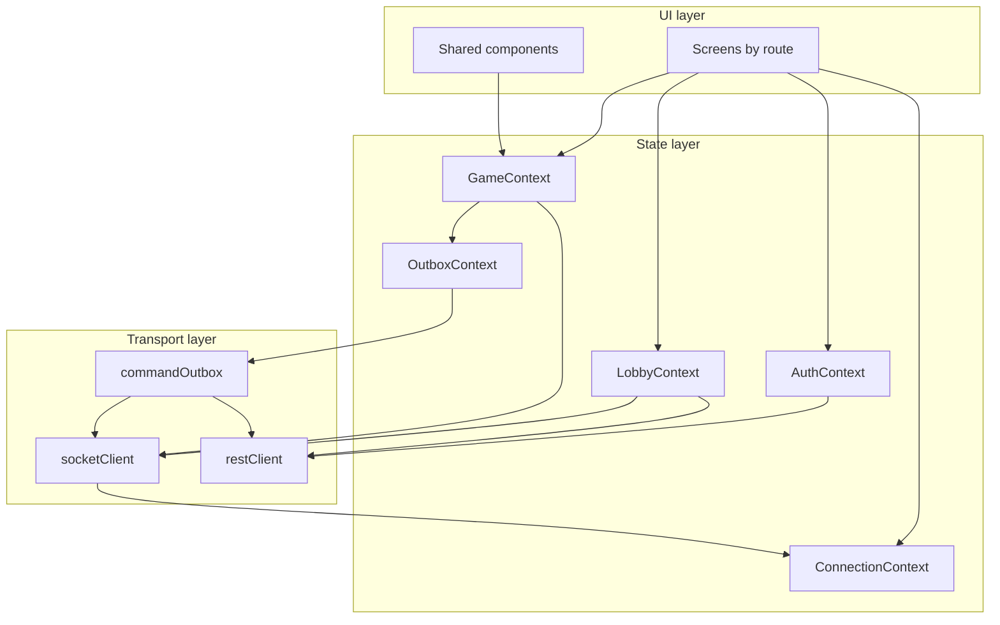
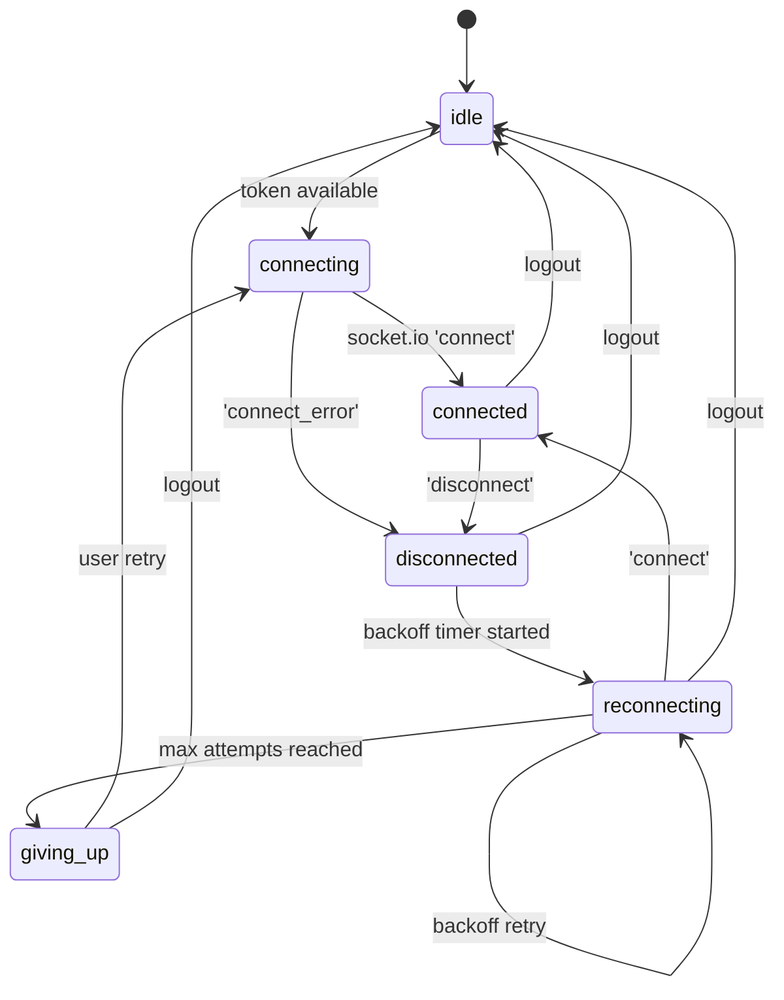
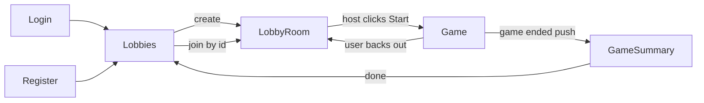

# Mingmei's Mahjong Mania — Client Technical Design Document

**Status:** Living document (v1 MVP)
**Last updated:** 2026-06-01
**Companion:** [docs/TDD_server.md](TDD_server.md) — the server is the source of truth for game state, ordering, and visibility; this doc covers the React client that renders projections and dispatches commands.

---

## 1. Purpose and scope

This document defines the **architecture and chunked implementation plan** for the v1 MVP client of *mingmei-mahjong-mania*. The deadline is approximately **2026-06-08** (one week from the decision date), so the scope is intentionally cut to "functional and reliable, not polished".

The server is feature-complete through Phase E (Socket.IO + projections + queue/scheduler workers) and Phase F (geolocation warn/allow on the engine side). The client today is a static map viewer plus a local tile shuffler — none of the realtime, auth, or game-state plumbing exists yet. This TDD describes how we build it.

### In scope (v1 MVP)

- **Auth** — registered-user login + registration; JWT in `localStorage`; route guards.
- **Lobby flow** — create lobby (host), join lobby (member), see members + readiness, pick team, host-only config editor, host-only start. Notifications CRUD is included since the lobby DTO carries them.
- **In-game** — map view (reuse existing `MapShell`), team hand panel, station panel (slot-aware), event log drawer, game timer, station check-in, station check-out, swap-tile / swap-location-tiles UX. All reads driven by the server's `game.state` projection.
- **Game summary screen** — final scores, full event log replay, post-game hand. (Score values come from Phase I when it lands; v1 shows what the server gives us, including stub values.)
- **Mobile-first responsive web** — the target device is a phone in a subway. Desktop works because it's the same DOM, but layout breakpoints prioritize portrait phone first.
- **Realtime + reliability** — `socket.io-client` for live updates; `react-router-dom` for navigation; reconnect-on-visibility-change; per-game IndexedDB command outbox; REST fallback (`POST /api/games/:id/commands`) when the socket is offline.

### Out of scope (v1)

- **Photo capture and upload (Phase G)** — deferred per [docs/TDD_server.md §1](TDD_server.md#1-purpose-and-scope). CHECK_IN is photo-less in MVP.
- **Polished design / brand identity** — visual design is intentionally rough. Spacing, typography, colors land as "consistent enough to use", not "pretty".
- **PWA service worker / offline app shell** — only a manifest + icon so users can add-to-home-screen.
- **Native wrappers (Capacitor, React Native)** — out of scope; browser-only.
- **Push notifications (FCM/APNs)** — out of scope; the only realtime channel is the open socket.
- **Offline-first caching of game state** — the IndexedDB outbox is the *only* offline persistence we add; everything else is in-memory and re-fetched on reconnect.
- **Dark mode** — light only in v1.
- **Accessibility audit** — basic keyboard navigation + sensible tab order; no ARIA audit / screen reader testing.
- **Internationalization** — English only.
- **Automated end-to-end tests** — manual smoke checklist per chunk; Playwright deferred.
- **Shared-types package (server↔client)** — wire types are duplicated client-side and kept in sync manually. Post-MVP cleanup.

### Repository conventions

- **Client stack:** React 18 + Vite + TypeScript (already in [client/package.json](../client/package.json)).
- **New deps to land:** `socket.io-client`, `react-router-dom`, `vitest`, `@testing-library/react`, `@testing-library/jest-dom`, `@testing-library/user-event`, `jsdom`, `idb` (small typed wrapper around IndexedDB). All other behavior is built on the React standard library.
- **Test runner:** Vitest with `jsdom`. One config file ([client/vitest.config.ts](../client/vitest.config.ts)) added in chunk 1.
- **Path conventions:** flat under [client/src/](../client/src). Source layout:
  - `client/src/transport/` — `restClient.ts`, `socketClient.ts`, `commandOutbox.ts`.
  - `client/src/state/` — one folder per context (`auth/`, `lobby/`, `game/`, `connection/`, `outbox/`), each with `Context.tsx`, `reducer.ts`, `types.ts`, `hooks.ts`.
  - `client/src/screens/` — one folder per route (`Login/`, `Register/`, `Lobby/`, `LobbyRoom/`, `Game/`, `GameSummary/`).
  - `client/src/components/` — existing map components stay here; new shared components join them.
  - `client/src/wire/` — duplicated server wire types (`projection.ts`, `lobby.ts`, `auth.ts`, `command.ts`).

---

## 2. Confirmed design decisions

| Area | Decision |
|------|----------|
| Framework | **React 18 + Vite + TypeScript** (existing) |
| State management | **React Context + useReducer + custom hooks** — no Zustand/Jotai/Redux. Each domain gets its own context to keep render scope tight. |
| Routing | **`react-router-dom` v6** — real URLs, browser back button, refresh-safe. |
| Styling | **Plain CSS files**, mobile-first responsive, design tokens as CSS custom properties on `:root`. No Tailwind, no CSS-in-JS. |
| Transport (realtime) | **`socket.io-client`** with default reconnection, tuned backoff, `auth.token` JWT in the handshake. |
| Transport (REST) | **Native `fetch`** wrapped in `restClient.ts`. JWT injection in a `Authorization: Bearer …` header. Centralised error → `HttpError`-shaped JSON parsing. |
| Auth storage | **JWT in `localStorage`** under key `mmm.auth.v1`. Documented XSS caveat — acceptable for MVP since the only injection vector is our own bundle. Migration to httpOnly cookies tracked as a post-MVP hardening item. |
| Outbox storage | **IndexedDB** via `idb`, one object store `commandOutbox` keyed by `clientCommandId`. Per-game scoping via an `idx_gameId` index. |
| Testing | **Vitest + React Testing Library** for transport/state/outbox; **light component tests** for screens; **manual smoke checklist** per chunk. No automated E2E in v1. |
| PWA | **Manifest + icon only.** No service worker. Users can add-to-home-screen for a more app-like launch experience. |
| Geolocation | **Warn-and-allow** on check-in. Request permission, log the result, proceed regardless. Coordinates passed as command payload `geo: { latitude, longitude, accuracy, capturedAt }` if available, omitted on deny / unavailable. Server's Phase F validation accepts both shapes. |
| Photo capture | **Deferred (Phase G).** No camera UX in v1. |
| Wire types | **Duplicated** under `client/src/wire/`. Manual sync from server when types change. Post-MVP: extract to shared workspace package. |
| Error surfacing | **Three classes:** toasts (transient — failed command, reconnect blip), banners (persistent state — disconnected, game ended), modals (blocking — auth required, fatal client error). |
| Browser target | **Modern evergreen mobile** — iOS Safari 16+, Chrome 110+. ES2022 baseline; Vite handles transpile for older if we ever need it. |

---

## 3. Architecture overview

The client splits into three layers:



### Layer responsibilities

**Transport layer** — owns the raw connections and durable storage. Stateless from the UI's perspective; exposes typed primitives:

- `restClient` — typed `fetch` wrapper. Handles JWT injection, JSON serialisation, error normalisation. Exports `get`, `post`, `patch`, `delete` with typed bodies and responses.
- `socketClient` — owns the single `Socket` instance. Manages connection lifecycle, exposes typed `emit` helpers and an event-bus subscription API. Forwards state changes (`connect`, `disconnect`, `reconnect_attempt`, etc.) to `ConnectionContext`.
- `commandOutbox` — IndexedDB-backed FIFO queue. Pure storage primitive; the drain loop lives in `OutboxContext`. Exports `enqueue`, `markInFlight`, `markAcked`, `markRejected`, `peekNext`, `listForGame`.

**State layer** — five contexts, each tightly scoped so a re-render in one doesn't cascade through the others. Every context owns:

- A typed `state` (reducer state).
- A typed `actions` union (reducer inputs).
- A `Provider` component that wires the reducer + side effects (subscriptions, persistence reads/writes).
- A set of custom hooks (`useAuth`, `useLobby`, `useGame`, `useConnection`, `useOutbox`) that read slices via `useContext` and dispatch actions. Selector hooks (`useGameTeamSlot`, `useIsHost`) wrap the broad hooks for components that only need narrow slices.

**UI layer** — pure rendering. Screens compose contexts; components compose props. No screen calls transport directly; everything goes through a context.

### Why five contexts instead of one global store

A single root store would re-render every component on every event tick. Splitting by concern keeps the blast radius small:

- `ConnectionContext` flips on every reconnect — we don't want the in-game hand panel to re-render when only the connection badge changed.
- `GameContext` updates on every `game.state` push (many per game) — the lobby screen shouldn't care.
- `OutboxContext` updates as commands drain — only the command-dispatch component and the connection badge care.
- `AuthContext` rarely changes — most of the tree only reads `user.id` and `token`.
- `LobbyContext` updates on every `lobby.config` push — only the lobby room screen subscribes.

The cost is some lifting of cross-context state (e.g., the outbox needs the auth token to make REST calls). We handle this with a small composition pattern: contexts higher in the tree expose their state to lower contexts via plain props on the Provider, not via reaching across.

### Provider composition

```
<AuthProvider>
  <ConnectionProvider token={authToken}>
    <OutboxProvider socket={socket} restClient={rest}>
      <LobbyProvider socket={socket} restClient={rest}>
        <GameProvider socket={socket} outbox={outbox}>
          <RouterProvider> ... </RouterProvider>
        </GameProvider>
      </LobbyProvider>
    </OutboxProvider>
  </ConnectionProvider>
</AuthProvider>
```

`AuthProvider` is outermost because every layer below needs the JWT. `ConnectionProvider` constructs the `Socket` once the auth token is known and tears it down on logout. The remaining providers are siblings in concept but nest for prop wiring; none of them subscribes to the others' context (no `useContext` calls between providers), so the nesting order below `ConnectionProvider` is mechanical.

---

## 4. Wire-shape consumption

The server is the source of truth for every type the client renders. This section enumerates **every server contract the client consumes**, points at the file that defines it, and notes how the client mirrors it.

### 4.1 Type duplication policy

For v1 we duplicate wire types under `client/src/wire/`. The mirrored files are:

- `client/src/wire/auth.ts` — `RegisterRequest`, `LoginRequest`, `AuthResponse`, `User`.
- `client/src/wire/lobby.ts` — `LobbyDetailDto`, `LobbyConfigDto`, `LobbyMemberDto`, `LobbyReadinessDto`, `LobbyNotificationDto`, `LobbyConfigPatch`, `CreateLobbyInput`.
- `client/src/wire/projection.ts` — `GameStateProjection`, `TileDto`, `SlotTileDto`, `MapNodeDto`, `MapLineDto`, `MapEdgeDto`, `AtStationDto`, `HandTileDto`, `RecentEventDto`.
- `client/src/wire/command.ts` — `GameCommandPayload`, `GameCommandAcked`, `GameCommandRejected`, `GameJoinPayload`, `GameJoinResponse`, `Ack<T>` envelope, `CommandType` literal union, per-command-type payload narrowings.
- `client/src/wire/error.ts` — `HttpErrorBody` (`{ error: { code: string; message: string; details?: unknown } }`).

These files are *only* type declarations — no runtime code, no validation. Mismatch surfaces at compile time when the server changes and we manually re-sync. A `// SERVER SOURCE:` comment at the top of each file points at the server-side definition so the sync is auditable.

Post-MVP we extract this into a `packages/wire` workspace package consumed by both sides; that work is captured in [§9 Open items](#9-open-items).

### 4.2 REST surface (consumed)

All endpoints below already exist on the server; the client just needs to call them. Authentication is `Authorization: Bearer <jwt>` except where noted.

| Method + path | Body (request) | Response | Client caller | Source |
|---------------|----------------|----------|----------------|--------|
| `POST /api/auth/register` (public) | `{ email, username, password }` | `201 { user, token }` | `restClient.register()` | [server/src/routes/auth.ts](../server/src/routes/auth.ts) |
| `POST /api/auth/login` (public) | `{ email, password }` | `200 { user, token }` | `restClient.login()` | [server/src/routes/auth.ts](../server/src/routes/auth.ts) |
| `GET /api/auth/me` | — | `200 { user }` | `restClient.getMe()` (used to re-validate a stored token at boot) | [server/src/routes/auth.ts](../server/src/routes/auth.ts) |
| `GET /api/map-templates` | — | `200 { templates: MapTemplateSummary[] }` | `restClient.listMapTemplates()` (used by the host config form to populate the map dropdown) | [server/src/routes/map-templates.ts](../server/src/routes/map-templates.ts) |
| `POST /api/lobbies` | `{ mapTemplateId?, gameDurationSeconds?, ... }` | `201 { lobby: LobbyDetailDto }` | `restClient.createLobby()` | [server/src/routes/lobbies.ts](../server/src/routes/lobbies.ts) |
| `GET /api/lobbies/:id` | — | `200 { lobby: LobbyDetailDto }` | `restClient.getLobby()` (used on screen mount before the socket join lands; also the recovery path if `lobby.config` pushes are dropped) | [server/src/routes/lobbies.ts](../server/src/routes/lobbies.ts) |
| `PATCH /api/lobbies/:id/config` | `Partial<LobbyConfigDto>` | `200 { lobby }` | `restClient.updateLobbyConfig()` | [server/src/routes/lobbies.ts](../server/src/routes/lobbies.ts) |
| `POST /api/lobbies/:id/join` | — | `200 { lobby }` | `restClient.joinLobby()` | [server/src/routes/lobbies.ts](../server/src/routes/lobbies.ts) |
| `POST /api/lobbies/:id/team` | `{ teamSlot: 1\|2\|3\|4 }` | `200 { lobby }` | `restClient.pickTeam()` | [server/src/routes/lobbies.ts](../server/src/routes/lobbies.ts) |
| `POST /api/lobbies/:id/start` | — | `201 { gameId, lobby }` | `restClient.startLobby()` (host only) | [server/src/routes/lobbies.ts](../server/src/routes/lobbies.ts) |
| `GET /api/lobbies/:id/notifications` | — | `200 { notifications: LobbyNotificationDto[] }` | unused in v1 (notifications come embedded in `LobbyDetailDto`); kept for future debug surfaces. | [server/src/routes/lobbies.ts](../server/src/routes/lobbies.ts) |
| `POST /api/lobbies/:id/notifications` | `{ atSeconds, template, data? }` | `201 { notification }` | `restClient.addNotification()` (host only) | [server/src/routes/lobbies.ts](../server/src/routes/lobbies.ts) |
| `PATCH /api/lobbies/:id/notifications/:notifId` | partial of above | `200 { notification }` | `restClient.updateNotification()` (host only) | [server/src/routes/lobbies.ts](../server/src/routes/lobbies.ts) |
| `DELETE /api/lobbies/:id/notifications/:notifId` | — | `204` | `restClient.deleteNotification()` (host only) | [server/src/routes/lobbies.ts](../server/src/routes/lobbies.ts) |
| `POST /api/games/:id/commands` | `{ gameTeamId, commandType, payload?, clientCommandId }` | `202 { clientCommandId, queueItemId }` | `restClient.submitCommand()` — **HTTP fallback path** for the outbox when the socket is down. Same idempotency contract as `game.command`. | [server/src/routes/games.ts](../server/src/routes/games.ts) |

### 4.3 Socket events

The client's `socketClient` is a single `Socket` instance authenticated at handshake time (`auth: { token }`). Every event has a typed wrapper.

**Client → Server (acked)**

| Event | Payload | Ack response | Notes |
|-------|---------|--------------|-------|
| `lobby.join` | `{ lobbyId: string }` | `{ ok: true, data: { lobby: LobbyDetailDto } }` or `{ ok: false, error: { code, message } }` | Re-emitted on every reconnect after the first (see [§6](#6-reliability-layer)). |
| `game.join` | `{ gameId: string }` | `{ ok: true, data: { state: GameStateProjection } }` or `{ ok: false, … }` | The initial state arrives in the ack, not as a separate `game.state` push. Sets `socket.data.gameTeamId` server-side so subsequent `game.command` events are authorised. |
| `game.command` | `GameCommandPayload` (`{ gameId, gameTeamId, commandType, payload?, clientCommandId }`) | `{ ok: true, data: GameCommandAcked }` or `{ ok: false, error: { code, message } }` | The ack means "enqueued"; the actual state mutation arrives later as `game.event` + `game.state`. |

**Server → Client (pushed, no ack)**

| Event | Payload | Room | Notes |
|-------|---------|------|-------|
| `lobby.config` | `{ lobby: LobbyDetailDto }` | `lobby:{id}` | Broadcast on every lobby mutation (config edit, join, team pick, notification CRUD). The client replaces its `LobbyContext.lobby` wholesale. |
| `game.state` | `{ state: GameStateProjection }` | `game:{id}` (team-scoped — server projects per team) | Pushed after every applied command, every scheduler tick that mutates state, and once on initial `game.join` ack. Drives the entire in-game render. |
| `game.event` | `RecentEventDto` | `game:{id}` (team-scoped) | One event per applied command / system action that's visible to the team. Appended to the rolling event log; `recentEvents` in the next `game.state` may overlap, so the client dedupes by `sequence`. |
| `game.notification` | `{ template: string; data: Record<string, unknown>; at: string }` | `game:{id}` | Server-side scheduled toast events. Surfaced as a transient banner / toast in the in-game UI. |
| `game.command.acked` | `GameCommandAcked` | direct to emitting socket | Not used in v1 — the `game.command` ack callback carries this. Listed for completeness; the broadcaster currently never targets it as a room emit, but if we ever add cross-tab fan-out it lives here. |
| `game.command.rejected` | `GameCommandRejected` | direct to emitting socket | Same as above; v1 reads rejections from the ack callback. |

### 4.4 Error envelope

REST and socket acks share an error envelope shape so the client has one error path:

```ts
// REST (HTTP non-2xx body):
{ error: { code: string; message: string; details?: unknown } }

// Socket ack:
{ ok: false, error: { code: string; message: string } }
```

The `restClient` parses non-2xx responses into a typed `HttpError(code, message, status, details?)`. The socket ack-aware helpers (`emitWithAck`) reject with the same `HttpError` shape on `ok: false`. Every context's reducer can therefore handle one error type regardless of transport.

**Known error codes the client must recognise:**

| `code` | Origin | Client behavior |
|--------|--------|-----------------|
| `unauthenticated` | auth middleware / socket handshake | Clear stored JWT, redirect to `/login`. |
| `forbidden` | command auth, lobby host checks | Toast "Not allowed"; refresh the relevant projection (state may have shifted). |
| `validation_error` | every router and command parser | Toast the `message` field; do not retry. |
| `not_found` | lobby/game lookups | Redirect to a "not found" placeholder route. |
| `client_command_id_conflict` | `enqueueCommand` idempotency | **Sticky banner**: indicates a client bug (different payload, same id). Outbox row is dropped; rest of queue continues. |
| `duplicate` | `enqueueCommand` (same id + same payload) | Treat as success — the outbox row transitions to `acked`. |
| `game_not_active` | command auth | Toast "Game already ended"; remove the outbox row; resync via `GET /api/games/:id` if we add it later, otherwise drop the row silently. |
| `slot_locked` | engine validation (swap pre-unlock) | Toast "Tile not yet available"; remove the outbox row. |
| `command_queue_full` (future) | rate limit | Toast "Slow down"; retry with backoff. |

For any error code not in this list the client falls back to a generic toast carrying `message`, and the row is marked `rejected` in the outbox so it never retries.

---

## 5. State model

Five contexts, each with its own reducer, action union, and persistence story. Below, each subsection documents the shape, the actions, and the side-effects performed by the provider.

### 5.1 `AuthContext`

**Shape:**

```ts
type AuthState =
  | { status: "unknown" }
  | { status: "anonymous" }
  | { status: "authenticated"; user: User; token: string };
```

`status: "unknown"` is the boot state — we have a token in `localStorage` and need to validate it (`GET /me`) before deciding `authenticated` vs `anonymous`.

**Actions:**

- `auth/restore` `{ token: string }` — read from localStorage on mount, triggers a `GET /me`.
- `auth/login/success` `{ user, token }` — successful POST /login or POST /register.
- `auth/logout` — clears in-memory and localStorage.
- `auth/restore/failed` — token was rejected; transition to `anonymous` and clear storage.

**Persistence:** `localStorage["mmm.auth.v1"] = JSON.stringify({ token })`. We do **not** persist `user` — `GET /me` is the source of truth on every boot.

**Hooks:**

- `useAuth()` — returns the full state plus `login`, `register`, `logout` callbacks.
- `useAuthToken()` — selector returning the token string or `null`; used by transport layer.
- `useRequireAuth()` — throws (caught by router guard) if `status !== "authenticated"`; used inside protected routes.

**Side effects in `AuthProvider`:**

1. On mount, read `localStorage["mmm.auth.v1"]`; if present, dispatch `auth/restore` and call `restClient.getMe()`.
2. On `auth/login/success`, write to localStorage.
3. On `auth/logout`, remove from localStorage and call `socketClient.disconnect()` (via injected callback) so we drop the underlying connection.

### 5.2 `ConnectionContext`

**Shape:**

```ts
type ConnectionState =
  | { status: "idle" }              // no token yet
  | { status: "connecting"; attempt: number }
  | { status: "connected"; since: number }
  | { status: "disconnected"; reason: string; attempt: number }
  | { status: "reconnecting"; attempt: number; nextAttemptAt: number }
  | { status: "giving_up"; reason: string };
```

`giving_up` is reached only after the configured max-retry threshold (default 30 attempts ≈ 5 minutes of exponential backoff capped at 10s). User action — pressing a "Retry" affordance — resets the state machine to `connecting`.



**Actions:**

- `conn/connect/started` `{ attempt }`
- `conn/connect/succeeded` `{ at }`
- `conn/disconnect` `{ reason, attempt }`
- `conn/reconnect/scheduled` `{ attempt, nextAttemptAt }`
- `conn/give-up` `{ reason }`
- `conn/retry-requested` — user-initiated retry from `giving_up`.
- `conn/reset` — on logout.

**Persistence:** none. Connection state is purely runtime.

**Hooks:**

- `useConnection()` — full state, plus a `retry()` callback.
- `useIsOnline()` — selector returning `state.status === "connected"`; used by `OutboxContext` to decide between socket and HTTP drain.

**Side effects in `ConnectionProvider`:** subscribes to `socketClient.on('connect' | 'disconnect' | 'reconnect_attempt' | 'reconnect_failed')`. Also subscribes to `document.visibilitychange` — see [§6](#6-reliability-layer).

### 5.3 `LobbyContext`

**Shape:**

```ts
type LobbyState =
  | { status: "absent" }
  | { status: "loading"; id: string }
  | { status: "ready"; id: string; lobby: LobbyDetailDto }
  | { status: "error"; id: string; error: HttpError };
```

The client tracks **at most one active lobby at a time**. Switching lobbies dispatches `lobby/leave` and then `lobby/load`. This keeps the listener bookkeeping straightforward.

**Actions:**

- `lobby/load` `{ id }` — set `loading`.
- `lobby/loaded` `{ id, lobby }` — set `ready`.
- `lobby/updated` `{ lobby }` — push from `lobby.config` socket event.
- `lobby/load/failed` `{ id, error }`.
- `lobby/leave` `{ id }`.
- `lobby/team/optimistic` `{ teamSlot }` — see below.
- `lobby/team/rolled-back` — REST call failed, restore prior teamSlot.

**Persistence:** none. Lobby state is fetched fresh on every screen mount.

**Optimistic updates:** the team picker is the only optimistic surface. Clicking a team slot dispatches `lobby/team/optimistic` immediately, then issues `POST /api/lobbies/:id/team`. On `200` the inbound `lobby.config` push reconciles; on failure we dispatch `lobby/team/rolled-back`. All other mutations (config edits, notifications) are awaited synchronously — they're rare and host-only, so a 200 ms spinner is fine.

**Hooks:**

- `useLobby()` — full state plus `loadLobby`, `joinLobby`, `pickTeam`, `updateConfig`, `addNotification`, `updateNotification`, `removeNotification`, `startLobby`, `leaveLobby`.
- `useIsHost()` — selector `state.lobby?.hostUserId === currentUserId`.
- `useLobbyMembers()` — selector returning sorted member list.
- `useLobbyNotifications()` — selector returning the notifications array (already sorted by the server).

**Side effects in `LobbyProvider`:** on entering `loading`, emit `lobby.join` (if socket connected) plus `GET /api/lobbies/:id` (always; gives us a fast path that doesn't depend on socket). On `lobby.config` push, dispatch `lobby/updated`.

### 5.4 `GameContext`

**Shape:**

```ts
type GameState =
  | { status: "absent" }
  | { status: "loading"; id: string }
  | { status: "active"; id: string; projection: GameStateProjection; eventLog: RecentEventDto[]; notifications: GameNotificationToast[] }
  | { status: "error"; id: string; error: HttpError };
```

`eventLog` is a separate buffer from `projection.recentEvents` because:

- `projection.recentEvents` is a *snapshot* (last N events) that the server includes for new joiners.
- `eventLog` is the full rolling log the user has seen this session, deduplicated by `sequence`. The UI's event drawer shows this.

On every `game.state` push we merge `state.recentEvents` into `eventLog` (skip duplicates), preserving sequence order. On `game.event` push we append directly.

**Actions:**

- `game/load` `{ id }`
- `game/loaded` `{ id, projection }` — from `game.join` ack.
- `game/state` `{ projection }` — from `game.state` push.
- `game/event` `{ event }` — from `game.event` push.
- `game/notification` `{ template, data, at }` — from `game.notification` push.
- `game/notification/dismiss` `{ id }` — UI dismissal.
- `game/load/failed` `{ id, error }`.
- `game/leave`.

**Persistence:** none. On reconnect the `game.join` ack re-supplies the full projection.

**Hooks:**

- `useGame()` — full state plus `joinGame`, `submitCommand`, `dismissNotification`, `leaveGame`.
- `useGameProjection()` — selector returning the projection or null. The map, hand panel, and station panel use this.
- `useGameTeamSlot()` — selector returning the user's `gameTeamId` (read from the projection / lobby state).
- `useEventLog()` — selector returning the deduped event log.
- `useAtStation()` — selector returning `projection.atStation` or null; drives the station panel.
- `useNextVisibilityChange()` — selector returning the visibility countdown target; drives the timer banner.

**Side effects in `GameProvider`:** on `game/load`, emit `game.join` and await ack. Subscribes to `game.state`, `game.event`, `game.notification`. On reconnect (`useConnection().status === "connected"` after a prior `disconnected`), re-emit `game.join` to resync. Outbox interactions are delegated to `OutboxContext` — `submitCommand` calls `outbox.enqueue(...)`.

### 5.5 `OutboxContext`

**Shape:**

```ts
interface OutboxRow {
  clientCommandId: string;       // UUID v4 generated at submit time
  gameId: string;
  gameTeamId: string;
  commandType: string;
  payload: Record<string, unknown>;
  enqueuedAt: number;
  status: "pending" | "in_flight" | "acked" | "rejected" | "expired";
  attempts: number;
  lastError?: { code: string; message: string };
}

interface OutboxState {
  byGame: Record<string, OutboxRow[]>;   // sorted by enqueuedAt asc
  draining: boolean;
  conflictBanner: { gameId: string; clientCommandId: string } | null;
}
```

**Actions:**

- `outbox/hydrated` `{ rows }` — IndexedDB read on mount.
- `outbox/enqueued` `{ row }`.
- `outbox/in-flight` `{ clientCommandId }`.
- `outbox/acked` `{ clientCommandId }`.
- `outbox/rejected` `{ clientCommandId, error, terminal }` — `terminal: true` drops the row; `false` resets to `pending` for retry.
- `outbox/conflict` `{ gameId, clientCommandId }` — sets the sticky banner.
- `outbox/banner/dismissed`.
- `outbox/drain/started` / `outbox/drain/finished`.

**Persistence:** IndexedDB. Schema:

- DB name: `mmm.client.v1`.
- Object store: `commandOutbox`, key = `clientCommandId`.
- Index: `byGameAndEnqueuedAt` on `[gameId, enqueuedAt]`.
- Hydration runs once on `OutboxProvider` mount; the in-memory `byGame` map is the read-path source of truth thereafter, with every write also persisted async.

**Hooks:**

- `useOutbox()` — `enqueue(row)`, `peek(gameId)`, `getConflictBanner()`, `dismissBanner()`.
- `useOutboxStatus(clientCommandId)` — selector for a single row; used by the optimistic UI on the in-game screen.

**Side effects in `OutboxProvider`:** owns the drain loop (see [§6.3](#63-command-outbox)).

---

## 6. Reliability layer

This section is the meat of the "mobile sockets are flaky" answer. The goal is **best-effort never-lose-a-command** in the face of subway tunnels, cellular handoffs, tab backgrounding on iOS Safari, and the browser's tendency to quietly close idle WebSockets. Everything here is layered on top of the contexts described in [§5](#5-state-model).

### 6.1 Reconnection

We use `socket.io-client`'s built-in reconnection with tuned settings:

```ts
const socket = io(SERVER_URL, {
  auth: { token },
  transports: ["websocket", "polling"],
  reconnection: true,
  reconnectionAttempts: 30,
  reconnectionDelay: 500,
  reconnectionDelayMax: 10_000,
  randomizationFactor: 0.4,
  timeout: 10_000,
});
```

Notes:

- **`transports`** starts with WebSocket; falls back to long-polling automatically if the WebSocket handshake fails (some corporate Wi-Fi / proxies break WS but allow XHR).
- **30 attempts × 10 s cap ≈ 5 minutes** before we surface `giving_up`. Manual retry resets the counter.
- **`reconnectionDelay` 500 ms** is aggressive on purpose — most mobile drops resolve inside 2 seconds, so we want to be ready immediately. The exponential ramp keeps long outages from hammering the server.
- **`randomizationFactor`** jitters the backoff to spread retries when many clients reconnect simultaneously (e.g., after a server restart).

After **every** `connect` event *except the first*, the client must re-issue the room joins:

- If the user is on `/lobbies/:id`, re-emit `lobby.join`.
- If the user is on `/games/:id` or `/games/:id/summary`, re-emit `game.join`.

This is implemented as a `useEffect` in `LobbyProvider` / `GameProvider` that subscribes to `useConnection().status` and re-fires the join whenever the transition is `disconnected → connected` (or `reconnecting → connected`).

The very first `connect` is handled inline by the loader effect, not by the reconnect watcher, to avoid a double-join race on screen mount.

### 6.2 Page Visibility

iOS Safari and modern Chrome both aggressively suspend background tabs, often closing the WebSocket silently. The user comes back to a tab whose `socket.connected` says `true` but no events have arrived in 15 minutes.

`ConnectionProvider` subscribes to `document.addEventListener('visibilitychange')`. When the tab becomes visible:

1. If `socket.connected === false`, call `socket.connect()` and dispatch `conn/connect/started`.
2. If `socket.connected === true`, fire a lightweight liveness probe: `socket.timeout(2000).emit('ping', ack)`. If the ack doesn't come back in 2 s, force-disconnect (`socket.disconnect()` then `socket.connect()`).
3. After reconnect, the room-rejoin logic in [§6.1](#61-reconnection) runs.

We do **not** implement a custom heartbeat in the foreground — socket.io's own pingInterval handles it. The visibility hook is purely a "wake up and check" mechanism for the case where the OS suspended us.

### 6.3 Command outbox

The outbox is the linchpin of reliability. Every command goes through it, even when the socket is healthy. This guarantees:

- **Crash safety:** a refresh / tab close mid-command doesn't lose user intent.
- **Idempotent retries:** the server already keys commands on `clientCommandId`; we just need to keep the same id across retries.
- **Single drain path:** the UI submits to the outbox; the outbox decides socket vs HTTP. Nobody else calls `socket.emit('game.command')` or `restClient.submitCommand()` directly.

#### Lifecycle of a command

```
user click
   │
   ▼
useGame().submitCommand(commandType, payload)
   │  generate UUID clientCommandId, persist row {status: "pending"}
   ▼
OutboxProvider drain loop wakes
   │
   ├── socket.connected? ──► emit 'game.command' with ack callback
   │                            │
   │                            ▼
   │                       ack arrives → outbox/acked
   │
   └── socket disconnected ──► POST /api/games/:id/commands
                                  │
                                  ▼
                             202 → outbox/acked
                             4xx → outbox/rejected (terminal)
                             5xx / network → outbox stays "pending", retry after backoff
```

#### Drain loop semantics

The drain loop is per-game and **strictly FIFO**:

- For each game, iterate `byGame[gameId]` in `enqueuedAt` order.
- Pick the first row with `status === "pending"`.
- Mark `in_flight`.
- Send via the appropriate transport.
- Await the ack (with a 10 s timeout).
- On success: mark `acked`. Remove from IndexedDB.
- On terminal failure: mark `rejected`. Remove from IndexedDB. Surface a toast or banner per [§4.4](#44-error-envelope).
- On retriable failure (network, timeout, 5xx): reset to `pending`, increment `attempts`. Wait `min(2 ** attempts * 500ms, 10s)`. Then loop.

Only one row is in flight per game at a time. This matters because the server orders by `(game_id, enqueued_at)` and refuses to reorder; if the client sent commands in parallel and one was rejected, the next would still get sequenced after it, leading to confusing UX.

**Cross-game parallelism is allowed** — there's at most one game per session in v1, so this is a non-issue, but the structure supports it.

#### Expiry

Outbox rows older than **24 hours** are marked `expired` on hydration and dropped. A 24-hour-old command almost certainly references a stale game state; better to surface a "your command timed out" toast than to push a wildly out-of-date `CHECK_IN`.

### 6.4 HTTP fallback

The outbox uses `POST /api/games/:id/commands` (Phase E final chunk) whenever `socket.connected === false`. The endpoint is **fully idempotent**: same `clientCommandId` + same payload → `duplicate` → treated as `acked`. Different payload + same id → `client_command_id_conflict` → terminal failure with the sticky-banner UX.

Two subtleties:

1. **Race during reconnect.** If the socket reconnects mid-drain (between the `pending → in_flight` transition and the HTTP response), the next pending row will go via socket. The in-flight HTTP row continues to completion; its server-side processing is already in motion and the ack contract is unchanged.
2. **Auth.** The HTTP path uses the same JWT in the `Authorization` header. Since the JWT is stored in `localStorage` and the outbox lives in IndexedDB, both survive a reload independently — a user could reload mid-drain and have the outbox resume cleanly with a still-valid token. If the token expires (or is rejected), the drain pauses on `unauthenticated`, surfaces a banner, and resumes when the user re-logs in.

### 6.5 Reconnect resync

After every `game.join` ack (initial or after a reconnect), `GameProvider`:

1. Dispatches `game/state` with the projection from the ack.
2. The reducer **replaces** `state.projection` wholesale.
3. The reducer merges `projection.recentEvents` into the existing `eventLog`, deduping by `sequence`. Anything in the log that's older than `projection.recentEvents[0].sequence - K` (for some safety window K ≈ 50) is kept; the server's `recentEvents` is just a snapshot, not the full log.

If a command was in flight at disconnect time:

- It may have landed on the server (we'll see its `RecentEventDto` in `projection.recentEvents`).
- It may have not (the outbox row is still `in_flight` or `pending`).

The outbox drain loop will redrive any non-`acked` rows after reconnect. Because `clientCommandId` is stable, the worst case is `duplicate` → ack. There is **no path** where the client double-submits and the server processes it twice.

### 6.6 Failure surfacing

Three classes of feedback, all consumed by a single `<ToastShelf />` component reading from `useOutbox()` + `useConnection()`:

| Class | Trigger | UI |
|-------|---------|----|
| Transient toast | Per-command success / retriable error | Bottom-center, 3 s timeout, queue-able |
| Persistent banner | `disconnected`, `reconnecting`, `giving_up` | Top, sticky, dismissable only via reconnect |
| Sticky banner | `client_command_id_conflict` | Top, sticky, **persistent across reloads** (re-derived from the outbox row's `lastError`) |

The sticky banner case is intentionally noisy: it's a client bug, not a transient failure. The product expectation is that we never ship this state to users — it should fire only in dev / staging during development. In prod it surfaces enough info (the offending `clientCommandId`) to bisect.

---

## 7. Screens and navigation

The MVP has **eight routes**. Mobile-first design — all screens render in a 360 px viewport without horizontal scroll.

### 7.1 Route table

| Route | Auth | Component | Primary context | Notes |
|-------|------|-----------|------------------|-------|
| `/` | any | `<RootRedirect />` | `AuthContext` | Redirects to `/lobbies` if authed, `/login` otherwise. |
| `/login` | anon | `<LoginScreen />` | `AuthContext` | Email + password, link to register. |
| `/register` | anon | `<RegisterScreen />` | `AuthContext` | Email + username + password. |
| `/lobbies` | auth | `<LobbiesScreen />` | `AuthContext` | Action hub: "Create lobby" + "Join by code". No active-lobby list in v1 (server doesn't expose one); future expansion is straightforward. |
| `/lobbies/:id` | auth | `<LobbyRoomScreen />` | `LobbyContext` | Member list, team picker, host config form, notifications editor (host only), Start. |
| `/games/:id` | auth | `<GameScreen />` | `GameContext` | Map + hand + station + event log + timer + command buttons. The main game UI. |
| `/games/:id/summary` | auth | `<GameSummaryScreen />` | `GameContext` | Final scores (stubbed), full event log, post-game hand. |
| `*` | any | `<NotFoundScreen />` | — | Fallback. |

### 7.2 Navigation map



### 7.3 Wireframes

All wireframes are **functional, not polished** — boxes and labels indicate placement and information density, not visual design. The design pass is post-MVP.

#### Login (`/login`)

```
+--------------------------------------+
|  mingmei's mahjong mania             |
|                                       |
|  email   [________________________]   |
|  password[________________________]   |
|                                       |
|  [ Log in ]                           |
|                                       |
|  Need an account? Register            |
+--------------------------------------+
```

States: idle, submitting (button spinner), error (red text above button: "Invalid email or password").

#### Register (`/register`)

```
+--------------------------------------+
|  mingmei's mahjong mania             |
|                                       |
|  email    [_______________________]   |
|  username [_______________________]   |
|  password [_______________________]   |
|                                       |
|  [ Create account ]                   |
|                                       |
|  Have an account? Log in              |
+--------------------------------------+
```

States: idle, submitting, validation errors (per-field red text), conflict ("Email already in use" / "Username taken").

#### Lobbies hub (`/lobbies`)

```
+--------------------------------------+
| @username                  [Log out] |
|                                       |
|  [ + Create new lobby ]               |
|                                       |
|  Join existing lobby                  |
|  lobby id [____________________]      |
|  [ Join ]                             |
+--------------------------------------+
```

The lobby list is omitted because the server doesn't expose "lobbies I'm in". Once a join succeeds, we redirect to `/lobbies/:id`. Future work: server endpoint `GET /api/lobbies/mine`, then this screen gets a list section.

#### Lobby room (`/lobbies/:id`)

Host view:

```
+--------------------------------------+
| < Back                  [Connection] |
|                                       |
|  Lobby ABC123                  HOST   |
|                                       |
|  Members (3 / min 4)                  |
|    @alice    Team 1                   |
|    @bob      Team 2                   |
|    @carol    —                        |
|                                       |
|  Your team:                           |
|  [Team 1] [Team 2] [Team 3] [Team 4]  |
|                                       |
|  > Config                             |
|    map      [TYO_BASE     v]         |
|    duration [ 7200  ] sec             |
|    phases   [ 4 ] x [ 1200 ] sec      |
|    slots    [ 2 ]                     |
|    team mode[ host    v]              |
|    start at [—————        v]         |
|                                       |
|  > Notifications  [+]                 |
|    @ 0:30:00  "halfway"   [edit][x]   |
|    @ 1:30:00  "30 min left"  [...]    |
|                                       |
|  [ Start game ]   (disabled if not ready) |
|                                       |
|  Readiness: 1 player missing on Team 3 |
+--------------------------------------+
```

Non-host view: same layout minus the config form and notifications editor (read-only listings instead); the start button is replaced with "Waiting for host…".

#### Game (`/games/:id`)

Portrait phone:

```
+--------------------------------------+
| < End game     Timer 0:47:13  [Conn] |
|                                       |
|  +------------------------------+    |
|  |                              |    |
|  |        MapShell SVG          |    |
|  |    (existing component)      |    |
|  |                              |    |
|  +------------------------------+    |
|                                       |
|  At: SHINJUKU                         |
|   slot 0: [tile]   slot 1: [tile]     |
|   [ Swap tile ]   [ Check out ]       |
|                                       |
|  Your hand (13)                       |
|   [tile][tile][tile][tile][tile][...] |
|                                       |
|  Next visibility: 0:04:32             |
|                                       |
|  [ Event log ▴ ]                      |
+--------------------------------------+
```

When not at a station, the "At" section is replaced with "[ Check in here ]" surfaced after the user taps a station node on the map.

Event log drawer (slides up):

```
+--------------------------------------+
|  Event log               [close]      |
|  ---------------------------------    |
|  0:47:01  team A checked in @ TOKYO   |
|  0:46:55  slot 1 unlocked @ SHINJUKU  |
|  0:46:30  team C swapped tile         |
|  0:45:00  notification: halfway       |
|  ...                                  |
+--------------------------------------+
```

#### Game summary (`/games/:id/summary`)

```
+--------------------------------------+
|  Game over                            |
|                                       |
|  Final hand                           |
|   [tile][tile][tile][tile][tile][...] |
|                                       |
|  Stub score: 42 (riichi: TBD)         |
|                                       |
|  Event log (full)                     |
|   [scrollable timeline]               |
|                                       |
|  [ Back to lobbies ]                  |
+--------------------------------------+
```

Scoring is intentionally stubbed: the server's `HandEvaluationService` returns placeholder values per [docs/TDD_server.md §9 Phase I](TDD_server.md#9-implementation-phases). We render whatever the server gives us.

### 7.4 Connection badge

Every authed screen renders a small connection badge in the header:

- `[●]` green — connected.
- `[◌]` amber + spinner — reconnecting.
- `[!]` red — disconnected, tap to retry.
- Outbox depth pill `(2)` appears next to the badge when ≥ 1 pending row exists.

The badge is a single component (`<ConnectionBadge />`) that reads `useConnection()` and `useOutbox()`. It is rendered by the screen-level layout, not individual screens.

### 7.5 Component reuse

Existing components are reused with minimal changes:

- `<MapShell />` — wraps `<SubwaySvg />`, `<LineLayer />`, `<StationMarker />`. **Modified** to take its data from `useGameProjection()` instead of static `playerViews.ts` mock data.
- `<StationPanel />` — **modified** to render `projection.atStation` (slot-aware) instead of the mock-data prop shape.
- `<Legend />` — unchanged.
- `<SubwaySvg />`, `<StationMarker />`, `<LineLayer />` — unchanged.

The existing `services/network.ts` (`fetchSubway`) is **deleted** in chunk 5; its responsibilities move to `restClient` and the projection.

---

## 8. Implementation phases (chunked plan)

The work is sliced into **7 chunks**, each independently reviewable and testable. Mirrors the server's Phase E approach: each chunk lands a vertical slice (transport + state + UI where applicable) with its own tests; subsequent chunks compose on top.

### Chunk 1 — Auth + REST client + routing skeleton

**Goal:** a user can register, log in, see a placeholder authed page, and log out. No socket, no game, no lobby — just the foundations.

**Files added:**

- `client/src/transport/restClient.ts` — `fetch` wrapper with JWT injection, JSON parse, `HttpError` normalization.
- `client/src/wire/auth.ts`, `client/src/wire/error.ts`.
- `client/src/state/auth/{Context.tsx,reducer.ts,types.ts,hooks.ts}`.
- `client/src/screens/Login/LoginScreen.tsx`, `client/src/screens/Register/RegisterScreen.tsx`.
- `client/src/router/{routes.tsx,RootRedirect.tsx,RequireAuth.tsx,NotFoundScreen.tsx}`.
- `client/vitest.config.ts`, `client/src/test/setup.ts`.

**Files modified:**

- `client/src/App.tsx` — replaced with `<BrowserRouter>` + provider composition + outlet.
- `client/src/main.tsx` — unchanged.
- `client/package.json` — `react-router-dom`, `vitest`, `@testing-library/*`, `jsdom`.

**Key decisions locked in:**

- JWT stored at `localStorage["mmm.auth.v1"]`.
- Route layout pattern: nested `<Outlet />` with `<RequireAuth />` wrapper.
- `restClient` returns parsed JSON or throws `HttpError`. Never returns `Response`.
- Vitest config uses `jsdom` env, sets up RTL via `client/src/test/setup.ts`.

**Test coverage:**

- `restClient.test.ts` — JWT injection, JSON parse, error normalization (4xx body shape, 5xx no body, network error).
- `auth/reducer.test.ts` — every action transition.
- `LoginScreen.test.tsx` — happy path (RTL `userEvent.type` + click → mocked restClient → state transition).
- `RegisterScreen.test.tsx` — happy path + validation error surfacing.
- `RequireAuth.test.tsx` — redirects anonymous users to `/login`.

**Manual smoke:** Run `npm run dev` in client, register a new account against a running local server, log out, log in, refresh.

---

### Chunk 2 — Socket transport + ConnectionContext

**Goal:** the app maintains a single authenticated socket; the connection badge accurately reflects status; reconnect on visibility change works.

**Files added:**

- `client/src/transport/socketClient.ts` — single `Socket` instance factory, typed emit helpers, event-bus subscription API.
- `client/src/wire/command.ts`, `client/src/wire/lobby.ts`, `client/src/wire/projection.ts` (skeleton — full type bodies arrive as later chunks need them).
- `client/src/state/connection/{Context.tsx,reducer.ts,types.ts,hooks.ts}`.
- `client/src/components/ConnectionBadge.tsx`.
- `client/src/hooks/usePageVisibility.ts`.

**Files modified:**

- `client/src/App.tsx` — wrap with `<ConnectionProvider>` below `<AuthProvider>`.
- `client/package.json` — `socket.io-client`.

**Key decisions locked in:**

- Reconnection config (30 attempts, 500 ms initial delay, 10 s cap, 0.4 jitter).
- Page Visibility: passive `visibilitychange` listener + 2 s liveness probe.
- Socket lifecycle: created on `auth/login/success`, destroyed on `auth/logout`.

**Test coverage:**

- `connection/reducer.test.ts` — every state transition including `giving_up` and manual retry.
- `socketClient.test.ts` — emit helpers wrap `socket.emit` correctly, ack envelope unwrap, error mapping.
- `usePageVisibility.test.tsx` — `visibilitychange` event triggers expected callback.

**Manual smoke:** Log in, observe green badge. Toggle airplane mode on phone (or browser devtools "Offline"); badge goes red. Re-enable; badge goes amber then green.

---

### Chunk 3 — Lobby store + lobby screens

**Goal:** a user can create a lobby, join one, pick a team, edit config (host), CRUD notifications (host), and start a game. Lobby state stays live across multiple connected clients via `lobby.config` pushes.

**Files added:**

- `client/src/wire/lobby.ts` — full DTO definitions.
- `client/src/state/lobby/{Context.tsx,reducer.ts,types.ts,hooks.ts}`.
- `client/src/screens/Lobbies/LobbiesScreen.tsx` — create + join-by-id.
- `client/src/screens/LobbyRoom/{LobbyRoomScreen.tsx,MemberList.tsx,TeamPicker.tsx,ConfigForm.tsx,NotificationsEditor.tsx}`.
- `client/src/state/auth/restClientWithAuth.ts` — small adapter; injects current token automatically.

**Files modified:**

- `client/src/router/routes.tsx` — adds the lobby routes.
- `client/src/transport/restClient.ts` — adds `createLobby`, `getLobby`, `updateLobbyConfig`, `joinLobby`, `pickTeam`, `startLobby`, `addNotification`, `updateNotification`, `deleteNotification`.
- `client/src/transport/socketClient.ts` — adds typed `emitLobbyJoin`.

**Key decisions locked in:**

- Optimistic team pick (rollback on REST failure).
- `LobbyDetailDto` is wholly replaced on every `lobby.config` push (no field-level merge).
- `RootRedirect` for `/` redirects to `/lobbies` once authed.

**Test coverage:**

- `lobby/reducer.test.ts` — all transitions including optimistic team pick + rollback.
- `LobbyRoomScreen.test.tsx` — host vs non-host conditional rendering.
- `ConfigForm.test.tsx` — form → restClient call mapping; validation surface.
- `NotificationsEditor.test.tsx` — add / edit / delete flows.
- `lobbyContextSocket.test.tsx` — mock socket → `lobby.config` push → reducer dispatched → screen re-renders.

**Manual smoke:** Open two browser tabs (different users). Tab A creates a lobby; tab B joins via id. Tab A changes config; tab B's form fields update. Tab A starts; both navigate to `/games/:id` (which is a placeholder screen until chunk 5).

---

### Chunk 4 — Command outbox

**Goal:** every command issued by the UI flows through a durable IndexedDB-backed FIFO outbox; reloads / crashes don't lose user intent; HTTP fallback works when the socket is down.

**Files added:**

- `client/src/transport/commandOutbox.ts` — pure storage primitive over IndexedDB.
- `client/src/state/outbox/{Context.tsx,reducer.ts,types.ts,hooks.ts,drainLoop.ts}`.
- `client/src/wire/command.ts` — full payload narrowings per command type.

**Files modified:**

- `client/src/transport/socketClient.ts` — `emitCommand(payload, ack)` typed wrapper.
- `client/src/transport/restClient.ts` — adds `submitCommand` (POST /api/games/:id/commands).
- `client/src/components/ConnectionBadge.tsx` — adds outbox depth pill.
- `client/src/App.tsx` — wrap with `<OutboxProvider>` between Connection and Lobby.

**Key decisions locked in:**

- IndexedDB schema `mmm.client.v1`, store `commandOutbox`, key `clientCommandId`, index `byGameAndEnqueuedAt`.
- One in-flight row per game at a time; FIFO drain order.
- 24 h expiry on hydration.
- Sticky banner for `client_command_id_conflict`.
- Manual retry button on `giving_up` triggers a fresh drain attempt.

**Test coverage:**

- `commandOutbox.test.ts` — `enqueue`, `peekNext`, `markAcked`, `markRejected`, hydration filters expired rows. Uses `fake-indexeddb` for the IDB stub.
- `outbox/reducer.test.ts` — every action including conflict-banner sticky state.
- `drainLoop.test.ts` — fake socket + fake REST → drains socket path; toggle to disconnected → drains HTTP path; retriable error → backs off; terminal error → drops row; conflict → banner.
- `OutboxProvider.integration.test.tsx` — full provider stack with mocked transports, simulated reconnect mid-drain.

**Manual smoke:** This chunk has no game UI yet; smoke is verified in chunk 6. The dev tools "Application → IndexedDB" view should show rows being created and removed during chunk 6 testing.

---

### Chunk 5 — GameContext + projection rendering

**Goal:** the in-game screen renders the server's projection: map, hand, station panel, event log, timer. **No commands yet** — that's chunk 6.

**Files added:**

- `client/src/wire/projection.ts` — full DTO definitions.
- `client/src/state/game/{Context.tsx,reducer.ts,types.ts,hooks.ts}`.
- `client/src/screens/Game/{GameScreen.tsx,HandPanel.tsx,EventLogDrawer.tsx,GameTimer.tsx,VisibilityCountdown.tsx}`.

**Files modified:**

- `client/src/components/MapShell.tsx` — consumes `useGameProjection()` instead of mock data prop.
- `client/src/components/StationPanel.tsx` — consumes `useAtStation()`; renders slot-aware tile listings.
- `client/src/components/StationMarker.tsx` — accepts projection's `MapNodeDto` shape (probably already close — minor refactor).
- `client/src/transport/socketClient.ts` — adds `emitGameJoin` + subscriptions for `game.state` / `game.event` / `game.notification`.
- `client/src/router/routes.tsx` — wires `/games/:id`.
- `client/src/services/network.ts` — **deleted** (moved to `restClient` + projection).
- `client/src/data/playerViews.ts` — **kept** for now as a dev-only fixture (used by Storybook-style standalone component tests); flagged for deletion post-MVP.

**Key decisions locked in:**

- `eventLog` is a separate buffer from `projection.recentEvents`; merge-by-sequence with a 50-event safety window.
- Reconnect resync: `game.join` ack fully replaces `projection`.
- No optimistic command UI yet — that's chunk 6.

**Test coverage:**

- `game/reducer.test.ts` — all actions including event-log dedup.
- `GameScreen.test.tsx` — given a fixture projection, renders map + hand + station + log.
- `gameContextSocket.test.tsx` — mock socket → `game.state` push → projection in context updated → MapShell re-renders with new tiles.
- `HandPanel.test.tsx` — sorts by `slotIndex`, renders correct tile glyphs.

**Manual smoke:** Start a game (from chunk 3's flow), see the map with stations and lines, see the hand panel populated, see the timer count down. Tab a second client (different team) — they see a different per-team projection.

---

### Chunk 6 — In-game commands

**Goal:** the user can check in, check out, swap tiles, and swap location tiles. All via the outbox. Geolocation warn-and-allow on check-in.

**Files added:**

- `client/src/screens/Game/{CheckInButton.tsx,CheckOutButton.tsx,SwapTileModal.tsx,SwapLocationTilesModal.tsx}`.
- `client/src/hooks/useGeolocation.ts`.
- `client/src/components/ToastShelf.tsx` — consumes `useOutbox()` + `useConnection()`.

**Files modified:**

- `client/src/state/game/Context.tsx` — exposes `submitCommand(commandType, payload)` which delegates to `outbox.enqueue(...)`.
- `client/src/components/StationMarker.tsx` — tap-to-check-in interaction.
- `client/src/components/StationPanel.tsx` — wires Check Out / Swap Tile actions.

**Key decisions locked in:**

- Geolocation: `navigator.geolocation.getCurrentPosition` with a 5 s timeout. If the user denies or the call times out, submit the command without `geo`. If it succeeds, include `geo: { latitude, longitude, accuracy, capturedAt }`.
- Optimistic UI: clicking "Check in" immediately shows the row as `in_flight` in the StationPanel. On ack, the next `game.state` resolves the truth. On reject, toast + outbox row dropped.
- Swap modal flow: tapping "Swap Tile" opens a modal listing your hand × the station tiles; user picks one of each, confirms.

**Test coverage:**

- `useGeolocation.test.tsx` — denied, timeout, success cases.
- `CheckInButton.test.tsx` — happy path (granted), denied path, timeout path; verifies the outbox `enqueue` call with the right payload.
- `SwapTileModal.test.tsx` — pair-selection UX → payload shape.
- `gameCommandIntegration.test.tsx` — full stack: click button → outbox row created → socket emit → ack → row removed.

**Manual smoke:** Full happy path with two tabs. Check in to a station, see the event log update on both sides. Swap a tile, see your hand reshuffle and the station panel update. Toggle airplane mode, click check-in, observe the row sit in the outbox (badge pill). Re-enable network; observe the row drain via HTTP fallback or socket.

---

### Chunk 7 — Game summary + final polish

**Goal:** when a game ends, users land on the summary screen showing final hand, full event log, and stub scores. Plus any cleanup needed before MVP launch.

**Files added:**

- `client/src/screens/GameSummary/{GameSummaryScreen.tsx,FinalHand.tsx,FullEventLog.tsx,StubScore.tsx}`.
- `client/src/components/RetryBanner.tsx` — the `giving_up` retry prompt.

**Files modified:**

- `client/src/state/game/reducer.ts` — handle `status === "ended"` from the projection (auto-redirect via `useNavigate` inside the GameScreen effect).
- `client/src/router/routes.tsx` — wires `/games/:id/summary`.
- `client/index.html` — adds PWA manifest reference + icons.
- `client/public/manifest.webmanifest` — minimal manifest (name, short_name, icons, theme_color, start_url).
- `client/public/icon-192.png`, `client/public/icon-512.png` — placeholder app icons (rough vector, OK for MVP).

**Key decisions locked in:**

- Auto-navigate from `/games/:id` to `/games/:id/summary` when `projection.status === "ended"`.
- "Back to lobbies" button as the only exit point from the summary; clears `GameContext` state on click.
- No replay / share buttons in v1.

**Test coverage:**

- `GameSummaryScreen.test.tsx` — fixture-driven render.
- `gameEndAutoNavigate.test.tsx` — projection transitions to `ended` → navigation fires.
- Smoke verification of the manifest via Lighthouse (manual).

**Manual smoke:** Full game from start to scheduler-driven end (use a 60-second `gameDurationSeconds` lobby for fast iteration). Verify auto-redirect, verify event log scrolls cleanly, verify "Back to lobbies" returns to a fresh state.

---

## 9. Open items

Tracked here so we don't lose them, but explicitly out of scope for v1 MVP:

| Item | Notes |
|------|-------|
| **Shared types package** (`packages/wire`) | Extract `client/src/wire/` and the server's wire types into a workspace package consumed by both sides. Eliminates manual sync. Post-MVP cleanup. |
| **Photo capture (Phase G)** | Deferred per [docs/TDD_server.md §1](TDD_server.md#1-purpose-and-scope). When un-deferred, adds a `<PhotoCapture />` component, the `media_assets` upload pipeline, and a presigned-URL helper in `restClient`. |
| **Push notifications** | FCM/APNs are out of scope. The open socket is the only realtime channel in v1. Re-evaluate post-MVP. |
| **Polished design / brand** | Visual design pass post-MVP. CSS tokens are in place so a re-skin is bounded. |
| **Service worker / offline shell** | Manifest only in v1. Post-MVP: full PWA with cached app shell + background sync for the outbox. |
| **Accessibility audit** | Basic keyboard nav + tab order only. No ARIA review, no screen reader pass. Post-MVP. |
| **Automated E2E framework** | Playwright vs Cypress decision deferred. Manual smoke per chunk is sufficient for v1. |
| **Internationalization** | English only in v1. Post-MVP: extract strings to a flat key-value table. |
| **Dark mode** | Out of scope. CSS custom properties make a future theme bolt-on. |
| **Active-lobby list endpoint** | Server doesn't expose `GET /api/lobbies/mine`. The `/lobbies` hub is action-only in v1. When the server adds the endpoint, the screen grows a list section. |
| **`GET /api/games/:id` poll** | The HTTP fallback enqueues commands but can't currently fetch state without a socket. A pure-HTTP read endpoint would close the loop for "long subway ride, never reconnect". Not blocking for v1 because the socket reliably reconnects on tunnel exit. |
| **HttpOnly cookie auth** | Migration from `localStorage` JWT to httpOnly cookie + CSRF token is a post-MVP hardening item. Documented XSS caveat in [§2](#2-confirmed-design-decisions). |
| **Multi-game-per-session UI** | The contexts support it; no UI affordance for it in v1. |
| **Sound effects + haptics** | Out of scope. |
| **Telemetry / error reporting** | Sentry or similar is out of scope; the v1 error surface is browser-visible only. |

---

## 10. Testing

### 10.1 Levels

- **Unit tests** — pure reducers, pure helpers, `restClient` parsers, `commandOutbox` storage primitive. Vitest, no DOM, no mocks beyond the system under test.
- **Component tests** — RTL with `jsdom`. Each screen has a "happy path" test plus error-state coverage. Mocks: `restClient` (vi.mock at module boundary), `socketClient` (a small in-memory `EventEmitter` stub), `commandOutbox` (a `Map` in memory).
- **Provider integration tests** — wire `<AuthProvider><ConnectionProvider>...` together with mock transports; verify the cross-context behavior (e.g., disconnect → outbox switches to HTTP). One test file per provider-pair that interacts.
- **Manual smoke** — per-chunk checklist documented in each chunk's section in §8. Includes airplane-mode toggle and dual-tab tests.

### 10.2 Mock strategy

Three transport stubs live under `client/src/test/`:

- `mockRestClient.ts` — implements the full `restClient` surface as Vitest spies returning configurable responses. Defaults to `Promise.reject(new HttpError("not_configured", ...))` so tests must opt-in.
- `mockSocketClient.ts` — `EventEmitter`-based stub with `emit(event, payload, ack)` and a `__triggerServerEvent(event, payload)` test helper.
- `mockOutbox.ts` — same shape as `commandOutbox` but backed by an in-memory `Map`; lets reducer tests skip IDB entirely.

`fake-indexeddb` is used in `commandOutbox.test.ts` to exercise the real IDB code path with no Chrome.

### 10.3 Coverage targets

- **Unit + component tests:** reducers should be at 100 %; transports should be at ≥ 90 %; screens at ≥ 70 % (focus on logic-heavy screens — `LobbyRoomScreen`, `GameScreen` — over thin ones).
- **No coverage gating in CI** for v1. The number is informational only.

### 10.4 Test data

- A small fixture file (`client/src/test/fixtures/projection.ts`) returns a hand-built `GameStateProjection` for screen tests. Updated whenever a new projection field lands.
- `client/src/test/fixtures/lobby.ts` does the same for `LobbyDetailDto`.
- Fixtures import the duplicated wire types, so a type drift between server and client fails the build at fixture-construction time.

### 10.5 What we explicitly do NOT test

- Network conditions beyond what the mock transports can simulate. No real-server integration tests in CI.
- The `MapShell` SVG rendering itself — we trust React + the existing component. We test that the right props go in.
- IndexedDB across browsers — `fake-indexeddb` is good enough for the contract; real-browser quirks surface in manual smoke.
- Bundle size / load performance — out of scope for v1. Re-evaluate post-MVP.
