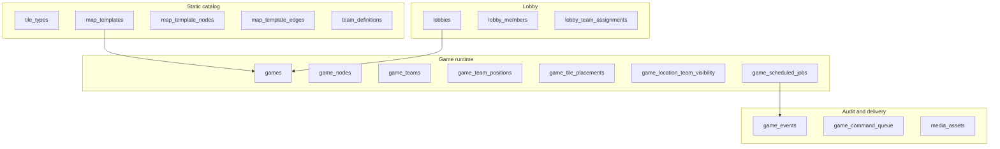
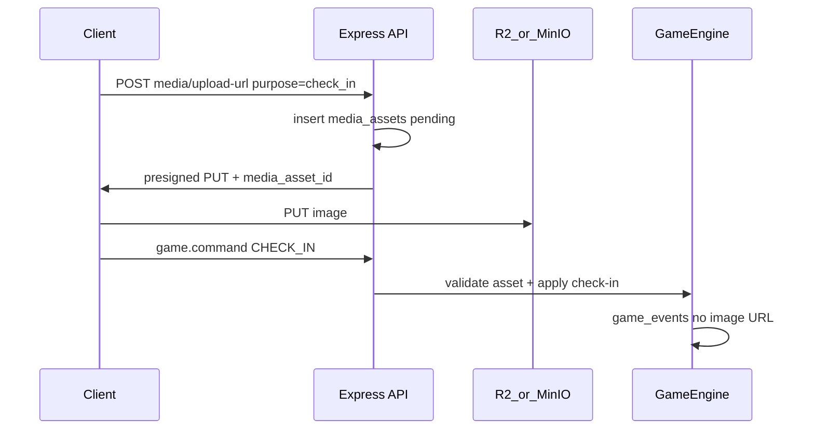
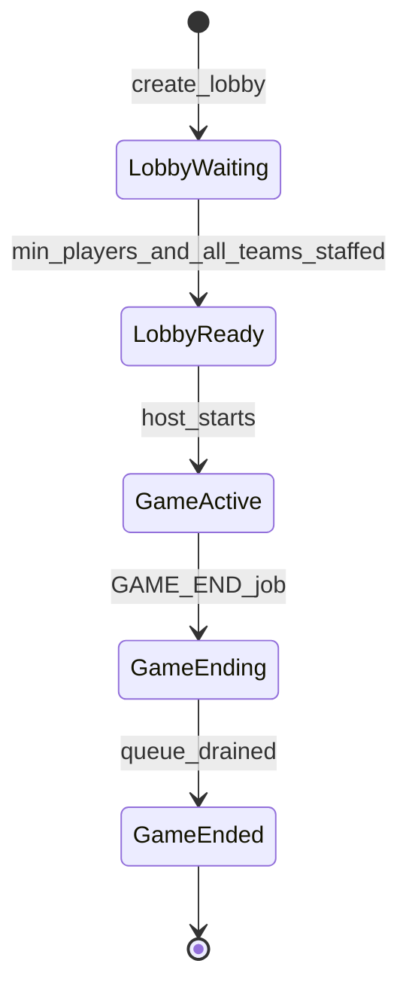
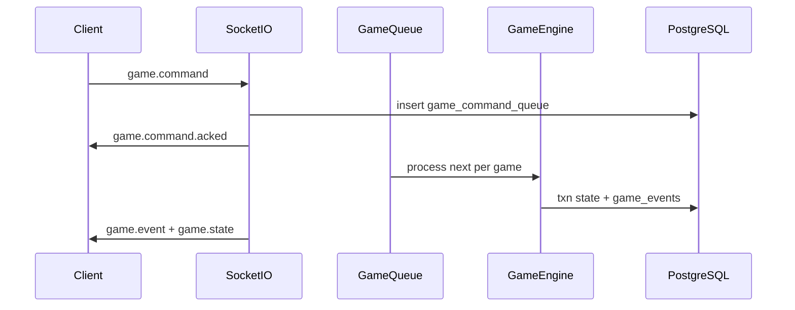

# Mingmei's Mahjong Mania — Technical Design Document

**Status:** Living document (v1 infrastructure)  
**Last updated:** 2026-05-24

---

## 1. Purpose and scope

This document defines **infrastructure and architecture** for *mingmei-mahjong-mania* before deep game UX work. The backend is the **source of truth** for game state, ordering, and visibility; clients primarily render projections and send commands.

### In scope (v1 infra)

- Registered-user auth (JWT)
- Lobby → game lifecycle
- Normalized relational game state (minimal JSONB on state tables)
- Event log + per-game command queue
- Socket.IO realtime + team-scoped state projections
- Map template cloning (**configurable node count** per template)
- Station check-in with **required photo**, geolocation (warn + allow)
- **Cloudflare R2** media storage (MinIO locally)
- DB-backed scheduler (visibility phases, notifications, game end)
- **Per-lobby static notification schedule** (`lobby_notifications`)
- Challenge system **schema + media plumbing** (resolver logic when product defines cards)
- **Riichi hand evaluation** module (stub → full scoring; see [§3.9](#39-mahjong-hand-evaluation-riichi))

### Abstraction layer vs rule layer

The infrastructure below the dotted line is intentionally agnostic to the specific game rules product ends up shipping. The engine knows about:

- **N nodes** on a map (per map template)
- **M slot capacity** at each node (`slots_per_node`, configurable per lobby — the dealer fills this many tiles at game start; runtime counts may shift)
- **K tiles** in each hand (`hand_size`, configurable per lobby)
- A primitive for **swapping placements** between any two locations (node ↔ node, hand ↔ node)
- An **append-only event log** that records every state-changing action
- A **scheduler** that can fire static notification templates at configurable game-relative times
- **Visibility groups + phases** as a configurable mechanic (N phases, N groups) layered on top of the placement model

Specific rules (the exact tile catalog, exact visibility schedule, exact challenge mechanics, exact scoring) live above this layer and can shift without schema migrations.

### Out of scope (v1)

- Polished UI
- Exhaustive riichi edge-case coverage on day one (incremental implementation inside the scoring module)
- Anti-cheat beyond basic validation
- Multi-server Redis (design allows it later; ship single-node first)
- Mobile push (FCM/APNs) — Socket-only notifications for v1
- Specific challenge card rules until product defines decks
- Catalog of notification templates (the lobby stores opaque template keys; the actual text lookup table is a rule-layer concern)
- User-initiated media deletion (GDPR) — post-v1
- **Phase G (R2/MinIO + check-in photo + media retention + game summary photo URLs)** — **deferred post-MVP** (decision: 2026-06-01). CHECK_IN in v1 is photo-less; the `media_assets` table stays migrated but is unused on the write path. Re-enabled when product is ready; see [§9](#9-implementation-phases) and [§10](#10-open-items-non-blocking).

Hand **styling** is a client concern; hand **order** is always server-provided.

### Repository conventions

- **Stack:** Express + Sequelize + PostgreSQL (`docker-compose.yml`), React + Vite client (demo).
- **Migrations / seeders:** `server/migrations/*.cjs`, `server/seeders/*.cjs`. Use **`.cjs`** (not `.js`) because `server/package.json` has `"type": "module"` — same rule as `config/config.cjs`.
- **Models:** `server/src/models/`, registered in `server/src/config/database.ts`.
- **CLI:** From `server/`, `npm run db:migrate`, `npm run db:seed`, `npm run db:migrate:status`.

**Phase A (schema):** All tables in [§4](#4-data-model) are migrated. Catalog seeds: `team_definitions`, `tile_types` (136 for the standard riichi catalog, but the engine reads the count dynamically), `challenge_types`, `map_template` **TTC 2026** (84 stations; WGS84 `latitude`/`longitude` and schematic layout in `seeders/data/ttc2026-network.cjs`). The 84/136/13/4 combination is the **default configuration**, not a hard constraint.

---

## 2. Confirmed design decisions

| Area | Decision |
|------|----------|
| Map | Static **templates** cloned into per-game rows at start |
| Auth | Registered users only (`users` + JWT) |
| Tile catalog | Per-game tile set drawn from `tile_types` (standard riichi seed = 136 rows; engine reads count dynamically). Closed set per game: no mid-game create/destroy. |
| Map size | **Configurable per template** (`map_templates.node_count`); standard TTC 2026 = 84 |
| Slots per node | **Configurable per lobby** (`slots_per_node`, default 1); snapshotted onto `games.slots_per_node` at start. Capacity, not realized count — actual tiles per node may diverge from this value as commands move tiles around. |
| Hand size | **Configurable per lobby** (`hand_size`, default 13); snapshotted onto `games.hand_size` at start |
| Deal-time invariant | `slots_per_node × node_count + hand_size × team_count` must equal the game's tile catalog size (Fisher–Yates draws the entire deck and fills every slot + hand at start) |
| Deal | **Fisher–Yates** shuffle; random always |
| Hand order | **Server-sorted** (`suit_sort_order` → `rank`); client renders as given |
| Visibility phases | **Configurable count** `visibility_phase_count` (default 4); N phases ⇒ N visibility groups; phase 0 reveals home group, phase N-1 reveals all. Ephemeral view while checked in remains independent. |
| Game config | **Lobby**, editable by **host only**; snapshotted to `games` at start |
| Lobby start | `min_players_to_start` (default **4**); every member picks a team (1–4); **>= 1 player per team** before start; multiple players may share the same team |
| Travel | **Any station** on check-in (honor + geofence); skipping stations OK |
| Commands | `CHECK_IN`, `CHECK_OUT`, `SWAP_TILE`, `SWAP_LOCATION_TILES` (separate) |
| Team commands | **Any member** on that team (`game_participants`) |
| Team positions (UI) | **Not on map**; intel via **event log** only |
| Check-in photo | **Deferred (Phase G, post-MVP)** — v1 MVP CHECK_IN is photo-less. Planned post-MVP: **required**; stored in R2; **hidden during game**; **game summary** after end. Schema (`media_assets`) ready; UX + upload pipeline post-MVP. |
| Media retention | **Deferred (Phase G, post-MVP)** — planned 365 days, then delete (lifecycle rule + sweeper). |
| Object storage | **Deferred (Phase G, post-MVP)** — planned **Cloudflare R2** (prod), **MinIO** (dev). |
| Geolocation | Browser API; **warn + allow** on `CHECK_IN` only (Phase F shipped). Two relative checks vs. `game_nodes.geofence_radius_meters` (default 100 m): distance via haversine, and accuracy. Either failure flips `geolocationWarning`; both passing sets `geofenceValidated`. Persisted on `game_team_positions` and lifted onto the CHECK_IN event. The handler never rejects on a warning. |
| Notifications | Per-lobby `lobby_notifications` rows (`at_seconds`, opaque `template` key, optional `data` JSONB); copied into `game_scheduled_jobs` as `NOTIFICATION` rows at game start; broadcast over Socket |
| Game end | Drain **in-flight** command queue, then `ended` |
| Realtime | Commands → queue → engine → `game_events` → broadcast |
| State storage | Relational tables; JSONB only on events/commands/challenge params/notification data |
| Hand scoring | **Riichi** ruleset; pure `analyzeHand` module in `server/src/scoring/`. **Shipped (Phase I)**: module + `game.state` projection wiring (`handAnalysis`, `roundWind`, `seatWind`). Game summary integration still post-MVP. Tile model treats every hand as fully concealed (no calls / kans). Wins are non-dealer tsumo. Round wind randomized per game (persisted on `games.round_wind`); seat wind per team. Red-fives add `+1 han` per copy in the winning hand. 28 yaku detectors (1–6 han) + 8 yakuman with **additive stacking** for co-firing yakuman. See §3.9. |

---

## 3. Domain model



### 3.1 Core invariants

- **Closed tile set:** the game's tile catalog (number of `tile_types` rows, e.g. 136 for the riichi seed) is partitioned across `game_tile_placements` at deal time. No mid-game create/destroy. The deal-time invariant is `slots_per_node × node_count + hand_size × team_count = catalog_size`.
- **`slots_per_node` capacity per map node:** Capacity is set by `games.slots_per_node` (default 1; configurable per lobby). The dealer fills exactly `slots_per_node` `game_tile_placements` rows per `game_node` at deal time. Runtime tile counts at a node may differ as the engine moves tiles, but never exceed the slot capacity (handlers enforce this).
- **One placement per tile:** Each `game_tile` has exactly one `game_tile_placements` row — either on a node or in a team hand (XOR via DB check).
- **Configurable hand size:** Each team hand has exactly `games.hand_size` tiles (default 13).
- **Checked-in gate:** Station actions require `current_game_node_id` set.
- **Swap at station:** `SWAP_TILE` only at `current_game_node_id`; exchanges a specific hand tile ↔ a specific station tile (caller chooses both); counts unchanged.
- **Visibility:** Clients never infer fog-of-war; server projection only.
- **No rival position on map:** Other teams’ locations are not in live projection; use `game_events`.

### 3.2 Progressive visibility (global game state)

Visibility is parameterized by `games.visibility_phase_count` (`N`, default 4). N phases ⇒ N visibility groups ⇒ (N-1) `VISIBILITY_PHASE_ADVANCE` jobs scheduled at `started_at + interval × k` for `k = 1 … N-1`.

**At game start:**

1. Random partition of all `game_nodes` into N groups (`game_node_visibility_groups`). Sizes differ by at most 1 when `node_count` doesn't divide evenly.
2. Random home group per team (`game_team_home_groups`). Group assignment is **independent of team count**: when `team_count <= N` each team can get a unique home; when `team_count > N` teams may share a home group; when `team_count < N` some groups have no home team.
3. `visibility_phase = 0` — each team sees face-up tiles only in its home group on map.
4. Schedule (N-1) `VISIBILITY_PHASE_ADVANCE` jobs plus `GAME_END` at `ends_at`. When `N = 1`, no advance jobs are scheduled and everything is visible from start.

**Unlock order per team:**

```text
visible_groups(team, phase) = first (phase + 1) entries of
  [home, (home+1) % N, (home+2) % N, …, (home+N-1) % N]
```

| Phase | Map visibility per team (for `N = 4`) |
|-------|---------------------------------------|
| 0 | Home group only |
| 1 | 2 groups |
| 2 | 3 groups |
| 3 | Full map |

All teams advance phase on the **same schedule**; which groups are visible differs by home group.

**On phase advance (scheduler):** bump phase, upsert `game_location_team_visibility` (`source = phase`), emit `VISIBILITY_PHASE_ADVANCED`, broadcast state.

### 3.3 Visit-based visibility (ephemeral)

While checked in at node `N`:

- `faceUpForTeam(team, N) = true` even if phase would hide `N`.
- `SWAP_TILE` and other station actions allowed.

After `CHECK_OUT` (or `CHECK_IN` elsewhere after implicit check-out):

- No persistent reveal in `game_location_team_visibility`.
- `faceUpOnMap` falls back to phase rules only.

```text
faceUpOnMap(team, node) =
  game_location_team_visibility[team, node].is_face_up

faceUpForTeam(team, node) =
  faceUpOnMap(team, node)
  OR game_team_positions[team].current_game_node_id == node

canSwap(team, node) =
  game_team_positions[team].current_game_node_id == node

canSwapSlot(team, node, slotIndex) =
  canSwap(team, node)
  AND now() >= games[game].started_at
      + games[game].slot_unlock_offsets_seconds[slotIndex] * 1000
```

**Per-slot unlock (chunk 4):** Each addressable slot at a node has a uniform game-wide unlock offset (`games.slot_unlock_offsets_seconds[slotIndex]`). Slot 0 always has offset 0 (always unlocked at game start). Higher slots may carry positive offsets; `SWAP_TILE` rejects with `409 slot_locked` if the targeted slot is still locked at the wall-clock check. The rule is wall-clock-based and independent of whether the `SLOT_UNLOCKED` scheduled job has actually fired (the job exists for replay/broadcast, not gameplay).

**Per-slot map visibility (chunk 5):** `games.slot_map_visible[slotIndex]` is a pure pass/no-pass gate orthogonal to the phase rules. When `false`, slot `k`'s tile is **never** exposed in `mapNodes[].tiles[]` regardless of `faceUpOnMap`. Slot 0 is always `true`. Once unlocked, the tile is still visible to a checked-in team via `atStation.tiles[]`. See §6.3.

**Single source of truth (chunk 6):** Both rules above are exported as pure helpers in `server/src/services/slot-visibility.ts` (`isSlotUnlocked`, `assertSlotUnlocked`, `unlockedSlotIndices`, `isSlotMapVisible`, `mapVisibleSlotIndices`). The engine's `SWAP_TILE` handler and the (future) projection layer both consume this module — the per-slot rules live in exactly one place.

**Projection rule:** The server computes `faceUpOnMap` / `faceUpForTeam` internally but **does not expose phase numbers or boolean flags to the client**. It emits **tile data only where that team may see it** (see [§6.3](#63-gamestate-projection-shape)).

### 3.4 Station commands and travel

| Command | Payload | Description |
|---------|---------|-------------|
| `CHECK_IN` | `{ nodeId, geo? }` | Photo upload **deferred (Phase G, post-MVP)**; v1 MVP accepts CHECK_IN without a `media_asset_id`. The optional `geo: { latitude, longitude, accuracy, capturedAt? }` triggers Phase F warn/allow (see "Travel" below). Sets `current_game_node_id` to any station; implicit check-out first if already checked in elsewhere. |
| `CHECK_OUT` | `{}` | Clears `current_game_node_id`. |
| `SWAP_TILE` | `{ handTileId, stationTileId }` | Exchanges a specific hand tile with a specific tile at the team's current station. Both tile ids are caller-chosen since a station may hold up to `games.slots_per_node` tiles. Rejects with `409 slot_locked` if the targeted tile occupies a slot whose unlock offset has not yet elapsed (see §3.3 `canSwapSlot`). |
| `SWAP_LOCATION_TILES` | `{ tileAId, tileBId }` | Swap two tiles between map nodes (challenges). Uses shared `TileSwapService`. Implemented in Phase H. |
| *(future)* | | Additional station actions while checked in. |

**Travel:** No adjacency requirement. Geolocation optional on `CHECK_IN` (Phase F) — `SWAP_TILE` inherits the team's most-recent check-in coordinates. The handler **always accepts** the check-in (allow); the `geofenceValidated` / `geolocationWarning` flags are advisory and persisted on `game_team_positions` + lifted onto the CHECK_IN event payload. Two independent warning triggers, both relative to the station's own `geofence_radius_meters` (default 100 m):

- **Distance check** — warn when `haversineDistanceMeters > geofence_radius_meters`.
- **Accuracy check** — warn when the browser-reported `accuracy_meters > geofence_radius_meters`. Relative threshold (one source of truth per station) rather than an absolute constant.

`geofenceValidated` is true iff **both** checks pass; `geolocationWarning` is true iff **either** check fails. Clients pass the raw browser values through unchanged; coordinates are stored as-reported, not server-corrected. When the `geo` field is omitted (geolocation denied, unavailable, or timed out client-side) all four position-row columns stay `NULL` and the CHECK_IN event payload omits the geo fields entirely.

**Check-in elsewhere:** Server runs check-out first, then check-in.

### 3.5 Check-in photo flow



- Live `game_events` / projections: `has_photo: true` only — **no URLs** during play.
- Uploader may show **local preview** only.
- After `status = ended`: `GET /api/games/:id/summary` returns presigned GET URLs for participants.

### 3.6 Tile identity and red fives

Each physical tile is one `tile_types` row: `(suit, rank, copy_index)` with `copy_index` 0–3. There is **no** `is_red_five` column.

**Red-five convention (catalog):** for `man`, `pin`, and `sou` at **rank 5**, **`copy_index === 0`** is the red five (three tiles in the 136 set). Other copies of the 5 are normal fives. Seeded `display_name` values are `Red 5 Man`, `Red 5 Pin`, `Red 5 Sou` for those rows.

**Game rule:** `game_rule_flags` with `rule_key = red_fives_enabled` (boolean `enabled`). When **off**, red-five tiles still exist and count as normal 5s for melds; when **on**, scoring/projections treat them as red fives. Default at game start: TBD with product (recommend **on** for riichi).

**Server helper:** `server/src/tiles/red-five.ts` — `isRedFiveTileIdentity(tile)`, `isRedFiveForGame(tile, redFivesEnabled)`. All engine, projection, and scoring code must use this; do not re-encode the convention ad hoc.

### 3.7 Hand sorting (server authority)

```text
sortKey(tile) = (tile_types.suit_sort_order, tile_types.rank, game_tiles.copy_index)
```

- Hand order is **not stored** in the DB. The engine/projection layer sorts by `sortKey` when building `handTiles[]`.
- Projections emit `handTiles[]` with `slotIndex` 0–12 assigned at read time; **client must not re-sort**.

### 3.8 Challenges (architecture; rules TBD)

Static catalog: `challenge_decks`, `challenge_types`, `challenges` (parameters JSONB OK).

Runtime: `game_challenge_instances`, `game_challenge_submissions`.

`ChallengeResolutionService` dispatches by `resolver_key`:

| Type | Examples (product) |
|------|-------------------|
| `travel` | “Travel 500m in direction of drawn wind” |
| `photo` | “Photo of 3 round objects”, “three same-colour foods” |
| `tile_swap` | Map tile exchanges via `TileSwapService` |

Photo challenges reuse media pipeline (`purpose = challenge_submission`). Implement resolvers when product defines decks (Phase H).

### 3.9 Mahjong hand evaluation (Riichi)

A self-contained **scoring module** at `server/src/scoring/` evaluates a mahjong hand and returns structured scoring metadata. The client **never** computes score — only displays server results. The module is **shipped as of Phase I** and is wired into the `game.state` projection (§6.3: `handAnalysis`, `roundWind`, `seatWind`). Integration with `GET /api/games/:id/summary` is a post-MVP follow-up.

**Ruleset:** [Riichi / modern Japanese](https://riichi.wiki/), adapted to this game's constraints:

- **No calls / kans.** Players cannot pon / chi / kan, so every hand is treated as **fully concealed**; there is no open/closed distinction and no kan-derived yaku.
- **Always non-dealer tsumo.** All wins are self-draws on the 14th tile. No dealer-tsumo or ron variants.
- **Round wind randomized per game** (`east/south/west/north` chosen at game start); **seat wind per team** (the team's `game_team` slot). Yakuhai for the team's seat wind, the round wind, and any dragon triplet all apply independently; a single triplet that satisfies both round and seat wind counts twice (double yakuhai).
- **Red fives** (catalog `copyIndex === 0` of suited 5s) contribute **`+1 han` per copy in the winning hand** when the `red_fives_enabled` rule flag is on. They are not a yaku on their own and never satisfy the "needs a yaku" requirement.
- **Yakuman stack additively.** Co-firing yakuman (e.g. Big Three Dragons + All Honours) multiply the base 8000: 2× yakuman → 16000 base → 64000 total (non-dealer tsumo). Counted yakuman (a normal hand reaching `≥ 13 han`) caps at a single 32000 yakuman.

The module never reads or writes game state directly; it is a pure function.

#### Public API

```ts
// server/src/scoring/index.ts

interface AnalyzeHandInput {
  tiles: ReadonlyArray<Tile>;          // 13 tiles (tenpai / iishanten analysis)
                                       //   or 14 tiles (already-winning hand;
                                       //   last tile treated as the wait)
  seatWind: WindRank;                  // 1=East, 2=South, 3=West, 4=North
  roundWind: WindRank;
  redFivesEnabled?: boolean;           // default false
}

interface AnalyzedWait {
  tile: Tile;                          // completing tile (red-five copy
                                       //   preferred when available)
  han: number;                         // total han incl. red-five bonus;
                                       //   for yakuman = 13 × yakumanCount
  fu: number;                          // already rounded; 0 for yakuman
  points: number;                      // non-dealer tsumo total
  yaku: Array<{ name: string; han: number }>;
  isYakuman: boolean;
}

interface AnalyzeHandResult {
  shanten: number;                     // -1 winning, 0 tenpai, 1+ away
  waits?: AnalyzedWait[];              // present when shanten <= 0;
                                       //   sorted by points desc
}

function analyzeHand(input: AnalyzeHandInput): AnalyzeHandResult;
```

`Tile` reuses the catalog `TileIdentity` shape (`{ suit, rank, copyIndex }`); copyIndex matters only for red-five detection (`copyIndex === 0` of any suited 5).

A 0-point wait in the result means *structurally* completing but with no valid yaku (riichi's "no yaku" rule). The client decides whether to display these as "yakuless" tiles or hide them.

#### Internal layout

```text
server/src/scoring/
  index.ts                 analyzeHand entry point + public types
  orchestrator.ts          scoreCompleteHand: walk decompositions × yaku
                           catalog, apply precedence, pick best decomp
  context.ts               ScoringContext (winds, red-fives, winning tile)
  shanten.ts               computeShanten (standard / chiitoitsu / kokushi)
  waits.ts                 enumerateTenpaiWaits
  fu.ts, score.ts          fu + han→points
  tile-counts.ts           Uint8Array-backed 34-slot count rep
  tile-sets.ts             shared constants (orphan indices, ...)
  types.ts                 Tile / Suit / Wind / Meld / Decomposition
  decomposers/
    standard.ts            4-melds-and-a-pair via pair-pivot DFS
    chiitoitsu.ts          seven pairs
    kokushi.ts             thirteen orphans
  yaku/
    1-han.ts, 2-han.ts, 3-han.ts, 6-han.ts, yakuman.ts
    helpers.ts             shared predicates + wait-shape classifier
    types.ts               YakuDetector interface
```

Each yaku detector is a pure structural check `(decomposition, context) → han | null`. The orchestrator runs every detector against every decomposition, applies subset elimination (precedence rules below), then for each decomposition picks either the yakuman path (`≥ 1` yakuman fires) or the normal path (sum han + red-five bonus, compute fu, look up points). Final per-decomp scores are compared on `(points, yaku count, han, fu)` to pick the best interpretation of the same 14 tiles.

#### Yaku catalog

| Han | Yaku |
|-----|------|
| 1 | All Simples · Red Dragon · White Dragon · Green Dragon · Round Wind · Seat Wind · All Sequences (pinfu) · Pure Double Sequence |
| 2 | Three Colour Straight · Pure Straight · All Triplets · Three Colour Triplets · All Terminals and Honours · Outside Hand · Little Three Dragons · Seven Pairs |
| 3 | Half Flush · Pure Outside Hand · Twice Pure Double Sequence |
| 6 | Full Flush |
| Yakuman | Big Three Dragons · Thirteen Orphans · All Honours · All Terminals · All Green · Big Four Winds · Little Four Winds · Nine Gates |

**Precedence subset-elimination** (orchestrator drops the first when the second also fires on the same decomposition):

- `Pure Double Sequence → Twice Pure Double Sequence`
- `Half Flush → Full Flush`
- `Outside Hand → Pure Outside Hand`

**Decomposition tie-breaks** (different decomps of the same 14 tiles): same hand can decompose as both seven-pairs *and* a standard ryanpeikou shape; the orchestrator scores each independently and keeps the one with higher points (then yaku count, han, fu).

**Wait-shape fu** uses the standard riichi classifier: `ryanmen` (pinfu-eligible), `penchan`, `kanchan`, `shanpon`, `tanki`.

#### Out of scope (deferred)

- **Dora / uradora indicators.** Not in v1.
- **Riichi / ippatsu / haitei / houtei** and other special-state yaku that require turn-context the engine doesn't surface to scoring.
- **Open hands / called melds** — structurally impossible in this game.
- **Kan / rinshan / chankan** — structurally impossible.
- **`GET /api/games/:id/summary` wiring** — `game.state` integration is live (§6.3); the summary endpoint is a post-MVP follow-up that will reuse `analyzeHand` to produce per-team end-of-game scores from the final hands.

---

## 4. Data model

JSONB is avoided for authoritative **state**. Allowed on: `game_events.payload`, `game_command_queue.payload`, `challenges.parameters`, challenge submissions.

### 4.1 Identity and membership

#### `users`

| Column | Type | Constraints |
|--------|------|-------------|
| `id` | UUID | PK, default UUIDv4 |
| `email` | STRING | NOT NULL, UNIQUE |
| `password_hash` | STRING | NOT NULL |
| `username` | STRING | NOT NULL, UNIQUE |
| `created_at` | DATE | NOT NULL |
| `updated_at` | DATE | NOT NULL |

Indexes: `email`, `username`.

Sequelize model: `User` (`server/src/models/user.ts`).

#### `lobbies`

| Column | Notes |
|--------|--------|
| `id` | UUID PK |
| `host_user_id` | FK → `users` |
| `status` | `waiting` \| `starting` \| `closed` |
| `map_template_id` | FK |
| `game_duration_seconds` | |
| `visibility_phase_interval_seconds` | |
| `visibility_phase_count` | INT NOT NULL DEFAULT 4 (sourced from `map_template.default_visibility_phase_count`); snapshotted to `games.visibility_phase_count` at start. `>= 1`. |
| `slots_per_node` | INT NOT NULL DEFAULT 1 (sourced from `map_template.default_slots_per_node`); snapshotted to `games.slots_per_node` at start. `>= 1`. Capacity, not realized count. |
| `slot_unlock_offsets_seconds` | INTEGER[] NOT NULL DEFAULT `{0}`. One offset per slot index. `cardinality = slots_per_node`; entry `[1]` must be `0` (slot 0 always unlocked); all entries `>= 0`. Sourced from `map_template.default_slot_unlock_offsets_seconds` on lobby creation; host-editable while `waiting`; snapshotted to `games.slot_unlock_offsets_seconds` at start. Uniform across nodes and teams. |
| `slot_map_visible` | BOOLEAN[] NOT NULL DEFAULT `{true}`. One flag per slot index. `cardinality = slots_per_node`; entry `[1]` must be `true` (slot 0 follows phase rules). When `false`, slot `k`'s tile is never face-up on the map regardless of phase; only revealed via `atStation` once unlocked. Sourced from `map_template.default_slot_map_visible`; host-editable. |
| `team_assignment_mode` | `pick` \| `random` \| `mixed` |
| `min_players_to_start` | default **4** |
| `config_updated_at` | |

**Config:** only `host_user_id` may `PATCH /api/lobbies/:id/config`.

**Start rule:**

- Member count ≥ `min_players_to_start` (default **4**; must be ≥ 4 so all teams can be staffed).
- **Each team 1–4 has at least one member** after resolving assignments (many players may share the same team).
- Mode-specific rules below.

**`team_assignment_mode`:**

| Mode | Lobby behavior | At game start (`GameStartService`) |
|------|----------------|-------------------------------------|
| `pick` | Every member must choose `team_slot` 1–4 before start. | Use picks as-is. |
| `random` | Members may leave `team_slot` null until start. | Assign **all** members across teams 1–4 **as evenly as possible** (shuffle order, then repeatedly place each player on a currently smallest team; random tie-break). |
| `mixed` | Members may pick a team or stay in the random pool (`null`). | Keep picks; assign pool members on top of existing counts using the same **even distribution** algorithm. Readiness: enough pool players to fill any team with zero picks. |

Even distribution implementation: `server/src/services/even-team-assignment.ts` (`assignTeamsEvenly`, `resolveTeamsForGameStart`).

#### `lobby_members`

`lobby_id`, `user_id`, `joined_at` — unique `(lobby_id, user_id)`.

#### `lobby_team_assignments`

`lobby_id`, `user_id`, `team_slot` — which of the four game teams (1–4) the user chose. **Not unique per lobby:** many users may share the same `team_slot`. `null` = random pool (assigned evenly at start in `random` / `mixed` modes).

#### `lobby_notifications`

Per-lobby schedule of static notification templates that fire during the game. Host-managed via REST while the lobby is `waiting`. Copied into `game_scheduled_jobs` as `NOTIFICATION` rows at game start (`run_at = started_at + at_seconds × 1000`, `payload = { template, data }`).

| Column | Notes |
|--------|--------|
| `id` | UUID PK |
| `lobby_id` | FK → `lobbies` (ON DELETE CASCADE) |
| `at_seconds` | INT NOT NULL CHECK `>= 0`; offset in seconds from `games.started_at`. |
| `template` | VARCHAR(64) NOT NULL; opaque template key (no enum catalog in v1). |
| `data` | JSONB; optional template-specific payload (e.g. `{ minutesLeft: 10 }`). |
| `created_at`, `updated_at` | |

Index: `(lobby_id, at_seconds)`. Same `at_seconds` may repeat (two distinct templates may fire at the same time).

#### `games`

| Column | Notes |
|--------|--------|
| `status` | `active` \| `ending` \| `ended` |
| `hand_size` | snapshot from `map_template.default_hand_size` (default 13) |
| `slots_per_node` | INT NOT NULL DEFAULT 1; snapshot from `lobby.slots_per_node` at start. Capacity, not realized count. |
| `slot_unlock_offsets_seconds` | INTEGER[] NOT NULL DEFAULT `{0}`; snapshot from `lobby.slot_unlock_offsets_seconds` at start. Same length/invariant rules as on `lobbies`. Slot `k` is unlocked once `now >= started_at + slot_unlock_offsets_seconds[k] * 1000`; the engine rejects `SWAP_TILE` against a still-locked slot. |
| `slot_map_visible` | BOOLEAN[] NOT NULL DEFAULT `{true}`; snapshot from `lobby.slot_map_visible` at start. Same length/invariant rules as on `lobbies`. Drives projection-time filtering of `mapNodes[].tiles[]`. |
| `visibility_phase` | 0 … `visibility_phase_count - 1` |
| `visibility_phase_count` | INT NOT NULL DEFAULT 4; snapshot from `lobby.visibility_phase_count` at start |
| `started_at`, `ends_at`, `duration_seconds` | |
| `visibility_phase_interval_seconds` | snapshot from lobby |
| `config_version` | |

#### `game_participants`

`game_id`, `user_id`, `game_team_id`. Many rows may reference the same `game_team_id` when several lobby members chose the same team. All participants on a team share that team’s hand and may issue commands for it.

### 4.2 Teams (catalog vs runtime)

#### `team_definitions` (static, 4 rows)

`id`, `code` (e.g. `red`), `display_name`, `sort_order`.

Seeded: `east`, `south`, `west`, `north` (`20260517180000-seed-team-definitions.cjs`).

#### `game_teams`

`id`, `game_id`, `team_definition_id`, `display_name` (optional).

### 4.3 Map catalog and instances

#### `map_templates`

| Column | Notes |
|--------|-------|
| `name`, `description` | |
| `node_count` | Number of stations on this template (TTC 2026 = 84). The cloner trusts the value; not constrained to 84. |
| `default_duration_seconds` | Default `games.duration_seconds` if not overridden on the lobby. |
| `default_hand_size` | Default `lobby.hand_size`. Standard riichi = 13. |
| `default_slots_per_node` | Default tile-slot capacity at each node on this template. Lobbies inherit it as `slots_per_node` (default 1). Map authors can model "roughly even but not identical" distributions by picking a slot count that, combined with the catalog and hand sizes, leaves room for the deal-time invariant to hold. |
| `default_slot_unlock_offsets_seconds` | INTEGER[] NOT NULL DEFAULT `{0}`. Per-slot unlock offsets in seconds from `started_at`; one entry per slot index. `cardinality = default_slots_per_node`; entry `[1]` must be `0`; all entries `>= 0`. Lobbies inherit as `slot_unlock_offsets_seconds`. |
| `default_slot_map_visible` | BOOLEAN[] NOT NULL DEFAULT `{true}`. Per-slot map-visibility flags. `cardinality = default_slots_per_node`; entry `[1]` must be `true`. Lobbies inherit as `slot_map_visible`. |
| `default_visibility_phase_count` | Default `lobby.visibility_phase_count`. Default 4. |
| `default_start_node_code` | Station code where teams spawn at game start (nullable; null = teams start unchecked). |

#### `map_template_nodes`

| Column | Notes |
|--------|--------|
| `code`, `name` | Station identifiers (unique `code` per template) |
| `latitude`, `longitude` | WGS84 entrance coords for geofence (authoritative values in `server/seeders/data/ttc2026-network.cjs`) |
| `geofence_radius_meters` | Optional; engine may default ~75–150m when null |
| `coordinate_x`, `coordinate_y` | Integer grid position for schematic map UI |
| `label_anchor` | Label placement hint (lowercase compass: `n`, `ne`, `sw`, `e`, …) — `STRING(16)`; stored as seeded, echoed in projections as `labelAnchor` |
| `label_rotate` | Optional label rotation in degrees (client transit-map style) |
| `is_interchange` | Interchange station styling |

#### `map_template_lines`

Lines for a template: `code` (`STRING`, unique per template), `name`, `short_name`, `color` (hex), `sort_order`, `render_metadata` (JSONB: `stationIds`, `bends` waypoints).

#### `map_template_node_lines`

Many-to-many: `map_template_node_id` ↔ `map_template_line_id` (a station can serve multiple lines).

#### `map_template_edges`

`from_node_id`, `to_node_id` (unique per template + pair). Graph for layout only — **no** `weight` / `travel_seconds` in v1 (travel is not edge-constrained).

#### `game_nodes` / `game_edges`

Cloned from template at game start (`GameStartService`):

- **`game_nodes`:** copy template node layout fields + `game_id`, `template_node_id` (FK, `RESTRICT` on delete).
- **`game_lines`:** clone `map_template_lines` per game (`code`, `name`, `short_name`, `color`, `render_metadata`, `sort_order`, `template_line_id`).
- **`game_nodes`:** also clone `label_rotate`.
- **`game_node_lines`:** clone `map_template_node_lines` using cloned line + node IDs.
- **`game_edges`:** `from_game_node_id`, `to_game_node_id` mapped from template edge endpoints.

Layout fields (including `lineIds[]` string codes) are **not secret** and are included in `game.state` `mapNodes[]`, `mapLines[]`, and `mapEdges[]`. Tile identity on nodes remains visibility-gated.

### 4.4 Tiles

#### `tile_types`

Tile catalog for the standard riichi seed: 34 types × 4 copies = 136 rows.  
`suit`, `rank`, `copy_index` (0–3), `suit_sort_order`, `display_name`.

The engine never hard-codes the count: `tile_types.count()` is the source of truth for the game's catalog size. Future map templates / game modes may seed alternate catalogs.

Red fives: `(man|pin|sou, rank 5, copy_index 0)` — see [§3.6](#36-tile-identity-and-red-fives). No boolean column.

#### `game_tiles`

One row per tile in the catalog (e.g. 136 for the riichi seed): `tile_type_id`, `copy_index` (must match the referenced `tile_types.copy_index`).

#### `game_tile_placements`

Where each `game_tile` lives — **exactly one** of:

| Column | Meaning |
|--------|---------|
| `game_node_id` | On the map at that station |
| `game_team_id` | In that team’s hand |
| `slot_index` | INT NULL. Addressable slot ordinal at the node (`0..games.slots_per_node - 1`). Set iff `game_node_id` is set; `NULL` for hand placements. |

`game_tile_id` is unique. `game_node_id` is **not unique** (a node may hold up to `games.slots_per_node` tiles); a non-unique index supports lookups by node. A partial unique index `(game_node_id, slot_index) WHERE game_node_id IS NOT NULL` enforces at most one tile per addressable slot (added in chunk 2). Invariants: `(game_node_id IS NOT NULL) XOR (game_team_id IS NOT NULL)` (enforced by DB CHECK); `slot_index IS NULL iff game_node_id IS NULL` and `slot_index >= 0` when set (DB CHECK lands with chunk 3 once `swapPlacements` swaps `slot_index` alongside `game_node_id` — see §11).

**Deal:** Shuffle all catalog tiles → create `slots_per_node` placements at each `game_node` → `hand_size` placements per team in fixed team order. Required invariant at deal time: `slots_per_node × node_count + hand_size × team_count = catalog_size`. Hand sort order is applied in the engine when projecting, not persisted.

### 4.5 Positions and visibility

#### `game_team_positions`

`current_game_node_id` (nullable), `checked_in_at`, `last_check_in_latitude`, `last_check_in_longitude`, `geofence_validated`, `geolocation_warning`.

#### `game_node_visibility_groups`

`game_node_id`, `group_index` (0–3).

#### `game_team_home_groups`

`game_team_id`, `group_index` (unique per game).

#### `game_location_team_visibility`

Phase unlocks only: `is_face_up`, `source` (`phase` \| `override`), `revealed_at`.

#### `game_rule_flags` (optional)

Extensible per-game rules: `rule_key`, `enabled` (boolean).

| `rule_key` | Meaning |
|------------|---------|
| `red_fives_enabled` | When true, copy 0 of each suited 5 uses red-five scoring/UI (§3.6) |

Set at game start from lobby config (when product defines it). Other keys may be added later.

### 4.6 Scheduled jobs

#### `game_scheduled_jobs`

| `job_type` | Effect |
|------------|--------|
| `VISIBILITY_PHASE_ADVANCE` | Phase++, recompute visibility, event + broadcast. `(N - 1)` rows seeded at game start (`N = games.visibility_phase_count`). |
| `GAME_END` | `ending` → drain queue → `ended`. One row seeded at game start. |
| `NOTIFICATION` | Broadcasts a static notification via `broadcaster.emitNotification`. Rows are seeded at game start by copying every `lobby_notifications` row into `game_scheduled_jobs` (`run_at = started_at + at_seconds × 1000`, `payload = { template, data }`). |

### 4.7 Media

#### `media_assets`

| Column | Notes |
|--------|--------|
| `game_id` | Owning game |
| `user_id` | Uploader |
| `purpose` | `check_in` \| `challenge_submission` \| `other` |
| `storage_key` | R2 object key (unique) |
| `status` | `pending` \| `ready` \| `failed` |
| `content_type` | Optional MIME for presign |
| `byte_size` | Optional uploaded size |
| `expires_at` | `created_at + 365 days` |
| `deleted_at` | set when purged |

**Stack:**

| Env | Storage |
|-----|---------|
| Production | Cloudflare R2 (S3 API) |
| Development | MinIO (Docker Compose) |

**Env vars:** `R2_ACCOUNT_ID`, `R2_ACCESS_KEY_ID`, `R2_SECRET_ACCESS_KEY`, `R2_BUCKET_NAME`, `R2_ENDPOINT`, `MEDIA_MAX_BYTES`, `MEDIA_RETENTION_DAYS` (365).

Use `@aws-sdk/client-s3` with custom endpoint + path-style for R2.

### 4.8 Challenges (schema; seeds later)

#### `challenge_types`

Global catalog: `code`, `name`, `resolver_key` (dispatches `ChallengeResolutionService`).

#### `challenge_decks`

`code`, `name`, `is_active`, `sort_order`.

#### `challenges`

`challenge_deck_id`, `challenge_type_id`, `code` (unique per deck), `title`, `parameters` (JSONB), `sort_order`, `is_active`.

#### `game_challenge_instances`

Runtime draw per team: `game_id`, `game_team_id`, `challenge_id`, `status` (`active` \| `submitted` \| `approved` \| `rejected` \| `cancelled`), `assigned_at`, `expires_at`, `resolved_at`, `resolution_payload` (JSONB).

#### `game_challenge_submissions`

`game_challenge_instance_id`, `submitted_by_user_id`, optional `media_asset_id`, `payload` (JSONB), `status` (`pending` \| `accepted` \| `rejected`), `submitted_at`, `reviewed_at`, `rejection_reason`.

Seeder: `challenge_types` only (`travel`, `photo`, `tile_swap`); decks/cards when product defines them.

### 4.9 Events and command queue

#### `game_events`

`sequence` (bigint, monotonic per game), `event_type`, `actor_user_id`, `actor_game_team_id`, `payload` (JSONB).

#### `game_command_queue`

`game_id`, `game_team_id`, `user_id`, `command_type`, `payload` (JSONB).  
`status`: `pending` \| `processing` \| `done` \| `failed`.  
`client_command_id` (UUID) — unique per `game_id` for idempotency.  
`processed_at`, `error_message` when terminal.

#### `game_scheduled_jobs`

`game_id`, `job_type` (`VISIBILITY_PHASE_ADVANCE` \| `GAME_END` \| `NOTIFICATION`), `run_at`, `status`, optional `payload` (JSONB), `completed_at`, `error_message`.

Optional (later): `game_event_media` (`event_id`, `media_asset_id`) for multiple attachments.

---

## 5. Lifecycle



1. Host creates lobby; members join and pick teams.
2. Host starts → validate deal-time invariant (`slots_per_node × node_count + hand_size × team_count == catalog_size`) → clone map → deal tiles → partition visibility into `visibility_phase_count` groups → schedule phase + notification jobs.
3. Active play via command queue + scheduler.
4. End → summary with photo URLs for participants.

---

## 6. Realtime architecture



### Socket rooms

- `lobby:{lobbyId}`
- `game:{gameId}`

Auth required; verify membership/participation.

### Command authorization

Issuer must be `game_participants` for the command’s `game_team_id`.

### Projections (`game.state`)

Delivered on join/reconnect and after every processed command (v1: **full snapshot** per team).

#### Design principles

1. **Do not send all location tiles.** Hidden tiles must be **absent** from the payload (not `tile: null` with a “secret” object the client could inspect). The server is the only authority on who sees what.
2. **Do not send `visibilityPhase`.** The client does not need the global phase index; fog-of-war is already applied in what tile data is included. Optional **`nextVisibilityChangeAt`** (ISO timestamp) is enough for a countdown banner.
3. **One realtime channel, not a separate “station” API for v1.** After `CHECK_IN`, the next `game.state` includes an **`atStation`** block with the tile(s). A second HTTP call would duplicate state and risk drift between Socket and REST.
4. **Split map view vs station view** in the JSON shape:
   - **`mapNodes`** — one entry per `game_node`; `tile`/`tiles` present only when **phase-visible on the map** (`faceUpOnMap`).
   - **`atStation`** — present when checked in; always includes the **current station tile(s)** even if that node is fogged on the map.

> When `games.slots_per_node = 1` (the default), projections currently expose a singular `tile` field on `mapNodes[]` and `atStation`. When `slots_per_node > 1`, the field becomes `tiles[]`; sites that issue `SWAP_TILE` must address a specific tile via `stationTileId`. The wire shape change is scoped to the projection phase (Phase G); the engine accepts the new payload from chunk 7 of the Phase D refactor onward.

The client renders the map from `mapNodes` and the station panel from `atStation` without re-deriving visibility rules.

#### Field summary

| Field | Scope |
|-------|--------|
| `gameId`, `status`, `endsAt` | Shared |
| `nextVisibilityChangeAt` | Optional; for UI timer only |
| `mapNodes[]` | Layout fields per `game_node`; `lineIds[]` (string codes); `tile` (default config) or `tiles[]` (when `slots_per_node > 1`) only if phase-visible on map |
| `mapLines[]` | Line catalog (`code`, `name`, `shortName`, `color`, `renderMetadata`) — sent once / on reconnect |
| `mapEdges[]` | Static graph (`fromNodeId`, `toNodeId`) — sent once / on reconnect |
| `atStation` | When checked in: `nodeId`, `code`, `tile` (always) |
| `handTiles[]` | Own team, pre-sorted |
| `recentEvents[]` | Shared metadata (no photo URLs) |
| `roundWind`, `seatWind` | Wind ranks `1..4` (East/South/West/North) — round wind is the game-wide randomized value, seat wind is derived from the team's `team_definition.code` |
| `handAnalysis?` | Riichi shanten / tenpai analysis from the scoring module (§3.9). Present when `handTiles.length === 13` or `14`; omitted otherwise. |
| Other teams’ hands / map positions | Omitted |

### 6.3 `game.state` projection shape

**Tile object** (when included):

```json
{
  "instanceId": "uuid",
  "suit": "man",
  "rank": 2,
  "copyIndex": 1,
  "displayName": "2 Man",
  "isRedFive": false
}
```

`isRedFive` is **computed** when building the snapshot (`isRedFiveForGame` + `red_fives_enabled`). Include `copyIndex` so the client can reconcile with catalog conventions.

**`mapNodes[]`** — one entry per `game_node` (length = `games.node_count`). Layout fields are always present; **`tile`** is conditional:

```json
{
  "id": "uuid",
  "code": "STN_01",
  "name": "Union Station",
  "coordinateX": 12,
  "coordinateY": 4,
  "lineIds": ["red", "blue"],
  "labelAnchor": "ne",
  "labelRotate": null,
  "isInterchange": false,
  "latitude": 51.5074,
  "longitude": -0.1278,
  "tile": { "instanceId": "...", "suit": "sou", "rank": 5, "displayName": "5 Sou" }
}
{
  "id": "uuid",
  "code": "STN_02",
  "name": "North End",
  "coordinateX": 8,
  "coordinateY": 1,
  "lineIds": ["red"],
  "labelAnchor": "n",
  "isInterchange": false,
  "latitude": 51.52,
  "longitude": -0.13
}
```

- Include **`tile`** only when `faceUpOnMap` is true for this team.
- Omit `tile` (or use `null` consistently—pick one in implementation; **never** send placeholder tile identity for hidden nodes).

**Per-slot extension (chunk 6 contract, slots_per_node > 1).** When `games.slots_per_node > 1`, replace the singular `tile` with `tiles[]` — an array of `{ slotIndex, tile }` objects, one entry per slot whose tile should be exposed on the map. The projection layer (Phase E) builds the array by:

```
includedTiles =
  faceUpOnMap(team, node) ?
    [ { slotIndex: k, tile: ... }
      for k in mapVisibleSlotIndices(game.slot_map_visible, game.slots_per_node)
      if a tile exists in placement (node, k) ]
    : []
```

- A slot whose `slot_map_visible[k]` is `false` is **never** included here, regardless of phase. Its tile is only ever surfaced via `atStation.tiles[]` to a checked-in team after the slot unlocks.
- `slotIndex` is required on every entry so the client can render slot-shaped UI (e.g. multi-tile stacks) without re-deriving order.
- The fog rule still gates the whole array: when `faceUpOnMap` is false, `tiles` is omitted/`null` exactly as the singular `tile` would be.
- For `slots_per_node = 1` (the default) the projection keeps emitting the singular `tile` field as documented above — the array shape only appears when the lobby/game opts into multiple slots, so existing clients are unaffected.

Both `mapVisibleSlotIndices` and the unlock helpers live in `server/src/services/slot-visibility.ts`; the projection layer must consume them directly rather than re-implementing the rules.

**`mapLines[]`** — line catalog for styling:

```json
{
  "code": "1",
  "name": "Line 1 Yonge-University",
  "shortName": "Line 1",
  "color": "#FFC72C",
  "sortOrder": 0,
  "renderMetadata": { "stationIds": ["finch-west", "..."], "bends": { "union": [{ "x": 575, "y": 680 }] } }
}
```

**`mapEdges[]`** — cloned graph edges (no tile data):

```json
{ "fromNodeId": "uuid", "toNodeId": "uuid" }
```

**`atStation`** — `null` when checked out; otherwise:

```json
{
  "nodeId": "uuid",
  "code": "STN_01",
  "tile": { "instanceId": "...", "suit": "dots", "rank": 9, "displayName": "9 Dot" }
}
```

- Populated whenever `current_game_node_id` is set.
- Tile is **always** included here, even when the same node has no `tile` on the map (fogged visibility group + checked in).

**Per-slot extension (chunk 6 contract, slots_per_node > 1).** With multiple slots, replace the singular `tile` with `tiles[]` — `{ slotIndex, tile }` entries for every slot that is currently **unlocked** at the wall clock:

```
includedTiles =
  [ { slotIndex: k, tile: ... }
    for k in unlockedSlotIndices(game, game.slots_per_node, now)
    if a tile exists in placement (node, k) ]
```

- A still-locked slot (`now < started_at + slot_unlock_offsets_seconds[k] * 1000`) is omitted; the station UI must indicate the slot exists and show a countdown, not the tile.
- `slot_map_visible` does **not** gate `atStation` — once unlocked, a station-visible tile is shown to the checked-in team even when it's never shown on the map. That's the whole point of the per-slot "always fogged on the map but visible at the station" tier.
- For `slots_per_node = 1` the singular `tile` field is retained; the array shape only appears when the game opts into multiple slots.

The `SWAP_TILE` payload (`{ handTileId, stationTileId }`) already addresses a specific tile by id, so the array shape requires no payload change — clients pick which slot's tile to swap by passing its `stationTileId`.

**Why not let the client render from full data?**  
Exposing every location’s tile in `game.state` would leak map state via devtools/network and breaks competitive play. Any “hidden” UI must be based on **missing data**, not client-side filtering.

**Post-game:** `GET /api/games/:id/summary` may include richer history; live `game.state` stays redacted as above.

**Wind + hand analysis** — every projection includes `roundWind` (the game's randomized round wind, `games.round_wind`) and `seatWind` (derived from the team's `team_definition.code`: `east → 1`, `south → 2`, `west → 3`, `north → 4`). When the team's hand is 13 or 14 tiles, the projection also includes `handAnalysis` with the scoring module's full evaluation:

```json
{
  "shanten": 0,
  "waits": [
    {
      "tile": { "suit": "pin", "rank": 5, "copyIndex": 1 },
      "han": 3,
      "fu": 30,
      "points": 4000,
      "yaku": [
        { "name": "All Simples", "han": 1 },
        { "name": "Three Colour Straight", "han": 2 }
      ],
      "isYakuman": false
    }
  ]
}
```

- `shanten`: `-1` (winning), `0` (tenpai), `1+` (away from tenpai).
- `waits`: present when `shanten <= 0`; sorted by points descending. A 0-point wait means the hand structurally completes but has no yaku (the riichi "needs a yaku" rule).
- The completing tile's `copyIndex` is set to `0` (the red copy) when the rule is on and the team doesn't already hold the red five of that rank.

The wiring is enabled for every team's projection — no opt-in flag. Clients ignore the field if they don't render scoring hints.

### Scheduler

`SchedulerWorker` polls `game_scheduled_jobs` (`FOR UPDATE SKIP LOCKED`).  
v1: in-process on single node. System handlers update state → `game_events` → broadcast (may bypass player queue; document ordering if unified later).

---

## 7. API surface

### HTTP

| Area | Endpoints |
|------|-----------|
| Auth | `POST /api/auth/register`, `POST /api/auth/login`, `GET /api/auth/me` |
| Lobbies | `POST /api/lobbies`, `GET /api/lobbies/:id`, `PATCH /api/lobbies/:id/config` (host), `POST …/join`, `POST …/team`, `POST …/start` |
| Games | `GET /api/games/:id`, `GET /api/games/:id/summary` (ended only; will include per-team `handAnalysis` once the scoring module is wired into the summary — see §3.9 follow-ups) |
| Media | `POST /api/games/:id/media/upload-url`, optional `POST …/media/:id/confirm` |
| Catalog | `GET /api/map-templates`, `GET /api/tile-types`, `GET /api/challenge-decks` |
| Scoring | (no HTTP surface in v1; `analyzeHand` is consumed in-process. An optional dev endpoint can wrap it later if useful for tooling.) |

### Socket

| Direction | Event |
|-----------|--------|
| C→S | `lobby.join`, `game.command` |
| S→C | `lobby.config`, `game.command.acked`, `game.command.rejected`, `game.event`, `game.state`, `game.notification` |

---

## 8. Server module layout

```text
server/src/
  auth/           JWT, bcrypt, middleware
  socket/         Socket.IO, rooms
  queue/          per-game processor
  engine/         handlers, TileSwapService, invariants
  projections/    GameStateProjection (hand sort via sortKey)
  scheduler/      game_scheduled_jobs worker
  media/          R2/MinIO presign, retention sweeper
  challenges/     ChallengeResolutionService (stubs → impl)
  scoring/        analyzeHand (Riichi: shanten, waits, yaku catalog, han–fu, points) — pure module
  tiles/          red-five identity helpers (isRedFiveForGame)
  services/       LobbyService, GameStartService, GameSummaryService
  models/         Sequelize models
```

Entry: `http.createServer(app)` + Socket.IO; `import "dotenv/config"`.

---

## 9. Implementation phases

| Phase | Work |
|-------|------|
| **A** | This doc; all §4 migrations; catalog seeds (`team_definitions`, `tile_types`, `challenge_types`, `map_template` **TTC 2026** with full WGS84 coords in `seeders/data/ttc2026-network.cjs`) |
| **B** | Auth + lobby HTTP APIs; **host** `POST /api/lobbies/:id/start` validates readiness, resolves teams (`even-team-assignment.ts`), persists `team_slot`, creates `games` + four `game_teams` + `game_participants`, closes lobby |
| **C** | Extend **same** `GameStartService`: clone map (template `node_count`), create one `game_tile` per catalog entry + placements (`slots_per_node` per node + `hand_size` per team), visibility groups, scheduled jobs |
| **D** | Engine, queue, scheduler, event tests |
| **E** | Socket.IO, projections (sorted hands), reconnect |
| **F** | **Complete** — Geolocation warn/allow. `services/geolocation.ts` (pure haversine + payload parser + evaluator) feeds the `CHECK_IN` handler; results persist to `game_team_positions.{lastCheckInLatitude,lastCheckInLongitude,geofenceValidated,geolocationWarning}` and are lifted onto the `CHECK_IN` event payload (`geolocationWarning`, `geofenceValidated`, `distanceMeters`) and the `RecentEventDto` (`geolocationWarning` only). `SWAP_TILE` inherits the most-recent-check-in coordinates from the position row. See [§3.4 Travel](#34-station-commands-and-travel). |
| **G** | **Deferred (post-MVP)** — R2/MinIO, check-in photo, game summary URLs, retention. v1 MVP CHECK_IN is photo-less; schema is already migrated so the re-enable path is purely additive (UX + upload pipeline + presigned-URL plumbing). See [§1](#1-purpose-and-scope) "Out of scope". |
| **H** | Challenge catalog + resolvers (when product ready) |
| **I** | **Scoring — Shipped.** Pure `analyzeHand` module under `server/src/scoring/`: shanten (standard / chiitoitsu / kokushi), wait enumeration, 28-detector yaku catalog (1–6 han + 8 yakuman with additive stacking), fu + non-dealer tsumo points, red-five bonus. `games.round_wind` migration + randomization in `GameStartService`. `buildGameStateProjection` wires `analyzeHand` into every team's `game.state` (new fields: `roundWind`, `seatWind`, `handAnalysis?`). **Follow-ups (post-MVP):** wire `analyzeHand` into `GET /api/games/:id/summary` for per-team end-of-game scores. Challenge resolvers (Phase H) reuse the same module when a card requires proving a scoring hand. |

---

## 10. Open items (non-blocking)

The infra layer is intentionally rule-agnostic. Items marked **rule layer** describe questions that will be answered by whatever rule set product picks (riichi, TTC variant, etc.) and do **not** block the infra phases.

| Item | Status |
|------|--------|
| Deal algorithm | Resolved — Fisher–Yates |
| Notification copy | Resolved — opaque `template` key per `lobby_notifications` row; concrete text catalog is a rule-layer concern |
| Challenge definitions | Waiting on product (rule layer) |
| GDPR media delete | Deferred |
| Challenge photo visibility during game | Likely same as check-in; confirm with product (rule layer) |
| Riichi: dora / red dora / full yaku list | Resolved — red-fives ship as `+1 han` per copy; dora / uradora are deferred (see §3.9 "Out of scope"). v1 yaku catalog is the 28 detectors in §3.9. |
| 13 vs 14 tiles for evaluation API | Resolved — `analyzeHand` accepts both: 13 tiles ⇒ shanten + waits; 14 tiles ⇒ scored directly (last tile = winning tile). |
| Scoring affects game winner | Rule layer — summary ranking only vs mechanical win condition; decided post-MVP once scoring is wired into the summary. |
| Per-template notification defaults | Future — `map_templates` could seed a default notification set; not in v1 |
| Phase G timing | Deferred to post-MVP (decision 2026-06-01); re-prioritize after MVP launches. Schema is already in place, so the un-defer is purely UX + upload pipeline + storage credentials. |

---

## 11. Migration checklist

- [x] Add user table
- [x] Add team definitions
- [x] Add lobby tables
- [x] Add game runtime tables
- [x] Add tile + map catalog tables
- [x] Add visibility + positions tables
- [x] Add `game_events`, `game_command_queue`, `game_scheduled_jobs`
- [x] Add `media_assets`
- [x] Add challenge tables (challenge_types seeder; decks/cards empty)
- [x] Seeds: `team_definitions`, `tile_types` (136 rows for the standard riichi catalog), `challenge_types`
- [x] Seed: `map_template` **TTC 2026** (`server/seeders/data/ttc2026-network.cjs` → `20260517202000-seed-map-template-ttc2026.cjs`). All 84 stations have entrance `latitude`/`longitude` plus schematic `x`/`y`/`labelAnchor` in the seed file, which is the canonical map source for the DB-backed client.
- [x] Phase D abstraction-layer relaxation (`20260524000000-relax-abstraction-layer.cjs`):
  - Drop unique index `game_tile_placements_game_node_id_unique`; add non-unique index on `game_node_id`.
  - `map_templates`: add `default_slots_per_node INT NOT NULL DEFAULT 1`, `default_visibility_phase_count INT NOT NULL DEFAULT 4`.
  - `lobbies`: add `slots_per_node INT NOT NULL DEFAULT 1`, `visibility_phase_count INT NOT NULL DEFAULT 4`.
  - `games`: add `slots_per_node INT NOT NULL DEFAULT 1`, `visibility_phase_count INT NOT NULL DEFAULT 4`.
  - Create `lobby_notifications (id, lobby_id FK CASCADE, at_seconds, template, data JSONB, timestamps)` + index `(lobby_id, at_seconds)`.
- [x] Phase D visibility-group constraint relaxation (`20260524100000-relax-visibility-group-constraints.cjs`):
  - Replace `game_node_visibility_groups.group_index` range check (`0..3`) with non-negative check (`>= 0`) so `N > 4` works.
  - Replace `game_team_home_groups.group_index` range check the same way.
  - Drop unique index `game_team_home_groups_game_group_unique`; replace with a non-unique index (teams may share a home group when `team_count > visibility_phase_count`).
- [x] Per-slot visibility rules schema, chunk 1 of the per-slot rollout (`20260530150000-add-per-slot-rules.cjs`): columns only, no CHECKs yet. Wrapped in a single transaction.
  - `map_templates`: add `default_slot_unlock_offsets_seconds INTEGER[] NOT NULL DEFAULT {0}`, `default_slot_map_visible BOOLEAN[] NOT NULL DEFAULT {true}`.
  - `lobbies`: add `slot_unlock_offsets_seconds`, `slot_map_visible` (same shape and defaults).
  - `games`: same two columns (snapshot of lobby values at start).
  - `game_tile_placements`: add `slot_index INTEGER NULL`; backfill existing node placements with `ROW_NUMBER() OVER (PARTITION BY game_node_id ORDER BY created_at, id) - 1` to recover the dealer's stable per-node insertion order. Hand placements stay `NULL`.
  - **Deferred CHECKs:** the array-length / slot-0 invariants on `map_templates` / `lobbies` / `games` land with chunk 5 (lobby config flow) so existing producers don't trip them mid-rollout. The `slot_index NOT NULL iff game_node_id NOT NULL` CHECK lands with chunk 3 (swap mechanics) so the existing `swap-tile` / `tile-swap-service` don't violate it mid-rollout — see chunk 2 / chunk 3 notes below.
  - Behavior-neutral: defaults preserve single-slot semantics; downstream chunks wire the dealer (chunk 2), swap mechanics (chunk 3), scheduler + lock validation (chunk 4), lobby config flow (chunk 5), and projection contract (chunk 6).
- [x] Per-slot rules chunk 2 of the rollout (`20260530160000-add-slot-index-partial-unique.cjs`): make `slot_index` real for the dealer + start enforcing intra-node uniqueness. Wrapped in a single transaction.
  - `game_tile_placements`: drop the legacy `game_tile_placements_game_node_id_unique` (UNIQUE on `game_node_id` alone — incompatible with `slots_per_node > 1`); add a non-unique `(game_node_id)` index for lookups; add partial UNIQUE `(game_node_id, slot_index) WHERE game_node_id IS NOT NULL` — Postgres treats NULL as distinct in unique indexes, so swap-mutated rows whose `slot_index` is still NULL won't conflict (they're chunk 3's problem).
  - Code: `tile-deal-service.dealTilesForGame` now sets `slotIndex = s` (0..slotsPerNode-1) on every node placement. Hand placements stay `slotIndex = null`. `setupLightweightGame` already does this since chunk 1.
  - **Deferred to chunk 3:** the `slot_index NOT NULL iff game_node_id NOT NULL` CHECK — the existing `swap-tile` handler mutates `game_node_id` directly without touching `slot_index`, which would put rows into a `(game_node_id NOT NULL, slot_index NULL)` state that violates the CHECK. Chunk 3 updates `swapPlacements` to swap `slot_index` alongside `game_node_id` / `game_team_id`, after which the CHECK becomes safe to enforce.
- [x] Per-slot rules chunk 3 of the rollout (`20260530170000-add-slot-index-check.cjs`): close the loop on the `slot_index` shape invariant. Wrapped in a single transaction.
  - Code: `tile-swap-service.swapPlacements` now swaps `slot_index` alongside `game_node_id` / `game_team_id` in a single UPDATE (avoids transient `(node, slot)` collisions against the partial unique index from chunk 2). `PlacementSnapshot` gains `slotIndex` so callers can observe the vacated slot. Per the per-slot rules: an incoming hand tile takes the exact slot the outgoing station tile vacated, and a node↔node swap exchanges slots along with nodes.
  - Migration adds `game_tile_placements_slot_index_matches_node CHECK ((game_node_id IS NULL AND slot_index IS NULL) OR (game_node_id IS NOT NULL AND slot_index IS NOT NULL AND slot_index >= 0))`. The upper bound (`slot_index < games.slots_per_node`) is enforced by the dealer + API layer, not the CHECK (would require a cross-row join).
  - Test coverage: `tile-swap-service.test.ts` asserts hand→node swap places the incoming tile in the vacated `slot_index` (not slot 0) on a 2-slot station, and node↔node-on-same-node swap exchanges slot indices without tripping the partial unique index. `swap-tile.test.ts` adds slot_index assertions to the happy-path SWAP_TILE.
- [x] Per-slot rules chunk 4 of the rollout (`20260530180000-add-slot-unlocked-job-type.cjs`): scheduler + engine lock validation. Wrapped in a single transaction.
  - Migration extends the `game_scheduled_jobs.job_type` CHECK enum from `{VISIBILITY_PHASE_ADVANCE, GAME_END, NOTIFICATION}` to also include `SLOT_UNLOCKED`. `down` refuses to roll back while `SLOT_UNLOCKED` rows exist (would silently corrupt the catalog).
  - Models: `ScheduledJobType` gains `"SLOT_UNLOCKED"`.
  - Code: `game-start-service` now snapshots `lobby.slot_unlock_offsets_seconds` and `lobby.slot_map_visible` into `games`. `game-schedule-service.scheduleGameJobs` takes an options object (was positional) and seeds one `SLOT_UNLOCKED` job per slot `k >= 1` with a non-zero offset, at `startedAt + offset * 1000`, payload `{ slotIndex: k }`. Slot 0 (always 0) and any slot whose offset is 0 are skipped (already unlocked at start).
  - Handler: `scheduler/handlers/slot-unlocked.ts` emits a `SLOT_UNLOCKED` event with `{ slotIndex }` (system actor; the orchestrator broadcasts state post-commit). The handler validates `slotIndex >= 1` and `< game.slotsPerNode`; out-of-range / missing payloads fail loudly so an operator can investigate.
  - Engine: `SWAP_TILE` rejects with `409 slot_locked` when `now() < game.startedAt + game.slot_unlock_offsets_seconds[stationSlotIndex] * 1000`. The rule is purely wall-clock-based (independent of whether the `SLOT_UNLOCKED` job has actually fired) so scheduler latency never blocks gameplay. See §3.3 `canSwapSlot`.
  - Test fixture: `setupLightweightGame` gains `slotUnlockOffsetsSeconds` so engine tests can opt into locked slots without seeding scheduler jobs. The fixture validates `[0] === 0` and `length === slotsPerNode`.
  - Test coverage: `game-schedule-service.test.ts` covers SLOT_UNLOCKED seeding (per-slot, slot-0-skipped, 0-offset-skipped, validation of `[0]` and negative offsets). `system-handlers.test.ts` covers the SLOT_UNLOCKED handler (happy path emits event, slotIndex=0 fails, slotIndex>=slotsPerNode fails). `swap-tile.test.ts` covers the engine rejection (slot 1 locked → `slot_locked`; slot 0 still permitted).
- [x] Per-slot rules chunk 6 of the rollout (`20260530200000-defer-slot-unique.cjs` for the bug-fix slice): projection contract + single source of truth helper.
  - New module `server/src/services/slot-visibility.ts` exports pure helpers — `slotUnlockAtMs`, `isSlotUnlocked`, `assertSlotUnlocked`, `unlockedSlotIndices`, `isSlotMapVisible`, `mapVisibleSlotIndices`. No DB access; callers pass the snapshot arrays from `games`. Out-of-range indices throw `500 internal_error` (chunk-5 CHECK guarantees array length matches `slots_per_node`, so any out-of-range read is a bug, not user input).
  - Engine refactor: `swap-tile.ts` now calls `assertSlotUnlocked(game, stationSlotIndex, "Slot N at CODE")` instead of inlining the `now < startedAt + offset * 1000` arithmetic. The per-slot lock rule now lives in exactly one place — every future projection / engine callsite that needs to know "is this slot usable right now?" goes through the helper.
  - TDD §3.3 documents the per-slot map-visibility rule and the single-source-of-truth helper. §6.3 adds the multi-slot wire shape for both `mapNodes[].tiles[]` and `atStation.tiles[]`: array of `{ slotIndex, tile }` entries gated by `mapVisibleSlotIndices` (map) / `unlockedSlotIndices` (station). The singular `tile` field is retained when `slots_per_node = 1` so existing clients aren't broken.
  - Phase E (projection layer) inherits a fully-specified contract: it must consume `slot-visibility.ts` directly rather than re-deriving the rules.
  - **Bug-fix slice (`20260530200000-defer-slot-unique.cjs`):** running the full integration suite end-to-end revealed that the chunk-2 partial UNIQUE INDEX on `(game_node_id, slot_index)` can't be made deferrable, and the chunk-3 single-statement `swapPlacements` UPDATE trips it whenever both rows cross over `(node, slot)` (e.g. hand↔node where the new `(N, k)` matches the other row's pre-swap `(N, k)`). Postgres checks unique-index violations per-row immediately, not at statement end. Fix: replace the partial UNIQUE INDEX with a partial EXCLUDE CONSTRAINT (`EXCLUDE USING btree (game_node_id WITH =, slot_index WITH =) WHERE (game_node_id IS NOT NULL) DEFERRABLE INITIALLY DEFERRED`). Same uniqueness semantics, but the check is deferred to statement / transaction end, by which time both rows have moved. `swapPlacements` is unchanged. `node_xor_team` stays as a non-deferrable CHECK because the swap sets `game_node_id` and `slot_index` together on every row — XOR is never transiently violated.
  - **Lobby create-time fix (no migration):** `createLobby` now algorithmically defaults the per-slot arrays (`[0,…,0]` / `[true,…,true]`) when the host overrides `slotsPerNode` past the template default's length, mirroring the auto-resize logic that already existed in `updateConfig`. Hosts no longer have to supply matched-length arrays just to start a non-default-slots lobby. Validation still rejects explicit-but-wrong-length arrays.
  - Test coverage: `test/unit/services/slot-visibility.test.ts` — 14 unit tests covering `slotUnlockAtMs` (slot 0, non-zero, out-of-range), `isSlotUnlocked` (slot 0 always, threshold around unlock time), `assertSlotUnlocked` (no-throw / 409 with timestamp), `unlockedSlotIndices` (all / prefix / start-of-game / non-monotonic offsets), `isSlotMapVisible` (lookup + out-of-range), and `mapVisibleSlotIndices` (full / partial / all-true). The existing `tile-swap-service.test.ts` (hand↔node and node↔node-on-same-node) now passes against the deferred EXCLUDE constraint, and `swap-tile.test.ts` covers the engine refactor end-to-end.
- [x] Phase I scoring projection wiring (`20260602225000-add-round-wind.cjs`): adds `games.round_wind INTEGER NOT NULL DEFAULT 1` (1 = East) with CHECK `1..4`. Snapshotted from a uniform random pick in `GameStartService` at game creation. Consumed by the `analyzeHand` projection wiring (§3.9). Existing rows backfill to East via the default.
- [x] Per-slot rules chunk 5 of the rollout (`20260530190000-add-config-array-checks.cjs`): lobby config flow + array-length / slot-0 invariants. Wrapped in a single transaction.
  - Migration adds five CHECK constraints to each of `map_templates`, `lobbies`, `games`: `cardinality(<offsets>) = <slots_per_node>`, `<offsets>[1] = 0`, `0 <= ALL(<offsets>)`, `cardinality(<map_visible>) = <slots_per_node>`, `<map_visible>[1] = TRUE`. Postgres arrays are 1-indexed, so `[1]` is our 0-indexed slot 0. Pre-existing rows satisfy all five (slots_per_node=1, defaults `[0]`/`[true]`).
  - `lobby-service.createLobby`: `slotUnlockOffsetsSeconds` and `slotMapVisible` default to the map template's `defaultSlotUnlockOffsetsSeconds` / `defaultSlotMapVisible`; host can override either independently; explicit values must match `slotsPerNode` exactly (no silent resize on create).
  - `lobby-service.updateConfig`: explicit patch values override. If the host changes only `slotsPerNode`, the existing arrays are auto-resized (pad with `0` / `true` when growing, truncate when shrinking) to keep cardinality aligned. If the host switches `mapTemplateId` without supplying the arrays, they inherit the new template's defaults (mirrors existing `slotsPerNode` / `visibilityPhaseCount` behavior). All paths funnel through app-level validators that mirror the DB CHECKs so the host gets a 400 with a useful message rather than a 500 from Postgres.
  - `LobbyConfigDto` exposes both arrays.
  - Test coverage: `lobby-service.test.ts` "per-slot rules arrays (chunk 5)" covers template defaults, create-time overrides, create-time validation (length mismatch, slot-0 non-zero, slot-0 not-visible), update-time overrides, growing/shrinking auto-resize, update-time length mismatch, and negative offset rejection. Existing scheduler / game-start / engine tests stay green because they implicitly use the `[0]`/`[true]` defaults paired with `slots_per_node = 1`.

---

## 12. Testing

**Stack:** Vitest + Supertest; Postgres **test database only** for any test that touches the DB.

| Layer | Location | Database |
|-------|----------|----------|
| Unit | `server/test/unit/**` | None |
| Integration | `server/test/integration/services/**` | `DATABASE_URL_TEST` only |
| API | `server/test/integration/api/**` | `DATABASE_URL_TEST` only |

**Commands** (from `server/`):

- `npm test` — all suites
- `npm run test:unit` — pure logic (no migrate/seed)
- `npm run test:integration` — service + HTTP tests against test DB

**Rules:**

- `DATABASE_URL_TEST` is required; harness sets `DATABASE_URL` from it before app/Sequelize load. Database name must contain `test`. Never run integration tests against dev data.
- Global setup migrates + seeds the **test** DB once per integration run; `beforeEach` truncates mutable tables, keeps catalog seeds.
- **Intentional coverage only** — test business rules and regressions, not framework boilerplate. Prefer one orchestration test over duplicate DB count assertions. API tests assert HTTP status + error `code`; deep invariants live in service integration tests.

Phase D+ adds engine/scheduler/socket suites under the same tree.

---

## Appendix: example `game.state` (team-scoped snapshot)

Team is checked in at `STN_42` (fogged on map). Home group nodes include `STN_01` with a visible tile. Example uses the default `slots_per_node = 1` config.

```json
{
  "gameId": "a1b2c3d4-…",
  "status": "active",
  "endsAt": "2026-05-17T20:00:00.000Z",
  "nextVisibilityChangeAt": "2026-05-17T19:30:00.000Z",
  "handTiles": [
    {
      "slotIndex": 0,
      "instanceId": "…",
      "suit": "characters",
      "rank": 2,
      "displayName": "2 Character"
    }
  ],
  "atStation": {
    "nodeId": "node-42-…",
    "code": "STN_42",
    "tile": {
      "instanceId": "tile-…",
      "suit": "dots",
      "rank": 9,
      "displayName": "9 Dot"
    }
  },
  "mapNodes": [
    {
      "id": "node-01-…",
      "code": "STN_01",
      "name": "Example A",
      "coordinateX": 10,
      "coordinateY": 5,
      "lineIds": ["red"],
      "labelAnchor": "ne",
      "isInterchange": false,
      "latitude": 51.5,
      "longitude": -0.12,
      "tile": {
        "instanceId": "tile-…",
        "suit": "bamboos",
        "rank": 5,
        "displayName": "5 Bamboo"
      }
    },
    {
      "id": "node-02-…",
      "code": "STN_02",
      "name": "Example B",
      "coordinateX": 8,
      "coordinateY": 3,
      "lineIds": ["red", "blue"],
      "labelAnchor": "n",
      "isInterchange": false,
      "latitude": 51.51,
      "longitude": -0.11
    }
  ],
  "mapLines": [
    { "code": "1", "name": "Line 1 Yonge-University", "shortName": "Line 1", "color": "#FFC72C", "sortOrder": 0, "renderMetadata": { "stationIds": [], "bends": null } },
    { "code": "2", "name": "Line 2 Bloor-Danforth", "shortName": "Line 2", "color": "#00923F", "sortOrder": 1, "renderMetadata": { "stationIds": [], "bends": null } }
  ],
  "mapEdges": [
    { "fromNodeId": "node-01-…", "toNodeId": "node-02-…" }
  ],
  "recentEvents": [
    {
      "sequence": 42,
      "type": "CHECK_IN",
      "teamCode": "red",
      "nodeCode": "STN_42",
      "hasPhoto": true,
      "at": "2026-05-17T18:12:00.000Z"
    }
  ],
  "roundWind": 2,
  "seatWind": 1,
  "handAnalysis": {
    "shanten": 0,
    "waits": [
      {
        "tile": { "suit": "pin", "rank": 5, "copyIndex": 1 },
        "han": 3,
        "fu": 30,
        "points": 4000,
        "yaku": [
          { "name": "All Simples", "han": 1 },
          { "name": "Three Colour Straight", "han": 2 }
        ],
        "isYakuman": false
      }
    ]
  }
}
```

Notes:

- `mapNodes` is abbreviated (one entry per `game_node`; 84 items for the TTC 2026 template); `STN_02` has **no** `tile` key—client shows face-down on map.
- `STN_42` tile appears under **`atStation`**, not under `mapNodes` (still fogged on map).
- After `CHECK_OUT`, `atStation` becomes `null`; `STN_42` remains without `tile` in `mapNodes` until phase unlock.
- `mapEdges` carries the static graph; no tile data on edges.
