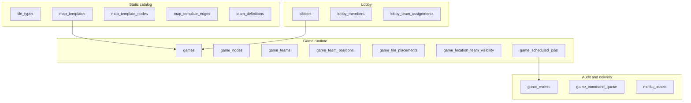
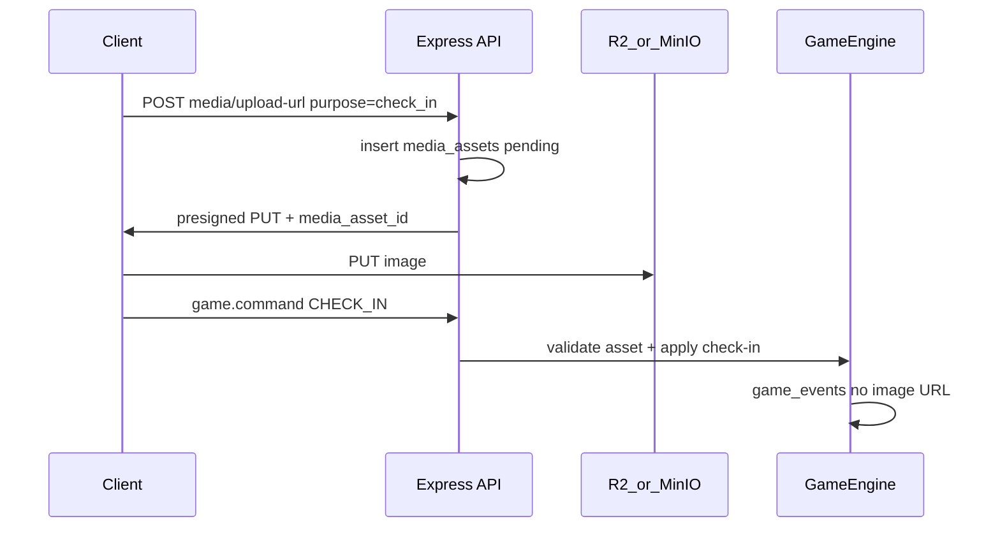
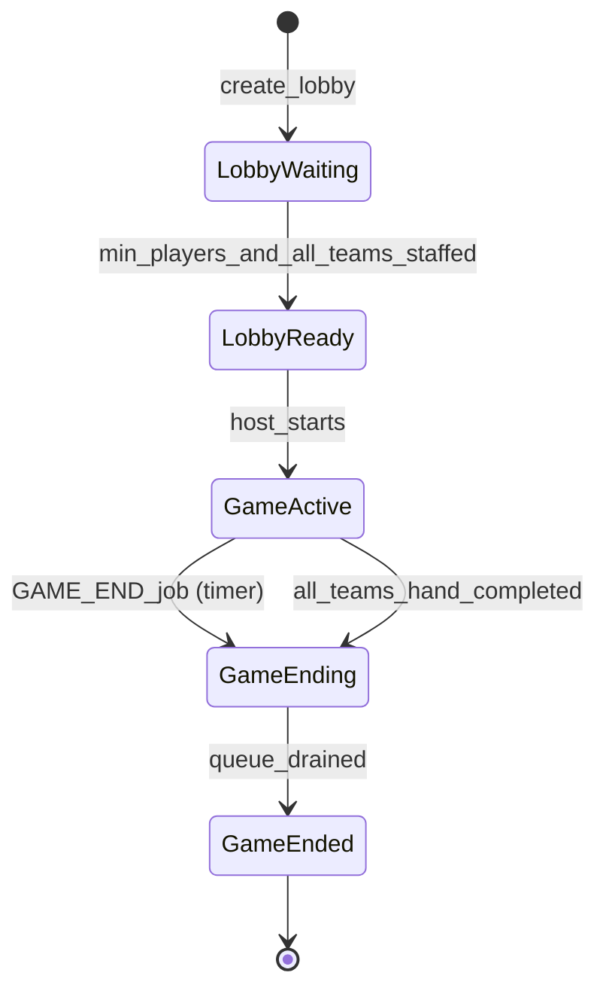
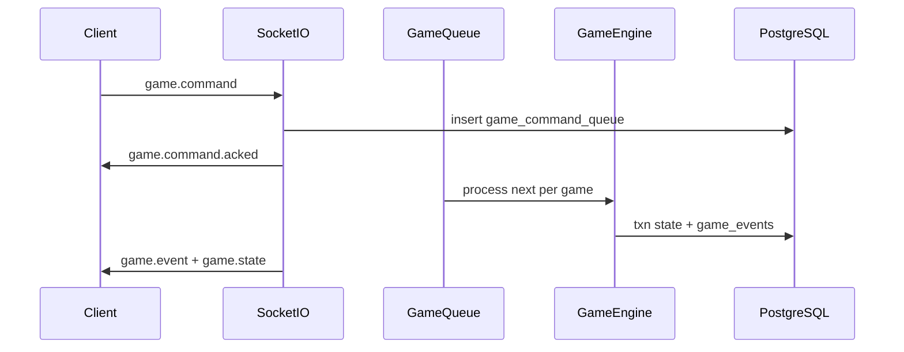

# Mingmei's Mahjong Mania — Technical Design Document

**Status:** Living document (v1 infrastructure)  
**Last updated:** 2026-06-06

---

## 1. Purpose and scope

This document defines **infrastructure and architecture** for *mingmei-mahjong-mania* before deep game UX work. The backend is the **source of truth** for game state, ordering, and visibility; clients primarily render projections and send commands.

### In scope (v1 infra)

- Registered-user auth (JWT)
- Lobby → game lifecycle
- Normalized relational game state (minimal JSONB on state tables)
- Event log + per-game command queue
- Socket.IO realtime + team-scoped state projections
- Map template cloning (**configurable node count** per template)
- Station check-in with **required photo**, geolocation (warn + allow)
- **Cloudflare R2** media storage (MinIO locally)
- DB-backed scheduler (visibility phases, notifications, game end)
- **Per-game visibility mode** (`games.visibility_mode`: `none | phase | slot | both`) that gates the two visibility layers (node-group phase reveal §3.2 and per-slot tier §3.3) independently; default `both` preserves current behaviour
- **Per-lobby static notification schedule** (`lobby_notifications`)
- Challenge system **schema + honor-system swap gate** (one challenge per station gates `SWAP_TILE`; product still defines the actual card decks; reviewer-driven resolvers when product asks for them — see [§3.8](#38-challenges-honor-system-swap-gate))
- **Riichi hand evaluation** module (stub → full scoring; see [§3.9](#39-mahjong-hand-evaluation-riichi))
- **End-game completion mechanic** — a new `CLAIM_WIN` engine command lets a tenpai team take a station tile as their winning 14th tile; the team is then **hand-completed** and locked from further tile-modifying commands. When every team has hand-completed (or the scheduled `GAME_END` fires), the game ends with a per-team scoring snapshot computed via `analyzeHand`. See [§3.10](#310-game-end-and-hand-completion)
- **Discord integration (per-lobby opt-in)** — a separate `discord-bot` Node process running alongside the main server provisions a per-game category (private team channels + public general + public notifications), bot-posts on every team-visible engine event, and drives the same scheduled notifications the in-app banner shows. Engine writes to a durable `discord_event_outbox` table + `pg_notify`; the bot consumes via `LISTEN` and `discord.js`. See [§3.11](#311-discord-integration-per-lobby-opt-in)
- **Server-authoritative views + telemetry hardening (Phase L)** — three intertwined moves: every user-driven command optionally carries a `geo` block that the engine stamps onto the event row with a per-command `geolocationWarning` (warn + allow, never rejects); the `game.state` projection pre-resolves slot visibility / lock state so the client renders directly from `mapNodes[].tiles[]` instead of re-deriving phase math; a new `GET /api/games/:id/nodes/:nodeId/view` endpoint serves the per-team station view (visible tiles + available actions with disable reasons) so the StationPanel data flows through one server-resolved surface. See [§3.12](#312-telemetry-geo-on-every-user-driven-command), [§3.13](#313-server-authoritative-tile-visibility), [§3.14](#314-node-view-endpoint)

### Abstraction layer vs rule layer

The infrastructure below the dotted line is intentionally agnostic to the specific game rules product ends up shipping. The engine knows about:

- **N nodes** on a map (per map template)
- **M slot capacity** at each node (`slots_per_node`, configurable per lobby — the dealer fills this many tiles at game start; runtime counts may shift)
- **K tiles** in each hand (`hand_size`, configurable per lobby)
- A primitive for **swapping placements** between any two locations (node ↔ node, hand ↔ node)
- An **append-only event log** that records every state-changing action
- A **scheduler** that can fire static notification templates at configurable game-relative times
- **Visibility groups + phases** as a configurable mechanic (N phases, N groups) layered on top of the placement model

Specific rules (the exact tile catalog, exact visibility schedule, exact challenge mechanics, exact scoring) live above this layer and can shift without schema migrations.

### Out of scope (v1)

- Polished UI
- Exhaustive riichi edge-case coverage on day one (incremental implementation inside the scoring module)
- Anti-cheat beyond basic validation
- Multi-server Redis (design allows it later; ship single-node first)
- Mobile push (FCM/APNs) — Socket-only notifications for v1
- Specific challenge card rules until product defines decks
- Catalog of notification templates (the lobby stores opaque template keys; the actual text lookup table is a rule-layer concern)
- User-initiated media deletion (GDPR) — post-v1
- **Phase G (R2/MinIO + check-in photo + media retention + game summary photo URLs)** — **deferred post-MVP** (decision: 2026-06-01). CHECK_IN in v1 is photo-less; the `media_assets` table stays migrated but is unused on the write path. Re-enabled when product is ready; see [§9](#9-implementation-phases) and [§10](#10-open-items-non-blocking).

Hand **styling** is a client concern; hand **order** is always server-provided.

### Repository conventions

- **Stack:** Express + Sequelize + PostgreSQL (`docker-compose.yml`), React + Vite client (demo).
- **Migrations / seeders:** `server/migrations/*.cjs`, `server/seeders/*.cjs`. Use **`.cjs`** (not `.js`) because `server/package.json` has `"type": "module"` — same rule as `config/config.cjs`.
- **Models:** `server/src/models/`, registered in `server/src/config/database.ts`.
- **CLI:** From `server/`, `npm run db:migrate`, `npm run db:seed`, `npm run db:migrate:status`.

**Phase A (schema):** All tables in [§4](#4-data-model) are migrated. Catalog seeds: `team_definitions`, `tile_types` (136 for the standard riichi catalog, but the engine reads the count dynamically), `challenge_types`, `map_template` **TTC 2026** (84 stations; WGS84 `latitude`/`longitude` and schematic layout in `seeders/data/ttc2026-network.cjs`). The 84/136/13/4 combination is the **default configuration**, not a hard constraint.

---

## 2. Confirmed design decisions

| Area | Decision |
|------|----------|
| Map | Static **templates** cloned into per-game rows at start |
| Auth | Registered users only (`users` + JWT) |
| Tile catalog | Per-game tile set drawn from `tile_types` (standard riichi seed = 136 rows; engine reads count dynamically). Closed set per game: no mid-game create/destroy. |
| Map size | **Configurable per template** (`map_templates.node_count`); standard TTC 2026 = 84 |
| Slots per node | **Configurable per lobby** (`slots_per_node`, default 1); snapshotted onto `games.slots_per_node` at start. Capacity, not realized count — actual tiles per node may diverge from this value as commands move tiles around. |
| Hand size | **Configurable per lobby** (`hand_size`, default 13); snapshotted onto `games.hand_size` at start |
| Dead wall | **Configurable per lobby** (`dead_wall_size`, default 0); snapshotted onto `games.dead_wall_size` at start. Tiles parked off-map / off-hand as `dead_wall_index = 0..n-1` placements. Index 0 is the dora indicator (see §3.9); higher indices are reserved for future kan / replacement use. |
| Deal-time invariant | `slots_per_node × node_count + hand_size × team_count + dead_wall_size` must equal the game's tile catalog size (Fisher–Yates draws the entire deck and fills every slot + hand + dead-wall position at start) |
| Deal | **Fisher–Yates** shuffle; random always |
| Hand order | **Server-sorted** (`suit_sort_order` → `rank`); client renders as given |
| Visibility phases | **Configurable count** `visibility_phase_count` (default 4); N phases ⇒ N visibility groups; phase 0 reveals home group, phase N-1 reveals all. Ephemeral view while checked in remains independent. |
| Game config | **Lobby**, editable by **host only**; snapshotted to `games` at start |
| Lobby start | `min_players_to_start` (default **4**); every member picks a team (1–4); **>= 1 player per team** before start; multiple players may share the same team |
| Travel | **Any station** on check-in (honor + geofence); skipping stations OK |
| Commands | `CHECK_IN`, `CHECK_OUT`, `SWAP_TILE`, `SWAP_LOCATION_TILES` (separate) |
| Team commands | **Any member** on that team (`game_participants`) |
| Team positions (UI) | **Not on map**; intel via **event log** only |
| Check-in photo | **Deferred (Phase G, post-MVP)** — v1 MVP CHECK_IN is photo-less. Planned post-MVP: **required**; stored in R2; **hidden during game**; **game summary** after end. Schema (`media_assets`) ready; UX + upload pipeline post-MVP. |
| Media retention | **Deferred (Phase G, post-MVP)** — planned 365 days, then delete (lifecycle rule + sweeper). |
| Object storage | **Deferred (Phase G, post-MVP)** — planned **Cloudflare R2** (prod), **MinIO** (dev). |
| Geolocation | Browser API; **warn + allow** on `CHECK_IN` only (Phase F shipped). Two relative checks vs. `game_nodes.geofence_radius_meters` (default 100 m): distance via haversine, and accuracy. Either failure flips `geolocationWarning`; both passing sets `geofenceValidated`. Persisted on `game_team_positions` and lifted onto the CHECK_IN event. The handler never rejects on a warning. **Phase L extends this to every user-driven command** (warn + allow throughout; off-station commands record geo with no warning since there's no station to compare against). See [§3.12](#312-telemetry-geo-on-every-user-driven-command). |
| Notifications | Per-lobby `lobby_notifications` rows (`at_seconds`, opaque `template` key, optional `data` JSONB); copied into `game_scheduled_jobs` as `NOTIFICATION` rows at game start; broadcast over Socket |
| Game end | Drain **in-flight** command queue, then `ended` |
| Realtime | Commands → queue → engine → `game_events` → broadcast |
| State storage | Relational tables; JSONB only on events/commands/challenge params/notification data |
| Hand scoring | **Riichi** ruleset; pure `analyzeHand` module in `server/src/scoring/`. **Shipped (Phase I)**: module + `game.state` projection wiring (`handAnalysis`, `roundWind`, `seatWind`, `doraIndicator`). End-of-game summary integration lands in **Phase J** ([§3.10](#310-game-end-and-hand-completion)). Tile model treats every hand as fully concealed (no calls / kans). Wins are non-dealer tsumo. Round wind randomized per game (persisted on `games.round_wind`); seat wind per team. Red-fives add `+1 han` per copy in the winning hand. Dora indicator from the dead wall (`game_tile_placements.dead_wall_index = 0`) adds `+1 han per matching tile`; like red fives, dora is not itself a yaku. 28 yaku detectors (1–6 han) + 8 yakuman with **additive stacking** for co-firing yakuman. See §3.9. |
| Discord integration | **Phase K (post-MVP)**, per-lobby opt-in. A separate `discord-bot` Node process running alongside the main server uses Postgres `LISTEN/NOTIFY` + a durable `discord_event_outbox` table to drive side effects: per-game channel category, private team channels, public general + notifications channels, and bot-posted messages on `CHECK_IN`, `START_CHALLENGE`, `CHALLENGE_COMPLETED/FORFEITED`, `CLAIM_WIN_SUCCEEDED`, `GAME_ENDED`, and scheduled notifications. Failure-isolated from the engine — the bot can crash without blocking gameplay. See [§3.11](#311-discord-integration-per-lobby-opt-in). |
| Server-authoritative views | **Phase L (spec'd)**. Three bug-bash items grouped under one banner: (a) every user-driven command optionally carries `geo` (warn + allow, persisted to `game_team_positions.last_known_*` + lifted onto the event); (b) `GameStateProjection.mapNodes[].tiles[]` flips to `{ slotIndex, tile?, visible, locked }` so the client renders straight from the projection — `visibilityPhase` / `phaseDrivenSlotMap` survive only as telemetry; (c) new `GET /api/games/:id/nodes/:nodeId/view` returns the per-team station view (visible tiles + `availableActions[]` with stable disable-reason codes). See [§3.12](#312-telemetry-geo-on-every-user-driven-command), [§3.13](#313-server-authoritative-tile-visibility), [§3.14](#314-node-view-endpoint). |
| Lobby auto-join | **Phase L (spec'd)** — client auto-joins on `forbidden` / `not_a_member` instead of requiring the user to press a "Try again" button. Terminal errors (`lobby_full`, `lobby_closed`, `lobby_already_started`) still surface inline. Server contract is unchanged; only the client retry policy moves. See client TDD §4 LobbyRoomScreen. |

---

## 3. Domain model



### 3.1 Core invariants

- **Closed tile set:** the game's tile catalog (number of `tile_types` rows, e.g. 136 for the riichi seed) is partitioned across `game_tile_placements` at deal time. No mid-game create/destroy. The deal-time invariant is `slots_per_node × node_count + hand_size × team_count + dead_wall_size = catalog_size`.
- **`slots_per_node` capacity per map node:** Capacity is set by `games.slots_per_node` (default 1; configurable per lobby). The dealer fills exactly `slots_per_node` `game_tile_placements` rows per `game_node` at deal time. Runtime tile counts at a node may differ as the engine moves tiles, but never exceed the slot capacity (handlers enforce this).
- **One placement per tile, tri-state target:** Each `game_tile` has exactly one `game_tile_placements` row. The `game_tile_placements_target_exactly_one` CHECK requires exactly one of `game_node_id`, `game_team_id`, `dead_wall_index` to be non-null — node placement, team-hand placement, or dead-wall placement respectively. Dead-wall placements never move under normal game flow (no engine command targets them); chunk 1 of the dead-wall rollout added the `dead_wall_index` column and replaced the legacy `node_xor_team` CHECK with the tri-state CHECK.
- **Configurable hand size:** Each team hand has exactly `games.hand_size` tiles (default 13).
- **Checked-in gate:** Station actions require `current_game_node_id` set.
- **Swap at station:** `SWAP_TILE` only at `current_game_node_id`; exchanges a specific hand tile ↔ a specific station tile (caller chooses both); counts unchanged.
- **Visibility:** Clients never infer fog-of-war; server projection only.
- **No rival position on map:** Other teams’ locations are not in live projection; use `game_events`.

### 3.2 Progressive visibility (global game state)

Visibility is parameterized by `games.visibility_phase_count` (`N`, default 4). N phases ⇒ N visibility groups ⇒ (N-1) `VISIBILITY_PHASE_ADVANCE` jobs scheduled at `started_at + interval × k` for `k = 1 … N-1`.

**Mode gate:** This entire layer is gated by `games.visibility_mode` (see §1, §4.3). The phase reveal runs only when the snapshotted mode is `phase` or `both`. When the mode excludes phase (`none` / `slot`), `game-start-service` skips `bootstrapGameVisibilityGroups` (no `game_node_visibility_groups`, `game_team_home_groups`, or phase-0 `game_location_team_visibility` rows are seeded); `game-schedule-service` emits no `VISIBILITY_PHASE_ADVANCE` jobs; the projection treats every node as face-up and reports `nextVisibilityChangeAt = null`. The lobby surface locks `visibility_phase_count` / `visibility_phase_interval_seconds` in phase-off modes and resets them to template defaults on transition.

**At game start:**

1. Random partition of all `game_nodes` into N groups (`game_node_visibility_groups`). Sizes differ by at most 1 when `node_count` doesn't divide evenly.
2. Random home group per team (`game_team_home_groups`). Group assignment is **independent of team count**: when `team_count <= N` each team can get a unique home; when `team_count > N` teams may share a home group; when `team_count < N` some groups have no home team.
3. `visibility_phase = 0` — each team sees face-up tiles only in its home group on map.
4. Schedule (N-1) `VISIBILITY_PHASE_ADVANCE` jobs plus `GAME_END` at `ends_at`. When `N = 1`, no advance jobs are scheduled and everything is visible from start.

**Unlock order per team:**

```text
visible_groups(team, phase) = first (phase + 1) entries of
  [home, (home+1) % N, (home+2) % N, …, (home+N-1) % N]
```

| Phase | Map visibility per team (for `N = 4`) |
|-------|---------------------------------------|
| 0 | Home group only |
| 1 | 2 groups |
| 2 | 3 groups |
| 3 | Full map |

All teams advance phase on the **same schedule**; which groups are visible differs by home group.

**On phase advance (scheduler):** bump phase, upsert `game_location_team_visibility` (`source = phase`), emit `VISIBILITY_PHASE_ADVANCED`, broadcast state.

### 3.3 Visit-based visibility (ephemeral)

While checked in at node `N`:

- `faceUpForTeam(team, N) = true` even if phase would hide `N`.
- `SWAP_TILE` and other station actions allowed.

After `CHECK_OUT` (or `CHECK_IN` elsewhere after implicit check-out):

- No persistent reveal in `game_location_team_visibility`.
- `faceUpOnMap` falls back to phase rules only.

```text
faceUpOnMap(team, node) =
  game_location_team_visibility[team, node].is_face_up

faceUpForTeam(team, node) =
  faceUpOnMap(team, node)
  OR game_team_positions[team].current_game_node_id == node

canSwap(team, node) =
  game_team_positions[team].current_game_node_id == node

canSwapSlot(team, node, slotIndex) =
  canSwap(team, node)
  AND now() >= games[game].started_at
      + games[game].slot_unlock_offsets_seconds[slotIndex] * 1000
```

**Mode gate:** The per-slot tier (unlock + map-visibility) is gated by `games.visibility_mode`. It runs only when the snapshotted mode is `slot` or `both`. When the mode excludes slot (`none` / `phase`), `game-schedule-service` emits no `SLOT_UNLOCKED` jobs and the projection treats every slot as unlocked **and** map-visible (the `slot_unlock_offsets_seconds[k]` / `slot_map_visible[k]` snapshot columns are ignored). The lobby surface rejects patches that set non-zero `slot_unlock_offsets_seconds[k>0]` or `false` in `slot_map_visible[k>0]` while slot is off, and zeros out the snapshots on mode transition.

**Per-slot unlock (chunk 4):** Each addressable slot at a node has a uniform game-wide unlock offset (`games.slot_unlock_offsets_seconds[slotIndex]`). Slot 0 always has offset 0 (always unlocked at game start). Higher slots may carry positive offsets; `SWAP_TILE` rejects with `409 slot_locked` if the targeted slot is still locked at the wall-clock check. The rule is wall-clock-based and independent of whether the `SLOT_UNLOCKED` scheduled job has actually fired (the job exists for replay/broadcast, not gameplay).

**Per-slot map visibility (chunk 5):** `games.slot_map_visible[slotIndex]` is a pure pass/no-pass gate orthogonal to the phase rules. When `false`, slot `k`'s tile is **never** exposed in `mapNodes[].tiles[]` regardless of `faceUpOnMap`. Slot 0 is always `true`. Once unlocked, the tile is still visible to a checked-in team via `atStation.tiles[]`. See §6.3.

**Single source of truth (chunk 6):** Both rules above are exported as pure helpers in `server/src/services/slot-visibility.ts` (`isSlotUnlocked`, `assertSlotUnlocked`, `unlockedSlotIndices`, `isSlotMapVisible`, `mapVisibleSlotIndices`). The engine's `SWAP_TILE` handler and the (future) projection layer both consume this module — the per-slot rules live in exactly one place.

**Projection rule:** The server computes `faceUpOnMap` / `faceUpForTeam` internally but **does not expose phase numbers or boolean flags to the client**. It emits **tile data only where that team may see it** (see [§6.3](#63-gamestate-projection-shape)).

### 3.4 Station commands and travel

| Command | Payload | Description |
|---------|---------|-------------|
| `CHECK_IN` | `{ nodeId, geo? }` | Photo upload **deferred (Phase G, post-MVP)**; v1 MVP accepts CHECK_IN without a `media_asset_id`. The optional `geo: { latitude, longitude, accuracy, capturedAt? }` triggers Phase F warn/allow (see "Travel" below). Sets `current_game_node_id` to any station; implicit check-out first if already checked in elsewhere. **Phase H:** if the team had an in-progress challenge at the previous station, the handler emits a `CHALLENGE_FORFEITED` event with `reason: "checkout"` before the implicit `CHECK_OUT`; the position's `pending_swap_credit` + `credit_earned_in_session` flags reset unconditionally so the team starts a fresh session at the new station. See [§3.8](#38-challenges-honor-system-swap-gate). |
| `CHECK_OUT` | `{}` | Clears `current_game_node_id`. **Phase H:** same auto-forfeit + credit-reset semantics as `CHECK_IN`'s implicit branch. |
| `SWAP_TILE` | `{ handTileId, stationTileId }` | Exchanges a specific hand tile with a specific tile at the team's current station. Both tile ids are caller-chosen since a station may hold up to `games.slots_per_node` tiles. Rejects with `409 slot_locked` if the targeted tile occupies a slot whose unlock offset has not yet elapsed (see §3.3 `canSwapSlot`). **Phase H:** rejects with `409 swap_credit_required` when the station has any configured challenges and the team's `pending_swap_credit` is false; consumes the credit on success (clears `pending_swap_credit` but leaves the sticky `credit_earned_in_session` flag intact). Stations with zero challenges configured stay free-swap for back-compat. |
| `START_CHALLENGE` | `{ nodeId }` | **Phase H.** Move the team's relationship with the station's top challenge from "available" to "in_progress" (creates a `game_challenge_instances` row). `nodeId` must match the team's current station. Rejects with `409 not_checked_in`, `409 wrong_node`, `409 credit_already_used` (team already cashed a credit this session), `409 challenge_in_progress` (team has any open instance anywhere), `409 no_challenge_at_station`, or `409 challenge_on_cooldown`. See [§3.8](#38-challenges-honor-system-swap-gate). |
| `CHALLENGE_COMPLETED` | `{ instanceId }` | **Phase H.** Honor-system completion. Transitions the instance to `completed`, stamps `cooldown_until = now + 5 min`, and flips both `pending_swap_credit` and `credit_earned_in_session` to true on the team's position. Rejects with `404 not_found`, `403 forbidden` (owned by another team), `409 challenge_not_in_progress`, or position guards (`409 not_checked_in` / `409 wrong_node`). |
| `CHALLENGE_FORFEITED` | `{ instanceId }` | **Phase H.** Player-driven forfeit. Same lifecycle as `CHALLENGE_COMPLETED` (transitions to `failed`, same cooldown) but DOES NOT grant a swap credit. Emits `reason: "explicit"` to distinguish from auto-forfeits (which emit `reason: "checkout"`). |
| `SWAP_LOCATION_TILES` | `{ tileAId, tileBId }` | Swap two tiles between map nodes (resolver-driven challenges). Uses shared `TileSwapService`. **Stub in v1** — the honor-system flow above is the MVP gate; the resolver workflow that drives `SWAP_LOCATION_TILES` is deferred until product defines decks that need it. |
| *(future)* | | Additional station actions while checked in. |

**Travel:** No adjacency requirement. Geolocation optional on `CHECK_IN` (Phase F) — `SWAP_TILE` inherits the team's most-recent check-in coordinates. The handler **always accepts** the check-in (allow); the `geofenceValidated` / `geolocationWarning` flags are advisory and persisted on `game_team_positions` + lifted onto the CHECK_IN event payload. Two independent warning triggers, both relative to the station's own `geofence_radius_meters` (default 100 m):

- **Distance check** — warn when `haversineDistanceMeters > geofence_radius_meters`.
- **Accuracy check** — warn when the browser-reported `accuracy_meters > geofence_radius_meters`. Relative threshold (one source of truth per station) rather than an absolute constant.

`geofenceValidated` is true iff **both** checks pass; `geolocationWarning` is true iff **either** check fails. Clients pass the raw browser values through unchanged; coordinates are stored as-reported, not server-corrected. When the `geo` field is omitted (geolocation denied, unavailable, or timed out client-side) all four position-row columns stay `NULL` and the CHECK_IN event payload omits the geo fields entirely.

**Check-in elsewhere:** Server runs check-out first, then check-in.

**Geo on every command (Phase L):** every command in the table above optionally accepts the same `geo: { latitude, longitude, accuracy, capturedAt? }` block as `CHECK_IN`. The engine still **always accepts** the command (warn + allow throughout); each handler stamps the team's last-known position columns and lifts the geo block onto the event payload. The `geolocationWarning` flag is derived per command: while the team is checked in, the same haversine + accuracy comparison runs against the current station's `geofence_radius_meters`; off-station commands (e.g. a `CHECK_IN` while not yet checked in anywhere, or any future off-station action) record `geo` with no warning since there's no station to compare against. The CHECK_IN-specific `geofenceValidated` flag stays a CHECK_IN concept — Phase L does **not** add it to other commands. See [§3.12](#312-telemetry-geo-on-every-user-driven-command) for the full flow + persistence shape.

### 3.5 Check-in photo flow



- Live `game_events` / projections: `has_photo: true` only — **no URLs** during play.
- Uploader may show **local preview** only.
- After `status = ended`: `GET /api/games/:id/summary` returns presigned GET URLs for participants.

### 3.6 Tile identity and red fives

Each physical tile is one `tile_types` row: `(suit, rank, copy_index)` with `copy_index` 0–3. There is **no** `is_red_five` column.

**Red-five convention (catalog):** for `man`, `pin`, and `sou` at **rank 5**, **`copy_index === 0`** is the red five (three tiles in the 136 set). Other copies of the 5 are normal fives. Seeded `display_name` values are `Red 5 Man`, `Red 5 Pin`, `Red 5 Sou` for those rows.

**Game rule:** `game_rule_flags` with `rule_key = red_fives_enabled` (boolean `enabled`). When **off**, red-five tiles still exist and count as normal 5s for melds; when **on**, scoring/projections treat them as red fives. Default at game start: TBD with product (recommend **on** for riichi).

**Server helper:** `server/src/tiles/red-five.ts` — `isRedFiveTileIdentity(tile)`, `isRedFiveForGame(tile, redFivesEnabled)`. All engine, projection, and scoring code must use this; do not re-encode the convention ad hoc.

### 3.7 Hand sorting (server authority)

```text
sortKey(tile) = (tile_types.suit_sort_order, tile_types.rank, game_tiles.copy_index)
```

- Hand order is **not stored** in the DB. The engine/projection layer sorts by `sortKey` when building `handTiles[]`.
- Projections emit `handTiles[]` with `slotIndex` 0–12 assigned at read time; **client must not re-sort**.

### 3.8 Challenges (honor-system swap gate)

**Status:** MVP shipped Phase H — the honor-system flow below gates `SWAP_TILE`. Resolver-driven workflow (`ChallengeResolutionService` with `resolver_key` dispatch, reviewer-approved submissions, `purpose = challenge_submission` media) is **deferred until product defines decks that need it**; the schema for submissions is already migrated so the re-enable is purely additive.

#### Honor-system mental model

Every station carries a **queue of challenges** (`game_node_challenges`, ordered by `sort_order`). To claim a tile from a station via `SWAP_TILE` a team must first complete that station's **top challenge** (`sort_order = 0`) on the honor system. MVP stations carry exactly one challenge — the multi-challenge "discard the top card" mechanic is forward-compatible but deferred.

#### Per-team challenge state machine

Per-team progress on a single station challenge is tracked in `game_challenge_instances`. Three observable states (`status` + `cooldown_until` + the team's `game_team_positions.credit_earned_in_session` flag):

| State | Definition | Engine command |
|-------|------------|----------------|
| `available` | No row exists OR the latest row has `cooldown_until <= now()`. Team can engage. | `START_CHALLENGE` |
| `in_progress` | Latest row has `status = "in_progress"`. Team is actively working on it. | `CHALLENGE_COMPLETED` or `CHALLENGE_FORFEITED` |
| `cooldown` | Latest row has `status ∈ {completed, failed}` and `cooldown_until > now()`. | (none — wait) |

**Cooldown:** 5 minutes (`CHALLENGE_COOLDOWN_MS` in `engine/challenge-lifecycle.ts`). Applies identically to `completed` (honor-system "great, you got the credit, now go somewhere else for a few minutes") and `failed` (so a team can't spam-forfeit to skip an unwanted challenge).

#### Swap credit (per-session economy)

A successful `CHALLENGE_COMPLETED` mints a **single-use, single-session swap credit** stored on the team's `game_team_positions` row:

| Column | Meaning |
|--------|---------|
| `pending_swap_credit BOOLEAN` | True between `CHALLENGE_COMPLETED` and the next `SWAP_TILE`. Consumed on swap. |
| `credit_earned_in_session BOOLEAN` | Sticky — set true on `CHALLENGE_COMPLETED`, stays true through `SWAP_TILE`, used by `START_CHALLENGE` to enforce "at most one credit per check-in session". |

Both flags reset to false on every `CHECK_IN` and `CHECK_OUT` (explicit or implicit). The session begins on check-in and dies on check-out — credits never bank across sessions.

#### Auto-forfeit on station change

A team can only carry one in-progress challenge at a time, and they must resolve it (or abandon it) before moving on. Any `CHECK_IN` at a different station or explicit `CHECK_OUT` auto-forfeits any in-progress instance (`status → failed`, same 5-minute cooldown, `resolution_payload = { reason: "checkout" }`). The auto-forfeit emits a `CHALLENGE_FORFEITED` event with `reason: "checkout"` so the event log distinguishes it from a player-driven `reason: "explicit"` forfeit.

#### Verification (out of scope for v1)

Completion is on the honor system — the player taps "Done" and the server takes their word. No photo upload, no reviewer queue, no automatic verification. The resolver workflow that would replace this lives in the deferred [§9 Phase H follow-up](#9-implementation-phases); the schema (`game_challenge_submissions` + the additional `status` enum values `active / submitted / approved / rejected / cancelled` on `game_challenge_instances`) is already migrated so the un-defer is purely a code path.

#### Engine event flow (single station)

```
[available]
   │ START_CHALLENGE { nodeId }
   ▼
[in_progress] ──── CHECK_IN elsewhere / CHECK_OUT ────► [cooldown (failed, reason: checkout)]
   │                                                      │
   │ CHALLENGE_COMPLETED { instanceId }                    │
   │   → pending_swap_credit = true                        │
   │   → credit_earned_in_session = true                   │
   ▼                                                       │
[cooldown (completed)]                                     │
   │                                                       │
   │ SWAP_TILE consumes the credit ──► pending_swap_credit │
   │                                   = false             │
   ▼                                                       ▼
(wait 5 min)                                          (wait 5 min)
   │                                                       │
   ▼                                                       ▼
[available again — but credit_earned_in_session blocks new starts in this session]
   │
   │ CHECK_OUT / CHECK_IN resets credit_earned_in_session
   ▼
[available, fresh session]
```

#### Back-compat

Stations with **zero** rows in `game_node_challenges` skip the credit gate entirely — `SWAP_TILE` succeeds without `pending_swap_credit`. This keeps existing templates that predate the challenge wiring functional and lets a future template opt in to the gate by simply attaching a `map_template_node_challenges` queue.

#### Schema summary

See [§4.8](#48-challenges-schema-honor-system--reserved-resolver-flow). The honor-system flow uses `challenges` + `challenge_decks` + the new `map_template_node_challenges` / `game_node_challenges` join tables; per-team state lives on `game_challenge_instances` (new `game_node_challenge_id` FK, new `cooldown_until` column, extended `status` enum). The reserved resolver tables (`challenge_types`, `game_challenge_submissions`) stay migrated but unused on the v1 write path.

### 3.9 Mahjong hand evaluation (Riichi)

A self-contained **scoring module** at `server/src/scoring/` evaluates a mahjong hand and returns structured scoring metadata. The client **never** computes score — only displays server results. The module is **shipped as of Phase I** and is wired into the `game.state` projection (§6.3: `handAnalysis`, `roundWind`, `seatWind`, `doraIndicator`). End-of-game integration with `GET /api/games/:id/summary` lands with **Phase J** — see [§3.10](#310-game-end-and-hand-completion).

**Ruleset:** [Riichi / modern Japanese](https://riichi.wiki/), adapted to this game's constraints:

- **No calls / kans.** Players cannot pon / chi / kan, so every hand is treated as **fully concealed**; there is no open/closed distinction and no kan-derived yaku.
- **Always non-dealer tsumo.** All wins are self-draws on the 14th tile. No dealer-tsumo or ron variants.
- **Round wind randomized per game** (`east/south/west/north` chosen at game start); **seat wind per team** (the team's `game_team` slot). Yakuhai for the team's seat wind, the round wind, and any dragon triplet all apply independently; a single triplet that satisfies both round and seat wind counts twice (double yakuhai).
- **Red fives** (catalog `copyIndex === 0` of suited 5s) contribute **`+1 han` per copy in the winning hand** when the `red_fives_enabled` rule flag is on. They are not a yaku on their own and never satisfy the "needs a yaku" requirement.
- **Dora indicator** lives on the dead wall (`game_tile_placements.dead_wall_index = 0`); the projection layer surfaces it as `game.state.doraIndicator` and threads its suit + rank into `analyzeHand.doraIndicators`. The dora tile type is the **next** tile after the indicator: suited `1→…→9→1`, winds `E→S→W→N→E`, dragons `Red→White→Green→Red` (matches `Haku→Hatsu→Chun`). Every matching tile in the winning hand contributes `+1 han per matching indicator`. Like red fives, dora is **not itself a yaku** and never satisfies the "needs a yaku" gate. Yakuman ignores both red-five and dora bonuses.
- **Yakuman stack additively.** Co-firing yakuman (e.g. Big Three Dragons + All Honours) multiply the base 8000: 2× yakuman → 16000 base → 64000 total (non-dealer tsumo). Counted yakuman (a normal hand reaching `≥ 13 han`) caps at a single 32000 yakuman.

The module never reads or writes game state directly; it is a pure function.

#### Public API

```ts
// server/src/scoring/index.ts

interface DoraIndicator { suit: Suit; rank: number; }

interface AnalyzeHandInput {
  tiles: ReadonlyArray<Tile>;          // 13 tiles (tenpai / iishanten analysis)
                                       //   or 14 tiles (already-winning hand;
                                       //   last tile treated as the wait)
  seatWind: WindRank;                  // 1=East, 2=South, 3=West, 4=North
  roundWind: WindRank;
  redFivesEnabled?: boolean;           // default false
  doraIndicators?: ReadonlyArray<DoraIndicator>;
                                       // default []; one per revealed
                                       //   indicator (v1 always 0 or 1)
}

interface AnalyzedWait {
  tile: Tile;                          // completing tile (red-five copy
                                       //   preferred when available)
  han: number;                         // total han incl. red-five + dora
                                       //   bonuses; for yakuman = 13 ×
                                       //   yakumanCount (yakuman ignores
                                       //   both bonuses)
  fu: number;                          // already rounded; 0 for yakuman
  points: number;                      // non-dealer tsumo total
  yaku: Array<{ name: string; han: number }>;
                                       // normal path may append `Red Five`
                                       //   and / or `Dora` entries whose
                                       //   `han` is the matching count
  isYakuman: boolean;
}

interface AnalyzeHandResult {
  shanten: number;                     // -1 winning, 0 tenpai, 1+ away
  waits?: AnalyzedWait[];              // present when shanten <= 0;
                                       //   sorted by points desc
}

function analyzeHand(input: AnalyzeHandInput): AnalyzeHandResult;
```

`Tile` reuses the catalog `TileIdentity` shape (`{ suit, rank, copyIndex }`); copyIndex matters only for red-five detection (`copyIndex === 0` of any suited 5).

A 0-point wait in the result means *structurally* completing but with no valid yaku (riichi's "no yaku" rule). The client decides whether to display these as "yakuless" tiles or hide them.

#### Internal layout

```text
server/src/scoring/
  index.ts                 analyzeHand entry point + public types
  orchestrator.ts          scoreCompleteHand: walk decompositions × yaku
                           catalog, apply precedence, pick best decomp
  context.ts               ScoringContext (winds, red-fives, winning
                           tile, doraIndicators)
  dora.ts                  indicatorToDoraTileType + countDora helpers
  shanten.ts               computeShanten (standard / chiitoitsu / kokushi)
  waits.ts                 enumerateTenpaiWaits
  fu.ts, score.ts          fu + han→points
  tile-counts.ts           Uint8Array-backed 34-slot count rep
  tile-sets.ts             shared constants (orphan indices, ...)
  types.ts                 Tile / Suit / Wind / Meld / Decomposition
  decomposers/
    standard.ts            4-melds-and-a-pair via pair-pivot DFS
    chiitoitsu.ts          seven pairs
    kokushi.ts             thirteen orphans
  yaku/
    1-han.ts, 2-han.ts, 3-han.ts, 6-han.ts, yakuman.ts
    helpers.ts             shared predicates + wait-shape classifier
    types.ts               YakuDetector interface
```

Each yaku detector is a pure structural check `(decomposition, context) → han | null`. The orchestrator runs every detector against every decomposition, applies subset elimination (precedence rules below), then for each decomposition picks either the yakuman path (`≥ 1` yakuman fires) or the normal path (sum han + red-five bonus, compute fu, look up points). Final per-decomp scores are compared on `(points, yaku count, han, fu)` to pick the best interpretation of the same 14 tiles.

#### Yaku catalog

| Han | Yaku |
|-----|------|
| 1 | All Simples · Red Dragon · White Dragon · Green Dragon · Round Wind · Seat Wind · All Sequences (pinfu) · Pure Double Sequence |
| 2 | Three Colour Straight · Pure Straight · All Triplets · Three Colour Triplets · All Terminals and Honours · Outside Hand · Little Three Dragons · Seven Pairs |
| 3 | Half Flush · Pure Outside Hand · Twice Pure Double Sequence |
| 6 | Full Flush |
| Yakuman | Big Three Dragons · Thirteen Orphans · All Honours · All Terminals · All Green · Big Four Winds · Little Four Winds · Nine Gates |

**Precedence subset-elimination** (orchestrator drops the first when the second also fires on the same decomposition):

- `Pure Double Sequence → Twice Pure Double Sequence`
- `Half Flush → Full Flush`
- `Outside Hand → Pure Outside Hand`

**Decomposition tie-breaks** (different decomps of the same 14 tiles): same hand can decompose as both seven-pairs *and* a standard ryanpeikou shape; the orchestrator scores each independently and keeps the one with higher points (then yaku count, han, fu).

**Wait-shape fu** uses the standard riichi classifier: `ryanmen` (pinfu-eligible), `penchan`, `kanchan`, `shanpon`, `tanki`.

#### Out of scope (deferred)

- **Uradora and kan-dora indicators.** v1 ships a single dora indicator (dead-wall index 0). Multiple indicators are already supported in the API (`doraIndicators: ReadonlyArray<DoraIndicator>`) so kan-dora can layer on without a signature break, but no engine code reveals them today.
- **Riichi / ippatsu / haitei / houtei** and other special-state yaku that require turn-context the engine doesn't surface to scoring.
- **Open hands / called melds** — structurally impossible in this game.
- **Kan / rinshan / chankan** — structurally impossible.
- **`GET /api/games/:id/summary` wiring** — `game.state` integration is live (§6.3); the summary endpoint is implemented in **Phase J** (see [§3.10](#310-game-end-and-hand-completion) and [§7](#7-api-surface)).

### 3.10 Game end and hand completion

**Status:** spec'd as **Phase J**; ships after Phase I/H. Builds on the scoring module above and the challenge swap-credit gate from §3.8.

#### Mechanic

Every team holds **13 tiles** throughout the game. A winning mahjong hand is **14 tiles**. When a team is **tenpai** (`analyzeHand.shanten === 0`) and physically checked into a station, the station-panel UI exposes a **"Claim" affordance on every wait tile** in addition to the normal "Swap" button. Picking Claim:

1. Moves the picked station tile into the team's hand (hand goes 13 → 14).
2. Stamps the team as **hand-completed** (`game_teams.hand_completed_at = now()`).
3. Snapshots the scoring result (han / fu / points / yaku) onto `game_teams`.
4. Locks the team out of any further tile-modifying engine command.

When **every** team has hand-completed, the game ends immediately (the scheduled `GAME_END` job is rescheduled to `runAt = now()`). When the scheduled timer fires first, any still-incomplete teams stay incomplete and get a tenpai/shanten summary with `final_points = 0`.

#### `CLAIM_WIN` command

| Field | Type | Notes |
|-------|------|-------|
| `gameId` | UUID | path / payload — same as every other command |
| `gameTeamId` | UUID | the calling team |
| `stationTileId` | UUID | the `game_tiles.id` the team wants to claim from the station |

**Validation pipeline** (rejects with the first failure):

1. Game is active (`status = "active"`). Else `409 game_not_active`.
2. Team is not already hand-completed (`hand_completed_at IS NULL`). Else `409 hand_completed`.
3. Team is checked in at the same station that holds `stationTileId` (read from `game_team_positions`). Else `409 not_at_station`.
4. The station slot is unlocked at `now()` (`assertSlotUnlocked` from §3.3). Else `409 slot_locked`.
5. **Challenge credit gate** (same as `SWAP_TILE`): if the station has at least one row in `game_node_challenges`, the team must have `pending_swap_credit = TRUE`. Else `409 swap_credit_required`. (See [§3.8](#38-challenges-honor-system-swap-gate).)
6. Build the candidate 14-tile hand (`hand13` plus the station tile's `TileIdentity`). Run `analyzeHand({ tiles: hand14, seatWind, roundWind, redFivesEnabled, doraIndicators })`. The result must have `shanten === -1` (a fully formed winning hand). The shorthand: `analyzeHand` over the 13-tile hand returned a wait set, and the station tile is in it. The 14-tile path is the authoritative check. Else `409 not_a_winning_tile`.
7. Pick the best `waits[]` entry whose `tile.suit + rank + copyIndex` matches the claimed station tile (red-five preferred when both copies are present). The picked entry's `points / han / fu / yaku` are the snapshot.

**Side effects on success** (all in one transaction):

- `UPDATE game_tile_placements SET game_node_id = NULL, slot_index = NULL, game_team_id = <team> WHERE game_tile_id = <stationTileId>` — the tile moves into the team's hand. The vacated `(game_node_id, slot_index)` pair is now empty; the per-slot EXCLUDE constraint added in the Phase D rollout already permits this.
- `UPDATE game_teams SET hand_completed_at = now(), winning_tile_id = <stationTileId>, winning_node_id = <node>, final_han = <han>, final_fu = <fu>, final_points = <points>, final_yaku_keys = <yaku> WHERE id = <teamId>`.
- `UPDATE game_team_positions SET pending_swap_credit = FALSE WHERE game_team_id = <teamId>` — credit consumed (`credit_earned_in_session` stays as-is).
- Emit `CLAIM_WIN_SUCCEEDED` event (see §6.4).
- Count `game_teams WHERE game_id = ? AND hand_completed_at IS NULL`. If zero, upsert the scheduled `GAME_END` job to `runAt = now()`; the queue worker picks it up in the next tick.

#### Lock semantics

With `hand_completed_at IS NOT NULL`, the team's engine surface narrows. The full disposition table:

| Command | Behavior when team is hand-completed |
|---------|--------------------------------------|
| `CHECK_IN` | Still permitted — observers may want to keep traveling |
| `CHECK_OUT` | Still permitted — same reasoning |
| `SWAP_TILE` | `409 hand_completed` |
| `CLAIM_WIN` | `409 hand_completed` |
| `START_CHALLENGE` | `409 hand_completed` |
| `CHALLENGE_COMPLETED` | `409 hand_completed` |
| `CHALLENGE_FORFEITED` | `409 hand_completed` |

Auto-forfeit on `CHECK_IN` / `CHECK_OUT` (§3.8) still runs for completed teams — if they had an in-progress challenge instance when they claimed, it stays in-progress until the next check-in/-out auto-forfeits it. Belt-and-suspenders: `CLAIM_WIN`'s commit path may also auto-forfeit immediately. (Implementation detail — call this out in the handler PR.)

#### Summary snapshotting at `GAME_ENDED`

When the `GAME_END` scheduler job runs (whether on time or via the early-end path), it does two things beyond today's `status = "ended"` flip:

1. For **incomplete teams**, run `analyzeHand` over their 13-tile hand and stamp `final_han / final_fu / final_points = 0`; record the tenpai shape (`waits[]`) into `final_yaku_keys` as a JSON-encoded "tenpai shape" payload, or simply leave `final_yaku_keys = NULL` and let the summary endpoint compute waits on the fly. Decision deferred to implementation; the columns support either path.
2. Emit `GAME_ENDED` with payload `{ endedAt, endReason: "timer" | "all_teams_completed", winningGameTeamId?: UUID }`. `winningGameTeamId` is set only when exactly one team has the strictly highest `final_points`; ties leave it `NULL` and the summary endpoint exposes the full ordering.

#### Visibility-mode interaction

The `CLAIM_WIN` validation pipeline is identical under every `visibility_mode`. The wait-set check uses the team's own hand, which is always private (§6.3 team-scoped projection); the station tile is in scope only if the team is checked in, which already requires the team to know the station exists. So `mode = none | slot | phase | both` does not change anything in §3.10.

### 3.11 Discord integration (per-lobby opt-in)

**Status:** spec'd as **Phase K**; ships after Phase J. Optional per-lobby — games created from lobbies with `discord_enabled = FALSE` behave exactly as today (no bot, no extra tables touched).

#### Architecture

```mermaid
flowchart LR
  subgraph mainServer["mainServer (Express + Socket.IO + scheduler)"]
    Engine[engine handlers]
    Outbox[(discord_event_outbox)]
    Engine -->|INSERT row in same TX| Outbox
    Engine -->|pg_notify('discord_outbox', rowId)| Outbox
  end

  subgraph botProcess["discord-bot (sibling Node process)"]
    Listener[pg LISTEN 'discord_outbox']
    Drainer[outbox drainer]
    Listener --> Drainer
    Drainer -->|read FOR UPDATE SKIP LOCKED| Outbox
    Drainer -->|REST: createChannel / sendMessage| DiscordAPI[(discord.js → Discord API)]
    Drainer -->|UPDATE delivered_at| Outbox
  end

  ScheduledJob[game_scheduled_jobs] -->|GAME_END / NOTIFICATION handlers also INSERT| Outbox
```

- **Bot is failure-isolated.** Engine handlers commit the event log row + the `discord_event_outbox` row in the **same transaction**. The `pg_notify` is the fast path; the drainer also runs a periodic `SELECT … WHERE delivered_at IS NULL ORDER BY created_at LIMIT N FOR UPDATE SKIP LOCKED` poll (every 30 s) so an outage of either the LISTEN channel or the bot itself just delays the post — it never loses one.
- **Bot never writes to game state.** Its only write surface is `discord_event_outbox.delivered_at` (and `delivery_attempts` / `last_error`). Engine state is read-only from the bot's perspective. This keeps the engine the single source of truth and lets the bot crash freely.
- **Bot is single-instance.** v1 ships one process; `FOR UPDATE SKIP LOCKED` already makes multi-instance safe but it's not enabled.

#### Identity linking

Users link their Discord account at registration time or later from the Profile screen. The link is captured by a Discord **username** the user types in plain text. The bot resolves the username against the configured guild's member list **at lobby start time** (not at link time), so a user who later joins the guild from a different username doesn't need to re-link.

- `users.discord_username` (`STRING(64) NULL UNIQUE` — Discord usernames are globally unique per the 2023 rollout).
- `users.discord_user_id` (`STRING(32) NULL UNIQUE`) — the resolved Discord snowflake, populated by the bot the **first time** it successfully resolves the username for any lobby. Subsequent lookups go through `discord_user_id` directly, which is stable across username changes.
- `users.discord_link_status` (`STRING(16) NOT NULL DEFAULT 'unlinked'` CHECK in `unlinked | pending | linked | failed`). `pending` is set the moment the user POSTs a username; the bot flips it to `linked` (success) or `failed` (username not found in guild) on the next opt-in lobby start that involves this user. `failed` keeps the username string for the user to fix it.

The link is **not required** to play. A team whose members aren't all linked still gets a private channel — only the linked members are added. The bot uses the public general / notifications channels as the fallback discovery surface for any team-visible event involving an unlinked member.

#### Opt-in semantics

`lobbies.discord_enabled BOOLEAN NOT NULL DEFAULT FALSE`. Host toggles in the lobby room (host-only knob, plain checkbox). The toggle is sticky on the **lobby**; `games.discord_enabled` snapshots the lobby value at `GameStartService` time, so a host can't sneak it on mid-game.

When the host flips `discord_enabled` to true, the lobby room shows a "Discord channels will be created when the game starts" note. No bot calls happen until `GAME_STARTED`.

#### Channel topology

At `GAME_STARTED`, the engine writes a single row to `discord_event_outbox` with `event_type = 'GAME_STARTED'`. The bot consumes the row and provisions **7 Discord resources** for the game in this order (each created via `discord.js` REST and recorded in `game_discord_channels`):

| Resource | Type | Name | Permissions |
|----------|------|------|-------------|
| Category | `GUILD_CATEGORY` | `🀄 game-{shortGameId}` | inherits guild defaults |
| Team channel | `GUILD_TEXT` | `team-east-{shortGameId}` (4 of these, per team) | private — only `discord_user_id` of team members + bot |
| General | `GUILD_TEXT` | `general-{shortGameId}` | public to everyone in the guild |
| Notifications | `GUILD_TEXT` | `notifications-{shortGameId}` | public to everyone in the guild; **read-only** for non-bot members |

`shortGameId = games.id.slice(0, 8)`. The category is the parent of all six text channels (4 team + 1 general + 1 notifications).

On `GAME_ENDED`, the bot posts the per-team summary to general + notifications, then **archives** the entire category (moves it to the `archive` parent category — name configurable via env var `DISCORD_ARCHIVE_CATEGORY_ID`). Channels are **not deleted** — game history stays in Discord for as long as the guild retains it.

#### Event → Discord post mapping

| Engine event | Channel target | Post content |
|--------------|----------------|--------------|
| `GAME_STARTED` | notifications + every team channel | "Game has started — N stations, M minutes duration. Round wind: East." |
| `CHECK_IN_SUCCEEDED` | the calling team's channel | "✅ {user} checked in at **{station name}**. Take your check-in proof photo here." (photo is honor-system — no upload validation; the channel is the audit trail.) |
| `START_CHALLENGE` | the calling team's channel | "🧩 Challenge: **{title}**. {description} _Document your proof in this channel._" If the catalog row has a `discord_attachment_url` (e.g. a Sporcle link), it's appended. |
| `CHALLENGE_COMPLETED` | the calling team's channel | "✅ Challenge complete — credit ready." (other teams don't see this) |
| `CHALLENGE_FORFEITED` | the calling team's channel | "❌ Challenge forfeited ({reason: explicit / checkout})." |
| `SWAP_TILE_SUCCEEDED` | the calling team's channel | "🀄 Swapped a tile at {station name}." (deliberately vague — no tile identity to keep team channels match the in-app projection) |
| `CLAIM_WIN_SUCCEEDED` | the calling team's channel **and** notifications | Team channel: full breakdown (yaku list, han, fu, points, winning tile image). Notifications: "🎉 {teamCode} completed their hand at {station}!" (no scoring breakdown — preserves the §6.4 fan-out redaction so other teams only see the public roster fact). |
| `VISIBILITY_PHASE_REVEALED` | notifications | "🔓 Visibility phase {n} revealed." |
| `SLOT_UNLOCKED` | notifications | "🔓 Slot {n} unlocked at all stations." |
| `GAME_ENDED` | notifications + every team channel | Final scoreboard from `GET /api/games/:id/summary` (re-uses the same DTO). Followed immediately by the category archive. |
| Scheduled `NOTIFICATION` | notifications | The same opaque `template` key the in-app banner uses; the bot resolves it via a copy of the lobby's `lobby_notifications.data` JSONB. |

The mapping is **fixed** in v1 — there's no per-lobby override. Future versions can expose it as a host-editable matrix.

#### Failure isolation + rate limits

- Every outbox row is processed at-least-once. The bot is **idempotent** per row: after a successful Discord REST call, it updates `delivered_at = now()`. If the call fails, it increments `delivery_attempts`, stores `last_error`, and lets the next poll cycle pick it up.
- After 10 failed attempts the row is marked `dead_letter` (no further processing); an operator can investigate via the outbox table. Engine continues without the post.
- Discord's REST rate limits are absorbed by `discord.js`'s built-in queue. The drainer fetches up to 25 rows per poll cycle; in practice the steady-state is ~1 row/sec per active game.
- If the **guild** is unreachable (Discord outage), the outbox grows. Engine doesn't care. Once Discord recovers, the drainer catches up at the limited rate.
- If the **bot process** crashes / restarts, the LISTEN channel reconnects; the next poll picks up everything that came in during the downtime.

#### Cross-section forward references

§3.4 (CHECK_IN / CHECK_OUT), §3.5 (check-in photo flow), §3.6 (tile identity), §3.8 (challenges), §3.10 (CLAIM_WIN), and §6.3 (projection) each have side effects that flow through the outbox per the mapping table above. No engine-side change is needed in those sections — the engine just adds an `insertIntoDiscordOutbox(...)` call inside the same transaction whenever `games.discord_enabled = TRUE`. The helper lives in `server/src/discord/outbox.ts` and is the **only** Discord-aware code reachable from the engine; everything else lives in the sibling bot process.

### 3.12 Telemetry: geo on every user-driven command

**Status:** spec'd as **Phase L**; generalizes the Phase F `CHECK_IN` warn/allow flow to every user-driven engine command. Strictly additive on the wire (`geo` is optional everywhere) and strictly **warn + allow** — no command ever rejects on a geo failure.

#### Command payload extension

Every user-driven command accepts an optional `geo` block that is a superset of the Phase F shape:

```ts
type GeoPayload = {
  latitude: number;            // WGS84, browser-reported, stored as-is
  longitude: number;
  accuracy: number;            // meters, browser-reported
  capturedAt?: string;         // ISO 8601, client clock; advisory only
};
```

Affected commands: `CHECK_IN`, `CHECK_OUT`, `SWAP_TILE`, `SWAP_LOCATION_TILES`, `START_CHALLENGE`, `CHALLENGE_COMPLETED`, `CHALLENGE_FORFEITED`, `CLAIM_WIN`. The browser `getCurrentPosition` call is fire-and-forget on the client (see client TDD §4 `useCommandWithGeo`); if it denies, errors, or times out, the command ships **without** `geo` and the engine accepts it unchanged. Existing clients that never send `geo` continue to work exactly as today.

#### Engine flow

1. Validate `geo` if present (numeric coords inside `[-90, 90]` / `[-180, 180]`, non-negative accuracy). A malformed `geo` is dropped — the command still applies, but no telemetry is recorded. (Rejecting on a malformed advisory field would defeat the warn-and-allow guarantee.)
2. Apply the command's normal effect.
3. **Stamp `game_team_positions`** with the latest sample: `last_known_latitude`, `last_known_longitude`, `last_known_accuracy`, `last_known_seen_at = now()`. These columns are independent of the existing `last_check_in_*` columns — they track the team's *most recent* geo regardless of which command emitted it, while `last_check_in_*` remains the CHECK_IN-time snapshot. See [§4.5](#45-positions-and-visibility).
4. **Derive `geolocationWarning`** per command:
   - **Team is checked in at a station** (`current_game_node_id IS NOT NULL`): reuse the existing haversine + accuracy helper in `server/src/services/geolocation.ts` against the team's *current* station's `geofence_radius_meters`. Same two-trigger rule as §3.4 — either failure flips the flag.
   - **Team is checked out**: there is no station to compare against. `geolocationWarning = false`. The geo is still stamped on the position row and lifted onto the event payload — only the warning flag is suppressed.
   - **`geo` is absent**: no flag is emitted. Position-row columns stay untouched (they preserve whatever the last command set).
5. **Lift onto the event row.** Every user-driven `game_events.payload` gains `geo?` (the raw sample, never server-corrected) and `geolocationWarning?` (only when `geo` was provided and the team was checked in). The CHECK_IN-specific `geofenceValidated` flag stays a CHECK_IN concept and is **not** propagated to other commands. The `RecentEventDto` fan-out (§6.4) carries `geolocationWarning` only — raw coordinates are stripped before broadcast so other teams can't triangulate a rival.

#### Implementation surface

- One shared helper: `recordCommandGeolocation(tx, gameTeamId, geo?, currentNodeId)` returns `{ geolocationWarning: boolean | undefined }` and writes the position row. Every handler calls it before constructing the event payload; no handler re-implements the math.
- The existing Phase F path stays the dominant CHECK_IN behavior — `recordCommandGeolocation` returns the same warning flag the Phase F evaluator returned, plus it now also handles the position-row stamp that CHECK_IN was doing inline. CHECK_IN's `geofenceValidated` field is computed alongside (CHECK_IN-only) and lifted onto the event in addition to the shared `geolocationWarning`.
- No new socket events. Geo is a payload-level concern only.

#### What this does **not** change

- The engine never rejects on geo. Existing `409` reasons (`not_checked_in`, `wrong_node`, `slot_locked`, `swap_credit_required`, `hand_completed`, …) are unchanged.
- The `CHECK_IN` geofence semantics (§3.4) — distance check, accuracy check, both relative to `geofence_radius_meters` — are unchanged. Phase L just generalizes the *delivery* of geo from "CHECK_IN-only" to "every command", and stamps a per-command warning derived from the same helper.
- `last_check_in_*` columns stay the CHECK_IN-time snapshot. Phase L adds `last_known_*` as an independent telemetry surface (last command of any kind).

### 3.13 Server-authoritative tile visibility

**Status:** spec'd as **Phase L**. Collapses the client's slot-visibility math (currently split between the projection and the client's `applyPhaseSlotVisibility` helper) into the projection. After this phase the client renders `mapNodes[].tiles[]` directly — no visibility math runs in the client.

#### Wire shape change

Today `mapNodes[].tile` (singular) / `mapNodes[].tiles[]` (per-slot) include a tile **only** when both `faceUpOnMap(team, node)` AND `slot_map_visible[slotIndex]` are true. Hidden slots either omit the entry entirely (singular) or omit `slotIndex` rows (per-slot), forcing the client to know `slots_per_node` and re-derive what slots exist.

After Phase L the shape becomes:

```json
{
  "id": "uuid",
  "code": "STN_01",
  "name": "Union Station",
  "coordinateX": 12,
  "coordinateY": 4,
  "lineIds": ["red", "blue"],
  "labelAnchor": "ne",
  "labelRotate": null,
  "isInterchange": false,
  "latitude": 51.5074,
  "longitude": -0.1278,
  "tiles": [
    { "slotIndex": 0, "tile": { "instanceId": "...", "suit": "sou", "rank": 5, "displayName": "5 Sou", "isRedFive": false }, "visible": true,  "locked": false },
    { "slotIndex": 1, "tile": null,                                                                                       "visible": false, "locked": false },
    { "slotIndex": 2, "tile": null,                                                                                       "visible": false, "locked": true  }
  ]
}
```

- **`slotIndex`** — every slot the node has (`0 .. slots_per_node - 1`) appears in the array, in ascending order. Empty slots (no placement) appear with `tile: null, visible: false, locked: false`.
- **`tile`** — present iff `visible: true` AND a tile occupies the slot. Otherwise `null`.
- **`visible`** — server-resolved per-team boolean. True iff both `faceUpOnMap(team, node)` AND the slot's map-visibility tier (`slot_map_visible[slotIndex]`) are true, *and* the team has not been hand-completed (a hand-completed team's `atStation` collapses to `null` per §6.3; the map projection still shows tiles per the usual rules).
- **`locked`** — slot-lock layer mirror. True when `now < started_at + slot_unlock_offsets_seconds[slotIndex] * 1000`. Independent of `visible` — a slot can be visible-and-locked (StationPanel greys the "Swap" affordance), or locked-and-hidden (the map shows a placeholder shadow with a countdown).

#### Per-slot deprecation

The `tiles[]` per-slot wire shape from chunk 6 of the original visibility plan (§6.3) is **replaced** by the Phase L shape. The pre-Phase-L "singular `tile` for `slots_per_node = 1`" back-compat path is dropped — every game emits the new array even when `slots_per_node = 1`. (The array still has exactly one entry in that case.) Clients shipping before Phase L need a single update to read `tiles[].tile` instead of `tile`.

#### `visibilityPhase` becomes telemetry-only

`visibilityPhase`, `visibilityPhaseCount`, and `phaseDrivenSlotMap` stay on the projection so the `VisibilityCountdown` component and the event log can render "phase 2 of 4" copy, but **UI rendering paths must read `mapNodes[].tiles[].visible`, never these fields**. Removing the client's `applyPhaseSlotVisibility` (and the related `buildTileSlots` math in `client/src/components/SubwaySvg.tsx`) is part of the Phase L client work (§10).

The existing `resolveMapVisibleSlotIndices` + `phaseDrivenMapVisibleSlotIndices` helpers in `server/src/projections/game-state.ts` (lines ~515-521 and ~808) already do the visibility math today; this section formalizes that the **output** (visible-slot set, locked-slot set) is what the wire carries, not the **inputs** (mode, phase index, slot offsets).

#### Visibility-mode interaction

The mode gate from §3.2 / §3.3 is unchanged: when `games.visibility_mode` excludes the phase layer the projection treats every group as face-up; when it excludes the slot layer the projection treats every slot as visible-and-unlocked. Phase L just pre-computes the resulting `visible` / `locked` booleans on the server instead of relying on the client to do the same flatten. Mode-off layers produce `visible: true` / `locked: false` rows trivially.

### 3.14 Node-view endpoint

**Status:** spec'd as **Phase L**. A dedicated REST surface for the StationPanel — "what does node X look like from team T's perspective right now". Pre-Phase-L the client derives this from `atStation` + `mapNodes[]` + a pile of client-side rules; the endpoint moves all of it to the server.

```http
GET /api/games/:id/nodes/:nodeId/view
200 NodeViewDto
404 game_not_found
404 node_not_found
403 forbidden                     # requester is not a game participant
409 game_not_started
409 game_ended
```

Authz: the requester must be in `game_participants` for the game; the response is **always** scoped to the requesting user's team (matching the per-team projection scope). No host override — even a host playing on team east sees team east's view.

```ts
type NodeViewDto = {
  nodeId: string;
  code: string;
  name: string;
  lineIds: string[];
  isInterchange: boolean;
  tiles: Array<{
    slotIndex: number;
    tile: TileDto | null;             // null when !visible or empty slot
    visible: boolean;                 // §3.13 server-resolved
    locked: boolean;                  // §3.13 slot-unlock countdown
  }>;
  currentChallenge: CurrentChallengeDto | null;   // reuses §6.3 atStation.currentChallenge
  availableActions: Array<{
    action: "check_in" | "check_out" | "swap_tile"
          | "swap_location_tiles" | "start_challenge" | "claim_win";
    enabled: boolean;
    reason?: "not_checked_in"
           | "wrong_node"
           | "slot_locked"
           | "hand_completed"
           | "swap_credit_required"
           | "credit_already_used"
           | "challenge_in_progress"
           | "challenge_on_cooldown"
           | "no_challenge_at_station"
           | "no_winning_wait"
           | "not_tenpai"
           | "game_ended";
  }>;
};
```

- **`tiles[]`** — byte-identical to the per-node entry on `GameStateProjection.mapNodes[]` (§3.13) for the same node + team + clock. Shared via a service helper (see below).
- **`currentChallenge`** — same shape as `atStation.currentChallenge` (§6.3). `null` when the station has no challenges configured, or when the requesting team isn't checked in at this node (off-station challenge state is not exposed). Reuses the existing `CurrentChallengeDto`; no new type.
- **`availableActions[]`** — every command the StationPanel might surface; `enabled: false` rows still appear with a stable `reason` code so the client can render a tooltip ("Slot 2 unlocks in 4m 17s") without re-deriving the rule. `claim_win` only appears when the team is checked in at the node, has `handAnalysis.shanten === 0`, and a wait matches one of the visible station tiles; the reason for an absence is `no_winning_wait` (matching wait but tile not visible / wrong copy), `not_tenpai` (`shanten > 0`), or `hand_completed`.

#### `buildNodeView` service

To keep the endpoint and the projection from drifting:

```ts
// server/src/services/node-view.ts
async function buildNodeView(
  gameId: string,
  gameTeamId: string,
  nodeId: string,
  tx?: Transaction,
): Promise<NodeViewDto>;
```

- `buildGameStateProjection` calls `buildNodeView` for the team's current station (the existing `atStation` payload becomes a thin wrapper around it — just adds the `pendingSwapCredit` / `creditEarnedInSession` flags that are CHECK_IN-state, not node-state).
- The route handler calls `buildNodeView` directly and serializes the result. The two paths share the same query plan and the same visibility / lock derivation — there's no way for the projection and the endpoint to disagree on whether slot 2 is locked.

#### Polling vs push

Phase L ships the endpoint as **fetch-on-mount + invalidate on `game.event`** — the client refreshes when any event for the game arrives over the existing socket room (no new socket channel). A future phase can promote this to a per-node socket room if the polling load justifies it; the REST surface is the primary contract.

---

## 4. Data model

JSONB is avoided for authoritative **state**. Allowed on: `game_events.payload`, `game_command_queue.payload`, `challenges.parameters`, challenge submissions.

### 4.1 Identity and membership

#### `users`

| Column | Type | Constraints |
|--------|------|-------------|
| `id` | UUID | PK, default UUIDv4 |
| `email` | STRING | NOT NULL, UNIQUE |
| `password_hash` | STRING | NOT NULL |
| `username` | STRING | NOT NULL, UNIQUE |
| `discord_username` | STRING(64) | NULL, UNIQUE (Phase K) — Discord username; user-provided plain text. Globally unique per Discord's 2023 unique-handle rollout. |
| `discord_user_id` | STRING(32) | NULL, UNIQUE (Phase K) — Discord snowflake; populated by the bot the first time it successfully resolves `discord_username` against the configured guild. Survives the user changing their Discord username. |
| `discord_link_status` | STRING(16) | NOT NULL DEFAULT `'unlinked'` CHECK in (`unlinked`, `pending`, `linked`, `failed`) (Phase K) — `pending` between `POST /api/users/me/discord-link` and the next lobby-start resolution attempt. `failed` keeps the username for the user to fix; the row stays usable. |
| `created_at` | DATE | NOT NULL |
| `updated_at` | DATE | NOT NULL |

Indexes: `email`, `username`, `discord_username`, `discord_user_id`.

Sequelize model: `User` (`server/src/models/user.ts`).

#### `lobbies`

| Column | Notes |
|--------|--------|
| `id` | UUID PK |
| `host_user_id` | FK → `users` |
| `status` | `waiting` \| `starting` \| `closed` |
| `map_template_id` | FK |
| `game_duration_seconds` | |
| `visibility_phase_interval_seconds` | |
| `visibility_phase_count` | INT NOT NULL DEFAULT 4 (sourced from `map_template.default_visibility_phase_count`); snapshotted to `games.visibility_phase_count` at start. `>= 1`. |
| `slots_per_node` | INT NOT NULL DEFAULT 1 (sourced from `map_template.default_slots_per_node`); snapshotted to `games.slots_per_node` at start. `>= 1`. Capacity, not realized count. |
| `slot_unlock_offsets_seconds` | INTEGER[] NOT NULL DEFAULT `{0}`. One offset per slot index. `cardinality = slots_per_node`; entry `[1]` must be `0` (slot 0 always unlocked); all entries `>= 0`. Sourced from `map_template.default_slot_unlock_offsets_seconds` on lobby creation; host-editable while `waiting`; snapshotted to `games.slot_unlock_offsets_seconds` at start. Uniform across nodes and teams. |
| `slot_map_visible` | BOOLEAN[] NOT NULL DEFAULT `{true}`. One flag per slot index. `cardinality = slots_per_node`; entry `[1]` must be `true` (slot 0 follows phase rules). When `false`, slot `k`'s tile is never face-up on the map regardless of phase; only revealed via `atStation` once unlocked. Sourced from `map_template.default_slot_map_visible`; host-editable. |
| `visibility_mode` | VARCHAR(8) NOT NULL DEFAULT `'both'` CHECK in (`none`, `phase`, `slot`, `both`). Picks which of the two visibility layers (§3.2 phase reveal / §3.3 per-slot tier) are active for the resulting game. Sourced from `map_template.default_visibility_mode`; host-editable. Snapshotted to `games.visibility_mode` at start. Picking a mode that excludes a layer **locks** the corresponding knobs at the service layer: phase-off rejects any patch that sets `visibility_phase_count` / `visibility_phase_interval_seconds`; slot-off rejects non-zero `slot_unlock_offsets_seconds[k>0]` and `false` entries in `slot_map_visible[k>0]`. On mode transition the locked knobs are reset to safe defaults. |
| `team_assignment_mode` | `pick` \| `random` \| `mixed` |
| `min_players_to_start` | default **4** |
| `discord_enabled` | BOOLEAN NOT NULL DEFAULT FALSE (Phase K). When `TRUE`, `GameStartService` snapshots the value into `games.discord_enabled` and the engine writes side-effect rows into `discord_event_outbox` on every team-visible event. Host-editable while the lobby is `waiting`; locked after `GAME_STARTED`. Independent of `visibility_mode`. |
| `config_updated_at` | |

**Config:** only `host_user_id` may `PATCH /api/lobbies/:id/config`.

**Start rule:**

- Member count ≥ `min_players_to_start` (default **4**; must be ≥ 4 so all teams can be staffed).
- **Each team 1–4 has at least one member** after resolving assignments (many players may share the same team).
- Mode-specific rules below.

**`team_assignment_mode`:**

| Mode | Lobby behavior | At game start (`GameStartService`) |
|------|----------------|-------------------------------------|
| `pick` | Every member must choose `team_slot` 1–4 before start. | Use picks as-is. |
| `random` | Members may leave `team_slot` null until start. | Assign **all** members across teams 1–4 **as evenly as possible** (shuffle order, then repeatedly place each player on a currently smallest team; random tie-break). |
| `mixed` | Members may pick a team or stay in the random pool (`null`). | Keep picks; assign pool members on top of existing counts using the same **even distribution** algorithm. Readiness: enough pool players to fill any team with zero picks. |

Even distribution implementation: `server/src/services/even-team-assignment.ts` (`assignTeamsEvenly`, `resolveTeamsForGameStart`).

#### `lobby_members`

`lobby_id`, `user_id`, `joined_at` — unique `(lobby_id, user_id)`.

#### `lobby_team_assignments`

`lobby_id`, `user_id`, `team_slot` — which of the four game teams (1–4) the user chose. **Not unique per lobby:** many users may share the same `team_slot`. `null` = random pool (assigned evenly at start in `random` / `mixed` modes).

#### `lobby_notifications`

Per-lobby schedule of static notification templates that fire during the game. Host-managed via REST while the lobby is `waiting`. Copied into `game_scheduled_jobs` as `NOTIFICATION` rows at game start (`run_at = started_at + at_seconds × 1000`, `payload = { template, data }`).

| Column | Notes |
|--------|--------|
| `id` | UUID PK |
| `lobby_id` | FK → `lobbies` (ON DELETE CASCADE) |
| `at_seconds` | INT NOT NULL CHECK `>= 0`; offset in seconds from `games.started_at`. |
| `template` | VARCHAR(64) NOT NULL; opaque template key (no enum catalog in v1). |
| `data` | JSONB; optional template-specific payload (e.g. `{ minutesLeft: 10 }`). |
| `created_at`, `updated_at` | |

Index: `(lobby_id, at_seconds)`. Same `at_seconds` may repeat (two distinct templates may fire at the same time).

#### `games`

| Column | Notes |
|--------|--------|
| `status` | `active` \| `ending` \| `ended` |
| `hand_size` | snapshot from `map_template.default_hand_size` (default 13) |
| `slots_per_node` | INT NOT NULL DEFAULT 1; snapshot from `lobby.slots_per_node` at start. Capacity, not realized count. |
| `slot_unlock_offsets_seconds` | INTEGER[] NOT NULL DEFAULT `{0}`; snapshot from `lobby.slot_unlock_offsets_seconds` at start. Same length/invariant rules as on `lobbies`. Slot `k` is unlocked once `now >= started_at + slot_unlock_offsets_seconds[k] * 1000`; the engine rejects `SWAP_TILE` against a still-locked slot. |
| `slot_map_visible` | BOOLEAN[] NOT NULL DEFAULT `{true}`; snapshot from `lobby.slot_map_visible` at start. Same length/invariant rules as on `lobbies`. Drives projection-time filtering of `mapNodes[].tiles[]`. |
| `visibility_phase` | 0 … `visibility_phase_count - 1` |
| `visibility_phase_count` | INT NOT NULL DEFAULT 4; snapshot from `lobby.visibility_phase_count` at start |
| `visibility_mode` | VARCHAR(8) NOT NULL DEFAULT `'both'` CHECK in (`none`, `phase`, `slot`, `both`); snapshot from `lobby.visibility_mode` at start. Gates the two visibility layers via `visibilityIncludes()`: `game-start-service` skips `bootstrapGameVisibilityGroups` when phase is off; `game-schedule-service` skips `VISIBILITY_PHASE_ADVANCE` / `SLOT_UNLOCKED` job loops per layer; the projection short-circuits phase fog and slot-tier filters per layer. See §3.2, §3.3, §6.3. |
| `started_at`, `ends_at`, `duration_seconds` | |
| `visibility_phase_interval_seconds` | snapshot from lobby |
| `discord_enabled` | BOOLEAN NOT NULL DEFAULT FALSE (Phase K). Snapshot from `lobby.discord_enabled` at `GameStartService`. The engine reads this on every event-emitting handler to decide whether to write a `discord_event_outbox` row in the same transaction. |
| `config_version` | |

#### `game_participants`

`game_id`, `user_id`, `game_team_id`. Many rows may reference the same `game_team_id` when several lobby members chose the same team. All participants on a team share that team’s hand and may issue commands for it.

### 4.2 Teams (catalog vs runtime)

#### `team_definitions` (static, 4 rows)

`id`, `code` (e.g. `red`), `display_name`, `sort_order`.

Seeded: `east`, `south`, `west`, `north` (`20260517180000-seed-team-definitions.cjs`).

#### `game_teams`

`id`, `game_id`, `team_definition_id`, `display_name` (optional), plus the **Phase J** hand-completion snapshot columns:

| Column | Notes |
|--------|-------|
| `hand_completed_at` | `TIMESTAMPTZ NULL`. Set when the team successfully runs `CLAIM_WIN`; null otherwise (including for tenpai/noten teams when `GAME_ENDED` fires the timer path). |
| `winning_tile_id` | `UUID NULL` FK → `game_tiles.id`. The station tile claimed as the 14th tile. Null until `CLAIM_WIN`. |
| `winning_node_id` | `UUID NULL` FK → `game_nodes.id`. Cached for the summary endpoint so we don't have to walk placements. Null until `CLAIM_WIN`. |
| `final_han` | `INTEGER NULL CHECK (final_han IS NULL OR final_han >= 0)`. Total han incl. red-five + dora bonuses (or `13 × yakumanCount` on the yakuman path). Null until `GAME_ENDED` (incomplete teams snapshot 0). |
| `final_fu` | `INTEGER NULL CHECK (final_fu IS NULL OR final_fu >= 0)`. Rounded fu (0 for yakuman). |
| `final_points` | `INTEGER NULL CHECK (final_points IS NULL OR final_points >= 0)`. Non-dealer tsumo total. 0 for noten / incomplete teams. |
| `final_yaku_keys` | `JSONB NULL`. Compact `{ name: string; han: number }[]` snapshot from `analyzeHand.waits[i].yaku` for the winning team, or the tenpai wait shape for incomplete teams. Schema is loosely typed because v1 only renders it; future revisions may swap to a normalized table. |

`CHECK (hand_completed_at IS NULL) OR (winning_tile_id IS NOT NULL AND winning_node_id IS NOT NULL AND final_han IS NOT NULL AND final_fu IS NOT NULL AND final_points IS NOT NULL)` — once a team is marked complete, the snapshot columns are all present. (Use a single multi-column `CHECK` rather than four mutually-redundant constraints.)

`final_*` may be filled in for **incomplete** teams too — the `GAME_END` job stamps `0` so the summary endpoint can read the row directly without recomputing.

### 4.3 Map catalog and instances

#### `map_templates`

| Column | Notes |
|--------|-------|
| `name`, `description` | |
| `node_count` | Number of stations on this template (TTC 2026 = 84). The cloner trusts the value; not constrained to 84. |
| `default_duration_seconds` | Default `games.duration_seconds` if not overridden on the lobby. |
| `default_hand_size` | Default `lobby.hand_size`. Standard riichi = 13. |
| `default_slots_per_node` | Default tile-slot capacity at each node on this template. Lobbies inherit it as `slots_per_node` (default 1). Map authors can model "roughly even but not identical" distributions by picking a slot count that, combined with the catalog and hand sizes, leaves room for the deal-time invariant to hold. |
| `default_slot_unlock_offsets_seconds` | INTEGER[] NOT NULL DEFAULT `{0}`. Per-slot unlock offsets in seconds from `started_at`; one entry per slot index. `cardinality = default_slots_per_node`; entry `[1]` must be `0`; all entries `>= 0`. Lobbies inherit as `slot_unlock_offsets_seconds`. |
| `default_slot_map_visible` | BOOLEAN[] NOT NULL DEFAULT `{true}`. Per-slot map-visibility flags. `cardinality = default_slots_per_node`; entry `[1]` must be `true`. Lobbies inherit as `slot_map_visible`. |
| `default_visibility_phase_count` | Default `lobby.visibility_phase_count`. Default 4. |
| `default_visibility_mode` | VARCHAR(8) NOT NULL DEFAULT `'both'` CHECK in (`none`, `phase`, `slot`, `both`). Default visibility mode lobbies built from this template inherit; see `lobbies.visibility_mode` for semantics. |
| `default_start_node_code` | Station code where teams spawn at game start (nullable; null = teams start unchecked). |

#### `map_template_nodes`

| Column | Notes |
|--------|--------|
| `code`, `name` | Station identifiers (unique `code` per template) |
| `latitude`, `longitude` | WGS84 entrance coords for geofence (authoritative values in `server/seeders/data/ttc2026-network.cjs`) |
| `geofence_radius_meters` | Optional; engine may default ~75–150m when null |
| `coordinate_x`, `coordinate_y` | Integer grid position for schematic map UI |
| `label_anchor` | Label placement hint (lowercase compass: `n`, `ne`, `sw`, `e`, …) — `STRING(16)`; stored as seeded, echoed in projections as `labelAnchor` |
| `label_rotate` | Optional label rotation in degrees (client transit-map style) |
| `is_interchange` | Interchange station styling |

#### `map_template_lines`

Lines for a template: `code` (`STRING`, unique per template), `name`, `short_name`, `color` (hex), `sort_order`, `render_metadata` (JSONB: `stationIds`, `bends` waypoints).

#### `map_template_node_lines`

Many-to-many: `map_template_node_id` ↔ `map_template_line_id` (a station can serve multiple lines).

#### `map_template_edges`

`from_node_id`, `to_node_id` (unique per template + pair). Graph for layout only — **no** `weight` / `travel_seconds` in v1 (travel is not edge-constrained).

#### `game_nodes` / `game_edges`

Cloned from template at game start (`GameStartService`):

- **`game_nodes`:** copy template node layout fields + `game_id`, `template_node_id` (FK, `RESTRICT` on delete).
- **`game_lines`:** clone `map_template_lines` per game (`code`, `name`, `short_name`, `color`, `render_metadata`, `sort_order`, `template_line_id`).
- **`game_nodes`:** also clone `label_rotate`.
- **`game_node_lines`:** clone `map_template_node_lines` using cloned line + node IDs.
- **`game_edges`:** `from_game_node_id`, `to_game_node_id` mapped from template edge endpoints.

Layout fields (including `lineIds[]` string codes) are **not secret** and are included in `game.state` `mapNodes[]`, `mapLines[]`, and `mapEdges[]`. Tile identity on nodes remains visibility-gated.

### 4.4 Tiles

#### `tile_types`

Tile catalog for the standard riichi seed: 34 types × 4 copies = 136 rows.  
`suit`, `rank`, `copy_index` (0–3), `suit_sort_order`, `display_name`.

The engine never hard-codes the count: `tile_types.count()` is the source of truth for the game's catalog size. Future map templates / game modes may seed alternate catalogs.

Red fives: `(man|pin|sou, rank 5, copy_index 0)` — see [§3.6](#36-tile-identity-and-red-fives). No boolean column.

#### `game_tiles`

One row per tile in the catalog (e.g. 136 for the riichi seed): `tile_type_id`, `copy_index` (must match the referenced `tile_types.copy_index`).

#### `game_tile_placements`

Where each `game_tile` lives — **exactly one** of:

| Column | Meaning |
|--------|---------|
| `game_node_id` | On the map at that station |
| `game_team_id` | In that team’s hand |
| `slot_index` | INT NULL. Addressable slot ordinal at the node (`0..games.slots_per_node - 1`). Set iff `game_node_id` is set; `NULL` for hand placements. |

`game_tile_id` is unique. `game_node_id` is **not unique** (a node may hold up to `games.slots_per_node` tiles); a non-unique index supports lookups by node. A partial unique index `(game_node_id, slot_index) WHERE game_node_id IS NOT NULL` enforces at most one tile per addressable slot (added in chunk 2). Invariants: `(game_node_id IS NOT NULL) XOR (game_team_id IS NOT NULL)` (enforced by DB CHECK); `slot_index IS NULL iff game_node_id IS NULL` and `slot_index >= 0` when set (DB CHECK lands with chunk 3 once `swapPlacements` swaps `slot_index` alongside `game_node_id` — see §11).

**Deal:** Shuffle all catalog tiles → create `slots_per_node` placements at each `game_node` → `hand_size` placements per team in fixed team order. Required invariant at deal time: `slots_per_node × node_count + hand_size × team_count = catalog_size`. Hand sort order is applied in the engine when projecting, not persisted.

### 4.5 Positions and visibility

#### `game_team_positions`

`current_game_node_id` (nullable), `checked_in_at`, `last_check_in_latitude`, `last_check_in_longitude`, `geofence_validated`, `geolocation_warning`.

**Phase L additions (telemetry):** `last_known_latitude` (DOUBLE PRECISION, nullable), `last_known_longitude` (DOUBLE PRECISION, nullable), `last_known_accuracy` (DOUBLE PRECISION, nullable, meters), `last_known_seen_at` (TIMESTAMP WITH TIME ZONE, nullable). These four columns are updated by **every user-driven command** that carries a `geo` block — independent of `last_check_in_*`, which remains the CHECK_IN-time snapshot. See [§3.12](#312-telemetry-geo-on-every-user-driven-command). The columns stay `NULL` for any team whose client never sends `geo`; the engine never rejects on a missing sample. Phase H's `pending_swap_credit` / `credit_earned_in_session` columns are unaffected.

#### `game_node_visibility_groups`

`game_node_id`, `group_index` (0–3).

#### `game_team_home_groups`

`game_team_id`, `group_index` (unique per game).

#### `game_location_team_visibility`

Phase unlocks only: `is_face_up`, `source` (`phase` \| `override`), `revealed_at`.

#### `game_rule_flags` (optional)

Extensible per-game rules: `rule_key`, `enabled` (boolean).

| `rule_key` | Meaning |
|------------|---------|
| `red_fives_enabled` | When true, copy 0 of each suited 5 uses red-five scoring/UI (§3.6) |

Set at game start from lobby config (when product defines it). Other keys may be added later.

### 4.6 Scheduled jobs

#### `game_scheduled_jobs`

| `job_type` | Effect |
|------------|--------|
| `VISIBILITY_PHASE_ADVANCE` | Phase++, recompute visibility, event + broadcast. `(N - 1)` rows seeded at game start (`N = games.visibility_phase_count`). |
| `GAME_END` | `ending` → drain queue → `ended`. One row seeded at game start. |
| `NOTIFICATION` | Broadcasts a static notification via `broadcaster.emitNotification`. Rows are seeded at game start by copying every `lobby_notifications` row into `game_scheduled_jobs` (`run_at = started_at + at_seconds × 1000`, `payload = { template, data }`). |

### 4.7 Media

#### `media_assets`

| Column | Notes |
|--------|--------|
| `game_id` | Owning game |
| `user_id` | Uploader |
| `purpose` | `check_in` \| `challenge_submission` \| `other` |
| `storage_key` | R2 object key (unique) |
| `status` | `pending` \| `ready` \| `failed` |
| `content_type` | Optional MIME for presign |
| `byte_size` | Optional uploaded size |
| `expires_at` | `created_at + 365 days` |
| `deleted_at` | set when purged |

**Stack:**

| Env | Storage |
|-----|---------|
| Production | Cloudflare R2 (S3 API) |
| Development | MinIO (Docker Compose) |

**Env vars:** `R2_ACCOUNT_ID`, `R2_ACCESS_KEY_ID`, `R2_SECRET_ACCESS_KEY`, `R2_BUCKET_NAME`, `R2_ENDPOINT`, `MEDIA_MAX_BYTES`, `MEDIA_RETENTION_DAYS` (365).

Use `@aws-sdk/client-s3` with custom endpoint + path-style for R2.

### 4.8 Challenges (schema; honor-system + reserved resolver flow)

The honor-system swap gate (TDD §3.8) ships in v1. The resolver-driven workflow tables (`challenge_types`, `game_challenge_submissions`) stay migrated but are unused on the write path until product defines decks that need them. See §3.8 for the lifecycle these tables back.

#### Catalog (rule-agnostic; seeded by product)

##### `challenge_types`

Global catalog: `code`, `name`, `resolver_key`. Reserved — dispatches the future `ChallengeResolutionService`. Honor-system flow ignores this column.

##### `challenge_decks`

`code` (unique), `name`, `is_active`, `sort_order`.

##### `challenges`

`challenge_deck_id`, `challenge_type_id`, `code` (unique per deck), `title`, `description` (nullable TEXT), `flavor_text` (nullable TEXT — added Phase H for the UI's flavour-line above the description), `parameters` (JSONB), `sort_order`, `is_active`.

#### Per-template queue (honor-system binding)

##### `map_template_node_challenges`

Catalog-level binding: which challenges (and in what order) appear at each station of a `map_template`. Snapshotted into `game_node_challenges` at game start.

| Column | Notes |
|--------|--------|
| `id` | UUID PK |
| `map_template_node_id` | FK → `map_template_nodes`, `ON DELETE RESTRICT` |
| `challenge_id` | FK → `challenges`, `ON DELETE RESTRICT` |
| `sort_order` | INT NOT NULL, `>= 0`. UNIQUE on `(map_template_node_id, sort_order)` — the queue is dense and totally-ordered. |

MVP map templates set exactly one row per station (sort_order = 0). The multi-row case is forward-compatible (multi-challenge "deck per station" with discard mechanic) but deferred — no engine code consumes `sort_order > 0` today.

##### `game_node_challenges`

Per-game snapshot of the template queue, created by `bootstrapGameChallenges` after `cloneMapTemplateToGame`.

| Column | Notes |
|--------|--------|
| `id` | UUID PK |
| `game_node_id` | FK → `game_nodes`, `ON DELETE RESTRICT` |
| `challenge_id` | FK → `challenges`, `ON DELETE RESTRICT` |
| `sort_order` | INT NOT NULL, `>= 0`. UNIQUE on `(game_node_id, sort_order)`. |

Truncated by the integration-test harness (`MUTABLE_TABLES`) but `challenges` / `challenge_decks` are catalog — tests that seed cards must clean up explicitly via `clearTestChallenges`.

#### Per-team runtime state

##### `game_challenge_instances`

Per-team progress on a single `game_node_challenge`. The honor-system flow uses the first three status values; the remaining five are reserved for the resolver workflow.

| Column | Notes |
|--------|--------|
| `id` | UUID PK |
| `game_id` | FK → `games` |
| `game_team_id` | FK → `game_teams` |
| `challenge_id` | FK → `challenges`. Denormalized for convenience; equal to `game_node_challenges.challenge_id`. |
| `game_node_challenge_id` | FK → `game_node_challenges`, added Phase H. Identifies WHICH station-queue slot this attempt is against. |
| `status` | CHECK in `{in_progress, completed, failed, active, submitted, approved, rejected, cancelled}`. Honor-system uses `in_progress / completed / failed`; the other five are reserved for the resolver workflow and never participate in the swap-credit lifecycle. |
| `assigned_at` | DATE NOT NULL — when the team issued `START_CHALLENGE`. |
| `expires_at` | DATE NULL — reserved for resolver workflow timeouts. |
| `resolved_at` | DATE NULL — stamped on `completed` / `failed`. |
| `cooldown_until` | DATE NULL — added Phase H. Stamped to `resolved_at + 5 min` on resolution. `START_CHALLENGE` rejects with `409 challenge_on_cooldown` while `cooldown_until > now()`. |
| `resolution_payload` | JSONB NULL. Honor-system writes `{ reason: "completed" \| "explicit" \| "checkout" }`. |

Index: `(game_team_id, game_node_challenge_id)` for the projection's "latest attempt by this team at this challenge" lookup.

##### `game_challenge_submissions` (reserved)

Resolver workflow only — unused in v1. `game_challenge_instance_id`, `submitted_by_user_id`, optional `media_asset_id`, `payload` (JSONB), `status` (`pending` \| `accepted` \| `rejected`), `submitted_at`, `reviewed_at`, `rejection_reason`.

#### Per-team swap-credit flags (on `game_team_positions`)

Phase H adds two booleans to `game_team_positions` (documented here alongside the challenge state they belong to; the rest of `game_team_positions` lives in §4.5):

| Column | Notes |
|--------|--------|
| `pending_swap_credit` | BOOLEAN NOT NULL DEFAULT FALSE. True between `CHALLENGE_COMPLETED` and the next `SWAP_TILE`. Consumed on swap. |
| `credit_earned_in_session` | BOOLEAN NOT NULL DEFAULT FALSE. Sticky within a check-in session: set on `CHALLENGE_COMPLETED`, stays true through the credit-consuming `SWAP_TILE`, blocks further `START_CHALLENGE` until the session ends. |

Both reset to false on every `CHECK_IN` and `CHECK_OUT` (explicit or implicit). See §3.8.

Seeder: `challenge_types` only (`travel`, `photo`, `tile_swap`); decks/cards/queue bindings live in template-specific seeders that product owns.

### 4.9 Events and command queue

#### `game_events`

`sequence` (bigint, monotonic per game), `event_type`, `actor_user_id`, `actor_game_team_id`, `payload` (JSONB).

#### `game_command_queue`

`game_id`, `game_team_id`, `user_id`, `command_type`, `payload` (JSONB).  
`status`: `pending` \| `processing` \| `done` \| `failed`.  
`client_command_id` (UUID) — unique per `game_id` for idempotency.  
`processed_at`, `error_message` when terminal.

#### `game_scheduled_jobs`

`game_id`, `job_type` (`VISIBILITY_PHASE_ADVANCE` \| `GAME_END` \| `NOTIFICATION` \| `SLOT_UNLOCKED`), `run_at`, `status`, optional `payload` (JSONB), `completed_at`, `error_message`.

Optional (later): `game_event_media` (`event_id`, `media_asset_id`) for multiple attachments.

### 4.10 Discord side-channel (Phase K)

These tables only have rows for games where `games.discord_enabled = TRUE`. Engine-side writes happen inside the same transaction as the matching `game_events` row; the bot process is the only consumer.

#### `game_discord_channels`

One row per provisioned Discord resource per game (1 category + 4 team channels + 1 general + 1 notifications = 7 rows per opt-in game).

| Column | Notes |
|--------|-------|
| `id` | UUID PK |
| `game_id` | FK → `games` (ON DELETE CASCADE) |
| `kind` | VARCHAR(16) NOT NULL CHECK in (`category`, `team`, `general`, `notifications`). |
| `game_team_id` | UUID NULL FK → `game_teams` (ON DELETE RESTRICT). Required iff `kind = 'team'`; null for the other three kinds. Enforced by partial unique index `(game_id, kind, game_team_id) WHERE kind = 'team'` + CHECK `(kind = 'team') = (game_team_id IS NOT NULL)`. |
| `discord_channel_id` | STRING(32) NOT NULL UNIQUE — Discord snowflake. |
| `discord_parent_id` | STRING(32) NULL — set on text channels to the category's snowflake. NULL on the category row. |
| `archived_at` | TIMESTAMPTZ NULL — set by the bot at `GAME_ENDED` after it moves the channel under the archive category. |
| `created_at`, `updated_at` | |

Unique index `(game_id, kind) WHERE kind <> 'team'` ensures exactly one category / general / notifications per game.

#### `discord_event_outbox`

The durable hand-off between engine and bot. The engine writes here; the bot is the only consumer.

| Column | Notes |
|--------|-------|
| `id` | UUID PK |
| `game_id` | FK → `games` (ON DELETE CASCADE) |
| `game_event_id` | UUID NULL FK → `game_events.id` ON DELETE SET NULL — the source-of-truth event, when there is one. Scheduled `NOTIFICATION` rows that fire without a corresponding engine event leave this NULL. |
| `event_type` | VARCHAR(48) NOT NULL — denormalized copy of `game_events.event_type` so the bot doesn't have to join, **plus** the synthetic types the bot fans out (e.g. `GAME_STARTED_PROVISION` which kicks off channel creation, distinct from the engine's `GAME_STARTED`). |
| `payload` | JSONB NOT NULL — the bot's input shape. Engine handlers build this on the way out so the bot doesn't need to re-derive (e.g. team channel id resolution happens in `server/src/discord/outbox.ts` before INSERT). |
| `delivered_at` | TIMESTAMPTZ NULL — set by the bot after a successful Discord REST call. |
| `delivery_attempts` | INT NOT NULL DEFAULT 0. |
| `last_error` | TEXT NULL — the most recent failed-attempt error message. |
| `status` | VARCHAR(16) NOT NULL DEFAULT `'pending'` CHECK in (`pending`, `dead_letter`). Bot flips to `dead_letter` after `delivery_attempts >= 10`. |
| `created_at`, `updated_at` | |

Indexes:

- `(status, created_at)` partial `WHERE delivered_at IS NULL` — the bot's drain query (`SELECT … FOR UPDATE SKIP LOCKED LIMIT 25`).
- `(game_id, created_at)` for operator queries.

Insert path always wraps the engine's existing transaction. Engine handlers call `await discordOutbox.insert(tx, { gameId, eventType, payload, gameEventId })`; the helper short-circuits to a no-op when `games.discord_enabled = FALSE`.

After insert, the helper issues `pg_notify('discord_outbox', rowId)` outside the transaction (on `tx.afterCommit`). The bot's LISTEN channel is purely a wake-up signal — the bot's correctness depends on the periodic drain poll, not on the notification.

Truncated by the integration-test harness (`MUTABLE_TABLES`) so per-test cleanup is automatic.

---

## 5. Lifecycle



1. Host creates lobby; members join and pick teams.
2. Host starts → validate deal-time invariant (`slots_per_node × node_count + hand_size × team_count == catalog_size`) → clone map → deal tiles → partition visibility into `visibility_phase_count` groups → schedule phase + notification jobs.
3. Active play via command queue + scheduler.
4. **End path A** (timer): the originally scheduled `GAME_END` job fires at `started_at + duration_seconds`.
5. **End path B** (all teams completed, **Phase J**): every team has run `CLAIM_WIN` → engine upserts the `GAME_END` job to `runAt = now()` → next queue tick transitions the game.
6. The `GAME_END` worker runs the per-team summary snapshot (§3.10) before emitting `GAME_ENDED`, ensuring the realtime broadcast and the eventual `GET /api/games/:id/summary` agree.
7. **Phase K side channel:** whenever `games.discord_enabled = TRUE`, every team-visible engine event (and every scheduled `NOTIFICATION` fire) also writes one `discord_event_outbox` row in the same transaction. The sibling `discord-bot` process drains these rows asynchronously and posts to Discord per §3.11. Engine never blocks on Discord — the bot's progress is fully decoupled from the gameplay tick.

---

## 6. Realtime architecture



### Socket rooms

- `lobby:{lobbyId}`
- `game:{gameId}`

Auth required; verify membership/participation.

**Phase K dual broadcast.** For games with `discord_enabled = TRUE`, every team-visible engine action triggers **two** broadcasts from a single transaction:

1. The Socket.IO fan-out described above — instant, in-process, no durability guarantee beyond the next reconnect.
2. A `discord_event_outbox` row insert (same transaction as `game_events`) + a post-commit `pg_notify('discord_outbox', rowId)`. The sibling bot process LISTENs on the channel and drains the outbox via Discord REST. The two paths are independent: a bot crash never blocks the Socket fan-out, and a Socket disconnect never delays the Discord post.

The bot is the only consumer of `discord_event_outbox` and never reads `game_events` directly — the engine produces a tailored `payload` shape per row so the bot doesn't need to re-derive any game state. Bot-side correctness depends on the outbox poll loop (every 30 s), not on the notification.

### Command authorization

Issuer must be `game_participants` for the command’s `game_team_id`.

### Projections (`game.state`)

Delivered on join/reconnect and after every processed command (v1: **full snapshot** per team).

#### Design principles

1. **Do not send all location tiles.** Hidden tiles must be **absent** from the payload (not `tile: null` with a “secret” object the client could inspect). The server is the only authority on who sees what.
2. **Do not send `visibilityPhase`.** The client does not need the global phase index; fog-of-war is already applied in what tile data is included. Optional **`nextVisibilityChangeAt`** (ISO timestamp) is enough for a countdown banner.
3. **One realtime channel, not a separate “station” API for v1.** After `CHECK_IN`, the next `game.state` includes an **`atStation`** block with the tile(s). A second HTTP call would duplicate state and risk drift between Socket and REST.
4. **Split map view vs station view** in the JSON shape:
   - **`mapNodes`** — one entry per `game_node`; `tile`/`tiles` present only when **phase-visible on the map** (`faceUpOnMap`).
   - **`atStation`** — present when checked in; always includes the **current station tile(s)** even if that node is fogged on the map.

> When `games.slots_per_node = 1` (the default), projections currently expose a singular `tile` field on `mapNodes[]` and `atStation`. When `slots_per_node > 1`, the field becomes `tiles[]`; sites that issue `SWAP_TILE` must address a specific tile via `stationTileId`. The wire shape change is scoped to the projection phase (Phase G); the engine accepts the new payload from chunk 7 of the Phase D refactor onward.

The client renders the map from `mapNodes` and the station panel from `atStation` without re-deriving visibility rules.

#### Field summary

| Field | Scope |
|-------|--------|
| `gameId`, `status`, `endsAt` | Shared |
| `nextVisibilityChangeAt` | Optional; for UI timer only. Always `null` when `games.visibility_mode` excludes the phase layer (no `VISIBILITY_PHASE_ADVANCE` jobs are scheduled, and the projection short-circuits stale ones). |
| `mapNodes[]` | Layout fields per `game_node`; `lineIds[]` (string codes); `tile` (default config) or `tiles[]` (when `slots_per_node > 1`) only if phase-visible on map |
| `mapLines[]` | Line catalog (`code`, `name`, `shortName`, `color`, `renderMetadata`) — sent once / on reconnect |
| `mapEdges[]` | Static graph (`fromNodeId`, `toNodeId`) — sent once / on reconnect |
| `atStation` | When checked in: `nodeId`, `code`, `tile` / `tiles[]`, plus Phase H `currentChallenge` + `pendingSwapCredit` + `creditEarnedInSession` |
| `handTiles[]` | Own team, pre-sorted |
| `recentEvents[]` | Shared metadata (no photo URLs). Phase H lifts `challengeId` + `instanceId` to top-level on START / COMPLETED / FORFEITED events. |
| `roundWind`, `seatWind` | Wind ranks `1..4` (East/South/West/North) — round wind is the game-wide randomized value, seat wind is derived from the team's `team_definition.code` |
| `doraIndicator` | The dead-wall tile at `dead_wall_index = 0`, or `null` when the game has no dead wall. Public — same value across every team's projection. Threaded into `analyzeHand.doraIndicators` so the per-wait `han` already includes the dora bonus. |
| `handAnalysis?` | Riichi shanten / tenpai analysis from the scoring module (§3.9). Present when `handTiles.length === 13` or `14`; omitted otherwise. |
| Other teams’ hands / map positions | Omitted |

### 6.3 `game.state` projection shape

**Tile object** (when included):

```json
{
  "instanceId": "uuid",
  "suit": "man",
  "rank": 2,
  "copyIndex": 1,
  "displayName": "2 Man",
  "isRedFive": false
}
```

`isRedFive` is **computed** when building the snapshot (`isRedFiveForGame` + `red_fives_enabled`). Include `copyIndex` so the client can reconcile with catalog conventions.

**`mapNodes[]`** — one entry per `game_node` (length = `games.node_count`). Layout fields are always present; **`tile`** is conditional:

```json
{
  "id": "uuid",
  "code": "STN_01",
  "name": "Union Station",
  "coordinateX": 12,
  "coordinateY": 4,
  "lineIds": ["red", "blue"],
  "labelAnchor": "ne",
  "labelRotate": null,
  "isInterchange": false,
  "latitude": 51.5074,
  "longitude": -0.1278,
  "tile": { "instanceId": "...", "suit": "sou", "rank": 5, "displayName": "5 Sou" }
}
{
  "id": "uuid",
  "code": "STN_02",
  "name": "North End",
  "coordinateX": 8,
  "coordinateY": 1,
  "lineIds": ["red"],
  "labelAnchor": "n",
  "isInterchange": false,
  "latitude": 51.52,
  "longitude": -0.13
}
```

- Include **`tile`** only when `faceUpOnMap` is true for this team.
- Omit `tile` (or use `null` consistently—pick one in implementation; **never** send placeholder tile identity for hidden nodes).

**Per-slot extension (chunk 6 contract, slots_per_node > 1).** When `games.slots_per_node > 1`, replace the singular `tile` with `tiles[]` — an array of `{ slotIndex, tile }` objects, one entry per slot whose tile should be exposed on the map. The projection layer (Phase E) builds the array by:

```
includedTiles =
  faceUpOnMap(team, node) ?
    [ { slotIndex: k, tile: ... }
      for k in mapVisibleSlotIndices(game.slot_map_visible, game.slots_per_node)
      if a tile exists in placement (node, k) ]
    : []
```

- A slot whose `slot_map_visible[k]` is `false` is **never** included here, regardless of phase. Its tile is only ever surfaced via `atStation.tiles[]` to a checked-in team after the slot unlocks.
- `slotIndex` is required on every entry so the client can render slot-shaped UI (e.g. multi-tile stacks) without re-deriving order.
- The fog rule still gates the whole array: when `faceUpOnMap` is false, `tiles` is omitted/`null` exactly as the singular `tile` would be.
- For `slots_per_node = 1` (the default) the projection keeps emitting the singular `tile` field as documented above — the array shape only appears when the lobby/game opts into multiple slots, so existing clients are unaffected.

Both `mapVisibleSlotIndices` and the unlock helpers live in `server/src/services/slot-visibility.ts`; the projection layer must consume them directly rather than re-implementing the rules.

**Phase L wire-shape change (server-authoritative visibility).** The pre-Phase-L "omit hidden slots" pattern above is **replaced** by an exhaustive per-slot array `{ slotIndex, tile, visible, locked }` — every slot the node has appears in the array, in ascending order, with `visible` / `locked` pre-resolved per team. Hidden tiles render as `tile: null, visible: false` rows (the client renders a face-down shadow). The singular `tile` field and the `slots_per_node = 1` back-compat path are dropped (a 1-slot game still emits a 1-entry `tiles[]`). `visibilityPhase`, `visibilityPhaseCount`, and `phaseDrivenSlotMap` are **deprecated as rendering inputs** and survive only as telemetry for `VisibilityCountdown` / event-log copy — UI rendering paths must read `mapNodes[].tiles[].visible`, never these fields. See [§3.13](#313-server-authoritative-tile-visibility) for the full shape + the `buildNodeView` helper that both this projection and the new `GET /api/games/:id/nodes/:nodeId/view` route share.

**`mapLines[]`** — line catalog for styling:

```json
{
  "code": "1",
  "name": "Line 1 Yonge-University",
  "shortName": "Line 1",
  "color": "#FFC72C",
  "sortOrder": 0,
  "renderMetadata": { "stationIds": ["finch-west", "..."], "bends": { "union": [{ "x": 575, "y": 680 }] } }
}
```

**`mapEdges[]`** — cloned graph edges (no tile data):

```json
{ "fromNodeId": "uuid", "toNodeId": "uuid" }
```

**`atStation`** — `null` when checked out **or when the team is hand-completed** (`game_teams.hand_completed_at IS NOT NULL`, Phase J); otherwise:

```json
{
  "nodeId": "uuid",
  "code": "STN_01",
  "tile": { "instanceId": "...", "suit": "dots", "rank": 9, "displayName": "9 Dot" }
}
```

- Populated whenever `current_game_node_id` is set.
- Tile is **always** included here, even when the same node has no `tile` on the map (fogged visibility group + checked in).

**Per-slot extension (chunk 6 contract, slots_per_node > 1).** With multiple slots, replace the singular `tile` with `tiles[]` — `{ slotIndex, tile }` entries for every slot that is currently **unlocked** at the wall clock:

```
includedTiles =
  [ { slotIndex: k, tile: ... }
    for k in unlockedSlotIndices(game, game.slots_per_node, now)
    if a tile exists in placement (node, k) ]
```

- A still-locked slot (`now < started_at + slot_unlock_offsets_seconds[k] * 1000`) is omitted; the station UI must indicate the slot exists and show a countdown, not the tile.
- `slot_map_visible` does **not** gate `atStation` — once unlocked, a station-visible tile is shown to the checked-in team even when it's never shown on the map. That's the whole point of the per-slot "always fogged on the map but visible at the station" tier.
- For `slots_per_node = 1` the singular `tile` field is retained; the array shape only appears when the game opts into multiple slots.
- **Mode gate:** When `games.visibility_mode` excludes the slot layer (`none` / `phase`), the projection treats every slot as unlocked at `atStation` regardless of the `slot_unlock_offsets_seconds` snapshot. The map-side `tiles[]` builder similarly ignores `slot_map_visible` and exposes every slot index. See §3.3.

The `SWAP_TILE` payload (`{ handTileId, stationTileId }`) already addresses a specific tile by id, so the array shape requires no payload change — clients pick which slot's tile to swap by passing its `stationTileId`.

**Phase H challenge extension (`atStation.currentChallenge` + credit flags).** Every `atStation` payload now includes three additional fields scoped to the honor-system swap gate (§3.8):

```json
{
  "nodeId": "uuid",
  "code": "STN_01",
  "tile": { "...": "..." },
  "currentChallenge": {
    "challengeId": "uuid",
    "title": "Tap the eastern pillar",
    "description": "Touch the pillar nearest the eastbound platform.",
    "flavorText": "Watch your step.",
    "status": "available"
  },
  "pendingSwapCredit": false,
  "creditEarnedInSession": false
}
```

- `currentChallenge`: the top (`sort_order = 0`) `game_node_challenges` row for the team's current station, joined to its catalog `challenges` row. `null` when the station has zero challenges configured (back-compat).
  - `status: "available"` — team can issue `START_CHALLENGE`. No `instanceId` / `cooldownUntil`.
  - `status: "in_progress"` — team has an open instance. `instanceId` is present; pass it back via `CHALLENGE_COMPLETED` / `CHALLENGE_FORFEITED`.
  - `status: "cooldown"` — team's most recent attempt is still cooling down. `cooldownUntil` is an ISO 8601 timestamp; the client renders a countdown.
- `pendingSwapCredit`: boolean. True between `CHALLENGE_COMPLETED` and the consuming `SWAP_TILE`; the swap button stays enabled while this is true. Reset on every `CHECK_IN` / `CHECK_OUT`.
- `creditEarnedInSession`: boolean. Sticky once `CHALLENGE_COMPLETED` fires this session; the client uses it to grey out the "Start challenge" button after the team has already cashed in. Reset on every `CHECK_IN` / `CHECK_OUT`.

All three fields are scoped to the issuing team — team A's `in_progress` is never visible to team B. The full per-state-machine projection contract lives in `server/src/projections/game-state.ts::buildCurrentChallenge`.

**Why not let the client render from full data?**  
Exposing every location’s tile in `game.state` would leak map state via devtools/network and breaks competitive play. Any “hidden” UI must be based on **missing data**, not client-side filtering.

**Post-game:** `GET /api/games/:id/summary` may include richer history; live `game.state` stays redacted as above.

**Dora indicator** — every projection includes `doraIndicator`: the dead-wall placement at `dead_wall_index = 0`, serialized as the standard `TileDto` (`instanceId`, `suit`, `rank`, `copyIndex`, `displayName`, `isRedFive`). `null` when the game has no dead wall (`games.dead_wall_size = 0`) or — defensively — when the dealer didn't park a tile at index 0. The dora indicator is **public** information in standard riichi, so the field is identical across every team's projection. The projection layer also threads the indicator's suit + rank into `analyzeHand.doraIndicators`, so the per-wait `han` already incorporates the dora bonus (`+1 han per matching tile in the winning hand`); clients don't need to recompute it.

**Wind + hand analysis** — every projection includes `roundWind` (the game's randomized round wind, `games.round_wind`) and `seatWind` (derived from the team's `team_definition.code`: `east → 1`, `south → 2`, `west → 3`, `north → 4`). When the team's hand is 13 or 14 tiles, the projection also includes `handAnalysis` with the scoring module's full evaluation:

```json
{
  "shanten": 0,
  "waits": [
    {
      "tile": { "suit": "pin", "rank": 5, "copyIndex": 1 },
      "han": 3,
      "fu": 30,
      "points": 4000,
      "yaku": [
        { "name": "All Simples", "han": 1 },
        { "name": "Three Colour Straight", "han": 2 }
      ],
      "isYakuman": false
    }
  ]
}
```

- `shanten`: `-1` (winning), `0` (tenpai), `1+` (away from tenpai).
- `waits`: present when `shanten <= 0`; sorted by points descending. A 0-point wait means the hand structurally completes but has no yaku (the riichi "needs a yaku" rule).
- The completing tile's `copyIndex` is set to `0` (the red copy) when the rule is on and the team doesn't already hold the red five of that rank.
- `han` already includes the dora bonus (per `doraIndicator` above); a `{ name: "Dora", han: n }` entry appears in `yaku[]` whenever `n >= 1` so clients can render the breakdown. Yakuman wins drop the entry — dora doesn't stack on a yakuman.

The wiring is enabled for every team's projection — no opt-in flag. Clients ignore the field if they don't render scoring hints.

**Phase J hand-completion fields** — every projection also surfaces:

```json
{
  "handCompleted": {
    "completedAt": "2026-06-07T20:14:33.000Z",
    "winningTile": { "instanceId": "...", "suit": "pin", "rank": 5, "copyIndex": 0, "displayName": "5 Pin", "isRedFive": true },
    "winningNodeCode": "STN_42",
    "finalHan": 5,
    "finalFu": 30,
    "finalPoints": 8000,
    "finalYaku": [
      { "name": "Riichi", "han": 0 },
      { "name": "Three Colour Straight", "han": 2 },
      { "name": "All Simples", "han": 1 },
      { "name": "Red Five", "han": 1 },
      { "name": "Dora", "han": 1 }
    ]
  },
  "teamsCompleted": [
    { "gameTeamId": "uuid-1", "teamCode": "east", "completedAt": "2026-06-07T20:14:33.000Z" },
    { "gameTeamId": "uuid-2", "teamCode": "south", "completedAt": "2026-06-07T20:15:01.000Z" }
  ]
}
```

- `handCompleted` — `null` until **this team** has successfully claimed. Once non-null, scoped to the team's own row in `game_teams` (`hand_completed_at`, `winning_tile_id`, `winning_node_id`, `final_han`, `final_fu`, `final_points`, `final_yaku_keys`). Same for every team's view of itself; **not** included in cross-team views.
- `teamsCompleted` — public list of every team currently hand-completed, scoped to identity only (`gameTeamId`, `teamCode`, `completedAt`). Lets the client render "X / 4 teams finished" without leaking which tile they won on or what their score is. The detailed scoring breakdown for **other** teams is only visible via `GET /api/games/:id/summary` once the game ends.
- Both fields are present (possibly empty / null) on every projection from Phase J onward; older clients ignore them.

**Phase L projection updates.** Two additive changes, both backed by the new sections above:

- `mapNodes[].tiles[]` adopts the exhaustive `{ slotIndex, tile, visible, locked }` shape ([§3.13](#313-server-authoritative-tile-visibility)). `atStation` becomes a thin wrapper around `buildNodeView(gameId, gameTeamId, currentNodeId)` ([§3.14](#314-node-view-endpoint)) plus the CHECK_IN-state flags (`pendingSwapCredit`, `creditEarnedInSession`) — both surfaces emit byte-identical `tiles[]` for the same node + team + clock.
- `recentEvents[].geolocationWarning` is now emitted by **every** user-driven event type — not just CHECK_IN ([§3.12](#312-telemetry-geo-on-every-user-driven-command)). Raw `geo` coordinates are stripped from `RecentEventDto` before fan-out (the on-row payload keeps them for the audit log); only the per-event `geolocationWarning` flag is broadcast.

### Scheduler

`SchedulerWorker` polls `game_scheduled_jobs` (`FOR UPDATE SKIP LOCKED`).  
v1: in-process on single node. System handlers update state → `game_events` → broadcast (may bypass player queue; document ordering if unified later).

### 6.4 Event types

The engine appends one row to `game_events` per state-changing action; the realtime layer fans the row out to subscribers. This is the canonical list of event types as of **Phase J**; the table is informative, not authoritative — the implementation is the source of truth.

| Event type | Origin | Notable payload fields |
|------------|--------|------------------------|
| `GAME_STARTED` | system | `startedAt`, `roundWind`, `seatWinds`, `doraIndicator` |
| `CHECK_IN_SUCCEEDED` | player | `gameTeamId`, `nodeId`, `geo?`, `geofenceValidated`, `geolocationWarning` |
| `CHECK_OUT_SUCCEEDED` | player | `gameTeamId`, `nodeId` |
| `SWAP_TILE_SUCCEEDED` | player | `gameTeamId`, `nodeId`, `handTileId`, `stationTileId`, `slotIndex` |
| `START_CHALLENGE` | player | `gameTeamId`, `instanceId`, `challengeId`, `nodeId` |
| `CHALLENGE_COMPLETED` | player | `gameTeamId`, `instanceId`, `creditEarnedInSession` |
| `CHALLENGE_FORFEITED` | player / system | `gameTeamId`, `instanceId`, `reason` (`explicit` / `checkout`) |
| `VISIBILITY_PHASE_REVEALED` | system | `phaseIndex`, `revealedAt` |
| `SLOT_UNLOCKED` | system | `slotIndex`, `unlockedAt` |
| `CLAIM_WIN_SUCCEEDED` | player | (new in Phase J) — `gameTeamId`, `stationTileId`, `nodeId`, `finalHan`, `finalFu`, `finalPoints`, `finalYaku[]`, `isYakuman` |
| `GAME_ENDED` | system | `endedAt`, `endReason` (`timer` / `all_teams_completed`), `winningGameTeamId?` |

**Phase L geo telemetry on every player event.** Every `player`-origin row above also accepts optional `geo` + `geolocationWarning` in its payload — additive to the existing fields, never replacing them. CHECK_IN keeps its CHECK_IN-only `geofenceValidated`; the other events get only `geolocationWarning`. The `RecentEventDto` fan-out strips the raw `geo` block before broadcast and surfaces `geolocationWarning` to the requesting team's own events (other teams see neither). See [§3.12](#312-telemetry-geo-on-every-user-driven-command).

**`CLAIM_WIN_SUCCEEDED` payload** (Phase J):

```json
{
  "gameTeamId": "uuid",
  "stationTileId": "uuid",
  "nodeId": "uuid",
  "winningTile": { "instanceId": "...", "suit": "pin", "rank": 5, "copyIndex": 0, "displayName": "5 Pin", "isRedFive": true },
  "finalHan": 5,
  "finalFu": 30,
  "finalPoints": 8000,
  "finalYaku": [
    { "name": "All Simples", "han": 1 },
    { "name": "Three Colour Straight", "han": 2 },
    { "name": "Red Five", "han": 1 },
    { "name": "Dora", "han": 1 }
  ],
  "isYakuman": false
}
```

- The event is broadcast on the **public** room (every team sees that team X claimed) but the **detailed scoring breakdown** (`finalHan / finalFu / finalPoints / finalYaku`) is **stripped to null** when fanned out to teams that aren't the claimer. Other teams only see "team X claimed at node Y with their hand" — the full scoring breakdown waits for `GET /api/games/:id/summary` after game end.
- The team's own projection (`game.state.handCompleted`) is updated atomically in the same transaction so the next state push reflects the lock.

**`GAME_ENDED` payload** (Phase J update):

```json
{
  "endedAt": "2026-06-07T22:00:00.000Z",
  "endReason": "all_teams_completed",
  "winningGameTeamId": "uuid-1"
}
```

- `endReason: "all_teams_completed"` is new in Phase J; the legacy timer path emits `endReason: "timer"`.
- `winningGameTeamId` is non-null only when exactly one team has the strictly highest `final_points`; ties leave it `null` and the summary endpoint exposes the full ordering.

---

## 7. API surface

### HTTP

| Area | Endpoints |
|------|-----------|
| Auth | `POST /api/auth/register`, `POST /api/auth/login`, `GET /api/auth/me` |
| Users | `POST /api/users/me/discord-link`, `DELETE /api/users/me/discord-link`, `GET /api/users/me/discord-status` (Phase K) |
| Lobbies | `POST /api/lobbies`, `GET /api/lobbies/:id`, `PATCH /api/lobbies/:id/config` (host, accepts `discordEnabled` from Phase K), `POST …/join`, `POST …/team`, `POST …/start` |
| Games | `GET /api/games/:id`, `GET /api/games/:id/summary` (ended only; full per-team hand-analysis snapshot from Phase J — see [§3.10](#310-game-end-and-hand-completion) and the contract below), `GET /api/games/:id/nodes/:nodeId/view` (Phase L — per-team station view; tiles + currentChallenge + availableActions, see [§3.14](#314-node-view-endpoint)) |
| Media | `POST /api/games/:id/media/upload-url`, optional `POST …/media/:id/confirm` |
| Catalog | `GET /api/map-templates`, `GET /api/tile-types`, `GET /api/challenge-decks` |
| Scoring | (no HTTP surface in v1; `analyzeHand` is consumed in-process. An optional dev endpoint can wrap it later if useful for tooling.) |

### Socket

| Direction | Event |
|-----------|--------|
| C→S | `lobby.join`, `game.command` |
| S→C | `lobby.config`, `game.command.acked`, `game.command.rejected`, `game.event`, `game.state`, `game.notification` |

### Discord link endpoints (Phase K)

```http
POST /api/users/me/discord-link
Body: { discord_username: string }
200 { user: { discord_username, discord_link_status: "pending" } }
400 validation_error           (empty / malformed username)
409 discord_username_taken     (another user already claims this username; UNIQUE on users.discord_username)
```

```http
DELETE /api/users/me/discord-link
204
```

Clears `discord_username`, `discord_user_id`, and resets `discord_link_status = 'unlinked'`. Does **not** remove the user from any provisioned team channels of in-progress games — those stay as a record. The bot has no callback to delete from past channels even if we wanted it to (the channel `archived_at` is the visibility gate).

```http
GET /api/users/me/discord-status
200 { user: { discord_username | null, discord_user_id | null, discord_link_status, last_error: string | null } }
```

`last_error` is non-null only when `discord_link_status = 'failed'`; surfaced verbatim to the user (e.g. "User 'foobar' not found in the configured guild — make sure you've joined the server.").

### `GET /api/games/:id/summary` (Phase J)

Available only when `games.status = 'ended'`; returns `409 game_not_ended` otherwise. The contract:

```ts
type GameSummaryDto = {
  gameId: string;
  endedAt: string;                      // ISO 8601
  endReason: "timer" | "all_teams_completed";
  winningGameTeamId: string | null;     // null on tie or no winner
  teams: Array<{
    gameTeamId: string;
    teamCode: "east" | "south" | "west" | "north";
    displayName: string | null;
    handCompletedAt: string | null;     // ISO 8601, null for noten / incomplete
    winningTile: TileDto | null;
    winningNodeCode: string | null;
    finalHand: TileDto[];               // 14 tiles for completed teams, 13 otherwise
    finalHan: number;
    finalFu: number;
    finalPoints: number;
    finalYaku: Array<{ name: string; han: number }>;
    isYakuman: boolean;
    waits: AnalyzedWaitDto[] | null;    // for tenpai / noten teams: server may
                                        //   include the wait set (analyzeHand
                                        //   over the 13-tile hand); null
                                        //   otherwise
  }>;
};
```

- Per-team final hands are read from `game_tile_placements` joined to `tile_types`, sorted with the same `sortKey` used in §3.7.
- `finalHan / finalFu / finalPoints / finalYaku` come straight off the `game_teams` snapshot columns; the endpoint is read-only and never re-runs `analyzeHand` on completed teams (the snapshot at `CLAIM_WIN` time is authoritative).
- For **incomplete teams**, `analyzeHand` may be invoked once at request time to populate `waits[]`. The result is cached for the lifetime of the endpoint response and not persisted.
- The endpoint is intended for both **post-game scoreboard rendering** and the eventual Discord bot's end-of-game summary post (see §3.11).

### `GET /api/games/:id/nodes/:nodeId/view` (Phase L)

Returns the server-authoritative view of a single station from the requesting team's perspective. Full spec in [§3.14](#314-node-view-endpoint); the response shape is `NodeViewDto`:

```ts
type NodeViewDto = {
  nodeId: string;
  code: string;
  name: string;
  lineIds: string[];
  isInterchange: boolean;
  tiles: Array<{
    slotIndex: number;
    tile: TileDto | null;        // null when !visible or empty slot
    visible: boolean;            // §3.13 server-resolved
    locked: boolean;             // §3.13 slot-unlock countdown
  }>;
  currentChallenge: CurrentChallengeDto | null;   // reuses §6.3 atStation.currentChallenge
  availableActions: Array<{
    action: "check_in" | "check_out" | "swap_tile"
          | "swap_location_tiles" | "start_challenge" | "claim_win";
    enabled: boolean;
    reason?: "not_checked_in" | "wrong_node" | "slot_locked" | "hand_completed"
           | "swap_credit_required" | "credit_already_used"
           | "challenge_in_progress" | "challenge_on_cooldown"
           | "no_challenge_at_station" | "no_winning_wait"
           | "not_tenpai" | "game_ended";
  }>;
};
```

- **Status codes:** `200 NodeViewDto`, `403 forbidden` (requester not in `game_participants`), `404 game_not_found`, `404 node_not_found`, `409 game_not_started`, `409 game_ended`.
- **Authz:** requesting user's team is read from `game_participants`; the response is **always** scoped to that team — the host has no override.
- **Shared service:** the route handler and `buildGameStateProjection` both call `buildNodeView(gameId, gameTeamId, nodeId, tx?)` so the two surfaces never drift.

---

## 8. Server module layout

```text
server/src/
  auth/           JWT, bcrypt, middleware
  socket/         Socket.IO, rooms
  queue/          per-game processor
  engine/         handlers (CHECK_IN, CHECK_OUT, SWAP_TILE, CLAIM_WIN, START_CHALLENGE, CHALLENGE_COMPLETED, CHALLENGE_FORFEITED), TileSwapService, invariants
  projections/    GameStateProjection (hand sort via sortKey)
  scheduler/      game_scheduled_jobs worker
  media/          R2/MinIO presign, retention sweeper
  challenges/     ChallengeResolutionService (stubs → impl)
  scoring/        analyzeHand (Riichi: shanten, waits, yaku catalog, han–fu, points) — pure module
  tiles/          red-five identity helpers (isRedFiveForGame)
  services/       LobbyService, GameStartService, GameSummaryService
  models/         Sequelize models
  discord/        Phase K — outbox.ts (engine-side insert helper),
                  types.ts (outbox payload shapes), formatters.ts
                  (event → markdown). The engine only ever imports
                  outbox.ts; the rest is bot-only.
server/bin/
  discord-bot.ts  Phase K — sibling Node entrypoint. Boots Sequelize +
                  discord.js, runs the LISTEN listener + 30s drain
                  poll, calls into server/src/discord/formatters.ts
                  and the Discord REST API. Never imports engine code.
```

Entry: `http.createServer(app)` + Socket.IO; `import "dotenv/config"`. The Discord bot has its own entry (`node --import tsx/esm server/bin/discord-bot.ts`); deployment runs both as sibling processes (see §9 Phase K notes).

---

## 9. Implementation phases

| Phase | Work |
|-------|------|
| **A** | This doc; all §4 migrations; catalog seeds (`team_definitions`, `tile_types`, `challenge_types`, `map_template` **TTC 2026** with full WGS84 coords in `seeders/data/ttc2026-network.cjs`) |
| **B** | Auth + lobby HTTP APIs; **host** `POST /api/lobbies/:id/start` validates readiness, resolves teams (`even-team-assignment.ts`), persists `team_slot`, creates `games` + four `game_teams` + `game_participants`, closes lobby |
| **C** | Extend **same** `GameStartService`: clone map (template `node_count`), create one `game_tile` per catalog entry + placements (`slots_per_node` per node + `hand_size` per team), visibility groups, scheduled jobs |
| **D** | Engine, queue, scheduler, event tests |
| **E** | Socket.IO, projections (sorted hands), reconnect |
| **F** | **Complete** — Geolocation warn/allow. `services/geolocation.ts` (pure haversine + payload parser + evaluator) feeds the `CHECK_IN` handler; results persist to `game_team_positions.{lastCheckInLatitude,lastCheckInLongitude,geofenceValidated,geolocationWarning}` and are lifted onto the `CHECK_IN` event payload (`geolocationWarning`, `geofenceValidated`, `distanceMeters`) and the `RecentEventDto` (`geolocationWarning` only). `SWAP_TILE` inherits the most-recent-check-in coordinates from the position row. See [§3.4 Travel](#34-station-commands-and-travel). |
| **G** | **Deferred (post-MVP)** — R2/MinIO, check-in photo, game summary URLs, retention. v1 MVP CHECK_IN is photo-less; schema is already migrated so the re-enable path is purely additive (UX + upload pipeline + presigned-URL plumbing). See [§1](#1-purpose-and-scope) "Out of scope". |
| **H** | **Honor-system swap gate — Shipped.** Three new commands + events (`START_CHALLENGE` / `CHALLENGE_COMPLETED` / `CHALLENGE_FORFEITED`) wire challenges to `SWAP_TILE` via a per-team swap credit. New tables `map_template_node_challenges` / `game_node_challenges` snapshot a per-station queue at game start (`bootstrapGameChallenges`). `game_challenge_instances` gains `game_node_challenge_id` + `cooldown_until` + extended `status` enum; `game_team_positions` gains `pending_swap_credit` + `credit_earned_in_session`. `CHECK_IN` / `CHECK_OUT` auto-forfeit any in-progress instance and reset both credit flags. `SWAP_TILE` rejects with `409 swap_credit_required` when the station has challenges and the team lacks a credit; back-compat path (no challenges configured) stays free-swap. `buildGameStateProjection` exposes `atStation.currentChallenge` + the two credit flags. **Deferred follow-ups:** resolver-driven workflow (`ChallengeResolutionService` + `purpose = challenge_submission` media + reviewer queue) — the schema is migrated, just no v1 write path; the multi-challenge "discard the top card" mechanic for stations carrying `sort_order > 0` rows. See [§3.8](#38-challenges-honor-system-swap-gate). |
| **I** | **Scoring — Shipped.** Pure `analyzeHand` module under `server/src/scoring/`: shanten (standard / chiitoitsu / kokushi), wait enumeration, 28-detector yaku catalog (1–6 han + 8 yakuman with additive stacking), fu + non-dealer tsumo points, red-five bonus, **dora indicator** bonus (`scoring/dora.ts`, `+1 han per matching tile`, gated by the same "needs a yaku" rule as red fives, ignored by yakuman). `games.round_wind` + `games.dead_wall_size` migrations; `GameStartService` randomizes the round wind and snapshots `dead_wall_size`; the dealer parks the trailing tiles in the dead wall as `dead_wall_index = 0..n-1` placements (index 0 = dora indicator). `buildGameStateProjection` wires `analyzeHand` into every team's `game.state` (new fields: `roundWind`, `seatWind`, `doraIndicator`, `handAnalysis?`). **Follow-ups (post-MVP):** Uradora + kan-dora (the multi-indicator path is already in the API) when kan / riichi land. Challenge resolvers (Phase H) reuse the same module when a card requires proving a scoring hand. |
| **J** | **End-game mechanics + summary.** New `CLAIM_WIN` engine command (`{ stationTileId }`) routes through the same validation pipeline as `SWAP_TILE` plus a `shanten === -1` check on the candidate 14-tile hand. On success, the station tile moves into the team's hand, `game_teams.{hand_completed_at, winning_tile_id, winning_node_id, final_han, final_fu, final_points, final_yaku_keys}` are snapshotted, and a `CLAIM_WIN_SUCCEEDED` event is broadcast. Engine refuses any further tile-modifying command from a hand-completed team (`SWAP_TILE`, `CLAIM_WIN`, `START_CHALLENGE`, etc. → `409 hand_completed`). When all teams are hand-completed, the `GAME_END` job is upserted to `runAt = now()` so the existing scheduler path drives termination — no new "end the game now" code path. The `GAME_END` worker stamps `final_*` columns on incomplete teams (`final_points = 0`) and emits `GAME_ENDED` with `endReason ∈ {"timer", "all_teams_completed"}` + optional `winningGameTeamId`. `buildGameStateProjection` gains `handCompleted` (team-private) + `teamsCompleted[]` (public roster); `atStation` becomes `null` for completed teams. `GET /api/games/:id/summary` is implemented against the snapshot columns. See [§3.10](#310-game-end-and-hand-completion). |
| **K** | **Discord integration (per-lobby opt-in).** New `users.discord_*` columns + Discord-link API (`POST/DELETE /api/users/me/discord-link`, `GET /api/users/me/discord-status`). `lobbies.discord_enabled` (host knob) + `games.discord_enabled` (snapshot). New `server/src/discord/` module + sibling `server/bin/discord-bot.ts` process. New tables `game_discord_channels` + `discord_event_outbox`; engine handlers wrap an `await discordOutbox.insert(tx, ...)` inside the same transaction as `game_events` (no-op when `discord_enabled = FALSE`). Bot uses `pg LISTEN 'discord_outbox'` + a 30s drain poll + `discord.js` REST to provision channels, post messages, and archive the category at `GAME_ENDED`. Failure-isolated: bot can crash without blocking the engine; engine never reads bot status. See [§3.11](#311-discord-integration-per-lobby-opt-in). |
| **L** | **Server-authoritative views + telemetry hardening.** Three intertwined moves. **(a) Geo on every command** ([§3.12](#312-telemetry-geo-on-every-user-driven-command)): every user-driven command gains optional `geo: { latitude, longitude, accuracy, capturedAt? }`. A shared `recordCommandGeolocation` helper stamps `game_team_positions.last_known_*` (4 new columns, see [§4.5](#45-positions-and-visibility)) and lifts `geo` + a derived `geolocationWarning` onto the event payload. Warn + allow throughout — no command rejects on geo. The CHECK_IN-specific `geofenceValidated` flag stays CHECK_IN-only. **(b) Server-authoritative tile visibility** ([§3.13](#313-server-authoritative-tile-visibility)): `GameStateProjection.mapNodes[].tiles[]` becomes an exhaustive per-slot array `{ slotIndex, tile, visible, locked }`. `visibilityPhase` / `phaseDrivenSlotMap` survive only as telemetry — UI rendering paths must read `tiles[].visible`. The singular `tile` field is dropped (the `slots_per_node = 1` back-compat path goes with it). **(c) Node-view endpoint** ([§3.14](#314-node-view-endpoint)): new `GET /api/games/:id/nodes/:nodeId/view` returns per-team tiles + `currentChallenge` + `availableActions[]` (with stable `reason` codes for disabled rows). A shared `buildNodeView` service backs both the route and the projection's `atStation` so the two surfaces never drift. |

---

## 10. Open items (non-blocking)

The infra layer is intentionally rule-agnostic. Items marked **rule layer** describe questions that will be answered by whatever rule set product picks (riichi, TTC variant, etc.) and do **not** block the infra phases.

| Item | Status |
|------|--------|
| Deal algorithm | Resolved — Fisher–Yates |
| Notification copy | Resolved — opaque `template` key per `lobby_notifications` row; concrete text catalog is a rule-layer concern |
| Challenge definitions (catalog content) | Waiting on product (rule layer). Honor-system swap-gate infrastructure ships in Phase H; product still owns the actual deck/card seeds. |
| Challenge resolver workflow | Deferred — v1 uses the honor-system flow (§3.8). Schema for `game_challenge_submissions` + the `active / submitted / approved / rejected / cancelled` `status` values stays migrated for a purely additive re-enable. |
| Multi-challenge station queue (discard mechanic) | Deferred — `map_template_node_challenges` and `game_node_challenges` already store `sort_order` and allow `> 0` rows, but no engine code consumes them today. Re-enable means adding a "discard top card" command + plumbing the `sort_order = k` lookup into `START_CHALLENGE`. |
| GDPR media delete | Deferred |
| Challenge photo visibility during game | Deferred with the resolver workflow above (no photos in the honor-system flow). |
| Riichi: dora / red dora / full yaku list | Resolved — red-fives ship as `+1 han` per copy; **dora indicator** ships as `+1 han per matching tile` (single indicator parked at `dead_wall_index = 0`); uradora and kan-dora are deferred (the multi-indicator path already exists in the API, see §3.9 "Out of scope"). v1 yaku catalog is the 28 detectors in §3.9. |
| 13 vs 14 tiles for evaluation API | Resolved — `analyzeHand` accepts both: 13 tiles ⇒ shanten + waits; 14 tiles ⇒ scored directly (last tile = winning tile). |
| Scoring affects game winner | Resolved in **Phase J** ([§3.10](#310-game-end-and-hand-completion)) — `CLAIM_WIN` makes scoring directly mechanical: the team that claims a winning 14th tile completes their hand and locks out of further actions; when every team has claimed (or the timer fires), the game ends with a per-team scoring snapshot. `GAME_ENDED.winningGameTeamId` flags the strict points leader (null on tie). |
| Tenpai wait set surfaced on incomplete-team summary | Phase J open — the `GET /api/games/:id/summary` contract reserves a `waits[]` slot for noten/tenpai teams but the spec leaves the exact representation (server-computed at request time vs persisted onto `final_yaku_keys` JSONB at `GAME_ENDED`) to the implementing PR. |
| `CLAIM_WIN` honor-system gate vs reviewer workflow | The Phase J spec routes `CLAIM_WIN` through the same swap-credit gate as `SWAP_TILE` (one challenge per claim attempt). Whether a reviewer-driven challenge workflow should additionally require a final claim-time approval is a rule-layer follow-up — schema is unchanged either way. |
| Multi-guild Discord support | Deferred (Phase K). v1 ships single-guild — `DISCORD_GUILD_ID` is an env var on the bot, every game's channels land in the same guild's archive category. Multi-guild means moving the guild id to `lobbies.discord_guild_id` (host picks at lobby create), per-guild bot tokens via OAuth, and changes to the channel-name uniqueness story. Re-evaluate once a second deploy needs it. |
| Discord OAuth flow | Deferred (Phase K). v1 uses plain text Discord-username entry; the bot resolves to a snowflake at lobby start. OAuth would replace the resolution path entirely (the user authorises the bot to read their Discord identity, no manual entry), and would let us link accounts pre-emptively without joining a specific guild. Schema is forward-compatible — `users.discord_user_id` is the canonical identifier, the username is just bootstrap. |
| Discord notifications channel as primary surface | Deferred (Phase K). The notifications channel is currently a duplicate of the in-app banner. If we ever want Discord-only notifications (e.g. for spectators outside the game), the lobby toggle expands to a tri-state (`off / discord-only / both`) and `game_scheduled_jobs` gains a `targets` JSONB column. v1 keeps it simple: bot mirrors every banner. |
| Discord check-in photo validation | Deferred (Phase K + post-Phase G). Even when Phase G ships R2-backed check-in photos, the bot's check-in prompt stays honor-system — no OCR, no manual review queue. The bot channel is the audit trail; nothing more. |
| Bot opt-in for the general channel | Deferred (Phase K). The bot owns the notifications channel (it's read-only for humans) but humans freely post in the general channel. v1 doesn't bot-moderate general; future versions may add a `!summary` slash command that re-prints the latest state. |
| Per-template notification defaults | Future — `map_templates` could seed a default notification set; not in v1 |
| Phase G timing | Deferred to post-MVP (decision 2026-06-01); re-prioritize after MVP launches. Schema is already in place, so the un-defer is purely UX + upload pipeline + storage credentials. |

---

## 11. Migration checklist

- [x] Add user table
- [x] Add team definitions
- [x] Add lobby tables
- [x] Add game runtime tables
- [x] Add tile + map catalog tables
- [x] Add visibility + positions tables
- [x] Add `game_events`, `game_command_queue`, `game_scheduled_jobs`
- [x] Add `media_assets`
- [x] Add challenge tables (challenge_types seeder; decks/cards empty)
- [x] Seeds: `team_definitions`, `tile_types` (136 rows for the standard riichi catalog), `challenge_types`
- [x] Seed: `map_template` **TTC 2026** (`server/seeders/data/ttc2026-network.cjs` → `20260517202000-seed-map-template-ttc2026.cjs`). All 84 stations have entrance `latitude`/`longitude` plus schematic `x`/`y`/`labelAnchor` in the seed file, which is the canonical map source for the DB-backed client.
- [x] Phase D abstraction-layer relaxation (`20260524000000-relax-abstraction-layer.cjs`):
  - Drop unique index `game_tile_placements_game_node_id_unique`; add non-unique index on `game_node_id`.
  - `map_templates`: add `default_slots_per_node INT NOT NULL DEFAULT 1`, `default_visibility_phase_count INT NOT NULL DEFAULT 4`.
  - `lobbies`: add `slots_per_node INT NOT NULL DEFAULT 1`, `visibility_phase_count INT NOT NULL DEFAULT 4`.
  - `games`: add `slots_per_node INT NOT NULL DEFAULT 1`, `visibility_phase_count INT NOT NULL DEFAULT 4`.
  - Create `lobby_notifications (id, lobby_id FK CASCADE, at_seconds, template, data JSONB, timestamps)` + index `(lobby_id, at_seconds)`.
- [x] Phase D visibility-group constraint relaxation (`20260524100000-relax-visibility-group-constraints.cjs`):
  - Replace `game_node_visibility_groups.group_index` range check (`0..3`) with non-negative check (`>= 0`) so `N > 4` works.
  - Replace `game_team_home_groups.group_index` range check the same way.
  - Drop unique index `game_team_home_groups_game_group_unique`; replace with a non-unique index (teams may share a home group when `team_count > visibility_phase_count`).
- [x] Per-slot visibility rules schema, chunk 1 of the per-slot rollout (`20260530150000-add-per-slot-rules.cjs`): columns only, no CHECKs yet. Wrapped in a single transaction.
  - `map_templates`: add `default_slot_unlock_offsets_seconds INTEGER[] NOT NULL DEFAULT {0}`, `default_slot_map_visible BOOLEAN[] NOT NULL DEFAULT {true}`.
  - `lobbies`: add `slot_unlock_offsets_seconds`, `slot_map_visible` (same shape and defaults).
  - `games`: same two columns (snapshot of lobby values at start).
  - `game_tile_placements`: add `slot_index INTEGER NULL`; backfill existing node placements with `ROW_NUMBER() OVER (PARTITION BY game_node_id ORDER BY created_at, id) - 1` to recover the dealer's stable per-node insertion order. Hand placements stay `NULL`.
  - **Deferred CHECKs:** the array-length / slot-0 invariants on `map_templates` / `lobbies` / `games` land with chunk 5 (lobby config flow) so existing producers don't trip them mid-rollout. The `slot_index NOT NULL iff game_node_id NOT NULL` CHECK lands with chunk 3 (swap mechanics) so the existing `swap-tile` / `tile-swap-service` don't violate it mid-rollout — see chunk 2 / chunk 3 notes below.
  - Behavior-neutral: defaults preserve single-slot semantics; downstream chunks wire the dealer (chunk 2), swap mechanics (chunk 3), scheduler + lock validation (chunk 4), lobby config flow (chunk 5), and projection contract (chunk 6).
- [x] Per-slot rules chunk 2 of the rollout (`20260530160000-add-slot-index-partial-unique.cjs`): make `slot_index` real for the dealer + start enforcing intra-node uniqueness. Wrapped in a single transaction.
  - `game_tile_placements`: drop the legacy `game_tile_placements_game_node_id_unique` (UNIQUE on `game_node_id` alone — incompatible with `slots_per_node > 1`); add a non-unique `(game_node_id)` index for lookups; add partial UNIQUE `(game_node_id, slot_index) WHERE game_node_id IS NOT NULL` — Postgres treats NULL as distinct in unique indexes, so swap-mutated rows whose `slot_index` is still NULL won't conflict (they're chunk 3's problem).
  - Code: `tile-deal-service.dealTilesForGame` now sets `slotIndex = s` (0..slotsPerNode-1) on every node placement. Hand placements stay `slotIndex = null`. `setupLightweightGame` already does this since chunk 1.
  - **Deferred to chunk 3:** the `slot_index NOT NULL iff game_node_id NOT NULL` CHECK — the existing `swap-tile` handler mutates `game_node_id` directly without touching `slot_index`, which would put rows into a `(game_node_id NOT NULL, slot_index NULL)` state that violates the CHECK. Chunk 3 updates `swapPlacements` to swap `slot_index` alongside `game_node_id` / `game_team_id`, after which the CHECK becomes safe to enforce.
- [x] Per-slot rules chunk 3 of the rollout (`20260530170000-add-slot-index-check.cjs`): close the loop on the `slot_index` shape invariant. Wrapped in a single transaction.
  - Code: `tile-swap-service.swapPlacements` now swaps `slot_index` alongside `game_node_id` / `game_team_id` in a single UPDATE (avoids transient `(node, slot)` collisions against the partial unique index from chunk 2). `PlacementSnapshot` gains `slotIndex` so callers can observe the vacated slot. Per the per-slot rules: an incoming hand tile takes the exact slot the outgoing station tile vacated, and a node↔node swap exchanges slots along with nodes.
  - Migration adds `game_tile_placements_slot_index_matches_node CHECK ((game_node_id IS NULL AND slot_index IS NULL) OR (game_node_id IS NOT NULL AND slot_index IS NOT NULL AND slot_index >= 0))`. The upper bound (`slot_index < games.slots_per_node`) is enforced by the dealer + API layer, not the CHECK (would require a cross-row join).
  - Test coverage: `tile-swap-service.test.ts` asserts hand→node swap places the incoming tile in the vacated `slot_index` (not slot 0) on a 2-slot station, and node↔node-on-same-node swap exchanges slot indices without tripping the partial unique index. `swap-tile.test.ts` adds slot_index assertions to the happy-path SWAP_TILE.
- [x] Per-slot rules chunk 4 of the rollout (`20260530180000-add-slot-unlocked-job-type.cjs`): scheduler + engine lock validation. Wrapped in a single transaction.
  - Migration extends the `game_scheduled_jobs.job_type` CHECK enum from `{VISIBILITY_PHASE_ADVANCE, GAME_END, NOTIFICATION}` to also include `SLOT_UNLOCKED`. `down` refuses to roll back while `SLOT_UNLOCKED` rows exist (would silently corrupt the catalog).
  - Models: `ScheduledJobType` gains `"SLOT_UNLOCKED"`.
  - Code: `game-start-service` now snapshots `lobby.slot_unlock_offsets_seconds` and `lobby.slot_map_visible` into `games`. `game-schedule-service.scheduleGameJobs` takes an options object (was positional) and seeds one `SLOT_UNLOCKED` job per slot `k >= 1` with a non-zero offset, at `startedAt + offset * 1000`, payload `{ slotIndex: k }`. Slot 0 (always 0) and any slot whose offset is 0 are skipped (already unlocked at start).
  - Handler: `scheduler/handlers/slot-unlocked.ts` emits a `SLOT_UNLOCKED` event with `{ slotIndex }` (system actor; the orchestrator broadcasts state post-commit). The handler validates `slotIndex >= 1` and `< game.slotsPerNode`; out-of-range / missing payloads fail loudly so an operator can investigate.
  - Engine: `SWAP_TILE` rejects with `409 slot_locked` when `now() < game.startedAt + game.slot_unlock_offsets_seconds[stationSlotIndex] * 1000`. The rule is purely wall-clock-based (independent of whether the `SLOT_UNLOCKED` job has actually fired) so scheduler latency never blocks gameplay. See §3.3 `canSwapSlot`.
  - Test fixture: `setupLightweightGame` gains `slotUnlockOffsetsSeconds` so engine tests can opt into locked slots without seeding scheduler jobs. The fixture validates `[0] === 0` and `length === slotsPerNode`.
  - Test coverage: `game-schedule-service.test.ts` covers SLOT_UNLOCKED seeding (per-slot, slot-0-skipped, 0-offset-skipped, validation of `[0]` and negative offsets). `system-handlers.test.ts` covers the SLOT_UNLOCKED handler (happy path emits event, slotIndex=0 fails, slotIndex>=slotsPerNode fails). `swap-tile.test.ts` covers the engine rejection (slot 1 locked → `slot_locked`; slot 0 still permitted).
- [x] Per-slot rules chunk 6 of the rollout (`20260530200000-defer-slot-unique.cjs` for the bug-fix slice): projection contract + single source of truth helper.
  - New module `server/src/services/slot-visibility.ts` exports pure helpers — `slotUnlockAtMs`, `isSlotUnlocked`, `assertSlotUnlocked`, `unlockedSlotIndices`, `isSlotMapVisible`, `mapVisibleSlotIndices`. No DB access; callers pass the snapshot arrays from `games`. Out-of-range indices throw `500 internal_error` (chunk-5 CHECK guarantees array length matches `slots_per_node`, so any out-of-range read is a bug, not user input).
  - Engine refactor: `swap-tile.ts` now calls `assertSlotUnlocked(game, stationSlotIndex, "Slot N at CODE")` instead of inlining the `now < startedAt + offset * 1000` arithmetic. The per-slot lock rule now lives in exactly one place — every future projection / engine callsite that needs to know "is this slot usable right now?" goes through the helper.
  - TDD §3.3 documents the per-slot map-visibility rule and the single-source-of-truth helper. §6.3 adds the multi-slot wire shape for both `mapNodes[].tiles[]` and `atStation.tiles[]`: array of `{ slotIndex, tile }` entries gated by `mapVisibleSlotIndices` (map) / `unlockedSlotIndices` (station). The singular `tile` field is retained when `slots_per_node = 1` so existing clients aren't broken.
  - Phase E (projection layer) inherits a fully-specified contract: it must consume `slot-visibility.ts` directly rather than re-deriving the rules.
  - **Bug-fix slice (`20260530200000-defer-slot-unique.cjs`):** running the full integration suite end-to-end revealed that the chunk-2 partial UNIQUE INDEX on `(game_node_id, slot_index)` can't be made deferrable, and the chunk-3 single-statement `swapPlacements` UPDATE trips it whenever both rows cross over `(node, slot)` (e.g. hand↔node where the new `(N, k)` matches the other row's pre-swap `(N, k)`). Postgres checks unique-index violations per-row immediately, not at statement end. Fix: replace the partial UNIQUE INDEX with a partial EXCLUDE CONSTRAINT (`EXCLUDE USING btree (game_node_id WITH =, slot_index WITH =) WHERE (game_node_id IS NOT NULL) DEFERRABLE INITIALLY DEFERRED`). Same uniqueness semantics, but the check is deferred to statement / transaction end, by which time both rows have moved. `swapPlacements` is unchanged. `node_xor_team` stays as a non-deferrable CHECK because the swap sets `game_node_id` and `slot_index` together on every row — XOR is never transiently violated.
  - **Lobby create-time fix (no migration):** `createLobby` now algorithmically defaults the per-slot arrays (`[0,…,0]` / `[true,…,true]`) when the host overrides `slotsPerNode` past the template default's length, mirroring the auto-resize logic that already existed in `updateConfig`. Hosts no longer have to supply matched-length arrays just to start a non-default-slots lobby. Validation still rejects explicit-but-wrong-length arrays.
  - Test coverage: `test/unit/services/slot-visibility.test.ts` — 14 unit tests covering `slotUnlockAtMs` (slot 0, non-zero, out-of-range), `isSlotUnlocked` (slot 0 always, threshold around unlock time), `assertSlotUnlocked` (no-throw / 409 with timestamp), `unlockedSlotIndices` (all / prefix / start-of-game / non-monotonic offsets), `isSlotMapVisible` (lookup + out-of-range), and `mapVisibleSlotIndices` (full / partial / all-true). The existing `tile-swap-service.test.ts` (hand↔node and node↔node-on-same-node) now passes against the deferred EXCLUDE constraint, and `swap-tile.test.ts` covers the engine refactor end-to-end.
- [x] Phase I scoring projection wiring (`20260602225000-add-round-wind.cjs`): adds `games.round_wind INTEGER NOT NULL DEFAULT 1` (1 = East) with CHECK `1..4`. Snapshotted from a uniform random pick in `GameStartService` at game creation. Consumed by the `analyzeHand` projection wiring (§3.9). Existing rows backfill to East via the default.
- [x] Phase H honor-system challenge wiring (`20260606000000-add-node-challenges.cjs`): adds the storage + per-team state needed for the challenge swap gate (§3.8). Wrapped in a single transaction.
  - New table `map_template_node_challenges (id, map_template_node_id FK RESTRICT, challenge_id FK RESTRICT, sort_order, timestamps)` with `UNIQUE (map_template_node_id, sort_order)` and `sort_order >= 0`. Template-level binding of challenges to stations.
  - New table `game_node_challenges (id, game_node_id FK RESTRICT, challenge_id FK RESTRICT, sort_order, timestamps)` with `UNIQUE (game_node_id, sort_order)` and `sort_order >= 0`. Per-game snapshot copied by `bootstrapGameChallenges` from the template queue right after `cloneMapTemplateToGame`. Added to `MUTABLE_TABLES` so the integration harness truncates it; the seeded `challenges` / `challenge_decks` themselves are catalog and must be cleaned up by tests that mint them (see `server/test/setup/challenges.ts::clearTestChallenges`).
  - `challenges`: add `flavor_text TEXT NULL` — the UI's flavour-line above the description; never required.
  - `game_challenge_instances`: add `game_node_challenge_id UUID NOT NULL FK → game_node_challenges` (identifies WHICH station-queue slot this attempt is against — the legacy `challenge_id` is denormalized for convenience), add `cooldown_until TIMESTAMPTZ NULL` (stamped to `resolved_at + 5 min` on resolution; gates `START_CHALLENGE`), extend the `status` CHECK from `{active, submitted, approved, rejected, cancelled}` to also include `{in_progress, completed, failed}` for the honor-system flow. Added index on `(game_team_id, game_node_challenge_id)` for the projection's "latest attempt by this team at this challenge" lookup.
  - `game_team_positions`: add `pending_swap_credit BOOLEAN NOT NULL DEFAULT FALSE` and `credit_earned_in_session BOOLEAN NOT NULL DEFAULT FALSE`. Both reset to false on every `CHECK_IN` / `CHECK_OUT` (explicit or implicit); `CHALLENGE_COMPLETED` flips both to true; `SWAP_TILE` clears `pending_swap_credit` on success but leaves the sticky `credit_earned_in_session` alone. See §3.8.
  - Engine code (chunks 2 + 3): new service `game-challenge-bootstrap.ts` (template → game queue copy at start); new handlers `start-challenge.ts` / `complete-challenge.ts` / `forfeit-challenge.ts` registered in `engine/handlers/index.ts`; shared `engine/challenge-lifecycle.ts` exporting `CHALLENGE_COOLDOWN_MS` + `autoForfeitActiveChallenge` (used by both `check-in.ts` and `check-out.ts`); `swap-tile.ts` extended with the credit gate (back-compat for zero-challenge stations); `recent-events.ts` lifts `challengeId` + `instanceId` to top-level on START / COMPLETED / FORFEITED events.
  - Projection (chunk 4): `buildGameStateProjection` exposes `atStation.currentChallenge` (`{ challengeId, title, description, flavorText, status, instanceId?, cooldownUntil? }`) plus `pendingSwapCredit` + `creditEarnedInSession`. New helper `buildCurrentChallenge` derives the three observable states (`available` / `in_progress` / `cooldown`) from the team's latest `game_challenge_instances` row.
  - Test coverage: schema smoke (`schema/node-challenges.test.ts`), bootstrap service (`services/game-challenge-bootstrap.test.ts`), each new handler (`engine/handlers/{start,complete,forfeit}-challenge.test.ts`), extended `check-in.test.ts` / `check-out.test.ts` / `swap-tile.test.ts` for auto-forfeit + credit reset + gate / consumption, and projection (`projections/at-station-challenge.test.ts`) covering all three states + cooldown elapse + credit consumption + per-team scoping.
- [x] Dead wall + dora indicator chunk 1 (`20260605120000-add-dead-wall.cjs`): adds the storage needed for a per-game "dead wall". Wrapped in a single transaction.
  - Adds `game_tile_placements.dead_wall_index INTEGER NULL`.
  - Drops the legacy `game_tile_placements_node_xor_team` CHECK and replaces it with a tri-state `game_tile_placements_target_exactly_one` CHECK: exactly one of `game_node_id`, `game_team_id`, `dead_wall_index` is non-null. `dead_wall_index >= 0` is folded into the same CHECK.
  - Adds `map_templates.default_dead_wall_size`, `lobbies.dead_wall_size`, `games.dead_wall_size` (all `INTEGER NOT NULL DEFAULT 0`) with a `>= 0` CHECK per table. The upper bound (the closed-set tile-deal invariant `slotsPerNode * nodeCount + handSize * teamCount + deadWallSize === catalogSize`) is intentionally not in the DB — it's enforced by `dealTilesForGame`.
  - Pre-existing rows backfill safely: every existing placement gets `dead_wall_index = NULL` (tri-state CHECK reduces to the old XOR), every existing map template / lobby / game gets `dead_wall_size = 0` (no dead-wall placements expected for already-dealt games).
  - Producer updates landed alongside the migration: `dealTilesForGame` accepts `{ deadWallSize }`, parks the remaining tiles after node + hand placements with sequential `dead_wall_index = 0..n-1`, and folds `deadWallSize` into the catalog-mismatch error message; `GameStartService` snapshots `lobby.deadWallSize` into `games.deadWallSize` and threads it into the dealer; `lobby-service` defaults `deadWallSize` from the template (or 0), validates as a non-negative integer on create + update, and the lobby config DTO exposes the field; `lobbies` POST / PATCH `:id/config` accept `deadWallSize`; `swapPlacements` extends the row mutation to the quadruple (`game_node_id`, `game_team_id`, `slot_index`, `dead_wall_index`) so dead-wall tiles can never end up half-migrated by a stray swap. Tests: dealer non-zero / negative / catalog-mismatch coverage, lobby create + update accept / reject / default coverage, swap regression that `dead_wall_index` round-trips as `NULL` on a hand↔node swap.
- [ ] Phase J end-game snapshot columns (new migration): adds the hand-completion + final-scoring snapshot to `game_teams`. Wrapped in a single transaction.
  - `game_teams`: add `hand_completed_at TIMESTAMPTZ NULL`, `winning_tile_id UUID NULL FK → game_tiles(id) ON DELETE RESTRICT`, `winning_node_id UUID NULL FK → game_nodes(id) ON DELETE RESTRICT`, `final_han INTEGER NULL CHECK (final_han IS NULL OR final_han >= 0)`, `final_fu INTEGER NULL CHECK (final_fu IS NULL OR final_fu >= 0)`, `final_points INTEGER NULL CHECK (final_points IS NULL OR final_points >= 0)`, `final_yaku_keys JSONB NULL`.
  - Single multi-column CHECK: `(hand_completed_at IS NULL) OR (winning_tile_id IS NOT NULL AND winning_node_id IS NOT NULL AND final_han IS NOT NULL AND final_fu IS NOT NULL AND final_points IS NOT NULL)`.
  - Pre-existing rows backfill safely: every existing `game_teams` row gets `hand_completed_at = NULL` (and all snapshot columns `NULL`), which satisfies the new CHECK.
  - Producer updates (Phase J): new `CLAIM_WIN` handler stamps the snapshot in a single transaction with the placement update; the `GAME_END` scheduler handler fills in `final_*` columns on incomplete teams (`final_points = 0`) right before emitting `GAME_ENDED`.
- [ ] Phase K Discord integration (two migrations, applied in order):
  - Migration 1 — identity + opt-in columns. Wrapped in a single transaction.
    - `users`: add `discord_username VARCHAR(64) NULL UNIQUE`, `discord_user_id VARCHAR(32) NULL UNIQUE`, `discord_link_status VARCHAR(16) NOT NULL DEFAULT 'unlinked'` with CHECK in `unlinked | pending | linked | failed`. Indexed.
    - `lobbies`: add `discord_enabled BOOLEAN NOT NULL DEFAULT FALSE`.
    - `games`: add `discord_enabled BOOLEAN NOT NULL DEFAULT FALSE`.
    - Pre-existing rows backfill safely: every existing user is `unlinked`, every existing lobby/game is `discord_enabled = FALSE` (so no bot side effects materialize for in-progress games at deploy time).
  - Migration 2 — bot-side tables. Wrapped in a single transaction.
    - Create `game_discord_channels` per §4.10 with `(game_id, kind)` partial unique index `WHERE kind <> 'team'` and `(game_id, kind, game_team_id)` partial unique index `WHERE kind = 'team'`, plus CHECK `(kind = 'team') = (game_team_id IS NOT NULL)`.
    - Create `discord_event_outbox` per §4.10 with `(status, created_at)` partial index `WHERE delivered_at IS NULL` (drain query) and `(game_id, created_at)` index (operator queries).
    - Both tables added to `MUTABLE_TABLES` so integration tests truncate automatically. Catalog tests that need to seed Discord channels clean up explicitly.
    - No data backfill — both tables start empty and only fill for opt-in games.
  - Producer / consumer updates (Phase K):
    - `server/src/discord/outbox.ts::insert(tx, { gameId, eventType, payload, gameEventId })` — engine-side helper, no-op when `games.discord_enabled = FALSE`, otherwise inserts a row + queues a post-commit `pg_notify('discord_outbox', rowId)`.
    - Every engine handler that writes `game_events` (CHECK_IN, CHECK_OUT, SWAP_TILE, CLAIM_WIN, START_CHALLENGE, CHALLENGE_COMPLETED, CHALLENGE_FORFEITED) adds the `discordOutbox.insert(...)` call inside its existing transaction.
    - Scheduler handlers (`GAME_END`, `NOTIFICATION`, `VISIBILITY_PHASE_ADVANCE`, `SLOT_UNLOCKED`) get the same treatment.
    - `GAME_START` writes a single bootstrap row with `event_type = 'GAME_STARTED_PROVISION'` so the bot knows to create channels.
    - `server/bin/discord-bot.ts` is the consumer.

### Deployment / resourcing (Phase K)

- **Process model:** main server (`http.createServer(app)` + Socket.IO + scheduler worker) and Discord bot (`server/bin/discord-bot.ts`) run as **sibling processes**. v1 ships in the same container via a process manager (`pm2` or just `concurrently` in development). Shared `DATABASE_URL`; the bot opens its own Sequelize pool (5 connections by default — plenty for the LISTEN + drain loop).
- **Required env vars on the bot process:** `DISCORD_BOT_TOKEN`, `DISCORD_GUILD_ID`, `DISCORD_ARCHIVE_CATEGORY_ID`, plus the shared `DATABASE_URL`. The main server doesn't read any of these — Discord credentials never live on the request path.
- **Discord bot permissions:** `Manage Channels` (provision + archive), `View Channels` (read its own channels), `Send Messages`, `Embed Links`, `Read Message History` (for context). No moderation permissions in v1.
- **Rate limits:** `discord.js` handles per-route backoff automatically. Steady-state load is ~1 outbox row/sec per active game; the bot processes up to 25 rows per poll cycle, which is far below Discord's per-bot global rate limit (50 req/sec). Bursty `GAME_STARTED_PROVISION` events (7 REST calls per game) are smoothed by the same queue.
- **Graceful restart:** SIGTERM → stop accepting new LISTEN notifications → drain in-flight Discord REST calls → close DB pool → exit. In-flight outbox rows that fail mid-restart get picked up by the next drain poll cycle.
- **Failure mode under guild outage:** outbox grows; engine continues unaffected. Operator alert when `delivery_attempts > 5` for any row over 10 minutes old (Phase K observability item).
- **Local development:** `DISCORD_ENABLED_FOR_DEV=false` short-circuits `discordOutbox.insert` regardless of the game flag, so localhost runs without ever touching Discord. The bot process is just not started in `dev`.
- [x] Per-slot rules chunk 5 of the rollout (`20260530190000-add-config-array-checks.cjs`): lobby config flow + array-length / slot-0 invariants. Wrapped in a single transaction.
  - Migration adds five CHECK constraints to each of `map_templates`, `lobbies`, `games`: `cardinality(<offsets>) = <slots_per_node>`, `<offsets>[1] = 0`, `0 <= ALL(<offsets>)`, `cardinality(<map_visible>) = <slots_per_node>`, `<map_visible>[1] = TRUE`. Postgres arrays are 1-indexed, so `[1]` is our 0-indexed slot 0. Pre-existing rows satisfy all five (slots_per_node=1, defaults `[0]`/`[true]`).
  - `lobby-service.createLobby`: `slotUnlockOffsetsSeconds` and `slotMapVisible` default to the map template's `defaultSlotUnlockOffsetsSeconds` / `defaultSlotMapVisible`; host can override either independently; explicit values must match `slotsPerNode` exactly (no silent resize on create).
  - `lobby-service.updateConfig`: explicit patch values override. If the host changes only `slotsPerNode`, the existing arrays are auto-resized (pad with `0` / `true` when growing, truncate when shrinking) to keep cardinality aligned. If the host switches `mapTemplateId` without supplying the arrays, they inherit the new template's defaults (mirrors existing `slotsPerNode` / `visibilityPhaseCount` behavior). All paths funnel through app-level validators that mirror the DB CHECKs so the host gets a 400 with a useful message rather than a 500 from Postgres.
  - `LobbyConfigDto` exposes both arrays.
  - Test coverage: `lobby-service.test.ts` "per-slot rules arrays (chunk 5)" covers template defaults, create-time overrides, create-time validation (length mismatch, slot-0 non-zero, slot-0 not-visible), update-time overrides, growing/shrinking auto-resize, update-time length mismatch, and negative offset rejection. Existing scheduler / game-start / engine tests stay green because they implicitly use the `[0]`/`[true]` defaults paired with `slots_per_node = 1`.

---

## 12. Testing

**Stack:** Vitest + Supertest; Postgres **test database only** for any test that touches the DB.

| Layer | Location | Database |
|-------|----------|----------|
| Unit | `server/test/unit/**` | None |
| Integration | `server/test/integration/services/**` | `DATABASE_URL_TEST` only |
| API | `server/test/integration/api/**` | `DATABASE_URL_TEST` only |

**Commands** (from `server/`):

- `npm test` — all suites
- `npm run test:unit` — pure logic (no migrate/seed)
- `npm run test:integration` — service + HTTP tests against test DB

**Rules:**

- `DATABASE_URL_TEST` is required; harness sets `DATABASE_URL` from it before app/Sequelize load. Database name must contain `test`. Never run integration tests against dev data.
- Global setup migrates + seeds the **test** DB once per integration run; `beforeEach` truncates mutable tables, keeps catalog seeds.
- **Intentional coverage only** — test business rules and regressions, not framework boilerplate. Prefer one orchestration test over duplicate DB count assertions. API tests assert HTTP status + error `code`; deep invariants live in service integration tests.

Phase D+ adds engine/scheduler/socket suites under the same tree.

---

## Appendix: example `game.state` (team-scoped snapshot)

Team is checked in at `STN_42` (fogged on map). Home group nodes include `STN_01` with a visible tile. Example uses the default `slots_per_node = 1` config.

```json
{
  "gameId": "a1b2c3d4-…",
  "status": "active",
  "endsAt": "2026-05-17T20:00:00.000Z",
  "nextVisibilityChangeAt": "2026-05-17T19:30:00.000Z",
  "handTiles": [
    {
      "slotIndex": 0,
      "instanceId": "…",
      "suit": "characters",
      "rank": 2,
      "displayName": "2 Character"
    }
  ],
  "atStation": {
    "nodeId": "node-42-…",
    "code": "STN_42",
    "tile": {
      "instanceId": "tile-…",
      "suit": "dots",
      "rank": 9,
      "displayName": "9 Dot"
    },
    "currentChallenge": {
      "challengeId": "challenge-…",
      "title": "Tap the eastern pillar",
      "description": "Touch the pillar nearest the eastbound platform.",
      "flavorText": "Watch your step.",
      "status": "in_progress",
      "instanceId": "instance-…"
    },
    "pendingSwapCredit": false,
    "creditEarnedInSession": false
  },
  "mapNodes": [
    {
      "id": "node-01-…",
      "code": "STN_01",
      "name": "Example A",
      "coordinateX": 10,
      "coordinateY": 5,
      "lineIds": ["red"],
      "labelAnchor": "ne",
      "isInterchange": false,
      "latitude": 51.5,
      "longitude": -0.12,
      "tile": {
        "instanceId": "tile-…",
        "suit": "bamboos",
        "rank": 5,
        "displayName": "5 Bamboo"
      }
    },
    {
      "id": "node-02-…",
      "code": "STN_02",
      "name": "Example B",
      "coordinateX": 8,
      "coordinateY": 3,
      "lineIds": ["red", "blue"],
      "labelAnchor": "n",
      "isInterchange": false,
      "latitude": 51.51,
      "longitude": -0.11
    }
  ],
  "mapLines": [
    { "code": "1", "name": "Line 1 Yonge-University", "shortName": "Line 1", "color": "#FFC72C", "sortOrder": 0, "renderMetadata": { "stationIds": [], "bends": null } },
    { "code": "2", "name": "Line 2 Bloor-Danforth", "shortName": "Line 2", "color": "#00923F", "sortOrder": 1, "renderMetadata": { "stationIds": [], "bends": null } }
  ],
  "mapEdges": [
    { "fromNodeId": "node-01-…", "toNodeId": "node-02-…" }
  ],
  "recentEvents": [
    {
      "sequence": 42,
      "type": "CHECK_IN",
      "teamCode": "red",
      "nodeCode": "STN_42",
      "hasPhoto": true,
      "at": "2026-05-17T18:12:00.000Z"
    },
    {
      "sequence": 43,
      "type": "START_CHALLENGE",
      "teamCode": "red",
      "nodeCode": "STN_42",
      "challengeId": "challenge-…",
      "instanceId": "instance-…",
      "at": "2026-05-17T18:13:14.000Z"
    }
  ],
  "roundWind": 2,
  "seatWind": 1,
  "handAnalysis": {
    "shanten": 0,
    "waits": [
      {
        "tile": { "suit": "pin", "rank": 5, "copyIndex": 1 },
        "han": 3,
        "fu": 30,
        "points": 4000,
        "yaku": [
          { "name": "All Simples", "han": 1 },
          { "name": "Three Colour Straight", "han": 2 }
        ],
        "isYakuman": false
      }
    ]
  }
}
```

Notes:

- `mapNodes` is abbreviated (one entry per `game_node`; 84 items for the TTC 2026 template); `STN_02` has **no** `tile` key—client shows face-down on map.
- `STN_42` tile appears under **`atStation`**, not under `mapNodes` (still fogged on map).
- After `CHECK_OUT`, `atStation` becomes `null`; `STN_42` remains without `tile` in `mapNodes` until phase unlock.
- `mapEdges` carries the static graph; no tile data on edges.
